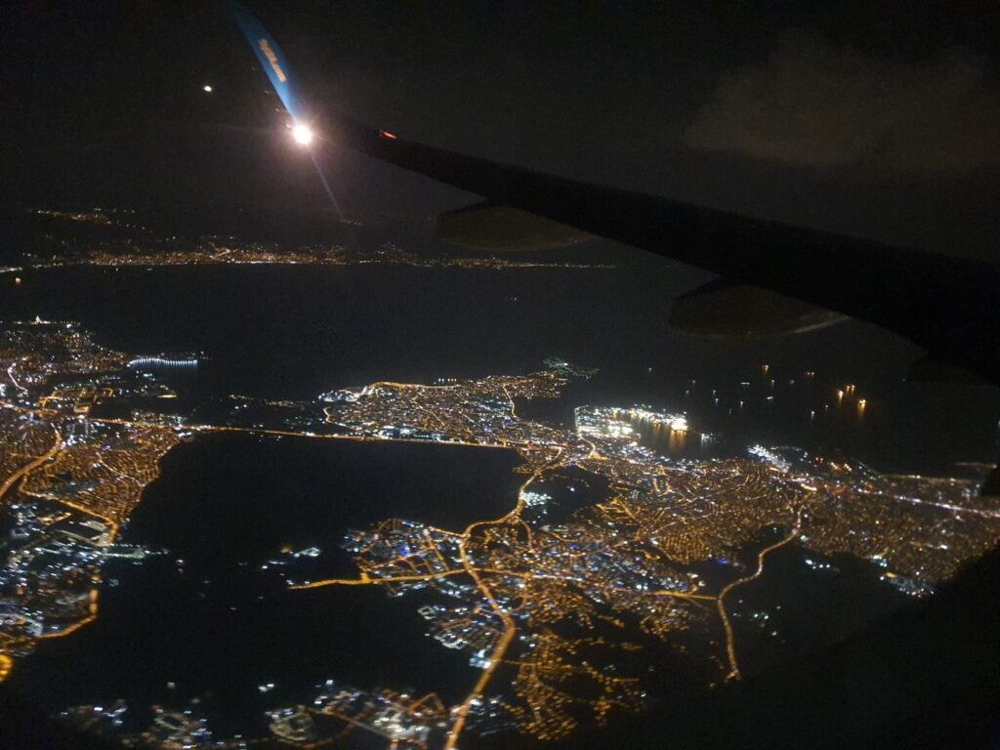
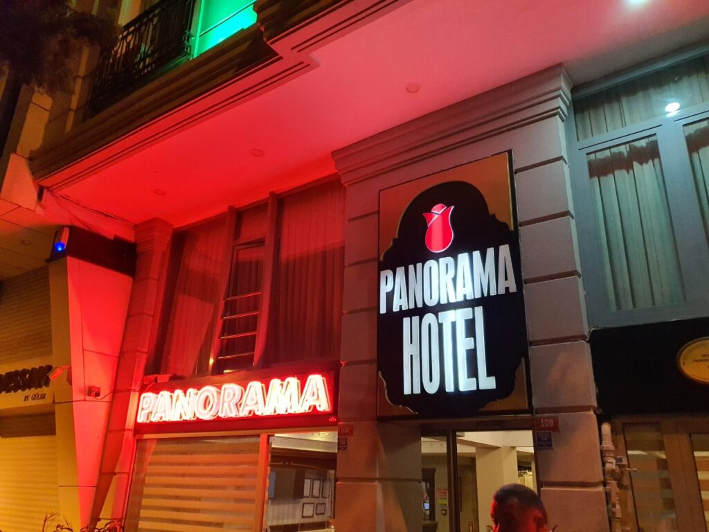
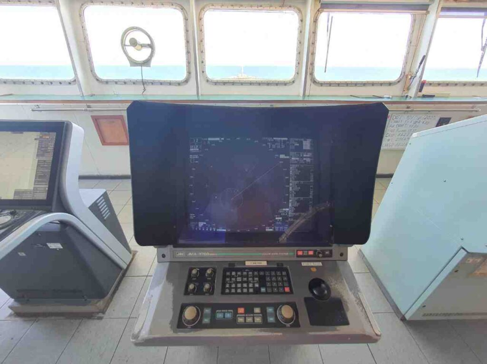
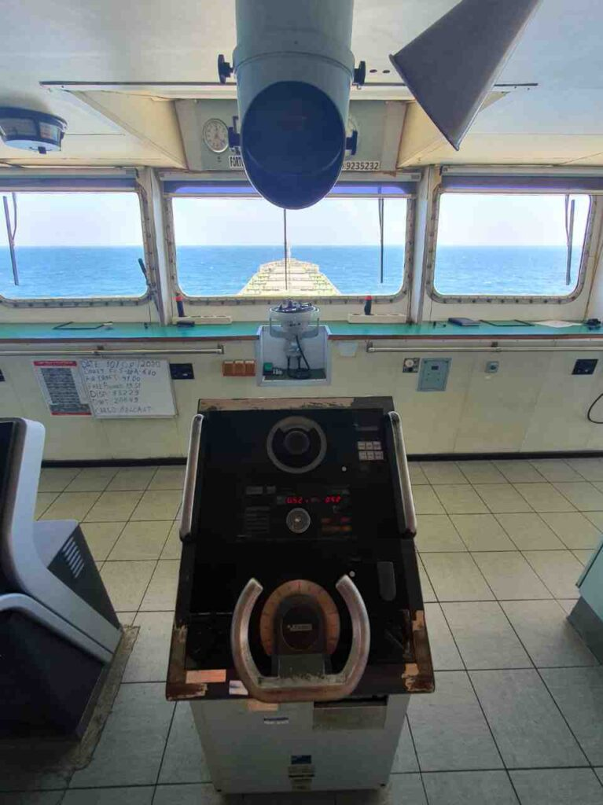
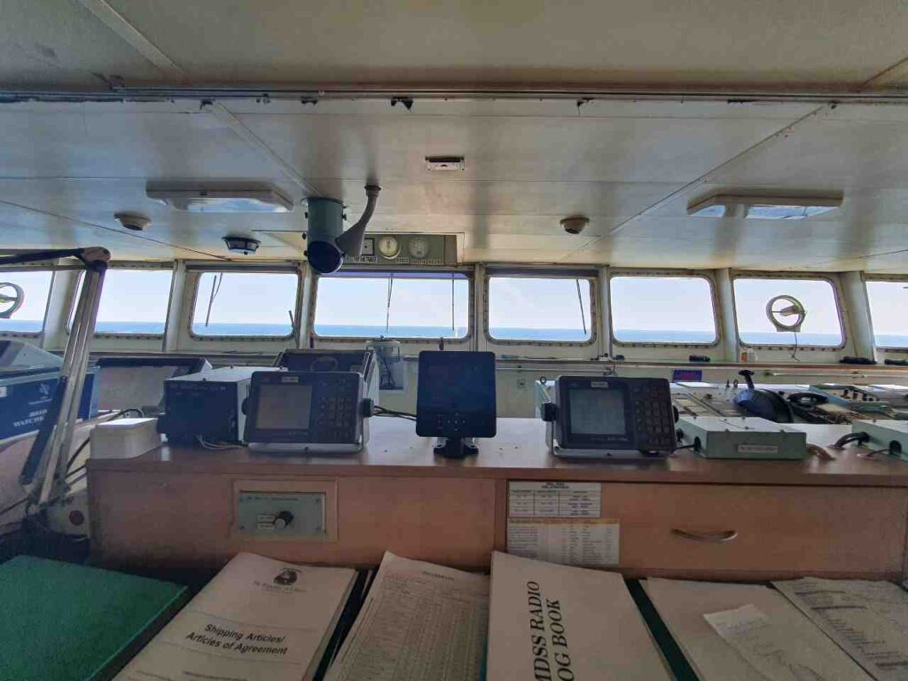
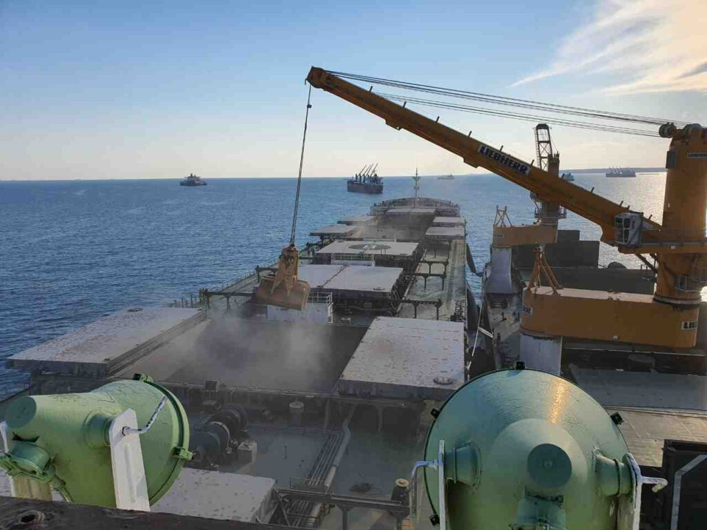
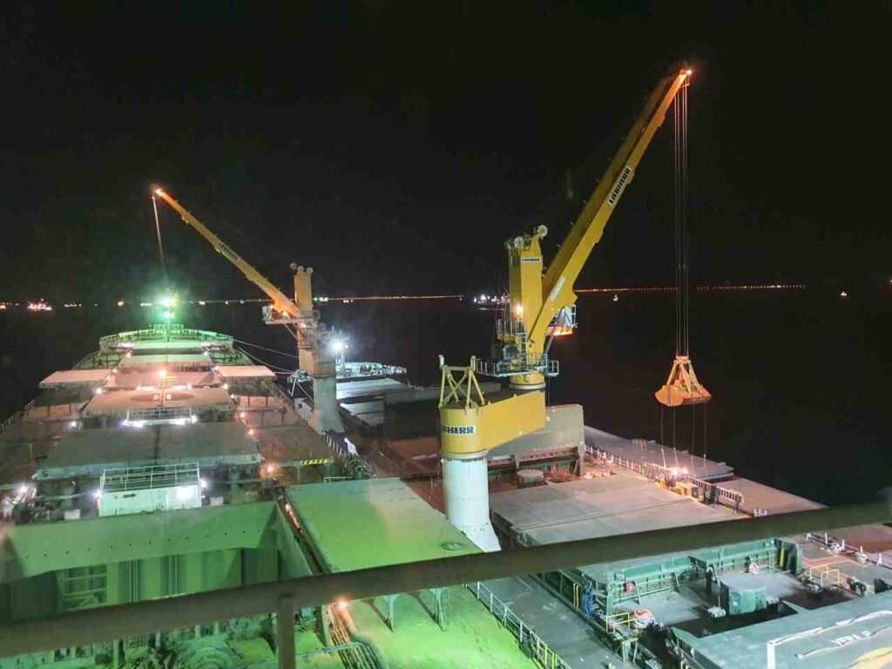
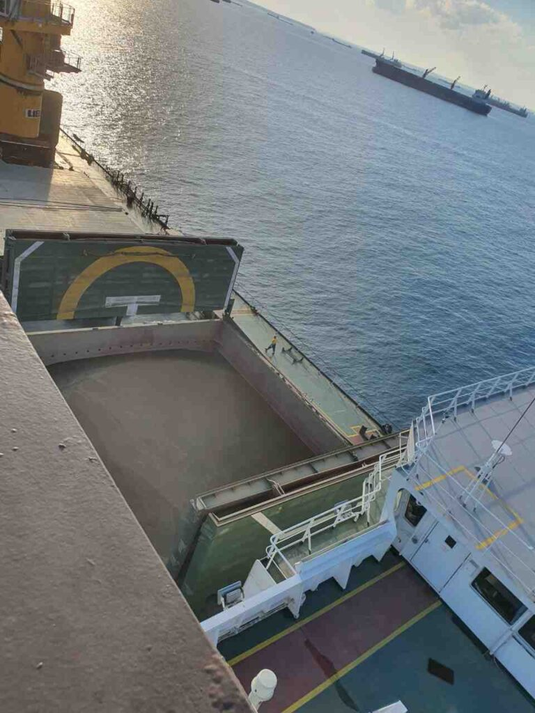
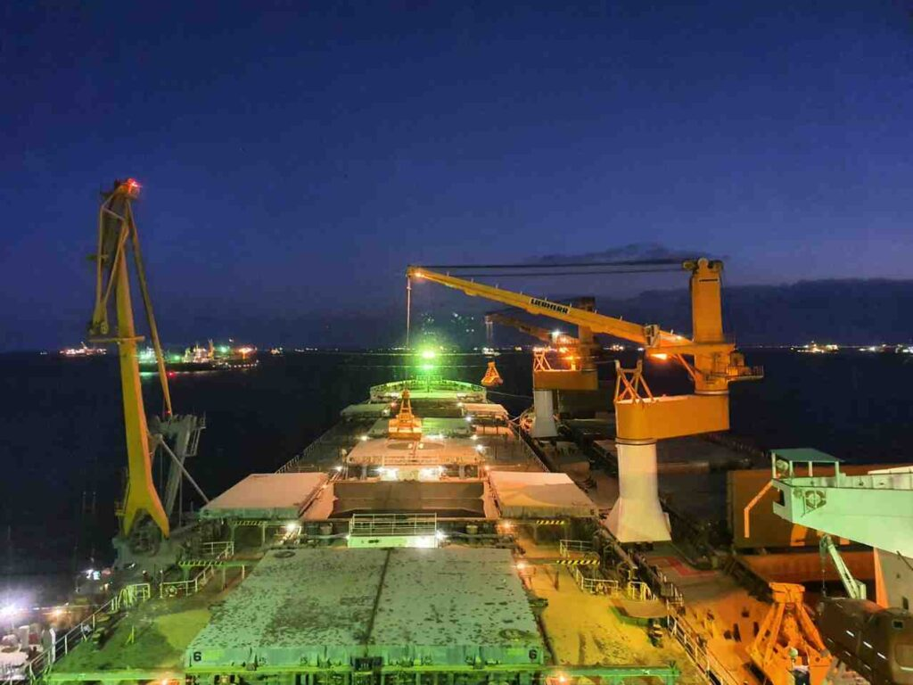

##### 2020.06.12

Что ж, снова здравствуйте тут)
Кацу подтвердили заявочку на галеру, так что скоро этот канал снова будет пополняться разными жизненными морскими историями
Не то чтобы я прям в восторге, но все же это хорошо)

##### 2020.08.04

У Кацу новый реквест на галеру. И есть надежды, что теперь все по настоящему.
Сейчас проблемы со сменами экипажей, так что я могу застрять там достаточно надолго (от 10 месяцев до 1,5 года), но мы будем надеяться на лучшее. Иначе сойдет на берег ночной хомячок с поехавшей крышей.

##### 2020.08.05

О, приехали билеты на самолет, так что послезавтра в 9 часов я вылетаю в сторону порта посадки.
Там будет быстрая смена экипажа на ходу судна, что очень неудобно.
Летим мы в Турцию, и смена экипажа будет во время ожидания очереди для прохождения пролива Босфор.
Кацу впервые потопчет Черное море, или Черное море потопчет Кацу, зависит от погоды😂
Идти будем то ли на порт Кавказ, то ли порт Керчь, пока не известно точно.

##### 2020.08.07

Отпустил родственников и направился на регистрацию)
Прошел проверку при входе в зону посадки

:::2

:::

И тут я осознал, что никому даже в голову не пришло проверять вес ручной клади, на нее даже смотреть не стали.
То чувство, когда приехал в аэропорт за 3 часа, и смотришь на людей пробегающих в закрывающийся гейт😅
Началась посадка, но сразу набежало куча турков😅
Все, мы с капитаном и вторым механиком сели в самолет)
Следующая связь со Стамбула

:::3

:::

##### 2020.08.08

Привет всем, мы в отеле, и добрались до Wi-Fi, все хорошо, будем ждать дальнейших новостей о посадке на судно) Сладких снов вам)

:::1

 

:::

Это будет наш пароход - [Fortune Trader](https://www.marinetraffic.com/ru/ais/details/ships/shipid:210311/mmsi:636018524/imo:9235232/vessel:FORTUNE_TRADER)

Позвонили с ресепшена отеля, предположительно, в 22 часа за нами приедет такси, хотя судно еще в центре мраморного моря и вряд ли успеет, почему же так рано?

###### 22:00

Все, выкатываемся с отеля

##### 2020.08.09 04:33

Вернулся с вахты, взяли лоцмана и идем по проливу.
Короче, это пиздец)
Экдисы не сопряжены с радарами и даже между собой. Так же они не показывают СРА, его можно посмотреть только на экране АIS.
Радары… Древнее меня. Кинескопные, у одного даже трейлы не работают, а у второго разбито защитное стекло.
Смена экипажа проходила чуть меньше часа, и меня еле кое-как ввели в курс дела.
Капитан просто в шоке.
Сейчас будем стоять около Керчи недели две, говорят, там и связь ловит и будет время разобраться с этим всем.
Пароход прям трясет во время набора скорости…
Каюта, не сказать что прямо большая. Чуть больше, чем была на 125 метровом малыше.
Короче, первое впечатление не радует.

##### 2020.08.10 00:23

Какие проблемы с приборами, в этом пароходе проблемы во всем: в документации, в состоянии судна в целом… Если будет Black Sea PSC - нам всем п…
Старый экипаж положил большой болт на все. Будем выживать, мх.
Ну хоть повар вроде нормальный более менее.
Вот сейчас я понимаю, что мои жалобы на старое судно, на котором я ходил, были ни о чем. Там, блин, было офигенно по части техники. Все же немцы, в отличии от китайцев умеют строить…

##### 2020.08.11 00:30

Привет всем, Кацу на связи.
М. Мы находимся на якорной стоянке у порта Кавказ и поймали российский Билайн)
Как я и писал ранее, хороших новостей нет от слова совсем, вместе 3ПКМ (3 помощник капитана) и мастером разбираем всю эту жопу, которая осталась после прошлого экипажа.

:::3

 

:::

Навигационное оборудование ходового мостика

##### 2020.08.12 02:40

Всем привет, шифтанулись поближе к крымскому мосту, тут и связь получше и прямо на рейде будет погрузка судна.

:::1

:::

##### 2020.08.13 02:30

Удивительно, но при фейс-констроле пограничников даже не было ФСБ-шников, как обычно.

:::3

 

:::

##### 2020.08.15 05:00

Привет с рейда Порт Кавказ.
Мы все так же понемногу грузимся ячменем, а пшеницу уже погрузили. Понемногу стараюсь разобраться с работой.
Кондиционер на судне не работает, а мы идем в ОАЭ, что в Персидском заливе…
Через пиратский район, кстати.
Зато из-за вахт - дни летят по сумасшедшему. Если бы я не писал постоянные репорты с указанием даты - я бы потерял счет времени.
С другой стороны, по уровню надоедания, ощущение, как будто я тут больше месяца уже.

:::1

 

:::

##### 2020.08.18 12:45

Вот жопця… Приехал PSC и отимел нас, мх.
И меня тоже. Понятное дело, что по "бокам" старого второго, мх.
Ну ничего, если что-то можно решить деньгами то это не проблема
PSC это Port State Control "Paris Memorandum of Understanding", в нашем случаеб одна из жестких европейских проверок.

Port State Control - это инспекция, в котором страны могут проверять зарегистрированные за границей суда в портах, отличных от судов государства флага , и принимать меры против судов, которые не соответствуют требованям международных конвенций, таких как SOLAS , MARPOL , STCW , и MLC . Инспекции могут включать проверку укомплектованности судном и его эксплуатации в соответствии с применимым международным правом, а также проверку компетентности капитана и офицеров, а также состояния и оборудования судна.

Разные страны объединяют нормы того, как нужно проверять иностранные суда, подписывая меморандумы, среди которых:

- Paris MoU (Europe and the North Atlantic);
- Tokyo MoU (Asia and the Pacific);
- Acuerdo de Viña del Mar (Latin America);
- Caribbean MoU (Caribbean);
- Abuja MoU (West and Central Africa);
- Black Sea MoU (the Black Sea region);
- Mediterranean MoU (the Mediterranean Sea region);
- Indian Ocean MoU (the Indian Ocean);
- Riyadh MoU (Persian Gulf).

##### 2020.08.20 00:30

Всем привет, наконец, до нас добрались рос. погранцы и мы наконец-то сегодня свалим из этой страны, мхмх
Да, впечатление о себе россияне оставили, ну так себе, хех. Не хочу сюда больше ехать😅
Дальше нас ждет проливы Босфор и Дарданеллы (Стамбул), потом Суэцкий канал в Египте. А после пиратского района мы отправимся в Дубаи и Кувейт с российской пшеницей и ячменем.

##### 2020.08.26 03:30

Всем привет, Кацу-дес)
Мы прошли турецкие проливы и сейчас ждем захода в Суэцкий канал)
Судно очень большое, что для меня совсем не привычно, 75к тонн, после 8,8к очень большая разница)
Поворачивать на авторулевом невозможно, только ручками, все остальное тоже старое, ржавое и убогое, мех.
И кондиционера нет. Прям как евробляха😅.
Ну ничего, мы выживем😂
После суеца нас ждет погрузка вооруженных шри-ланкийцев для защиты нас от пиратов)
В Jebel-Ali, UAE мы постоим пару дней, выгружая пшеницу, после чего отправимся в Кувейт, выгружать ячмень, что займет около недели.
С мастером у меня сложились хорошие отношения, да и в целом экипаж неплохой)
Правда готовка так себе, и овощей почти нет, и нашу заявку проигнорировали… Печально это.
И еще куча других заявок тоже… Мда.
Ну да ладно, не будем о плохом

:::3

 

:::

##### 2020.08.26 18:30

У нашего судна произошла поломка, мх
Так что мы не вошли в Суэцкий канал.
Механики еще утром все устранили, но теперь должен приехать проверяющий от Классификационного сообщества к которому приписано судно и провести проверку.
Если все хорошо, то он выдаст специальный сертификат, и тогда можно будет вызвать специального Суец Канал Инспектора, чтобы покататься с ним.
Только тогда он выдаст бумагу, что мы можем снова идти в канал.
Так же чартер (арендосьемщик парохода) объявил нам offhire, это значит, что пока мы в суец канал не войдем, денег он платить не будет.
Так что у нас тут очень весело)
UPD: в итоге нам тогда все необходимые сертификаты отправили по электронной почте)

##### 2020.08.27 21:45

Наконец мы вышли из Суэцкого канала)
Взяли охранников на борт и направляемся по Красному морю в сторону Аденского залива.
Чертовы арабы попили крови, забрали кучу блоков сигарет, кофе и даже хлеба…
Все же иногда фраза одного моего друга, что х...б - м...б _(**Upd.** не будем возбуждать разные органы)_, кажется вполне справедливой. По крайней мере при заходе в арабские страны точно.
Кстати, я не говорил, но у нас есть бассейн с морской водой, что не так уж и плохо) Хоть он и не большой, но все же очень приятно целиком опустится в водичку.
Скоро интернет пропадет, так что будем прощаться до следующего порта.

##### 2020.08.28 03:00

Я решил продолжить свою практику с питоном, чтобы мозг не засыхал в этой соленой среде, и тут мне подогнали отличный гайд по библиотеке PyGame, с помощью которой можно легко писать небольшие игры, за что я очень благодарен своему близкому другу)

##### 2020.08.29 12:00

🕛 Вот и пришла жопка.
Поломался кондиционер… А мы в красном море и пока что выживаем бассейном и открытыми дверями в надстройке, но скоро пиратский район и все двери должны будут быть закрыты. Это просто полная кромешная жопця. Температура воздуха уже +35 и продолжает расти.
Надеюсь, я выживу и еще смогу выйти на связь, мх

##### 2020.08.30 01:15 (UTC+3) (21 27,7N 37 45,9E)

Половина людей, у которых каюты не смотрят в нос, просто вытащила матрасы на открытую палубу, и спят на ветерке, и я тоже не исключение, хех

##### 2020.09.03 14:00 (UTC+3) (14 14,6N 52 37,0E)

Мы почти вышли из Аденского залива, скоро и опасная пиратская зона останется позади. Сегодня немного полегчало, ветер стал сильнее и не такой жаркий.
В Красном море был вообще кромешный ад. В +40 без кондиционера ты не можешь ни нормально спать, ни нормально работать, с каждым днем недосып все больше накапливается, а попытки покемарить пару часиков приводят к тому что ты просыпаешься весь липкий от пота в кровати, которая пылает жаром.
Единственное, что спасает - это бассейн с морской водой, впрочем, температура воды +32, но это всяко лучше, чем +40.
Кстати, холодной воды нет, вода из горячего и холодного кранов течет вода одинаковой температуры - около +55 градусов. Так что даже опреснится после морской воды это та еще задача.
Вот сегодня матросы смогли установить на мостике одну из двух сплит-систем. Так что я не завидую механикам, которые рассказывали истории, что установить их нельзя. Так-то и поделом им.
Когда мы зайдем в порт - около 08 сентября - у нас уже будет целый месяц незабываемых биззарных приключений.
Пока что вот так.

##### 2020.09.04 01:30 (UTC+4)

Продолжаю офигенные истории)
У нас тут погнутый винт, еще и с трещиной.
Вся гидравлика для открытия крышек трюмов течет во все стороны.
Самовар, который опресняет морскую воду - дышит на ладан и дает от силы 4 тонны.
Так же вылетели системы смазки ГД и сепаратор льяльных вод. В принципе, у нас дед (старший механик) вообще шкодник, к чему не прикоснется - все ломается.
Про состояние судового кондиционера, радаров и всего навигационного оборудования я уже писал.

##### 2020.09.05 03:20 (UTC+4) (18 20,0N 58 10,0E)

Сегодня наконец до конца закончили установку кондиционеров и это что-то волшебное. На мостике хочется даже спать)
Так же, сегодня мастер отдал из своей карты не рабочую стерео систему на 55вт, что очень недурно по мощности, а я смог ее починить) Так что теперь у нас на мостике есть музыка.
Насчет питания, становится все хуже, пошла в ход перловка, а овощей привезти даже не обещают.
Да и в целом достаточно голодно.

##### 2020.09.08 Порт Джебел-Али, ОАЭ

Вот мы и зашли в порт. Большой кондиционер на не чинят, мастер на свой страх и риск закупил три кондиционера для столовых, чтобы хоть там могли спать люди.
К тому же, к нам приехал PSC и снова нас трахнул. Только не помог и даже не задержал.

Этот пост уже малость растянулся даже за один месяц, так что начну писать следующий^^

Всегда Ваш, Кацу ❤️
