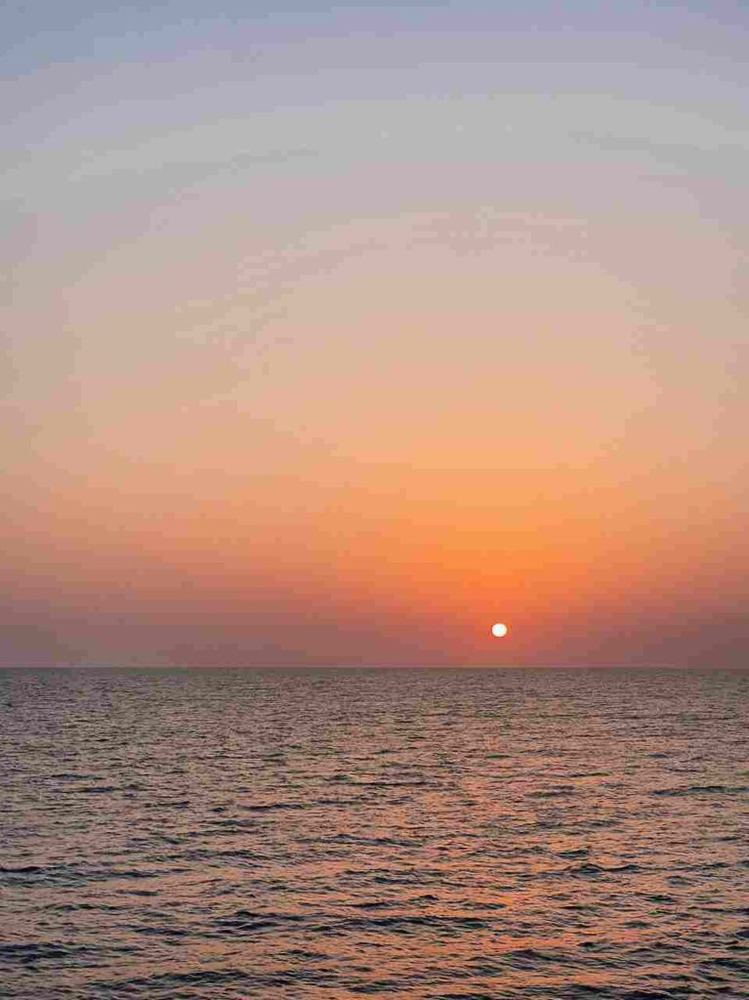
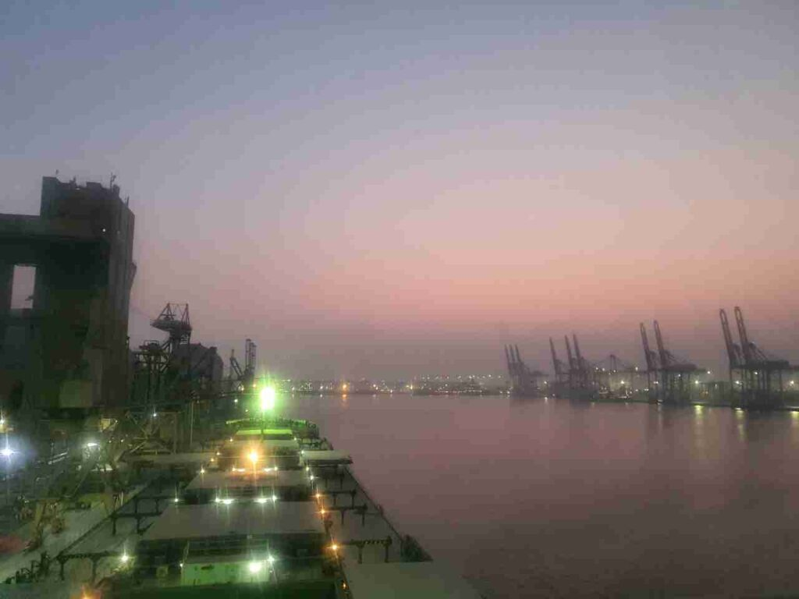
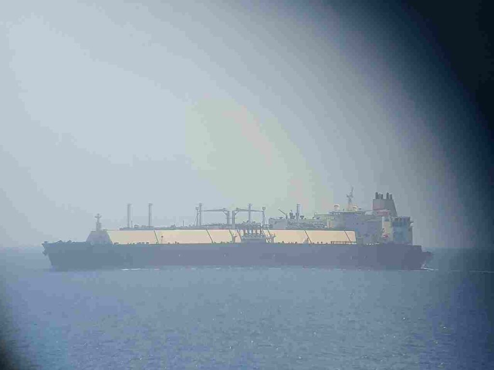
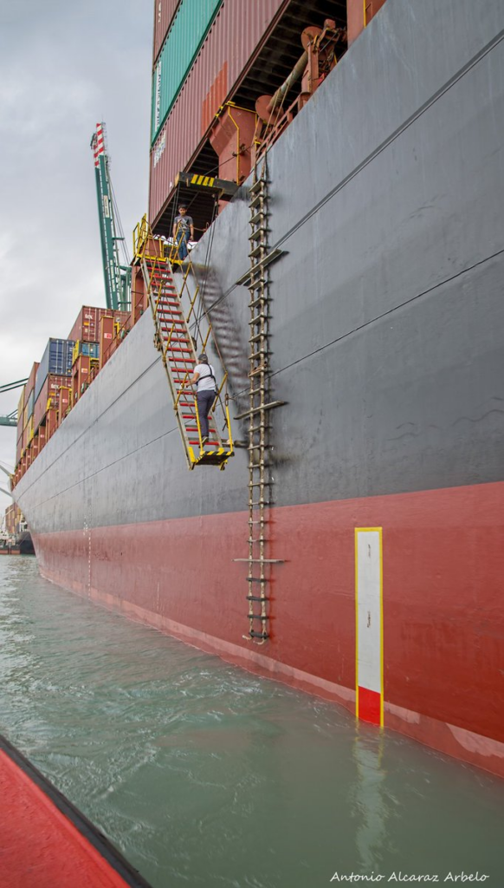
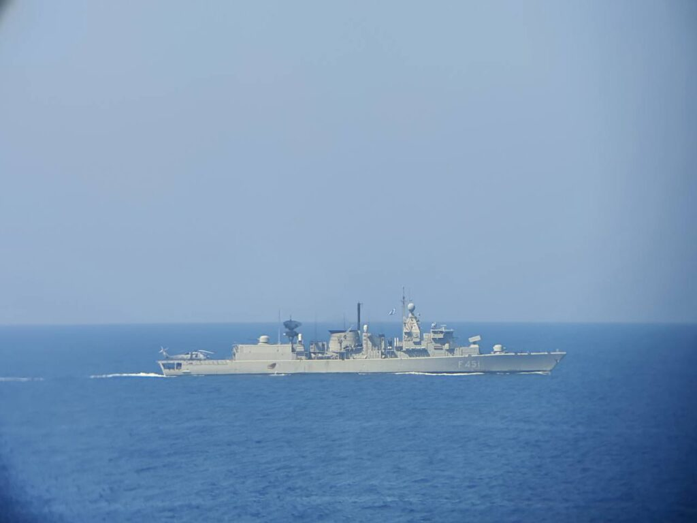
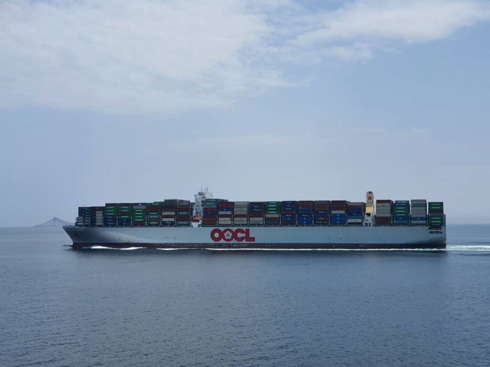
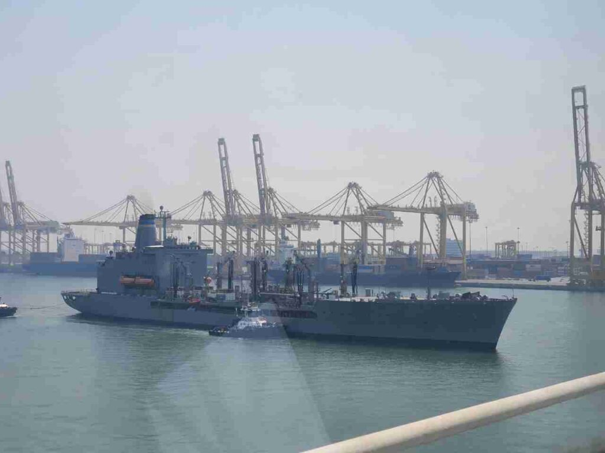
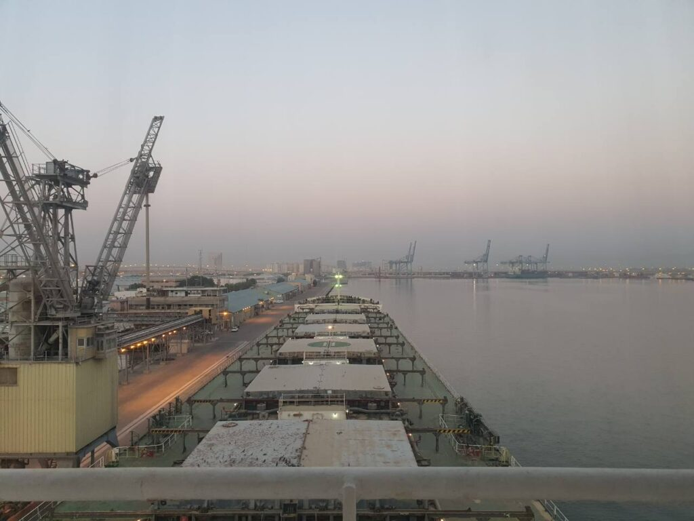
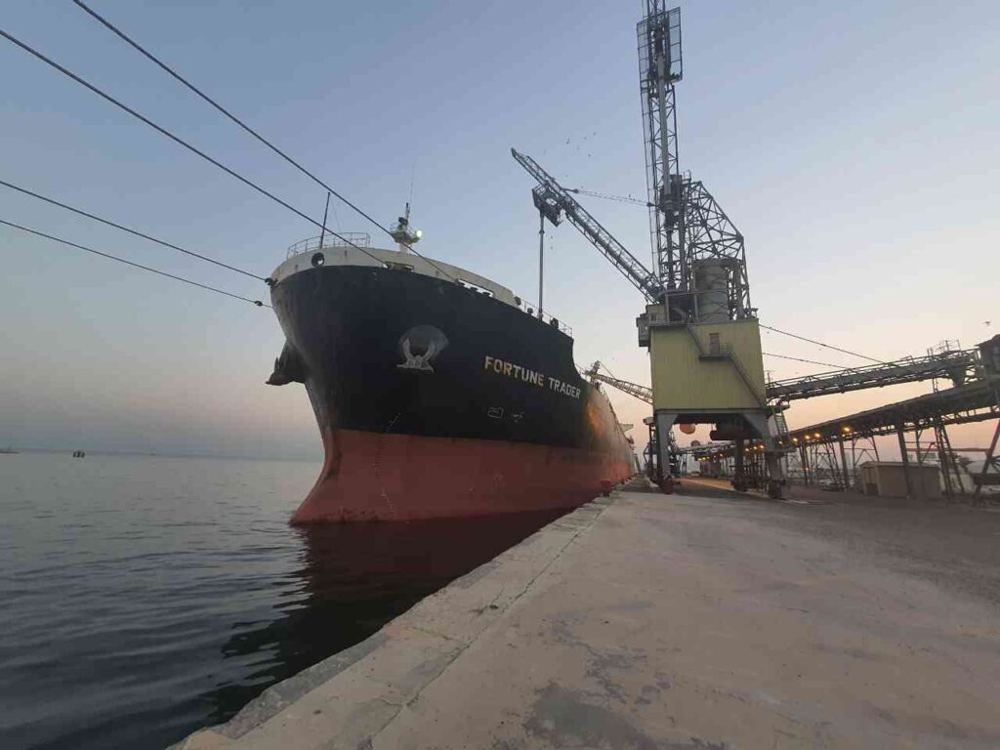
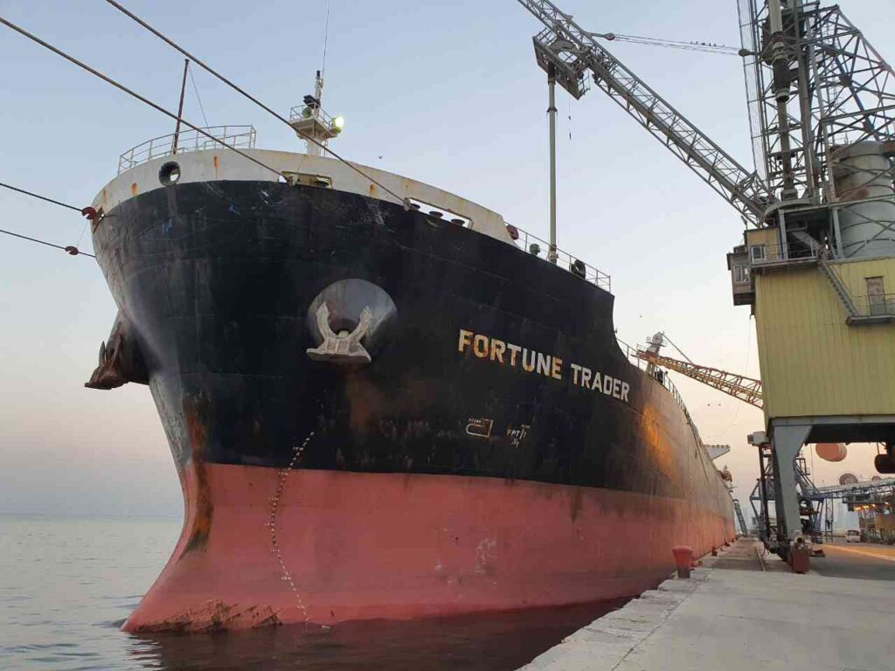

Greetings in the second post of the series about my travels as Second Officer on the motor vessel Fortune Trader.
Last time we finished on September 8, a month after boarding the ship.

I sent photos with very reduced quality so as not to exhaust the little internet traffic available to me.

%%%3
  
  
  
  %&23
    
    
  &%
%%%

##### 2020.09.09 06:00

We’re discharging used oil. And grandpa (the chief engineer) had a birthday yesterday, and he and his underlings—the third and fourth engineers—“celebrated” heavily. And then they went on watch right after finishing the oil discharge.
The machine that receives the used oil started having problems; they were yelling at me to do something. The engineers. To the navigator. 😂😂
Well, I had to force them to wake grandpa up, although they were very reluctant, and even the chief engineer had to get up, since grandpa couldn’t figure it out himself.

##### 2020.09.09 14:31 (UTC+4)

As a result, we’re leaving the port of Jebel Ali without the main air conditioner and we’ll spend another two weeks in the Persian Gulf without air conditioning!
Only after exiting Shuwaikh (Kuwait) and leaving the Persian Gulf, at Fujairah anchorage they will install those evaporators.
(Katsu from the future: they won’t install them. Katsu from an even more distant future: *laughs*)
Well, bastards is all I can say.
We have to cram ourselves onto the little couch in turns with the third officer on the bridge. In the only place on the ship where there is air conditioning.
Right now the chief engineer has bought ordinary home split systems and they will be installed in the large mess halls, so people can at least sleep in the cool. Worse than barracks.
In 20 minutes they’ll give us the pilot and mooring operations will begin, and accordingly the internet will be gone.
The machine is ready, people are being called at the mooring stations according to the urgent schedule.
There’s almost nothing left, heh.
Thanks to all the dear people who support me in these difficult times of deprivation, hehe.
We will survive! 😎

##### 2020.09.10 01:21 (UTC+4)

I barely managed to wake up for my watch, I slept only a few hours in the last day, heh.
We’re sailing in the Persian Gulf; around the ship on the waves, bioluminescent phytoplankton is glowing, it looks incredibly beautiful, but a smartphone camera cannot capture it.

%%%1
  
%%%

##### 2020.09.10 12:41 (UTC+4)

When we were handing over the pilot yesterday, just before that our combination ladder fell, which is used if the ship’s freeboard is over 9 meters. Good thing the pilot agreed to descend 10 meters by the standard pilot ladder. At least we recovered the combination ladder, but the mechanism, which had just been “repaired” in Piraeus, turned out to be in terrible condition. So now I have no clue how we’ll take the pilot on board.

##### 2020.09.11 18:05 (UTC+3)

Hello everyone, this is your agent Katsu speaking^^
We arrived in Shuwaikh, Kuwait, and dropped anchor awaiting orders.
Yesterday the agent gave us a ridiculous order to wait over a week for discharge, but according to the latest information we should enter the port tomorrow at 05:00 during high tide.
We will need to unload 5 holds of barley totaling 42,000 tons.
In Jebel Ali we unloaded 21,000 tons of wheat from two holds in just one day, so here we’ll stand no more than three days.
Next we face air conditioner repairs in Fujairah, UAE, after which we’ll head to Suez, of course through the dangerous pirate zone.
Hail to the Great Goddess!

##### 2020.09.11 23:13 (UTC+3) Shuwaikh Anchorage

We were supposed to lie quietly at anchor, but then the health department summoned us and said they’d arrive in an hour.
All documents were ready, an hour passed, and they still didn’t show up.
In the last month I’ve had so many impressions from the Arabs that I wouldn’t mind joining the Israeli army.
May the Great Goddess protect us all!
They installed several air conditioners, the ones the chief engineer bought proved far better (the company bought pathetic 9,000 BTU units for $460 apiece, while the captain for the same money bought 22,000 BTU units).
They installed them in the officers’ and crew’s mess halls, so now people sleep there. The chief engineer also installed a unit for himself, so now I sleep in his office, and the chief mate and third officer sleep on the bridge.
We survive as best we can.

##### 2020.09.12 Shuwaikh Port

I made a funny timelapse of our departure from Jebel Ali, but I won’t show it to you—it’s 300 MB😅
An Arab official came, checked all temperatures, declared free pratique, and left.
14:10 I bought an Arab SIM card, because my Ukrainian networks sucked up all my money—$16 for a Goodline card and 250 UAH on Kyivstar vanished in 30 MB, wow.

“Declaration of free pratique” = lifting the quarantine from the ship and allowing shore contact with crew members. Conducted not in all ports, mainly in backward ones like CIS or Arab ports.

Here there should have been timelapse videos of leaving Jebel Ali and entering Shuwaikh, but WordPress won’t let me upload them.

%%%3
  
  
  
  
  
  !r2
  
  
%%%

##### 2020.09.13 06:30

Finally, I got a haircut for the first time in a month, such a relief!
By the way, in Kuwait at night, unlike in the Emirates, it’s quite bearable.
The air is drier and not as hot, but once sunrise comes, it turns into real fiery torment, so all we can do is offer prayers to the Great Goddess to endure this trial with honor.
Let’s hope that in Fujairah at least they actually install the air conditioner, and don’t pull the usual trick.
**Upd.** Holy naivety!

%%%3  
  
  
  
  %&13  
    
  &%
%%%

##### 2020.09.17 12:00

Well, the discharge is finished and we’re preparing to depart from this f***ing hot Kuwait.
Yes, they charged us with a shortage of 350 tons according to the shore scale. (How they calculate cargo on the dock)
Right now the Chief Officer is conducting a draft survey with the surveyor to figure out the situation.
But since he’s a push-over, most likely the Arabs or Indians will let him off easy.
And for something like this you can go home, heh.
Upd. Everything ended well; the draft survey showed that there was even half a ton more cargo than needed, so we can quietly leave the port. Maybe…

*2020.09.17 17:45  
*Formalities are finished, the ship is almost ready to depart, we only have to obtain permission to exit the port.  
So soon I will leave you, presumably for two weeks into the heat and the Red Sea.  
19:20 The pilot is on board, we’re starting mooring operations.  
21:20 The ship has left the port and finally Katsu got off watch. However, at 24:00 I’m back on watch, in a couple of hours. Need to grab some sleep, heh.

##### 2020.09.23 11:30

Hello from the expanses of the Indian Ocean. We’re almost at the border of the IRTC transit corridor in the Gulf of Aden (the dangerous pirate zone). We have three soldiers with unpronounceable surnames on board, so everything should be fine.
Soon we’ll have been here two months, and my birthday is not far off.
The cook has at least started occasionally preparing something edible, although most of the time he still just turns food into trash.

##### 2020.09.27 20:00

Last night we handed over the soldiers, and passing through the dangerous area was successful and calm.
Now we’re proceeding further down the Red Sea toward Suez, where we’ll take on a Greek technician who flew in; after passing through the Suez Canal, we’ll head to Piraeus, Greece.
At the moment we have:

- Air conditioner not working  
- No cold water for the showers  
- Left-side combination ladder missing  
- Right-side combination ladder not functioning  
- S-Band radar antenna not working  
- One radar not acquiring targets  
- Hatch cover hydraulics leaking everywhere  
- Ballast system dying  
- Propeller bent and cracked  
- The engine room condition is horrifying  
- And the cook is a real welder, who continues to turn food into trash and exacerbates deteriorating tensions among the crew

BUT. It turned out we encountered a sister ship (built the same way) operating under the same company called TAILWINDS and there everything is even worse. In addition to many of the above issues, they have:

- Gyrocompass not working  
- Radars not acquiring targets at all  
- Propeller falling off completely  
- On top of that, a tyrant of a captain  

And they want to send that vessel on a voyage from Novorossiysk to Thailand without repair.
After that it became clear that ours is, in principle, the flagship of this company, not the worst as we thought…
Being here is actually terrifying. It’s like riding in a car, knowing its wheels could fly off at any moment…
This ship seems to drain human strength and energy, otherwise it would have simply fallen apart…

Lately I’ve been overwhelmed with wild gloom and apathy. I don’t want to do anything, not even read or watch movies…
Insomnia has also started. In the evening before my night watch I manage to sleep only about two hours, and after the night watch maybe four hours at best. Because of all these shitty thoughts about the future and life, I simply cannot fall asleep.
On previous voyages I didn’t think about life ashore at all, apparently because I was still a child with my family, and now I realize it’s time to become independent, but it feels like I simply can’t handle it.
I probably won’t be able to live with my parents, although they are very caring and I love them, but they are too present in my life.
But I don’t yet know how to live on from here… In terms of goals and priorities.
I understand that I need to focus on my health—which I’ve thoroughly neglected—both mental and physical. Maybe then I’ll be able to evaluate myself more realistically and take a slightly different view of life.
In short, my mental troubles have flared up with even greater intensity, yes.
I want to try to make a timelapse of passing through the Suez Canal, if I can go unnoticed) It seems that after Piraeus we were verbally promised something about Ukraine, but so far nobody has given us a scheduled assignment.
Honestly, I would love to grab a suitcase and just run away, if only there were Ukraine, heh. And that’s even though the ship’s officer cadre here is normal.
I feel that if I had been assigned to a ship with senior officers who are idiots, on top of all my mental problems I might not return from such a voyage, heh. And considering the worsening state of the fleet—soon there will be no decent people left here.
Moreover, with my absolutely weak, submissive character, positions in the senior officer corps are closed to me, since being a chief mate whom everyone heckles like ours… Better just to hang oneself.
Again, thoughts about the need for education and finding a normal job with a normal salary also gnaw at me.

##### 2020.09.30 01:00

Here we are already approaching the Suez Canal)
Many people have wished me a happy birthday, which was very pleasant)
Here, in the Suez Gulf there is a terrible wind of 45 knots, so we are not moving as fast as we’d like. Tomorrow night we will enter the canal and in October we will finally leave the Arab countries. Hooray!
Now we just have to hope they don’t send us back here again)
They say we have something planned for 2–3 months; we’re more hopeful for Brazil, then maybe by New Year we could be home.
The situation on the ship is getting worse; people are arguing, in the machine room as usual, rats are reporting each other to the company.
Grandpa even had the nerve to try to lecture the captain. Dude, that grandpa is such an asshole that everyone here already hates him, while he considers himself strict but fair and a decent person.
God knows what’s happening here…

%%%1  
  
%%%

They painted the hatch covers; at least now it looks somewhat decent.

In the next post I will describe how we passed through the Suez Canal and what happened afterward)

Love you all ❤️

Everything will be fine, Katsu! 🦊
