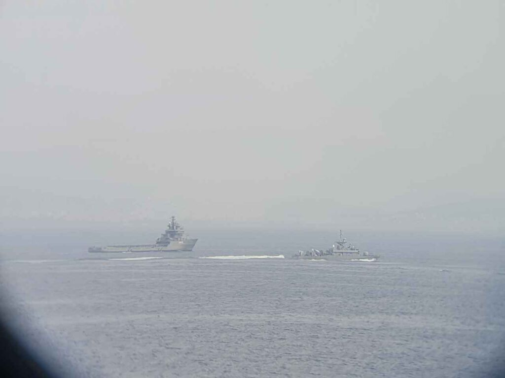
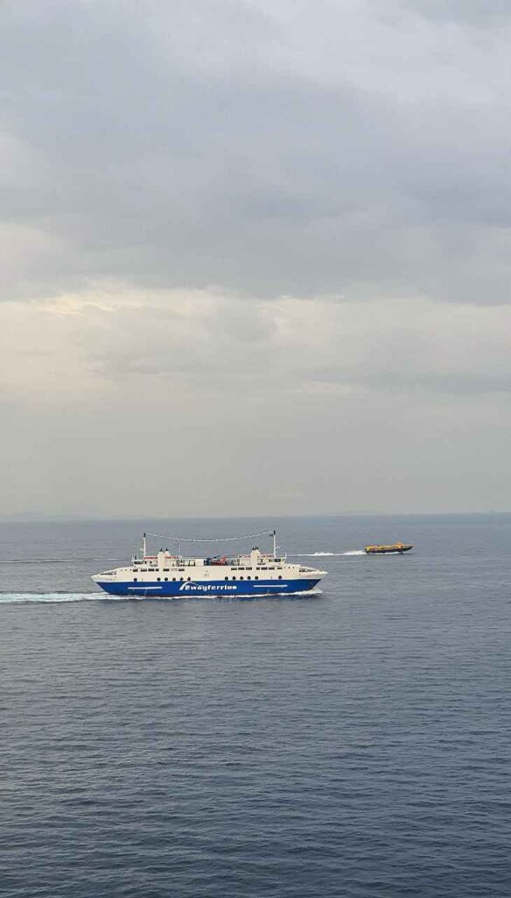
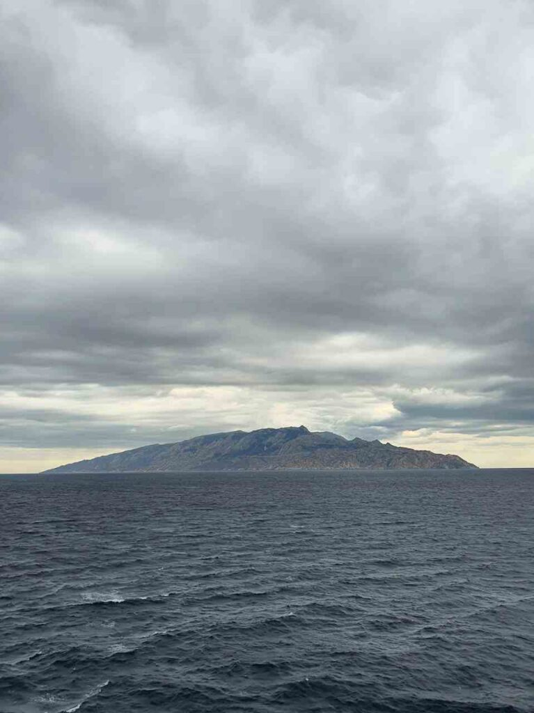
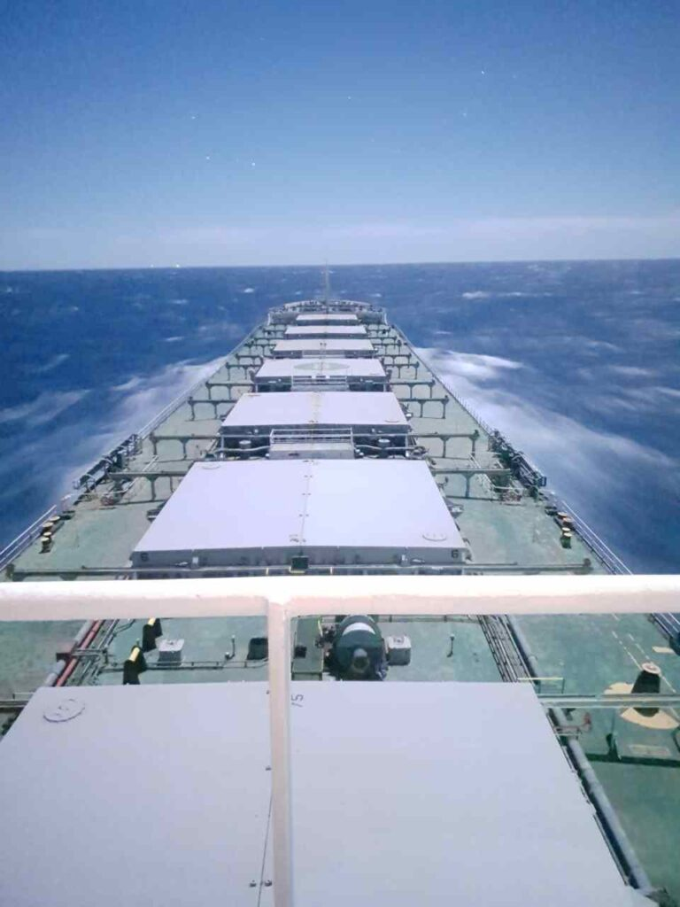

Greetings to the third part of my narrative.
In the previous post we passed the port of Shuwaikh in Kuwait, from which it was not easy to depart. Finally, we reached the entrance to the port of Suez, to transit the canal of the same name.

##### 2020.10.01 02:40

We’re anchored just before entering Suez, and it seemed to start off well, but those damned boatmen got pushy.
In the Suez Canal there’s a rule: a vessel must take one or two boats aboard, depending on its size, so that if it breaks down it can be quickly moored.
Well, we had been transiting with just one boat, but now they demanded either two boats or a tug for \$34k. In the end they drove us crazy and we barely managed to cram in that shitty second boat.
The shipowner also wrote that our vessel will call at Piraeus, Greece, where it will be reflagged (from American Bureau of Shipping to Korean Register), after which we face a full PSC Paris MoU inspection… I don’t even want to think about it, I just want to be far away somewhere…

##### 2020.10.01 14:00

We received our revised orders: after Piraeus we’ll head to Ochakiv and load in Aqaba, Jordan. Our stay in Piraeus will last a week, and the voyage to Aqaba will take just over a month.

##### 2020.10.03 02:42 (UTC+3)

We’re sailing among the Greek islands—my first time doing so—heading toward Piraeus. By tomorrow evening we should be at anchor, and later they will likely allow us into port.
Today the seamen climbed into the ballast tanks with the engineers and discovered a new problem. The pipe from the cofferdams (where the water from washing cargo holds is stored) was perforated, and the pump was drawing water from the ballast tank instead. But since that pipe was completely corroded and bent, it couldn’t be welded.

**Upd.** eventually, after a lot of effort, they managed to weld it)

:::3

:::c3

:::

:::

##### 2020.10.05 12:00

Well, here come the registrar, PSC, and technicians.
The registrar and PSC barely glanced at the bridge and found a few minor issues, but the inspection was very cursory, and now the technicians are fixing some of the equipment on the bridge. Really, it would be better to just replace it—for example, the radars or the echo sounder and other devices.

:::3

:::

##### 2020.10.05 22:50

We’re headed to Ukraine now.
As it turned out, Ukraine and Russia are the worst countries for a seafarer after those in Africa.
Not only do you need to deal with almost ten different authorities and a massive stack of documents, but you must also inventory every piece of ship’s and personal equipment, down to flash drives and paint brushes. You also have to inventory each crew member’s personal medical kit, on top of the ship’s medical supplies. And then customs will board and search for undeclared valuables.
And that’s while we’ll be loading at anchor without even entering port.
Yes, Ukraine is even worse than the Arab countries in this respect. It’s shameful—very shameful—for my country.

**Upd.** from 2020.10.24 17:00: It turned out everything is easily solved, naturally not for free. So they just scare people so they won’t think of paying a bribe

##### 2020.10.07 15:00

This is a real disaster. Just now the heavy fuel oil boiler exploded and struck our long-suffering fourth engineer. When I saw him, he was lying semi-conscious with a cut on his cheek. We quickly called the boat and lowered him on a stretcher by crane. He’s now in the hospital and they say he’s okay, but I wouldn’t trust the Greeks. Of course, once he’s back in Ukraine, he’ll head home. It turned out later that he had ignored safety rules and did not gas-free the boiler before restarting it.
At 16:30 he was brought back aboard.

:::3

:::

And to the left is another “rocket” and a local ferry. By the way, if you look closely, the ferry goes both ways without turning around.

##### 2020.10.07 20:00

By the way, about that heavy fuel oil boiler. Without it, it will be very difficult for us to go anywhere, because it is used to heat the very viscous heavy fuel. One option is to run on diesel for the first hour or two until the other (exhaust-driven) boiler comes online. But considering we have many maneuvers ahead, that is risky—up to risking a blackout. In the best case, we’d manage to replace the boiler, but we only have two days left. There are no drawings for this boiler, because it wasn’t installed at build but was changed at a Chinese shipyard.
In short, everything just gets more dismal.

##### 2020.10.10 00:30

The agent forgot that we need permission to exit port, so they didn’t allow us to weigh anchor. Waiting for morning.
He claims no one notified him…
But he’s the one who should notify us, not the other way around. Greeks…

:::3

:::

At sea, distances are quite large, so almost all my photos were taken through binoculars)
Fortunately, my phone still produces somewhat acceptable image quality)

:::1

:::

##### 2020.10.13 01:00

Hello from Ukraine)
We passed the Dardanelles and Bosphorus, and now we’ve arrived on the large Ukrainian loop. Here you can’t simply enter any port; you must transit a large circular route near Illichivsk, from which routes branch to Odessa and to the port of Yuzhny. From Yuzhny a canal leads that splits toward Mykolaiv and Kherson.

##### 2020.10.13 02:00

Despite all the difficulties, I’m trying to dedicate at least some time to programming. Since there’s no internet here and working with bots in Pyrogram isn’t feasible, I turned to PyGame. I decided to try making a simple tank game.
I sketched out the game framework, but I was stuck because the enemies had no AI. A good friend sent me his favorite game development book, and although it’s rather old and written for C and assembly, it contains general theoretical chapters that I really need.

:::1

:::

##### 2020.10.16 00:30

Delta Pilot has called us; we need to be by 05:30 in front of Yuzhny port, so in an hour we’ll prepare the engine for startup and in about 20 minutes begin weighing anchor.
After that we’ll head to Yuzhny port, where the pilot will come aboard to navigate the vessel through the canal all the way to Mykolaiv, to the private NIBULON terminal.

:::3

:::

##### 2020.10.16 15:05

Here we are, berthed at our destination!

##### 2020.10.18 09:20

As I approached the gangway to go ashore and see my family, they moved our berth slightly backward and raised the gangway again, hehe. Finally, I’ll meet my loved ones after three months.

##### 2020.10.18 18:40

Today I finally set foot on land, ate real food, and drank a beer. I strolled through the Mykolaiv Zoo with my relatives and “de-magnetized” myself, gaining a dose of positivity. After being on that ship, stepping ashore is pure joy)

:::3

:::

##### 2020.10.21 01:30

Hello everyone)
Yesterday afternoon they barely trimmed our draft to 10 meters at the stern, even though the cargo plan required 10.3 on even keel, and we were forced out of Mykolaiv.
With the pilot onboard we sailed through the canal for six hours and reached the anchorage known as Nikolaev Sea Port Outer Anchorage, according to the pilot.
Ahead of us in the queue for loading are three more vessels, and a windy forecast is expected, so I hope we’ll be here for another week or two)
It’s getting quite cool already, which is much better than heat from which there’s no escape)
Now you can wrap yourself in a blanket, put on noise-cancelling headphones so you can hear nothing and sleep like a regular person)

##### 2020.10.21 14:50

Meanwhile we have a barbecue, but since I’m on watch, the third officer brought me some meat up on the bridge)

:::1

:::

##### 2020.10.23 13:50

By the way, our automation power supply system in the engine room has failed, so now we cannot start the main engine.
Considering we’re at anchor and the weather forecast is not good, this is quite dangerous, because the vessel could drag its anchor, and we wouldn’t be able to do anything about it.
We reported this to the company, and they supposedly promised a repair crew, but the agent demands cash for their transfer—a sum we simply don’t have onboard.
In theory, if something happens, we’d be rescued by a tug, but in that case the company would go bankrupt.
Just now, over VHF, Ochakiv Traffic Control reported a storm warning: winds up to 20 m/s with gusts to 26 and fog with visibility no more than a kilometer…
Well, we’ll pray to the Great Goddess that anything beyond our control goes well. Everything else we will handle ourselves)

##### 2020.10.24 04:30

The technicians left after fixing the ship’s automation, but they didn’t bother signing any paperwork—strange. And everyone got yelled at by the chief engineer.

:::1

:::

##### 2020.10.24 11:50

Fishermen have come out from everywhere in their little boats. Is it the weekend?

##### 2020.10.24 13:20

I feel like a boiled vegetable today…
Plus scandals, intrigues, investigations—the atmosphere only intensifies, even though things are supposed to improve. Some people have already started writing statements.
And even those who aren’t directly involved still find it morally difficult to be in this environment where everyone complains about each other or accuses someone…
Where did we go wrong?

:::2

:::c2

:::

:::

##### 2020.10.29 09:00

The time has come for us to say goodbye to Ukraine. We’re completing formalities and will soon weigh anchor and head back to the Arabs.

:::3

:::

Better things ahead—on to the next post)

Love you all ❤️

Everything will be fine, Katsu! 🦊
