Вітаю в третій частині мого оповідання.
У попередньому дописі ми пройшли порт Шувайх у Кувейті, з якого було непросто вийти. І нарешті ми підійшли до входу в порт Суець, щоб пройти однойменний канал.

##### 2020.10.01 02:40

Стоїмо на якорі перед входом у Суець, і здавалося б, усе почалося непогано, але ті шлюпочники завели зуби.
У Суецькому каналі є правило: судно має брати одну або дві шлюпки на борт, залежно від розміру, щоб у разі поломки швидко пришвартувати його.
Так от, ми весь час проходили з однією шлюпкою, але зараз вони сказали: або дві шлюпки, або буксир за 34 тисячі баксів. Зрештою, лишень довбанули мізки, і ледве впхали ту мізерну другу шлюпку.
Також судновласник писав, що наше судно зайде в порт Пірей у Греції, і там його перекладуть під інший регістр (з American Bureau of Shipping на Korean Register), після чого нас чекає розгорнута перевірка PSC Paris MoU… Уже нічого не хочеться, тільки опинитися десь далеко…

##### 2020.10.01 14:00

Нам прийшли реймові завдання: після Пірея ідемо на Очаків і завантажуємося в Акабі, Іорданія. Стоянка в Піреї триватиме тиждень, а ходка до Акаби — трохи більше місяця.

##### 2020.10.03 02:42 (UTC+3)

Ми йдемо між грецькими островами — я вперше це роблю — у напрямку порту Пірей. Завтра ввечері нам вже мають дозволити встати там на якір, а трохи згодом, імовірно, заведуть у порт.
Сьогодні матроси з механіками лазили в баластні танки й знайшли нову проблему. Виявилося, що труба з льяльних колодязів (де зберігається вода після промивки вантажних трюмів) пробита, і насос замість неї качав воду з баластного танка. Але оскільки там труба — у суцільній іржі й на вигині, то навіть зварити її було неможливо.

**Upd.** зрештою, після довгого мордобою вони її змогли зварити)

:::3

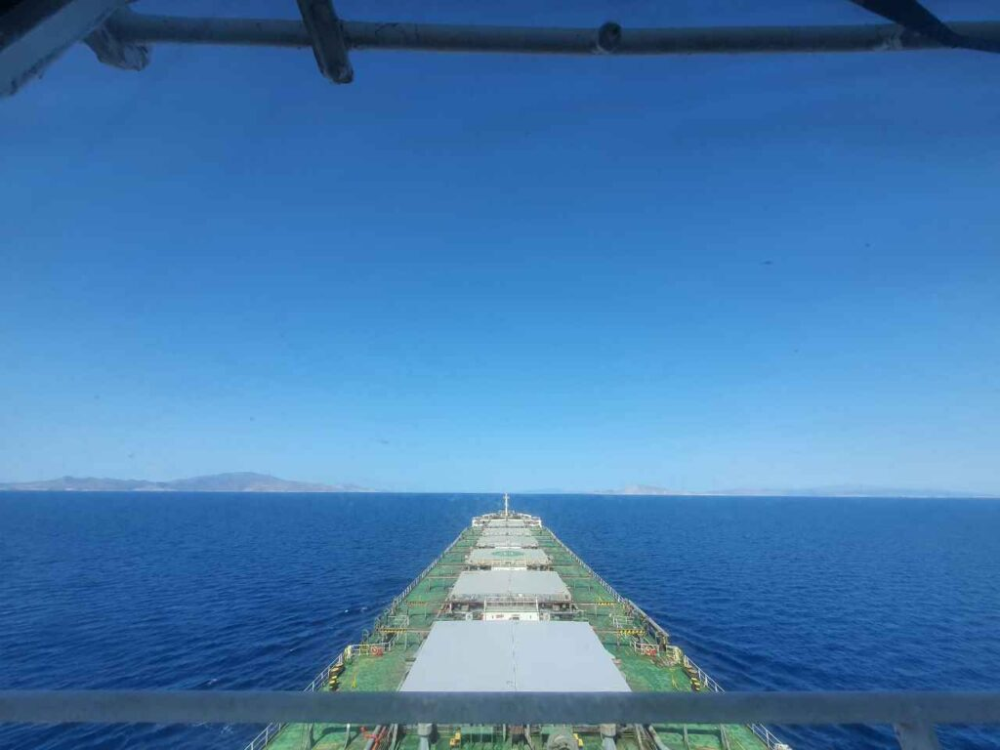
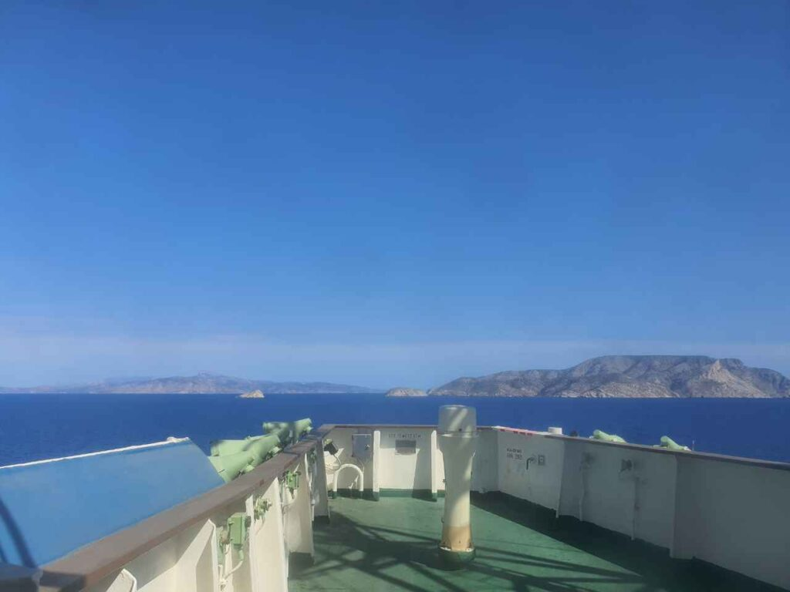
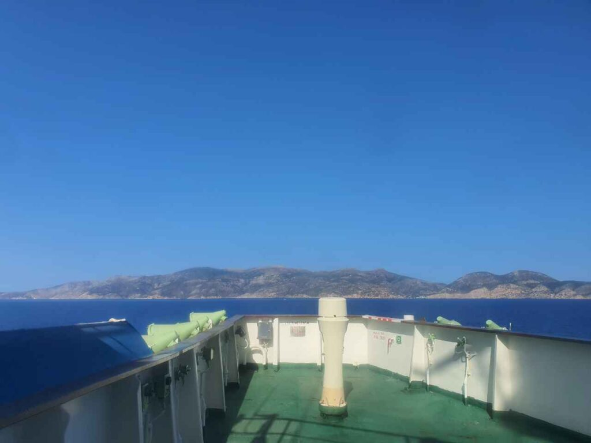

:::c3

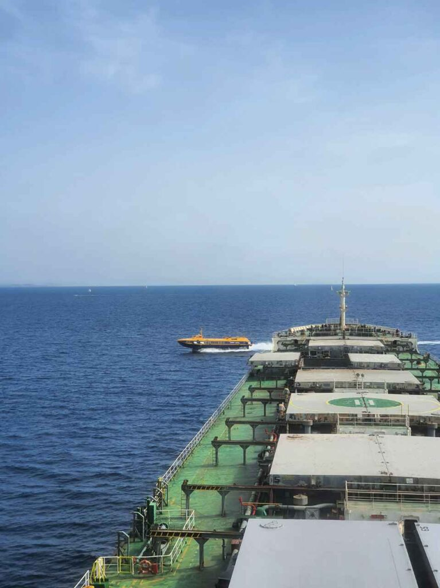

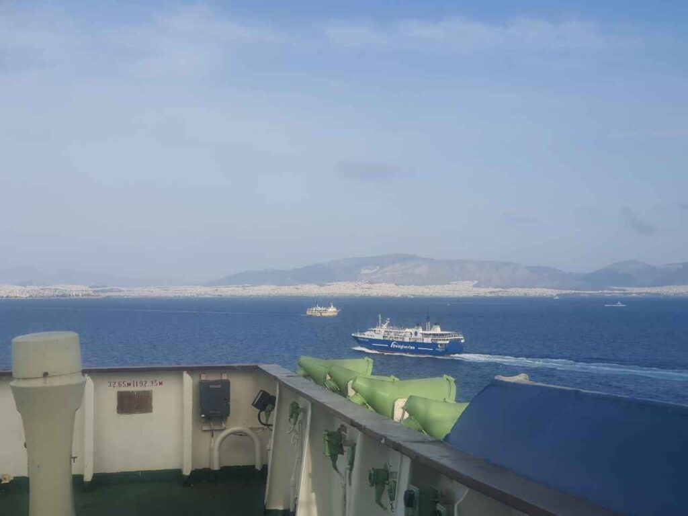

:::

:::

##### 2020.10.05 12:00

Ну ось, приїхали регістр, PSC і техніки.
Регістр у супроводі PSC мельком прошелив місток і знайшов кілька дрібниць, але перевіряли байдуже, а зараз техніки лагодять деяке обладнання на містку. Насправді його варто було б просто замінити. Наприклад, радіолокатори або ехолот та інше.

:::3

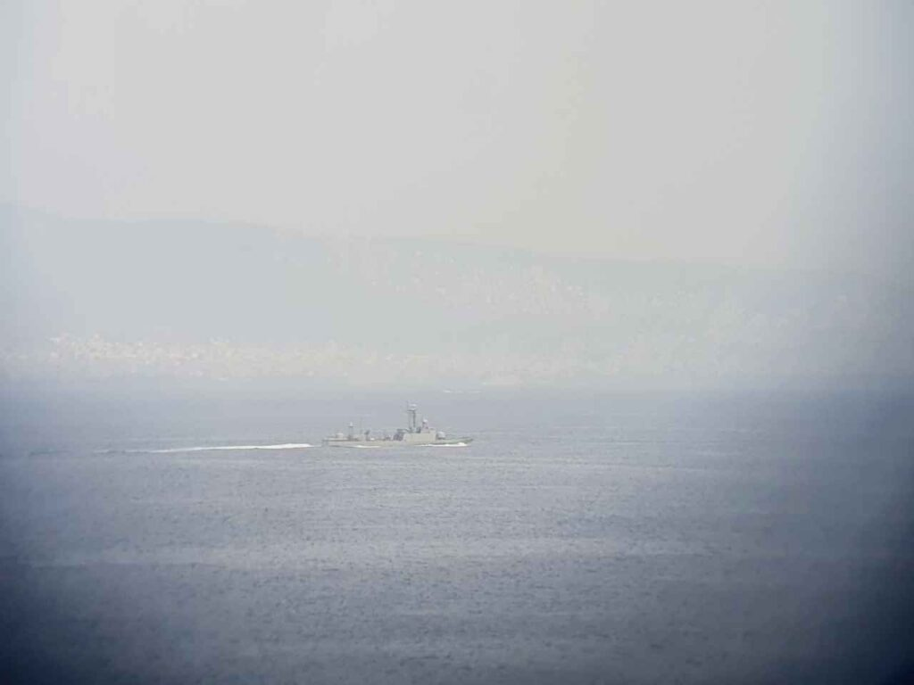
!r2

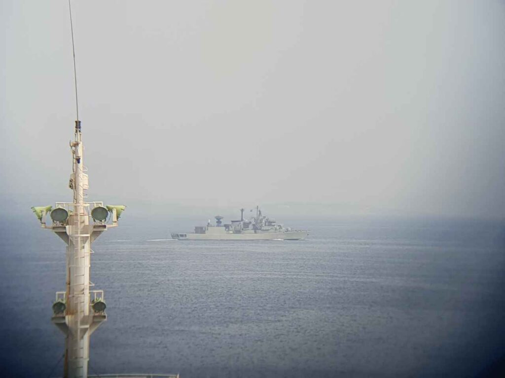

:::

##### 2020.10.05 22:50

Тепер ми йдемо в Україну.
Як виявилося, Україна і Росія — найгірші країни для моряка після африканських.
Не тільки треба майже десяти різним службам надати величезний пакет документів, а й скласти опис усього суднового й особистого майна, включно з флешками та пензликами. Також треба, крім судової аптечки, провести опис особистих аптечок кожного члена екіпажу, а ще буде ходити чорна митниця й шукати незадекларовані цінності.
І це при тому, що ми будемо вантажитися на якорі, не заходячи в порт.
Так, Україна навіть гірша за арабські країни в цьому сенсі. Соромно, дуже соромно за свою країну.

**Upd.** від 2020.10.24 17:00: Як виявилося, усе це дуже легко вирішується, зрозуміло, не за красиві очі. Тож це просто лякають людей, щоб і не подумали дати “на лапу”

##### 2020.10.07 15:00

Оце вже капець. Щойно вибухнув бойлер важкого палива і вдарив постраждалого четвертого механіка. Коли я його побачив, він лежав у напівсвідомості з розсіченою щокою. Ми оперативно викликали шлюпку і на ношах відразу ж краном опустили його на неї. Зараз він уже в лікарні, і, здається, з ним усе добре, але я б грекам не довіряв. Коли він опинився в Україні, звісно, поїде додому. Як виявилося згодом, він нехтував правилами безпеки і не дегазував бойлер перед повторним запуском.
О 16:30 його доставили назад на борт судна.

:::3

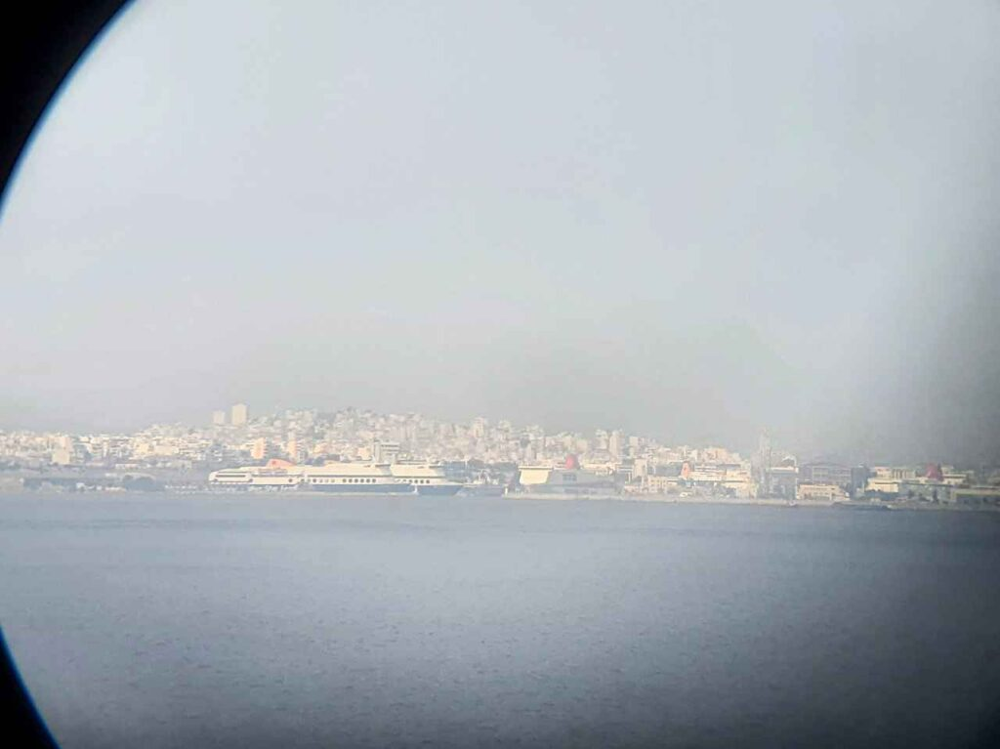

!r2
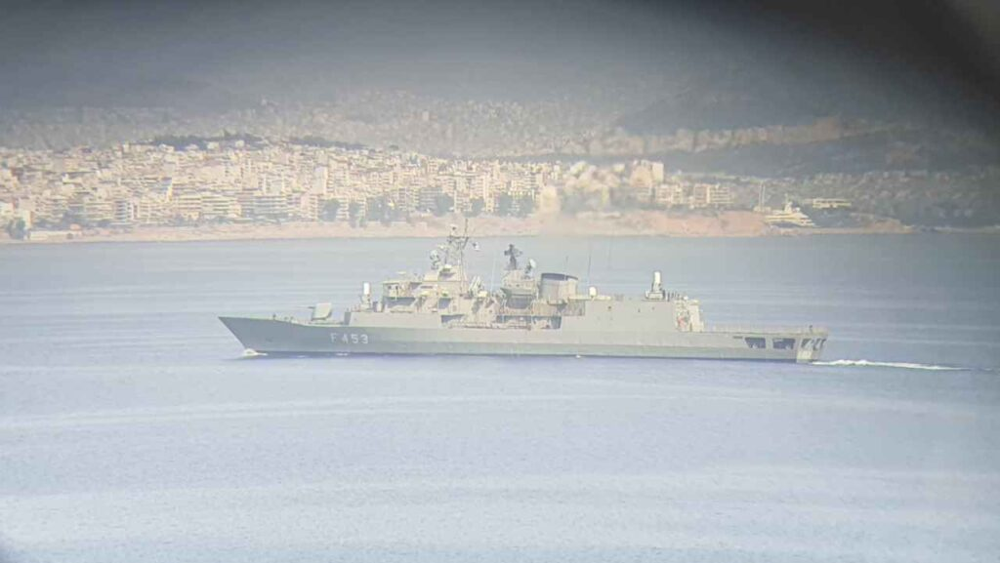

:::

А зліва така ж “ракета” й місцевий поромчик. До речі, якщо придивитися, то поромчик двосторонній, тож йому навіть розвертатися не треба.

##### 2020.10.07 20:00

До речі, про той самий бойлер важкого палива. Без нього нам буде дуже складно кудись іти, бо він призначений для розігріву дуже в’язкого важкого палива. Як варіант, можна йти спочатку на дизельному, а через годину-дві, коли запуститься інший бойлер, що працює від вихлопних газів. Але з огляду на те, що у нас буде багато маневрів, це буде ризиковано — аж до того, що можемо зловити блекаут. У кращому випадку — встигнути замінити бойлер, але у нас залишилося всього два дні. Ніяких креслень цього бойлера немає, адже він стоїть не з побудови, а його замінювали в китайському доку.
Словом, усе стає ще сумніше.

##### 2020.10.10 00:30

Агент забув, що нам потрібно дозвіл на вихід із порту, тому нам не дозволили зворушитися з якоря. Чекаємо ранку.
А він заявляє, що його ніхто і не попереджав…
Та ж самий він має нам повідомляти, а не ми йому. Греки, м-хм.

:::3

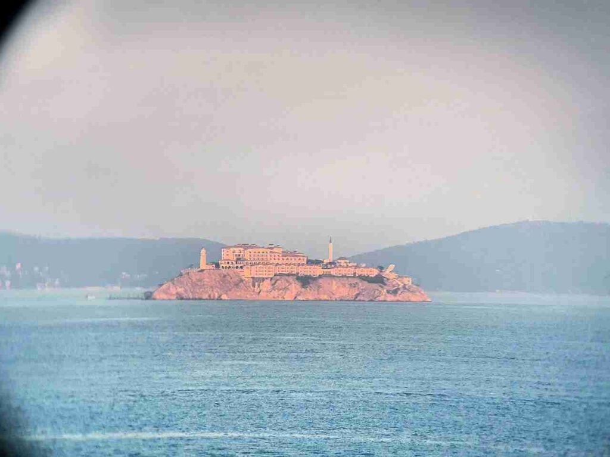

:::

На морі досить великі відстані до будь-чого, тож практично всі мої фотографії зроблені через бінокль)
На щастя, мій телефон дозволяє отримувати хоч скільки-небудь пристойну якість фото)

:::1

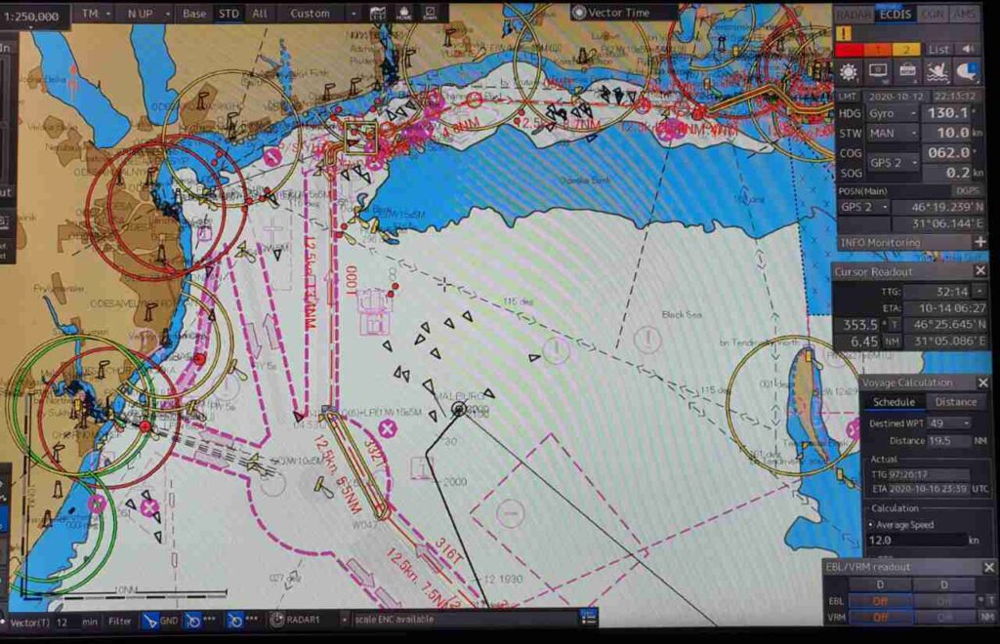

:::

##### 2020.10.13 01:00

Всім привіт з України)
Ми пройшли Дарданели й Босфор, і ось ми прибули на великий український круг. Тут не можна просто зайти в будь-який порт — треба пройти великий круговий рух біля Іллічівська, звідки йдуть шляхи до Одеси та порту Південний. А вже від Південного йде канал, який розгалужується на Миколаїв і Херсон.

##### 2020.10.13 02:00

Незважаючи на всі складнощі, я намагаюся знайти хоч трохи часу на програмування. Оскільки тут інтернету немає й робота з ботами в Pyrogram неможлива, я взявся за PyGame. Вирішив спробувати зробити щось на зразок танків.
Набив каркас гри, але мене зупиняла відсутність штучного інтелекту у ворогів. Хороший друг надіслав мені свою улюблену книгу про розробку ігор, хоч вона досить стара й написана для C та асемблера, але в ній є загальні теоретичні розділи, які мені саме й потрібні.

:::1

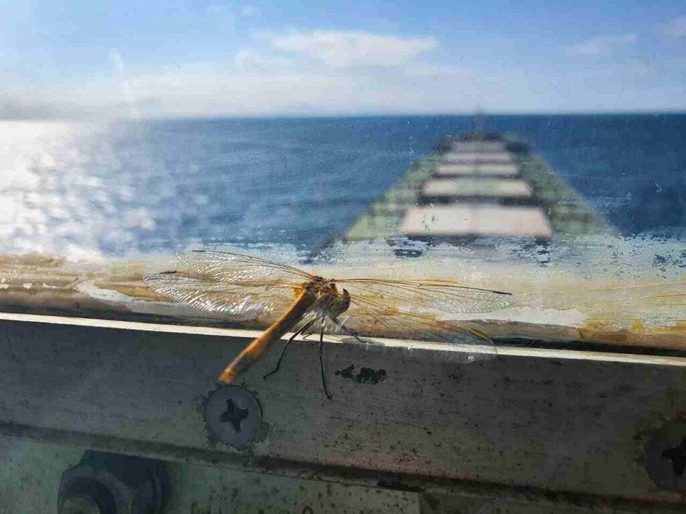

:::

##### 2020.10.16 00:30

Нас викликав Delta-лоцман — ми маємо бути о 05:30 навпроти порту Південний, тож уже через годину будемо готувати машину до запуску й за кілька хвилин починати вирання якоря.
Потім вирушимо до порту Південний, де на борт сядуть лоцман, щоб вести судно каналом аж до порту Миколаїв, на приватний термінал НІБУЛОН.

:::3

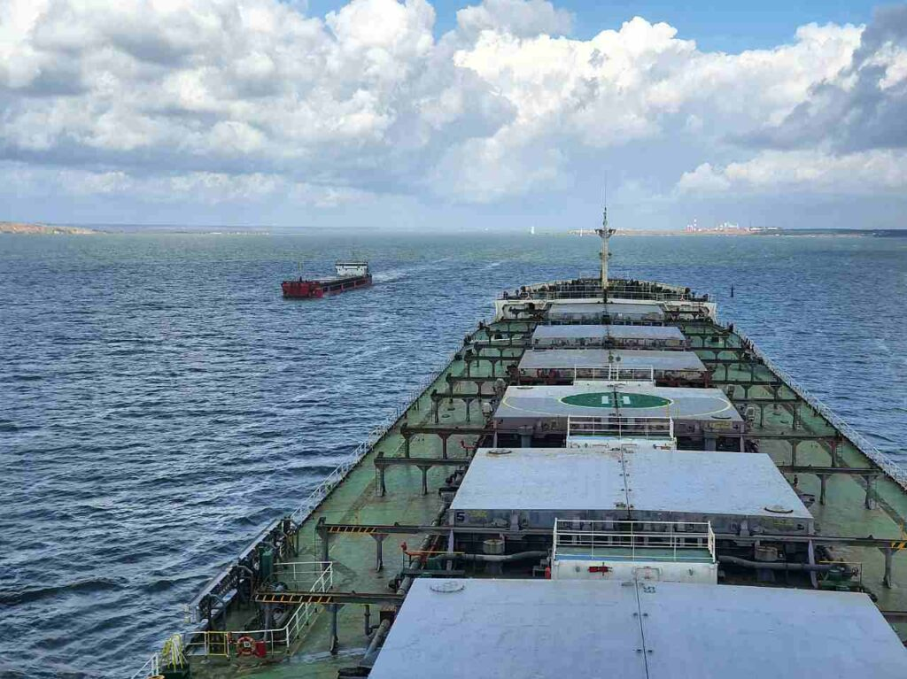

!r2[Заход у порт Миколаїв, термінал НІБУЛОН](+images/photo_1009@16-10-2020_13-08-02-767x1024.jpg)
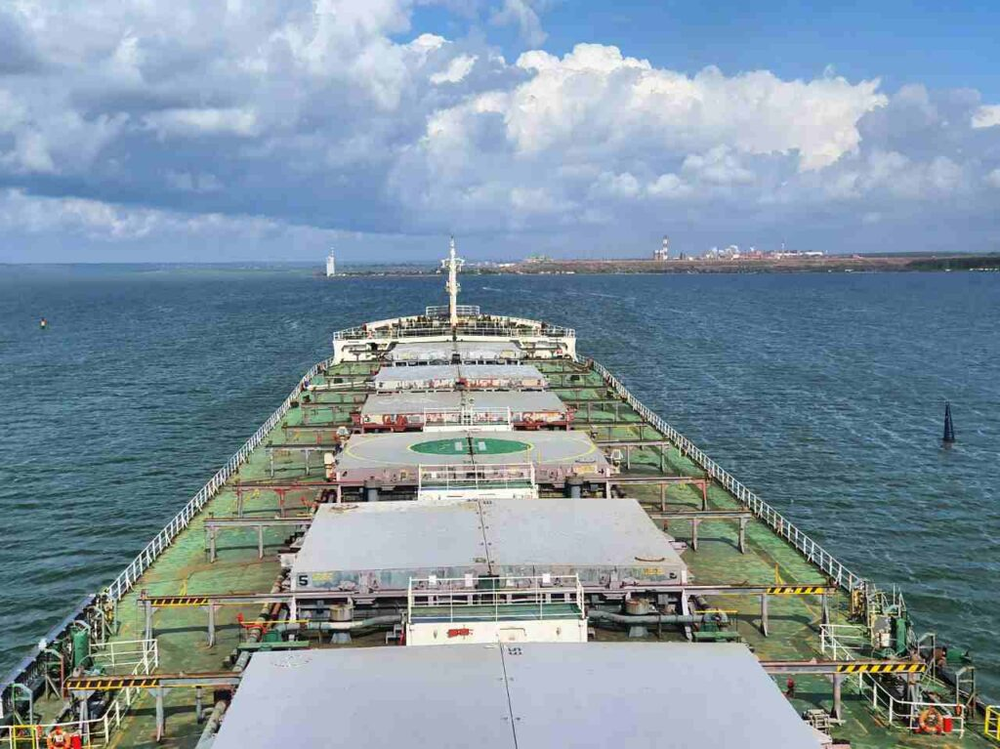
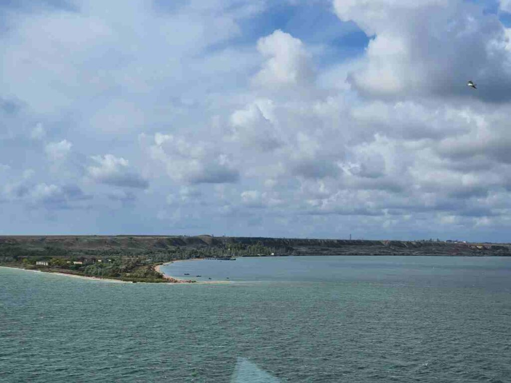
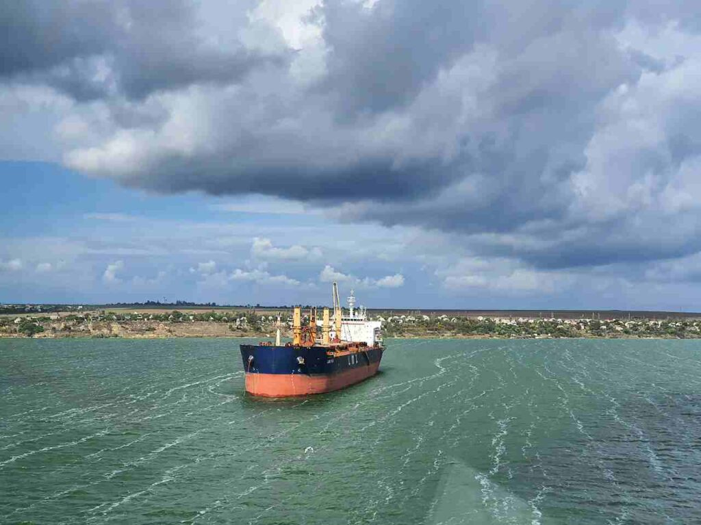
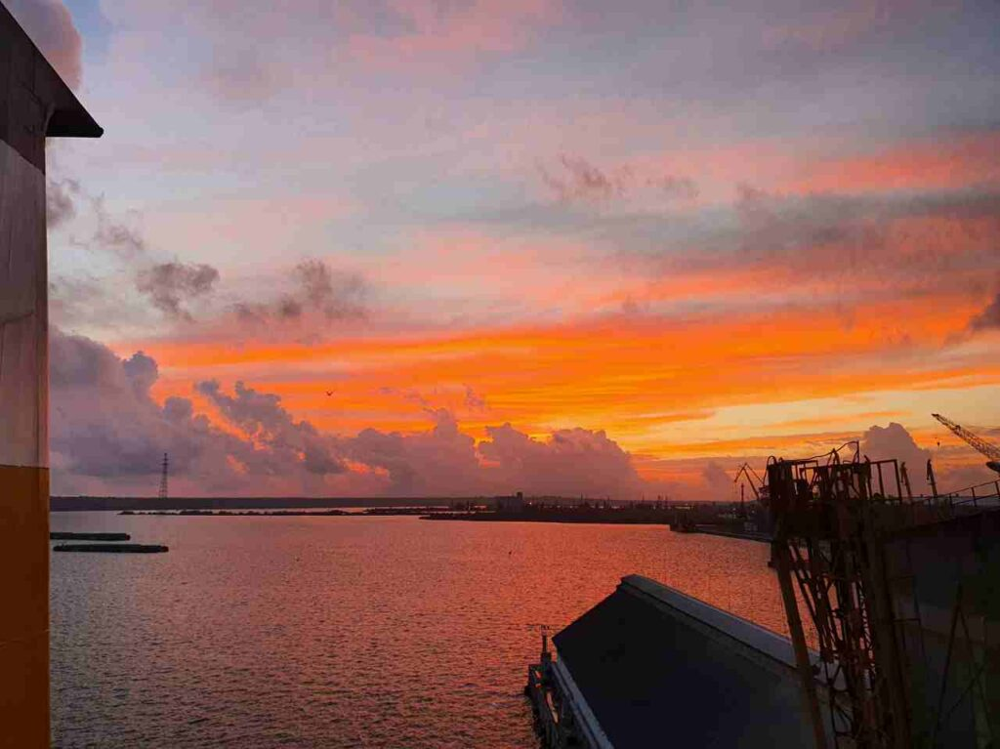

:::

##### 2020.10.16 15:05

Ось ми і пришвартувалися за місцем призначення!

##### 2020.10.18 09:20

Ось я підходжу до трапа, щоб іти до проходної й побачитися з рідними, а в нас трохи назад перетягнули місце швартовки й підняли трап, хех. Нарешті йду зустрічатися з рідними після трьох місяців.

##### 2020.10.18 18:40

Сьогодні я нарешті побував на березі, поїв нормальної їжі й випив пива. Прогулявся з родичами Миколаївським зоопарком і “розмагнітився”, отримавши дозу позитиву. Після перебування на цьому судні вийти на берег — величезна радість)

:::3

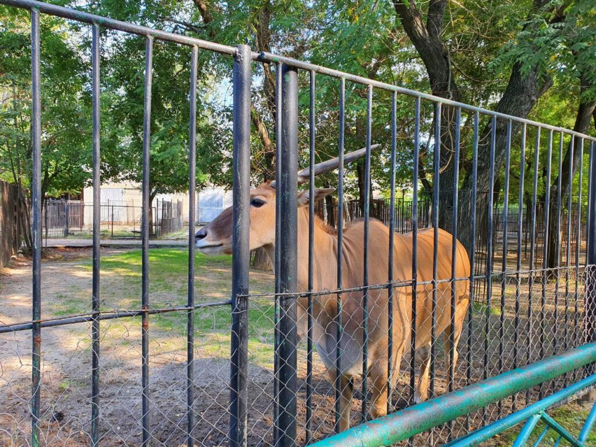

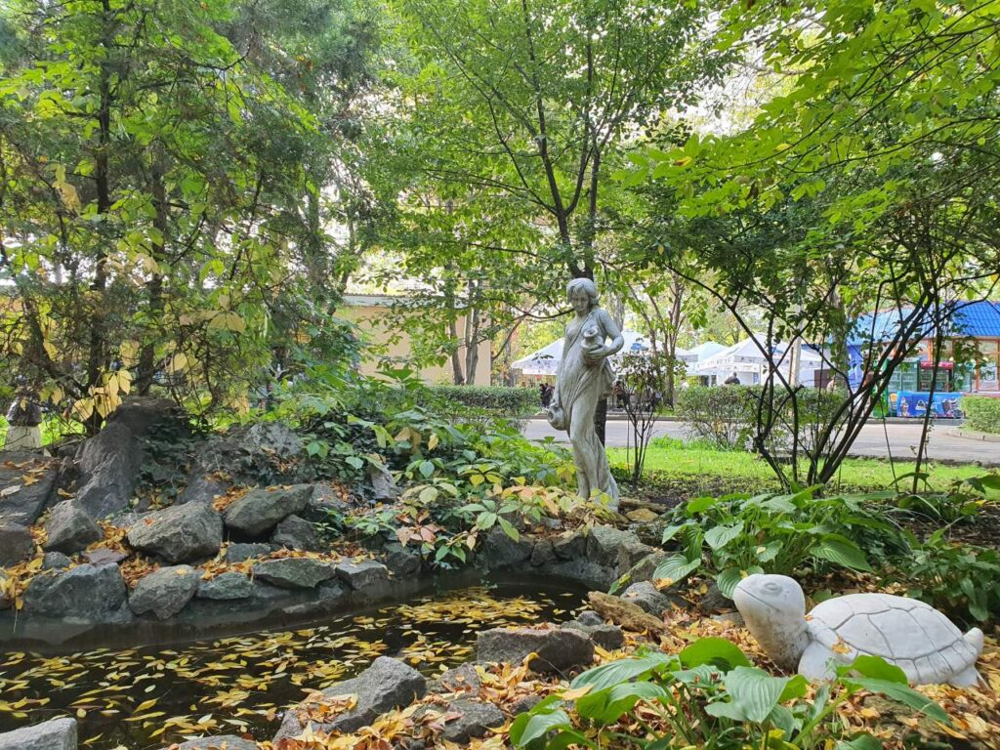

:::

##### 2020.10.21 01:30

Всім привіт)
Учора вдень нас ледве докоригували до 10 метрів у кормі, хоча вимагали cargo plan на 10.3 за справним кілем, і примусили вийти з Миколаєва.
Ми пройшли з лоцманом канал 6 годин і дісталися до якірної стоянки, яка називається Nikolaev Sea Port Outer Anchorage, за словами лоцмана.
Попереду нас у черзі на докомплект ще три судна, і очікується вітряна погода, тож сподіваюся, що ми тут ще постоїмо тиждень-два)
Стає вже прохолодно, втім це все ж краще, ніж спека, від якої не втекти)
Зараз можна накритися ковдрою, одягнути навушники з активним шумозаглушенням, щоб нікого й нічого не чути, і заснути як біла людина)

##### 2020.10.21 14:50

Тим часом у нас шашлички, але оскільки моя вахта, то третій приніс мені м’ясо на місток)

:::1

:::

##### 2020.10.23 13:50

До речі, у нас у ГД зламалася система живлення автоматики, тож тепер ми не можемо запустити головний двигун.
Враховуючи, що ми стоїмо на якорі й прогнози не надто добрі — це доволі небезпечно, адже судно може потягнути на якорі, а ми нічого з цим не зможемо зробити.
Ми доповіли в компанію, і ті начебто пообіцяли бригаду ремонтників, однак агент вимагає оплату готівкою за їхню доставку, але такої суми на борту немає.
За ідеєю, якщо що станеться, нас має рятувати буксир, але тоді компанія просто розориться.
Ось лише-но по УКВ Очаків Traffic Control доповіли, що очікується штормове попередження: вітер до 20 м/с із поривами до 26 і туман із видимістю не більше кілометра…
Що ж, будемо молитися Великій Богині, щоб усе, над чим ми не владні, пройшло добре. А все, що від нас залежить, зробимо самі)

##### 2020.10.24 04:30

Техніки поїхали, полагодили автоматику судна, але не спромоглися підписати жодних документів — дивно. Ну й усіх “нагребли” від старшого механіка.

:::1

:::

##### 2020.10.24 11:50

Рибалки вилізли звідусіль на своїх човнах. Вихідні?

##### 2020.10.24 13:20

Я сьогодні наче зварений овоч…
Ще й скандали, інтриги, розслідування — обстановка тільки загострюється, хоча мала б ставати лише кращою. Деякі вже зараз готові писати заяви.
А тим, хто не брав у цьому участі, все одно морально важко знаходитися в такому середовищі, коли всі скаржаться один на одного чи звинувачують когось…
Де ми пішли не так?

:::2

:::c2

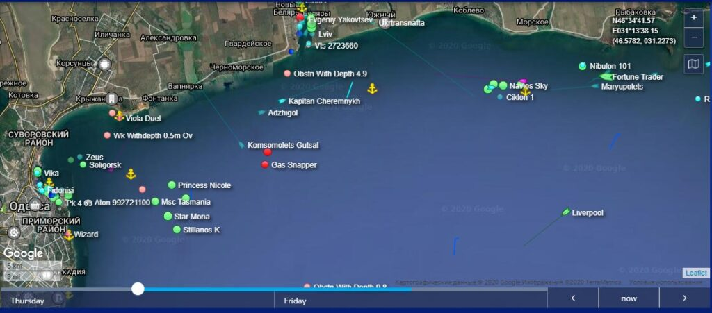

:::

:::

##### 2020.10.29 09:00

Ось і настав час прощатися з Україною. Зараз тривають формальності, і незабаром ми зворушимося з якоря і знову рушимо до арабів.

:::3

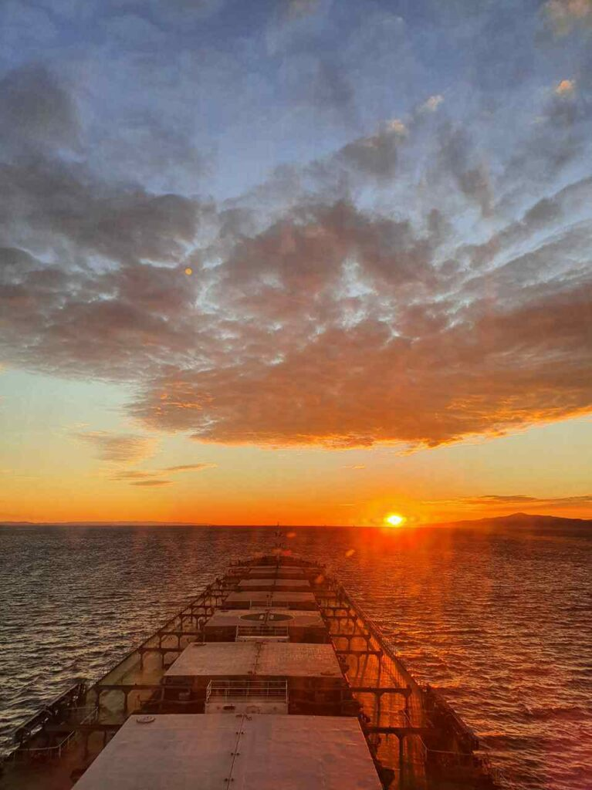
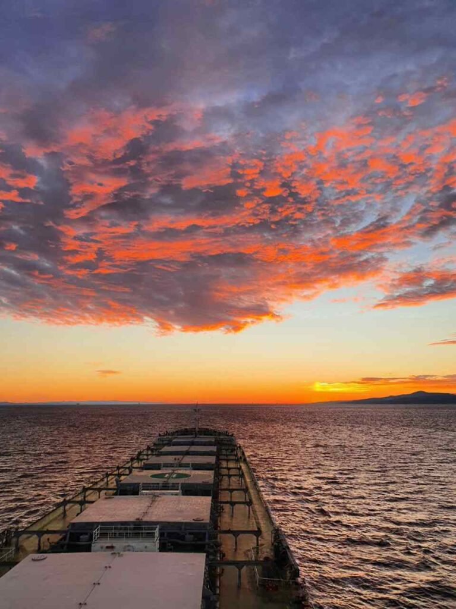

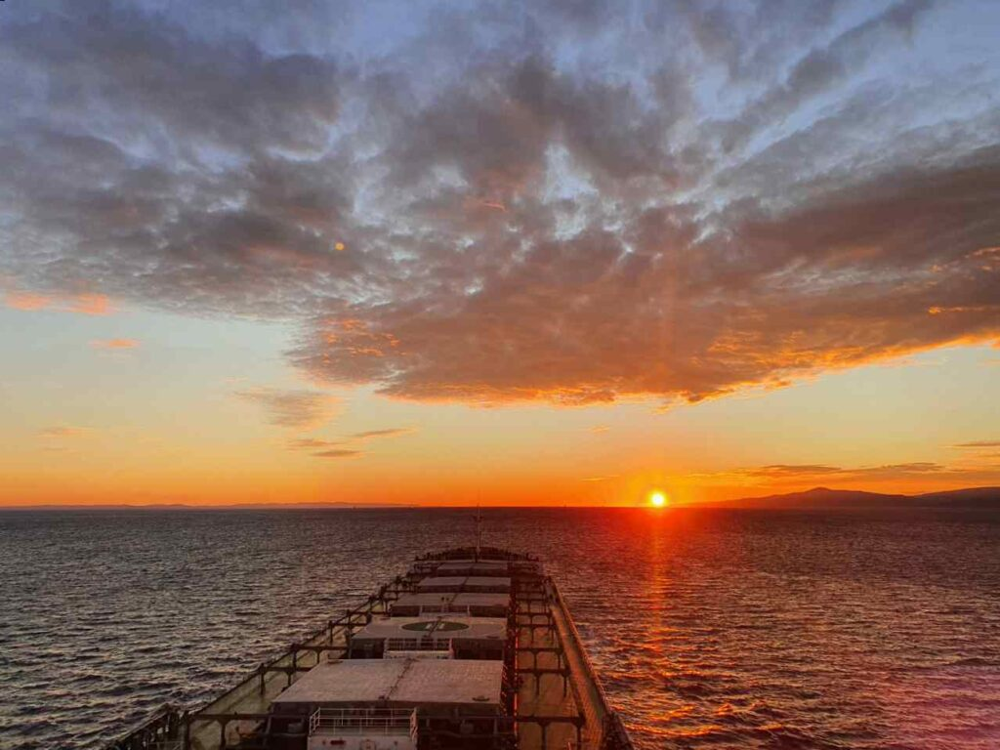

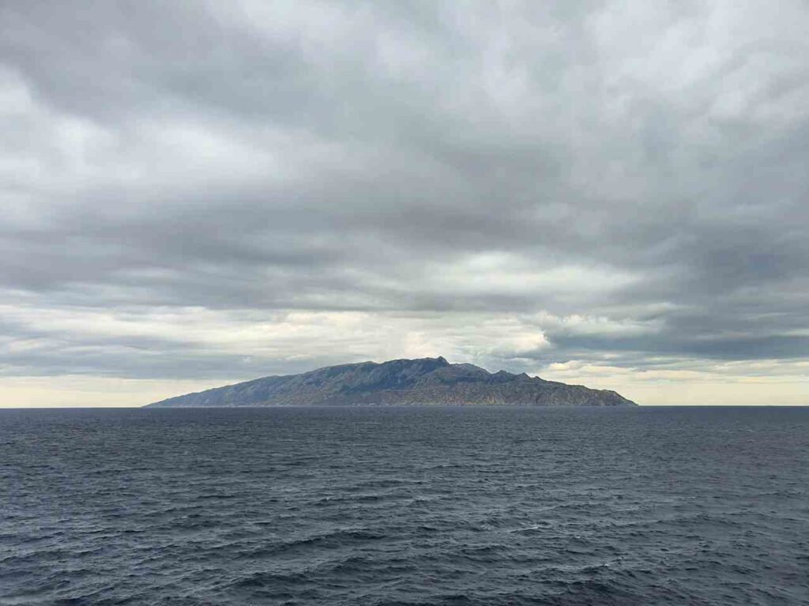

!r2

Люблю вас ❤️

Все буде добре, Кацу! 🦊
