На відміну від минулого рейсу, цей займе більше чотирьох постів. Якщо минулого разу мені вдавалося вміщати два місяці в одному дописі, то цього разу мені доводиться робити по одному допису на кожний місяць через величезну кількість тексту та фотографій. Сподіваюся, вам цікаво, дорогий читачу. Якщо якісь моменти будуть незрозумілими або вимагатимуть додаткових пояснень, будь ласка, не соромтеся залишати коментарі. У минулому дописі я закінчив опис жовтня, тому переходимо до листопада.

##### 2020.11.03 18:05

Так, так, ми прибули до Єгипту, і нас знову чекають арабські знущання над нервовою системою. Тим часом за кілька днів мине вже три місяці, як я перебуваю на цьому судні. Атмосфера на борту здається більш-менш спокійною. Але їжа так і залишилася такою ж протверезливою. Хоча вчора майстер змусив кухаря приготувати вінегрет, і він вийшов навіть трохи смачним. За пару днів ми опинимося в Акабі, а після кількох днів дрейфу в затоці ми знову зайдемо в арабський порт. Там нас чекає тиждень розвантаження з вахтами 6 через 6, після чого ми рушимо до Пірея на ремонт. Далі невідомо, але за останньою інформацією багато балкерів простоюють, а ціна фрахту впала майже вдвічі. Тож сподіваюся, що після ремонту ми ще пару місяців просто стоїмо на якорі. А потім, до лютого, знову вирушимо в Миколаїв, хіхі.

##### 2020.11.04 18:17

Ось ми й вийшли з Суеца — усе закінчилося добре, і навіть так сильно нам не морочили голову, як минулого разу. Тому вже завтра ввечері ми чекатимемо на рейді Акаби, в очікуванні розвантаження. Розповідати навіть нічого — із настанням третього місяця вмикається режим байдужості та безоціночних суджень, хех. Хоча, дивлячись на жахи, що відбуваються в Україні, повертатися не сильно й хочеться.

%%%1
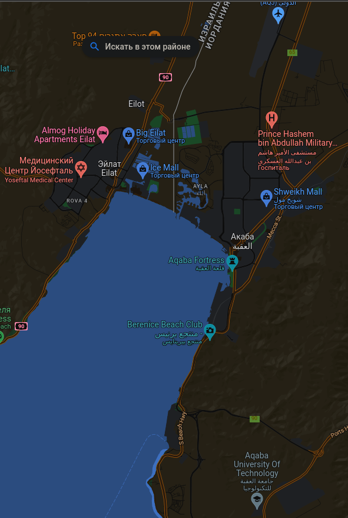
%%%

##### 2020.11.06 02:15

Підійшли до Акаби в Йорданії. Виявилося, що нам треба було не в порт, а в інше місце, і колишні тут старпом і третій механік отримали нагоняй за те, що не повідомили про це. Коли ми прийшли, я подав необхідні документи агенту, але він одразу написав список того, що йому потрібно додатково. Я теж отримав нагоняй, чому не готово, хоча навіть не міг знати, що їм можуть знадобитися інші документи. І як це пояснити сердитому капітану? Мех.

**Upd.** Взагалі-то підготовка прихідних документів — це обов’язок третього корабельного радіомеханіка, але капітан йому не довіряв, називаючи «роздолбаєм», і попросив зробити їх мене. Зараз ми крутимося, дрейфуємо, а дівчата з ізраїльської армії викликають, кричать: «Відійдіть від нашого державного кордону», хоча ми маневрували в вузькому місці, завширшки пару кілометрів, між берегом і кордоном Ізраїлю.

%%%3
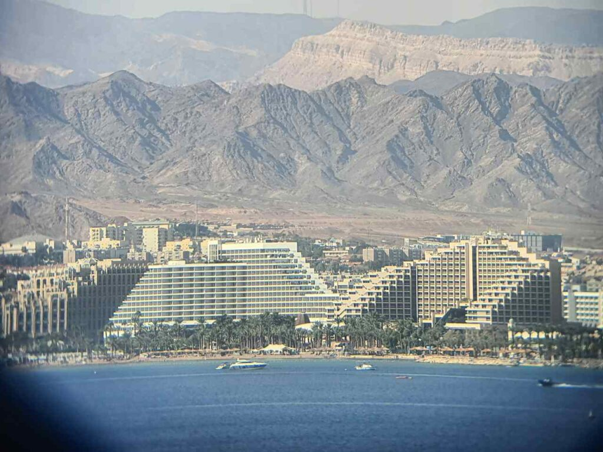

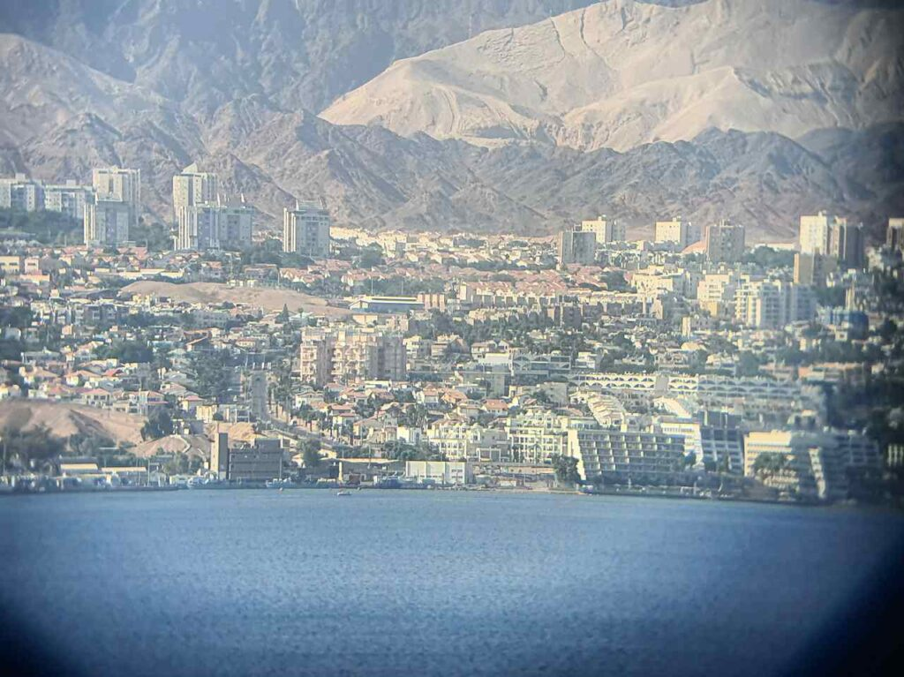

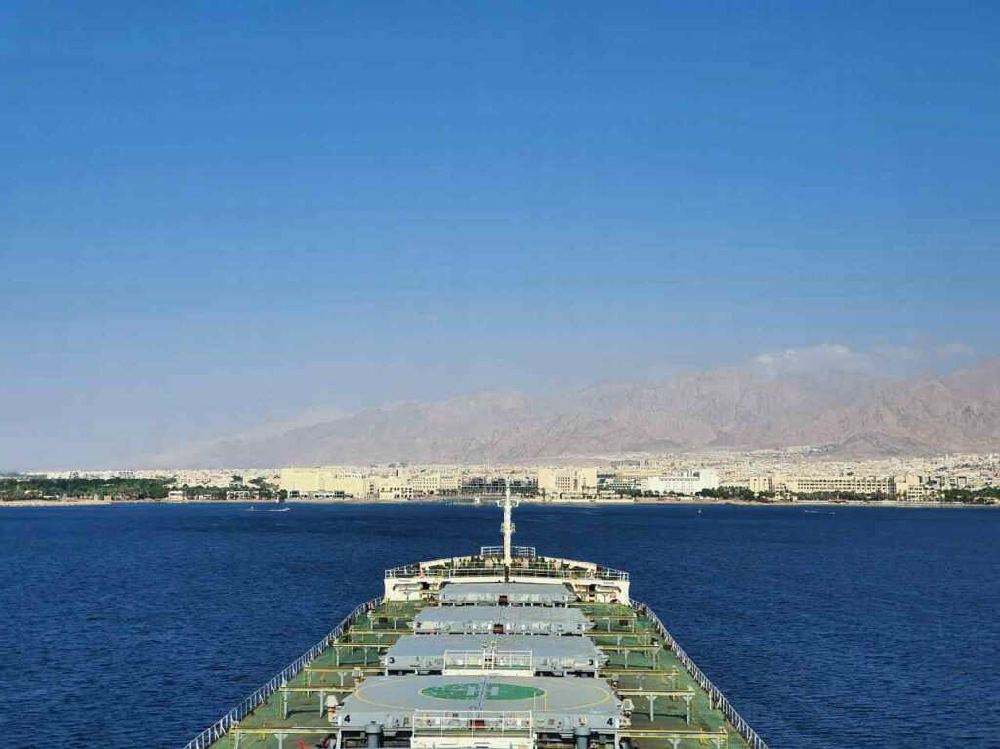

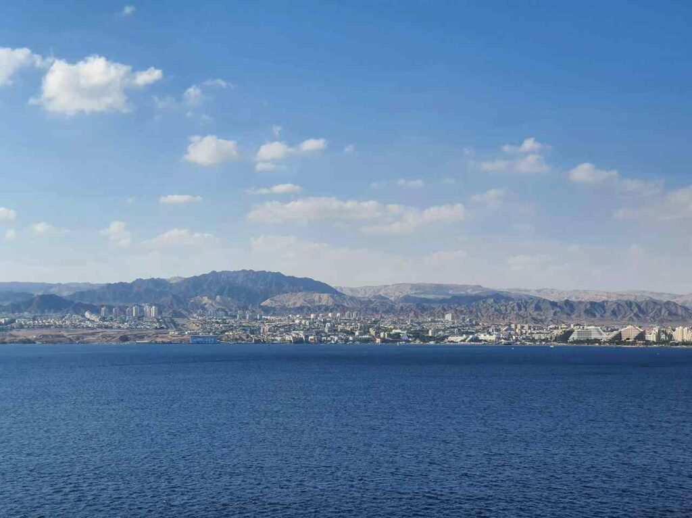
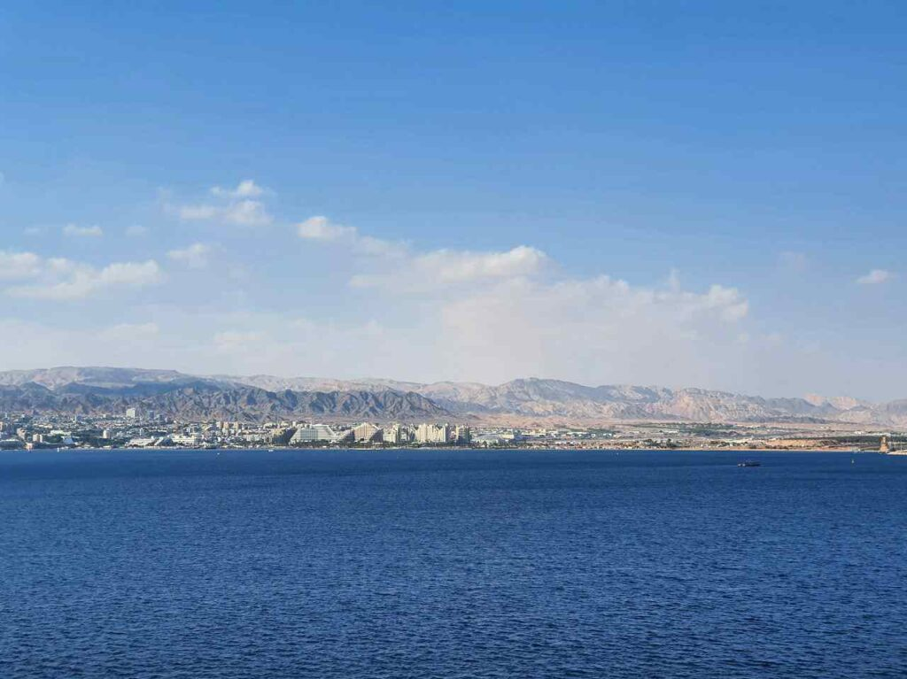

%&23

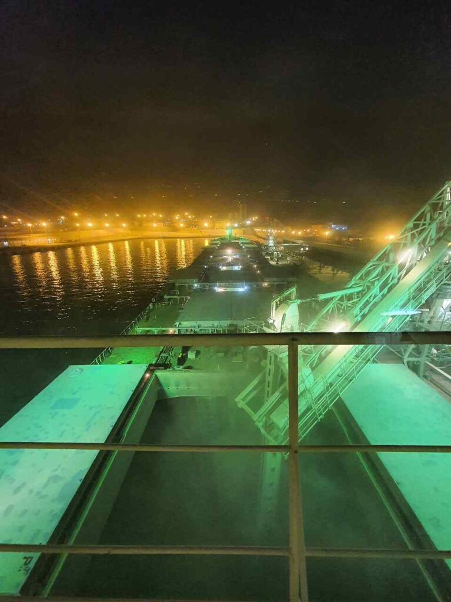
&%
%%%

##### 2020.11.14 16:30

Мої розмови з капітаном дають плоди. Я розповів йому, що в Україні зараз ще кепськіше, ніж тут, про небезпеки коронавірусу і про те, що тут хоча б гроші йдуть у плюс, а не в мінус. В результаті він, здається, дослухається до моїх доводів і замислюється лишитися до березня 😅😅.

##### 2020.11.16 00:30

Веду звіт за вчорашній день. О 11:00 я прокинувся і хотів було йти в душ, але почув стукіт від третього корабельного радіомеханіка та врятівні слова “Кацу, ПСК”. (Інспекція судна) Піднімаюся на місток, інспектор попросив папку з сертифікатами і почав усе перевіряти. Він не знайшов одного додатку до сертифіката, а копія, зроблена мною, йому не підійшла. (**Upd.** знову ж таки, судові сертифікати — відповідальність третього корабельного радіомеханіка відповідно до плану, але цим зайнявся я.) Ми спустилися з містка. (**Upd.** мені довірили почесну місію супроводжувати інспектора.)

- Вмикнули шлюпки (інспектор не дав часу запустити двигун і заявив, що одна з двох батарей не робоча).
- Залазив у сміттєву кімнату і заявив, що сміття забагато. (Хоч ми й спалили сміття до приходу в порт, але тут стоїмо вже якийсь час).
- Завели аварійний дизель-генератор.
- Після цього пішли в ЦПУ (кімната управління всіма механізмами в машинному відділенні).
- Там він клацав комп’ютери і фотографував помилки на них.
- Далі попросив електромеханіка відкрити ГРЩ на 220 В і 440 В, довго порпався й знайшов у одному нез’єднаний дріт, а в іншому неохайно припаяне опірники.
- Потім пройшовся всією машиною, зазираючи в кожну щілину і заявив, що машина брудна й усюди підтікає олія.

Як тільки ми повернулися на місток, я виявив, що той допис до сертифіката існує з припискою, що він електронний, і це вже пройшло. Тоді інспектор показав майстру фотографії і почав розповідати про купу зауважень, які могли б призвести до затримання судна, і капітанові майже довелося благати його не чинити цього. Побачимо, як усе буде далі.

На зв’язку був Кацу з доповіддю про інспекцію PSC на судні Fortune Trader в порту Акаба, Йорданія.

##### 2020.11.16 05:00

Виходячи з телефонної розмови з представниками компанії, у Стамбулі на рейді мають замінити старпома (старшого помічника капітана) нашого судна. І, як я розумію, під шумок хочуть «поменяти» немало людей, включно з (але не обмежуючись) третім механіком, кухарем, мотористом.

##### 2020.11.16 19:00

Капітан повідомив жахливу новину. У Росії, якщо судно пришвартовується до причалу, на борту не має бути ніякої їжі, не врахованої в інвентаризації — ні виловленої риби, ні, як у мене, привезеної власної їжі. Я кілька разів опиняюся в Росії й думаю, що дурнішої в законодавстві країни я не зустрічав. Пакет pre-arrival документів містить аж 43 документи!

##### 2020.11.17 16:30

Сьогодні, ймовірно після півночі, нам належить відхід з Акаби. Далі нас чекає чергове проходження Суецького каналу, а потім, через 2–3 дні, ми підемо до Дарданел. Ще через добу покинемо Босфор і залишиться трохи більше доби до Тамані. Там нас чекає більше ніж тиждень завантаження на відкритому, незахищеному причалі з перешвартуваннями (бо місцеві крани охоплюють лише 5 трюмів за раз). Також завжди потрібно бути готовими відійти з порту, якщо погода погіршиться. Режим просто маячня: у портах дуже втомлюєшся через вахти 6/6, а через тиждень ходи, під час якої треба підготувати документи на три порти й пройти три пролива, знову більше ніж тиждень стоянки… Не дарма в нормальних компаніях контракти три-чотири місяці, а не греківські ідіотські 7–10, бо це справжній садизм. Проте капіталістичний світ жорстокий до тих, у кого немає грошей, тож доводиться терпіти. Хай Велика Богиня допоможе з гідністю пережити ці випробування.

##### 2020.11.18 00:30

Отже, агент на борту, підписуються останні документи, і о 01:30 на борт прибуде лоцман. А завтра — Суець, знову араби і вся ця веселуха. Хоча таке відчуття, що росіяни там будуть ще гірші.

> Веселі історії журнал покаже наш,  
> Веселі історії в журналі — Араб Раш.

%%%1
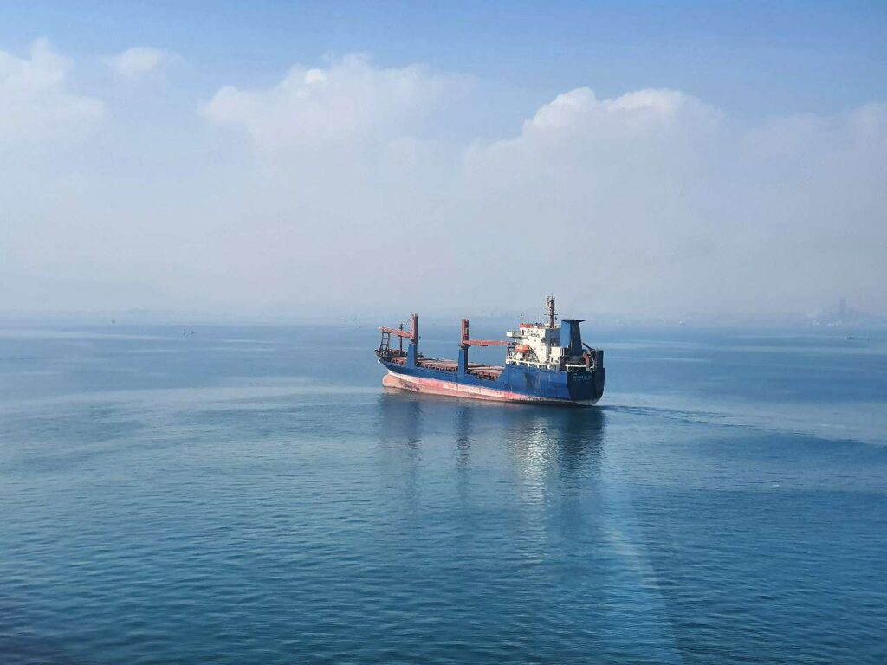
%%%

##### 2020.11.19 14:10

Трохи свіжих фотографій із рейду порту Суец. Ми мали підійти до спеціальної лінії відрізання до 05:00, щоб у 23:00 зайти в канал, але коли я викликав Port Suez Port Control, мені сказали приходити не раніше 08:00. На щастя, в схемі розділення руху (свого роду «дорога» на карті) було кілька перехресть, тож ми розвернулися, пішли назад, а потім знову повернулися за вказівкою Port Control. Зараз чекаємо на прохачів із Suez Canal Authorities, Immigration та Quarantine, які візьмуть якусь купу непотрібних паперів і по кілька блоків сигарет, а потім підуть собі.

##### 2020.11.20 01:45

Чомусь, коли йдеш по Суецу в бік Червоного моря, усе проходить більш-менш спокійно. Але як тільки йдеш до Середземного, вони просто з глузду з’їжджають. Агент/Інспекція/Карантин обійшлися десятьма блоками сигарет. Але ж досадили:

- Електрики (ставлять спеціальний ніким не потрібний прожектор) вимагали 10 блоків через те, що щось не так із тим прожектором, вдалося знизити ціну до 4.
- Лодочники (повинні швидко пришвартувати неробоче судно, але розташовують свої шлюпки так, що їх неможливо швидко зняти) вимагали цілий ящик (50 блоків), вдалося домовитися на 15.
- Мало того, їм ще не подобається спеціальна суецька каюта — вони вимагають місце в надбудові.

О Велика Богиня, покарай їх згідно з твоїми вченнями.

%%%2

%%%

##### 2020.11.24 13:20

Ми вкотре пройшли турецькі протоки і зараз прямуємо до порту Тамань. Незважаючи на те, що я п’ю вітаміни і нормально сплю, останнім часом мене накрила жахлива втома. Невідомо від чого, але з кожним днем все важче підніматися на вахту і змушувати себе щось робити… Навіть серіали більше не дивлюся, і книги не читаються: зайшов до каюти — і одразу падаю у сон. Тим часом у нас із капітаном і другим механіком уже 3,5 місяця. Стало холодніше, тож учора довелося перейти з шортів на джинси та светри, адже вже майже зима.

##### 2020.11.25 13:00

Вітаю з рейду порту Тамань. Зараз ми перебуваємо в територіальних водах РФ, але буквально за годину підемо на якір. За картою видно, що причали Тамані поки що зайняті.

%%%2
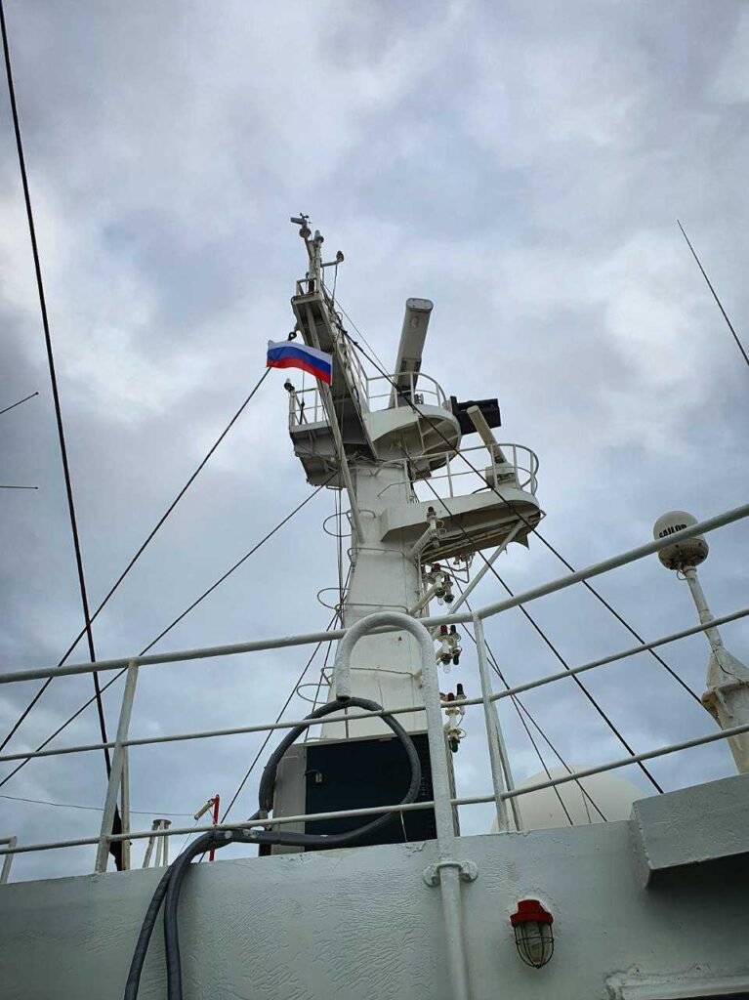
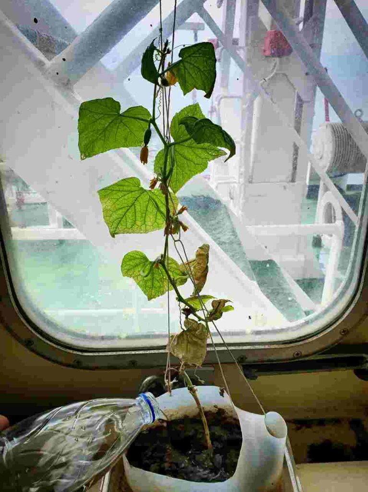
%%%

##### 2020.11.27 02:30

До речі, ось таке спадок залишив після себе минулий «садівник»-капітан. Помідори зберегти не вдалося, а от огірки дали перші плоди. Правда, стан у них такий собі, як на мене, через нестачу поживних речовин, але де їх тут узяти?

##### 2020.11.27 02:30

Сьогодні приблизно о 04:00 ми повинні почати рух у бік нашого причалу в порту Тамань. Зараз же стоїмо на якорі. Завантаження дуже швидке, зі швидкістю 500–1000 тонн на годину, тому, якщо погода буде нормальна, воно не триватиме довше трьох діб. Після чого нас чекає бункерування. Щодо зміни екіпажу в Стамбулі: нам підтвердили заміну старпома, третього помічника капітана, третього механіка, моториста і кухаря. Старпома змінюють через незадовільну роботу, третій і кухар написали заяви на зміну, а третій механік і моторист уже рік сидять на судні, тож їм пора додому. Також хотіли змінити електромеханіка, але майстер попросив його залишитися, і компанія зрештою погодилася, хоч і поворчала.

%%%2
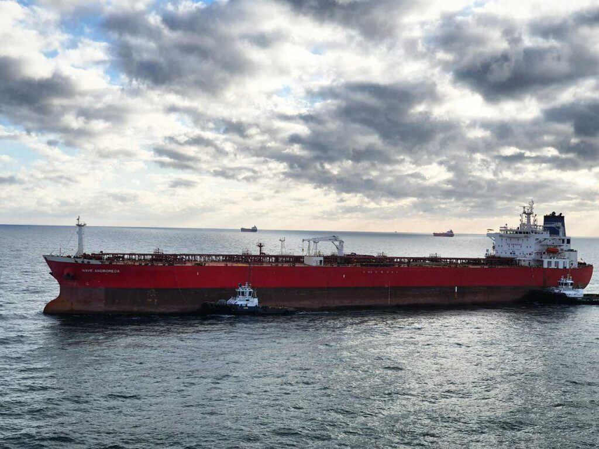
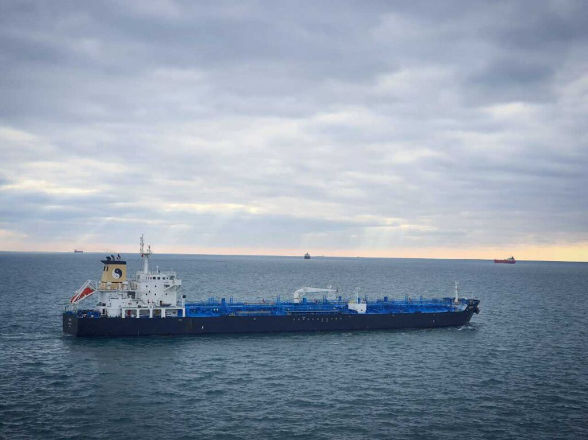
%%%

##### 2020.11.27 02:50

Коли ми заходили в порт, нас покликали прикордонники і сказали не входити в особливий закритий район, та порадили йти іншим курсом. При цьому закриття цього району не вказано ні в жодних повідомленнях NAVAREA або NAVTEX. Вони казали щось про свої ПРІПи/НАВІПи, але хто їх зараз отримує, крім флоту РФ? А крім як через Інтернет, якого немає, я не в курсі жодного способу їх отримати. Отже, нашому судну прикордонники казали йти в бік, російською, і ми рушили рекомендованим курсом, відповідно до їхніх вимог. Офіцер імміграційної служби сказав, що ми трохи все ж зайшли в закритий район, але це «закриють очі». Однак судам із англомовними екіпажами прикордонники не змогли пояснити необхідність не заходити в закритий район, тому ці судна тепер оштрафують на 300 000 ₽ (приблизно 3,5–4 тис. дол.). За що? Просто тому, що можуть. Росія — щедра душа.

##### 2020.11.28 00:20

Нас штормить із жахливою силою. На щастя, нас поки що не відірвало від причалу. А багато суден уже виходять з порту. Вітер був південно-східний, що нарощував хвилю, яка била нам у борт. Зараз вітер трохи зсунувся на південь, і хвиля трохи стихла. В принципі, качка трохи заспокоїлася, але все одно зберігається. До 03:00 за МСК хвиля має зовсім вщухнути. Причал, де ми стоїмо — не в гавані, а просто виносний на 3–4 км у море пірс, тож приємного тут дуже мало. А нас «притримує» буксир на ім’я «Яхонт», який, власне, зовсім без користі.

%%%2
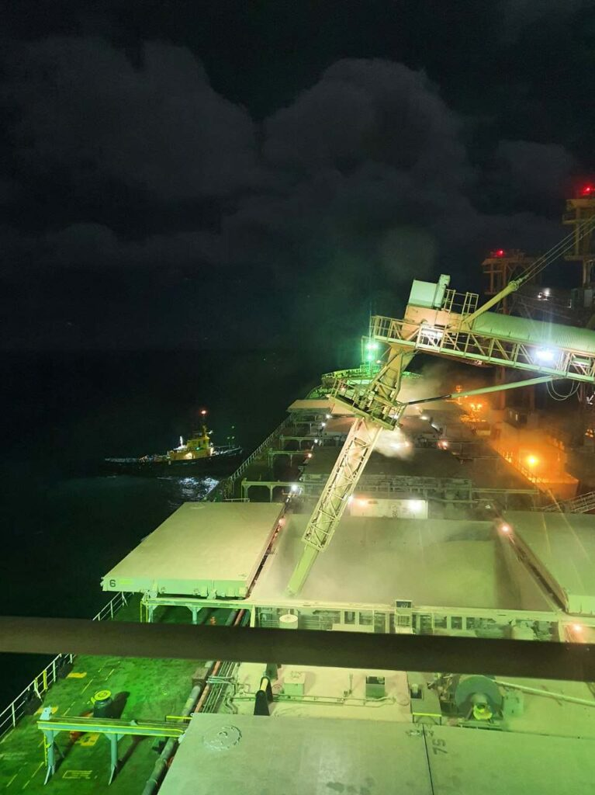
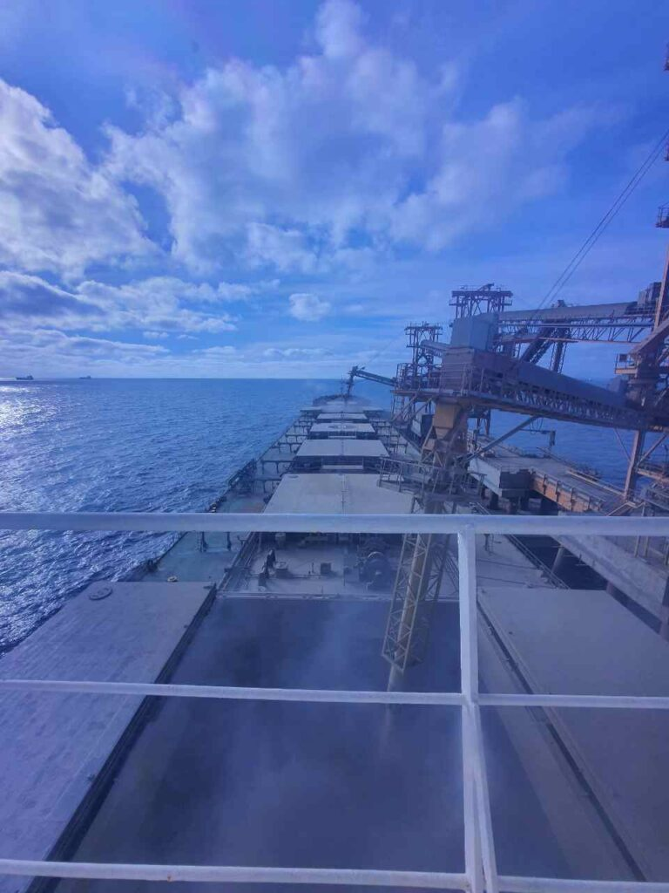
%%%

##### 2020.11.29 12:40

Завантаження майже завершується — залишилися два останні трюми, які обіцяють «добити» до 20:00. Далі старпом із сюрвеєром проведуть драфт-сюрвей. Після цього до півночі ми вийдемо з порту і станемо на якір під бункерування важким паливом (мазутом із низьким вмістом сірки). Однак, оскільки в Росії все дуже довго, після бункерування до світанку триватимуть формальності, і вийти з порту нам дозволять аж до 15:00 30.11. Щодо інспекції PSC — у порту Тамань, певно, PSC Паризького меморандуму не представлено, а Чорноморський меморандум ми пройшли без зауважень в Україні, тож вони не повинні прийти.

##### 2020.11.30 00:40

Отже, все. Завантаження завершено, проведено драфт-сюрвей і фумігацію. На 01:00 замовили лоцмана, і ми починаємо вибирати додаткові кінці. Через годину-дві ми будемо на якорі в порту Тамань і чекатимемо на бункерування.

##### 2020.11.30 03:20

У Криму зараз чутно Стамбул по УКВ. А це майже 420 миль, що майже 800 км. Ось вам сила фізики.

%%%2

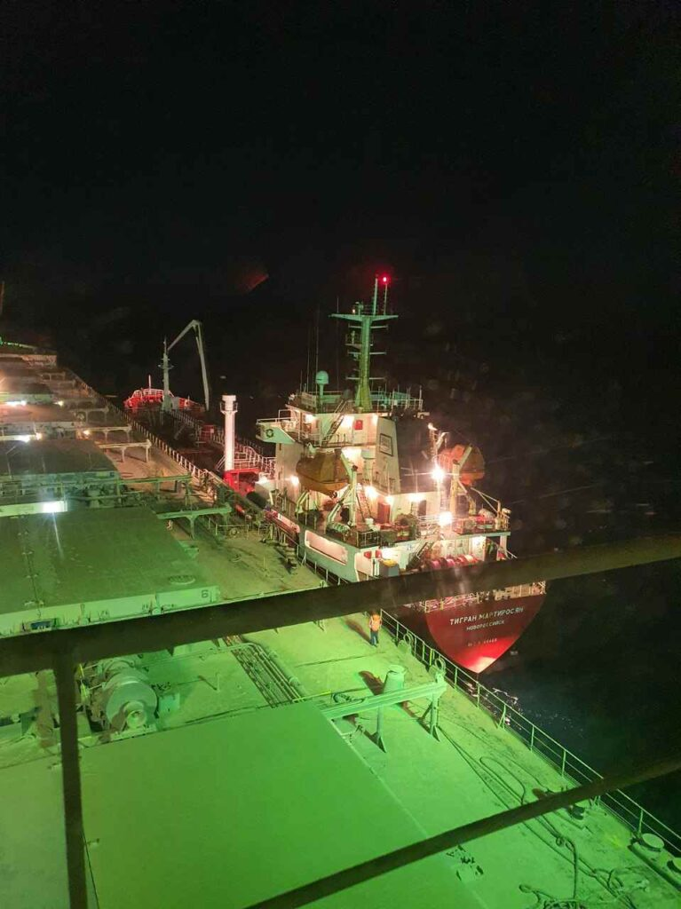
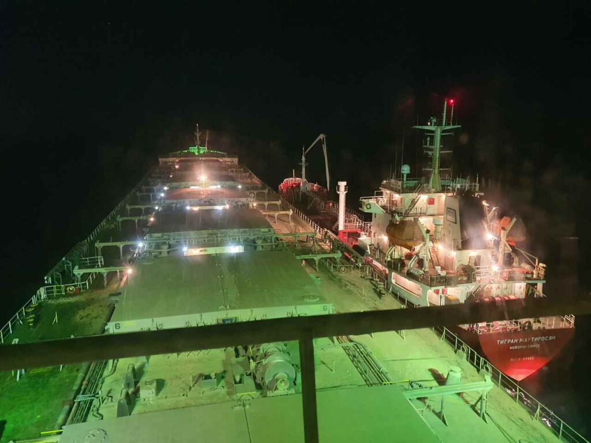
%&12

&%
%%%

Ще цілий день ми чекали приходу прикордонників, щоб нас випустили.

##### 2020.12.01 20:30

Ось і завершила роботу комісія. Були цікаві прикордонники, розповідали байки, пили пиво. Однак вітер і хвиля піднялися — не знаю, як взагалі зліземо. Скоро будемо відходити і рухатися в бік Стамбула, де відбудеться зміна екіпажу. Після цього буде розвантаження десь в Єгипті, ми досі не знаємо де. Потім, можливо, ремонт. Але хто його знає.

Що ж, зрештою листопад, який був таким насиченим, завершився. А у Кацу, який це пише, вже майже північ, час спати. І вам теж лягайте раніше, няшки.

Люблю вас ❤️  
Все буде Кацу! 🦊
