##### 2020.12.05 00:30

Hello everyone from this vessel.  
We have finally passed the Bosphorus and Çanakkale, and it wasn’t without seven-hour watches due to the crew change.  
We replaced 6 people while underway:

- Chief Officer
- 3rd Assistant Captain
- 3rd Engineer
- Electro-Mechanic
- Motorman
- Cook

In total, 24 people work on our ship.  
The new Chief Officer seems okay; he’s 31 years old. We were working together on the cargo planning software today, so maybe I can learn something from him.  
The 3rd Officer also seems fine, despite being 48 years old.  
The new cook is cooking better than the old one. I hope he’ll stay with us longer.  
Fresh blood always lifts morale a bit, because once the old crew is all thoroughly acquainted and everything to say has been said, things start to feel a bit dreary.  
Right now we’re heading toward Alexandria, but the exact discharge port is still unknown.

##### 2020.12.05 13:50

Here's the new bridge being built in the Dardanelles Strait at Çanakkale. According to the pilot, it will be completed in about a year and a couple of months.

:::3

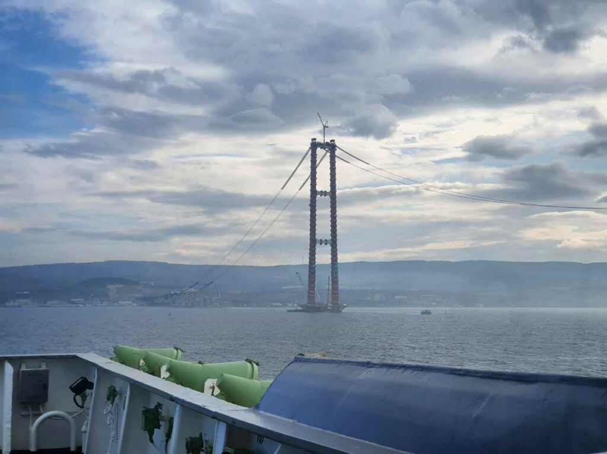

:::c3

:::

:::

##### 2020.12.07 01:05

Today marks 4 months since I boarded FORTUNE TRADER.  
I wouldn’t say I’m especially happy about it, but in our world very few people are happy with their jobs, hehe. **Upd.** Now that I’m working in IT, I am happy.  
I hope a period comes in my life when I can work and genuinely enjoy it.

##### 2020.12.08 00:15

Oh my god, help. The new Chief Officer arrived and started digging into our documentation, and the old crew members had kept nothing up to date.  
So now I have to start maintaining all records and catch up for the previous people.  
I knew it would end up like this… Now there’s even more headache and pointless paperwork…  
God, this is exactly why I dislike this job—the millions of pointless papers that only get in the way of actually working.  
And this, at a time when I’ve already slipped into a mode of “I really don’t care” and everything is becoming more and more “whatever.”

##### 2020.12.09 22:10

Hello again from my night watch—this is Katsu speaking.  
Today I relieved watch at 11:00, started sending various reports, stood watch from 12:00 to 16:00, and at 16:10 we were called to heave anchor and head into port. We only moored at 21:00, and now the authorities are on board. Then from 24:00 to 06:00 another watch.

And now for the funniest part: they crammed us, a 225-meter, 75k-ton vessel… just to take a few sacks of grain for analysis.  
After that, they’ll put us back on anchor for about 5 days, and then there will be another hellish mooring just a few meters from another ship, this time for unloading.

:::2

:::

##### 2020.12.10 13:50

Here’s the giant behind us: 300 m long, 45 m wide, with 9 holds.  
And in front of us… only about 10 m to the shore. They stuffed us right into a little slot. And all for a couple of sacks of grain. Also, 30 cartons of cigarettes.  
Today around 17:00 they’ll put us back on anchor again…

##### 2020.12.11 03:00

Here we are back at anchor.  
And I’m back on night watch from 11:00 AM until 4:00 AM, meh.  
Feels like they want to squeeze me like a lemon in a citrus juicer.

Since noon we were messaging the agent to ask when the pilot would arrive for our departure, but he ignored us.  
Finally at 18:00 the pilot’s launch arrived, the pilot came aboard, but we were not ready at all. The engine was made ready to sail in about 20 minutes, and then we waited another half hour for a letter from the agent giving permission to exit the port. After casting off we motored to the anchorage for about 3 hours, and the only free anchoring spots were in about 60 meters of water, which isn’t great.

And in the daytime a police officer came and said the ship was too dirty—so they demanded cigarettes, even though the dirt was because, as a bulk carrier, we were placed on a berth where ore was handled, and dust got onto the deck. But I managed to talk my way out by saying we had no cigarettes, no tea, no coffee. Damn beggars.  
Our entire crew can barely restrain themselves from tearing those freaks a new one.

##### 2020.12.12 12:15

Hello everyone from off the coast of Alexandria.  
Today our cook fell ill. He has a temperature of 37 °C and a runny nose. It’s very cold on board, so no surprise. I’m keeping warm with a space heater I found in a locker, but the others are feeling miserable.  
One of the seamen cooked lunch today, and the Bosun is baking bread.  
Honestly, the food turned out quite tasty.  
The Chief Officer is now monitoring the cook’s condition.  
FORTUNE TRADER—no day without an adventure!

:::2

:::

##### 2020.12.15 13:20

Last night we dragged anchor, and even running out two extra 27.5 m chain stoppers didn’t help, so we had to heave anchor and go adrift. The wind was 35–40 knots with gusts up to 45, and a 3–4 m sea. You’d think that wouldn’t be a problem for a loaded 75 000-ton ship—but the Chinese engine didn’t think so.  
Even when we sailed “Slow Ahead,” which uses half the engine power, we couldn’t make more than 2 knots.  
What kind of ocean passages are even possible on this ship?  
On my old ship of 9 000 t, the engine was 5 000 kW; this 75 000 t monster has an 8 000 kW engine!  
But now we’re back at anchor; the wind has calmed to about 30 knots, but with this ship you can never be sure of anything.

:::2

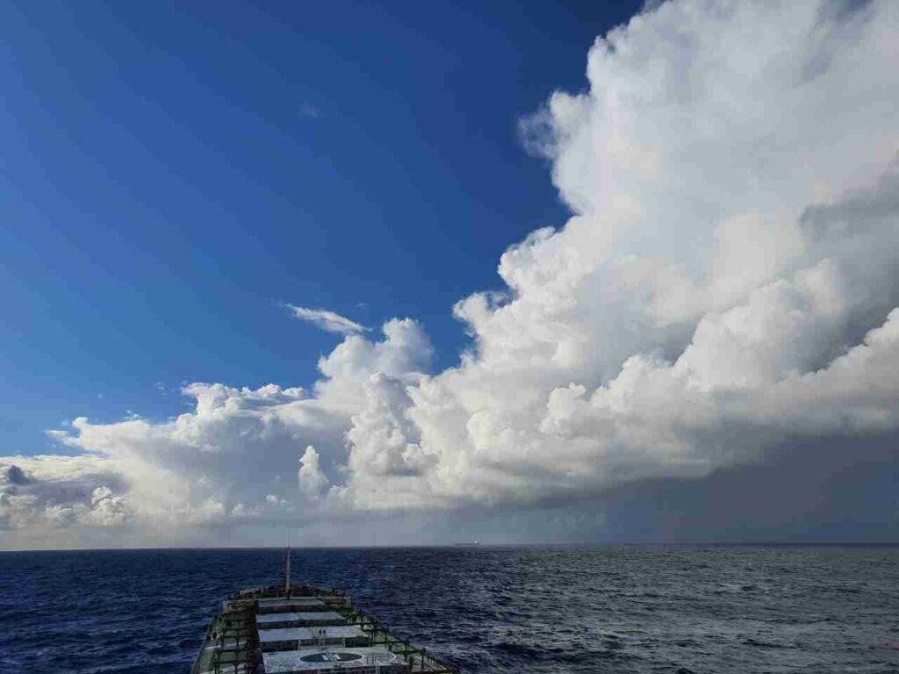

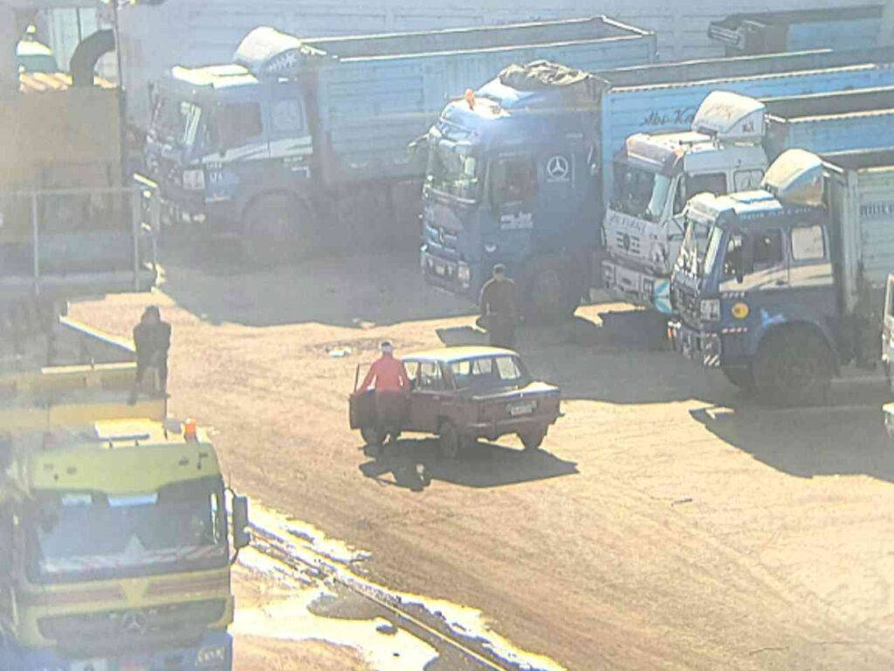

:::

##### 2020.12.17 14:40

They want to do a class inspection right here in Alexandria, so there’s a very good chance we won’t go to dry dock at all but will make one more voyage of “Black Sea → some Arab country.” But there’s no point in making predictions—everything is “subject to change.”  
Last night I was again on a night watch, then we moored, then authorities and paperwork, and then watch again. The Arabs really love this—they call us at exactly 16:10 again and again.  
**Upd.** As it turned out later, all the services (pilot, mooring crews, etc.) receive double pay for nighttime operations as overtime, so they basically never move the ship during the day.

:::1

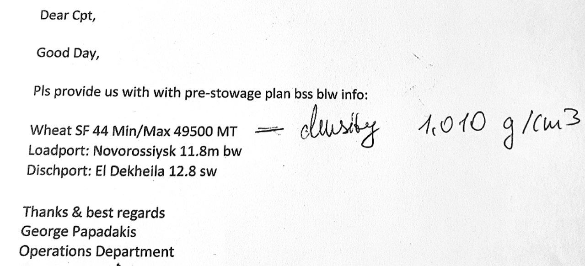

:::

##### 2020.12.18 00:35

Here’s the probable itinerary for our next voyage.  
And in Novorossiysk, we will definitely get a Paris MoU PSC inspection. At least that’s not Tamani with its open-sea berth. Next is El Dekheila with its double-entry port.  
Only after that will we go for repairs… maybe, since there’s a chance we’ll get class documents right here in Egypt.

##### 2020.12.20 03:00

Meanwhile, while I sit here on board during grain discharge, the world continues on.  
My city has been decorated very beautifully, and they’re holding parades—even though quarantine requirements have only tightened.  
Some people are working in factories or in ministers’ offices, writing code, studying at school, or are on one of the military fronts.  
Some people take pleasure in sleep, entertainment, love, or simply from life itself.  
The world is so multifaceted.  
For some reason, I just felt like writing something like this.

##### 2020.12.22 19:10

Sometimes people do completely inexplicable—or explicable but incredibly stupid—things.  
I’m very struck by people’s obsession with accessing the [Internet](https://telegra.ph/Iz-za-interneta-v-tyurmu-12-22) in the modern world.

##### 2020.12.24 00:50

Hello, we’ve been underway in the Mediterranean for 24 hours now.  
Right now we have a very strong headwind from the northwest, so we can only make about 8 knots on full power.  
This entry into Egypt was very exhausting.  
For two port calls, we used one and a half (!) boxes of cigarettes: for pilots, authorities, tugs, and mooring crews.  
If you don’t give those cigarettes, they’ll make a ton of trouble and nasty moves. A tug might cut our mooring line, and the pilot might blame the helmsman; as for the authorities, they can do whatever—they have thousands of ways.  
The stevedores handling our discharge made us take on ballast in hold 4 (out of 7 holds, with the center hold usable for ballast) because their loader couldn’t reach properly at the end of unloading.  
In the end, the cargo receiver tried to cheat the Chief Officer, claiming the ship was 222 t short of cargo, and demanded $1 000 (four-figure bills). But we had a letter stating the vessel bore no liability for the cargo. Still, nerves were frayed.  
We also had a class inspection by ABS. Again, two sleepless nights.  
They found several remarks, which were resolved thanks to the crew’s coordinated work. But everyone is exhausted. Meanwhile, the seamen must wash the holds immediately after such a grueling port call because in the Black Sea it’s already below 0 °C.

And I myself have almost no strength left; my head can’t hold any thoughts, even though there’s no rest or days off in sight for at least another month or two.  
Right now we’re heading toward the Turkish Straits for resupply, and then to Novorossiysk, where we will load only 49 000 t of wheat.  
And PSC Paris MoU will come to inspect us there. Hooray, another inspection! And then back to Egypt again.  
I wonder, do the Israeli army recruits take non-Jews?  
So many problems stem from the company and its friends. Because the Greeks are always looking for Greeks, no matter where we are things are always bad, since Greeks provide the worst possible service.  
Internet provider—Greek—constant dropouts.  
Chart/notice provider—Greek—constant issues with chart corrections (unlike publications updated by the British).  
Spare-parts and provisions suppliers—Greeks—instead of flour they delivered putty to us, so the Captain had to buy flour in Egypt at the exorbitant price of $1.50 per kg.  
What can I say? Don’t go, kids, to work for the Greeks. The fleet in general is getting worse year by year. With the Greeks it’s downright a nightmare. And by the way, I’m far from the worst case; it often gets even worse.  
All I can do is pray to the Great Goddess that I have enough strength to endure these trials.

:::3

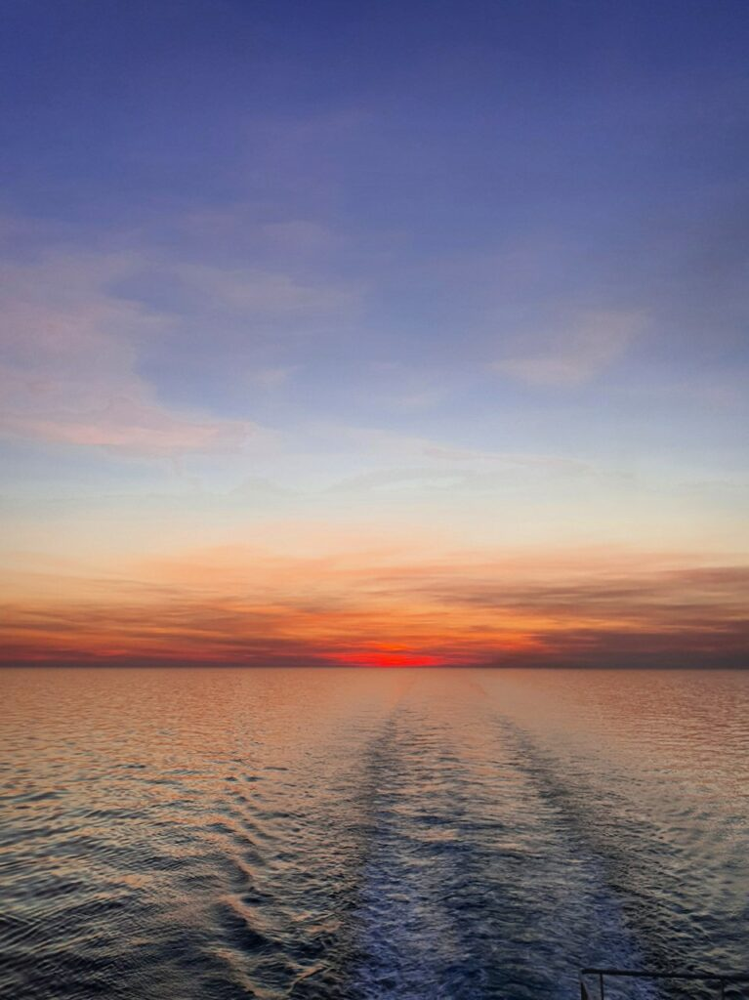

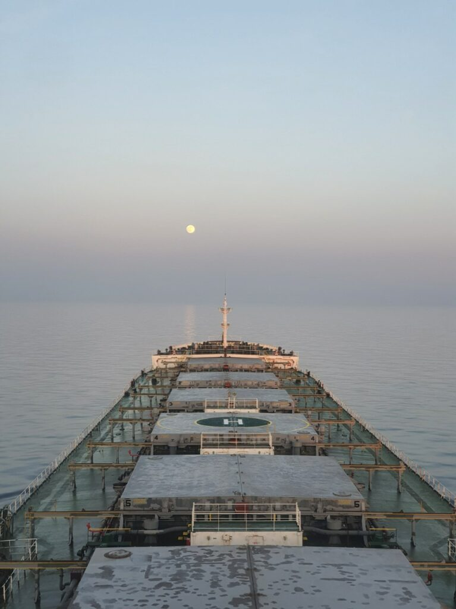
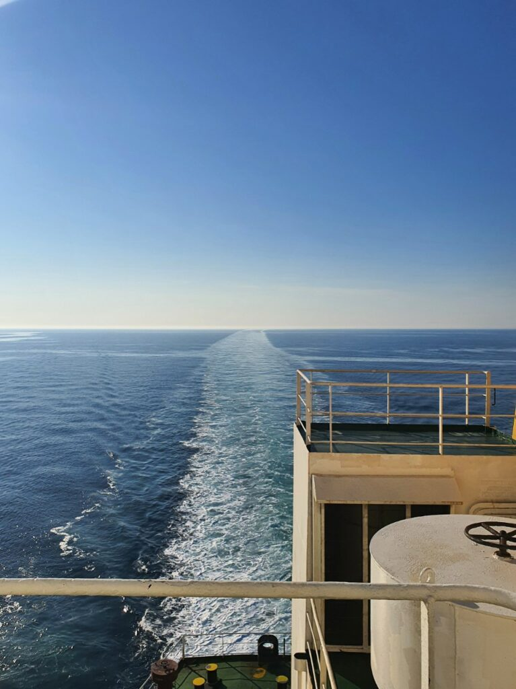

:::

##### 2020.12.30 03:45

We have anchored in the Port of Novorossiysk. The Russians lost their minds—tomorrow is New Year’s, and they want to load us today and get 50 000 t of grain in two days. Again to Egypt. And they’re loading decent grain, unlike the fodder they feed people. Typical for CIS countries.  
We hoped at least to sit until the 2nd, but New Year is cancelled.  
This is slave-driven work, after all. Everyone thinks about profits, but nobody thinks about the people. Although more accurately, the times are simply cruel.  
All we can do is endure this burden.

:::3

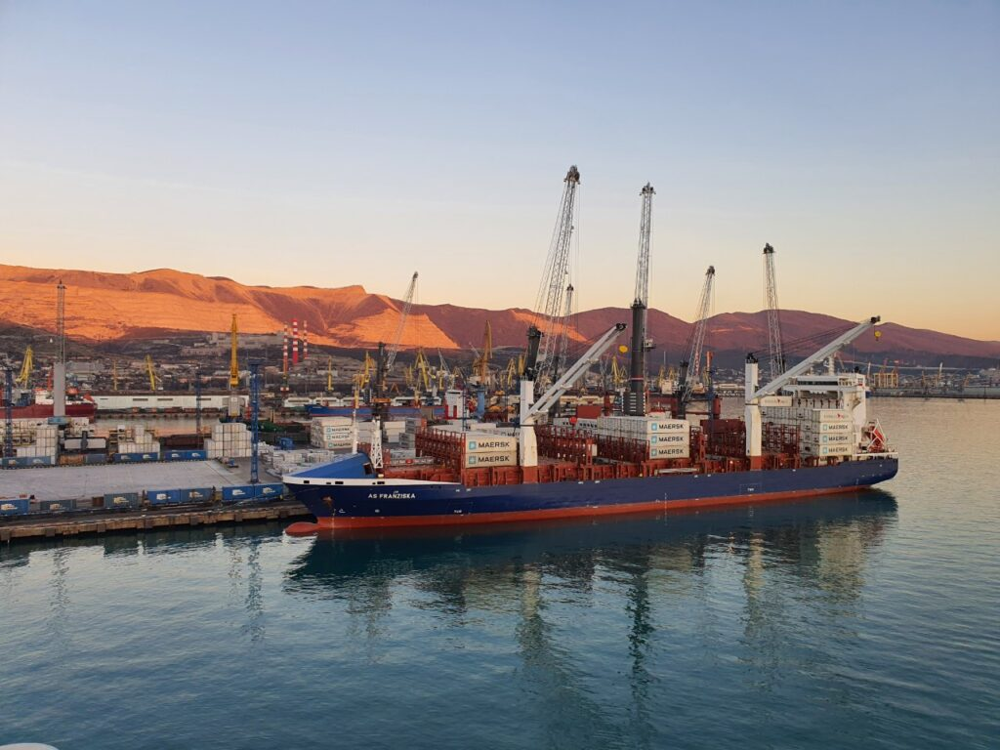

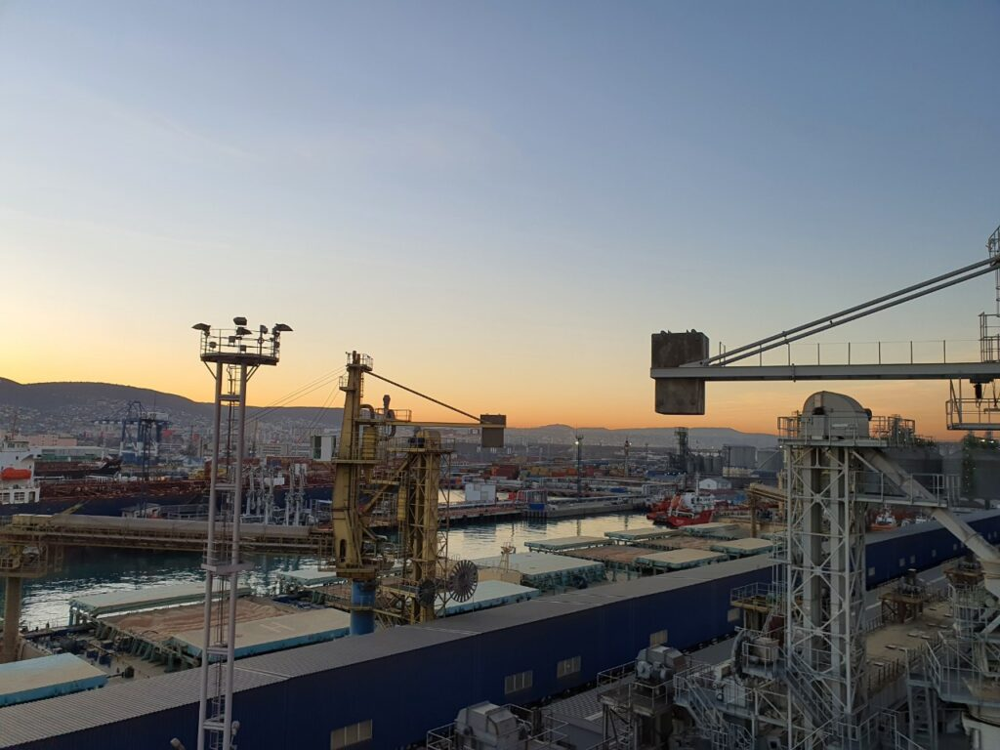

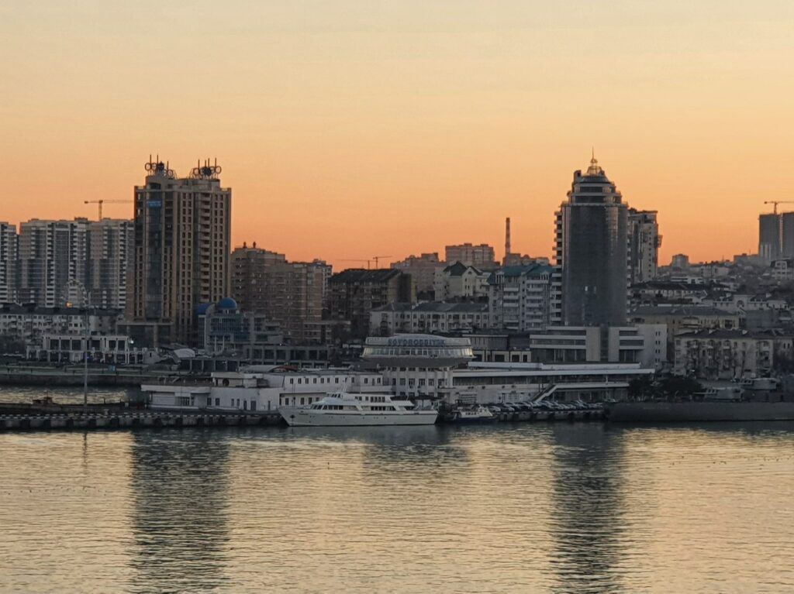
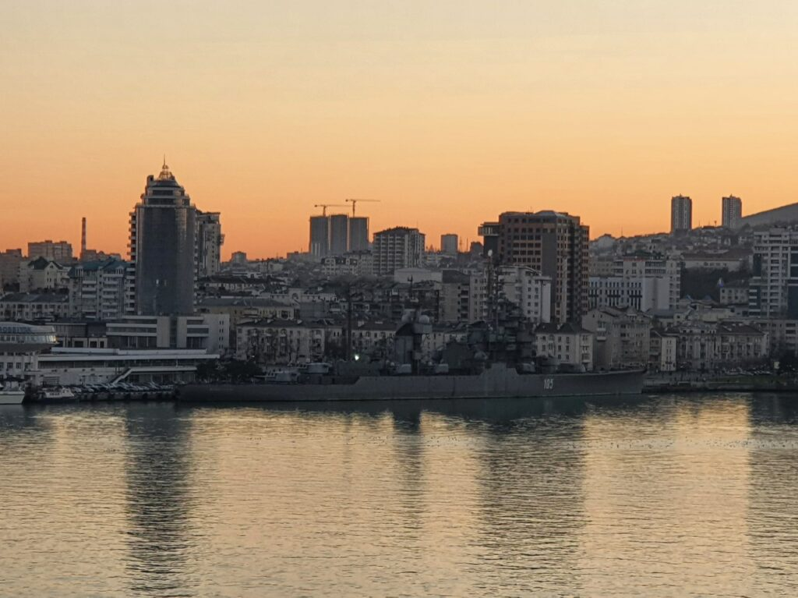

:::

Somewhere not far from here in 1986, on August 31, the passenger ship Admiral Nakhimov sank, and my parents worked on it.  
They are safe, but many people could not be rescued.

:::1

:::

##### 2020.12.31 10:30

Meanwhile, the loading is nearing completion.  
The Chief Officer was just shocked yesterday because, due to local environmental requirements, he had to discharge all ballast from the Mediterranean and take on Black Sea water.  
**Upd.** Of course, the environmental inspectors were just looking for a bribe.  
Now we have to quickly discharge that ballast in port even though our pump capacity is only 600 t/hour, while cargo loading is 1 600 t/hour.  
50 000 t in less than a day—can you imagine? Each loader is producing five sacks of grain every second.

##### 2020.12.31 15:10

:::1

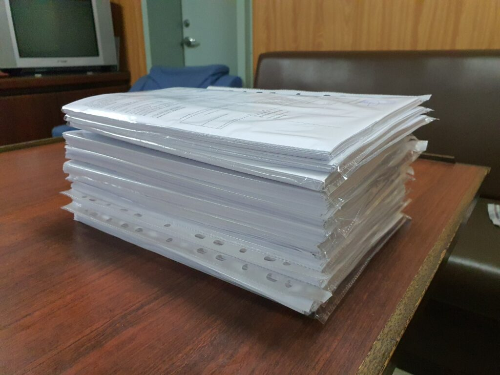

:::

##### 2020.12.31 20:00

Dear subscribers, among you are my relatives, close friends, and very good acquaintances.  
Thank you for your support in this difficult year.  
The year 2020 was marked by many unfortunate events, but even in all the bad things, one must always look for something good.  
In the coming year, I wish you the most important thing—health, so that none of us have to hide at home and wear masks on the street for fear of fines; so that everyone has the opportunity to work at a job they enjoy and rest where they would like; simply to be happy people.

Happy upcoming 2021!

On this joyful note, I conclude today’s post.  
In the next and final one, I will describe how we celebrated New Year’s (not included in the original channel content), and there will again be stories about Egypt and Russia.

Love you all ❤️  
Everything will be Katsu! 🦊
