The New Year is a special time that means restarting life, at least I would like to think so) In 2021, I met him on a steamer, anchored in the roadstead of the port of Novorossiysk.
It was not so bad, we celebrated with a close-knit deck crew, but immediately after midnight my watch began, I had to make sure that the anchor held well, which I did. I took a projector with good sound to the bridge and listened to the osts from Monogatari for several hours)

##### 2021.01.01 20:38

Border guards of the Russian Federation are already on board and processing the crew. There’s very little time left before we head out into open water. The weather is expected to be good, so we have about 38 hours’ steaming to the Bosphorus at 11 knots. But usually in the Black Sea we make 12–12.5 knots, so we’ll arrive sooner.

On January 1st the worst happened. We had 5 bottles of “Iceberg,” two bottles of champagne, and a case of beer. And also red fish and feta for appetizers—yes, at least the Greeks honored us for the New Year. As a result, I ended up in such a state that I couldn’t go on watch. In the morning I was feeling so bad that I couldn’t drink, eat, think, or do anything. But at least it was fun, with music and good company!

During the morning watch, the Captain looked at me sympathetically but said I had done the right thing by informing the Third Radio Mechanic that I couldn’t come.

%%%2
!c2
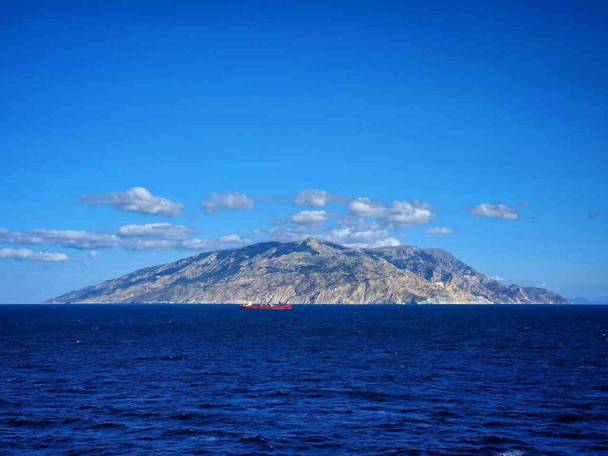
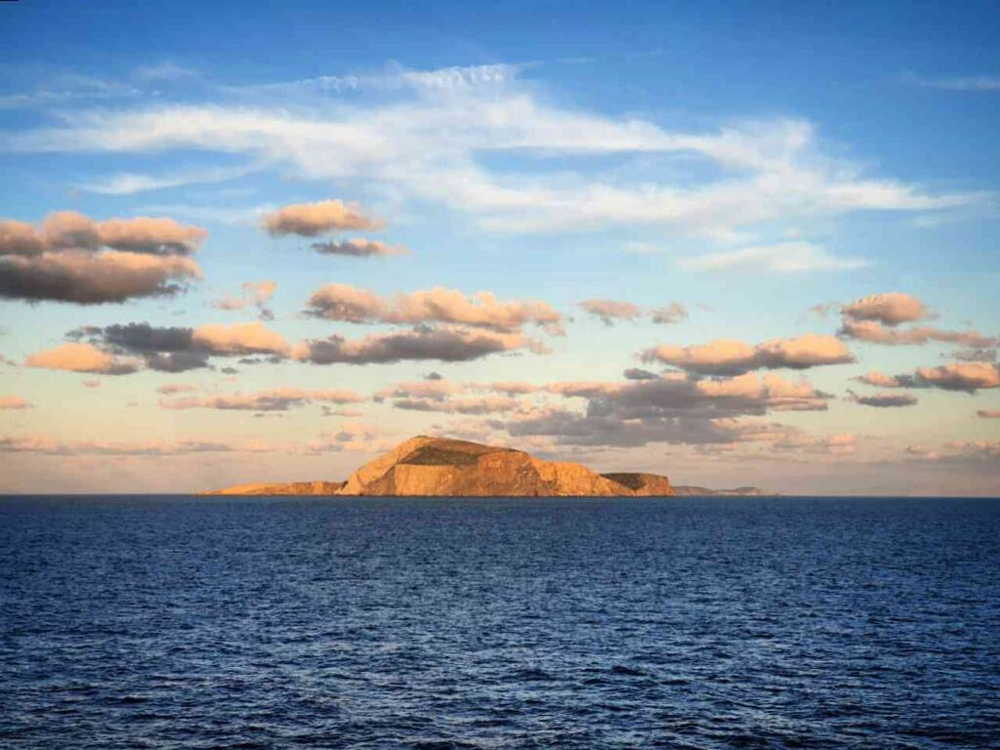
%%%

##### 2021.01.07 02:00

We are already approaching the port of Damietta in Egypt. For the last couple of days I’ve been feeling a terrible lack of strength—barely able to work, and I have nothing left for anything else. I’m trying to sleep as much as possible, taking vitamins and so on, but I don’t know how I’ll manage once we’re in port; I’m already dragging my feet. We have to enter the port’s inner anchorage, where they will take samples of our cargo, after which in a couple of days we’ll be berthed alongside and start unloading.

%%%3
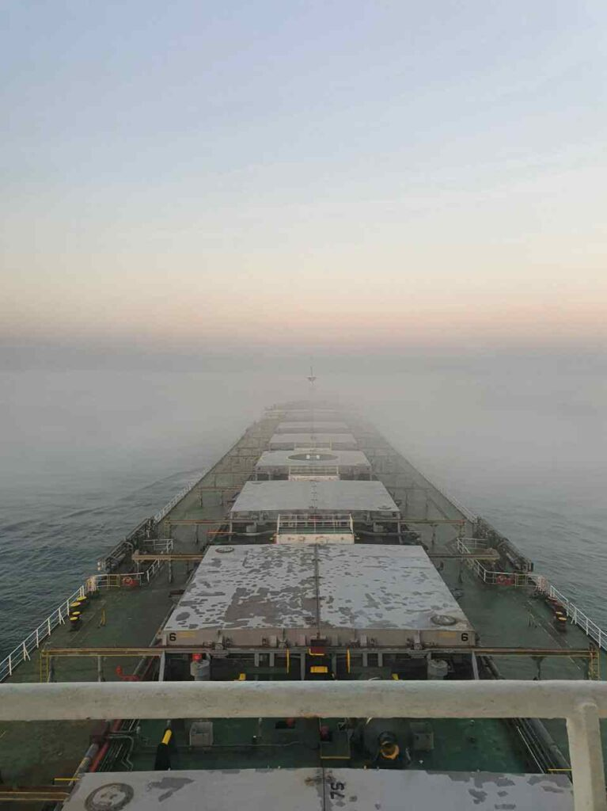
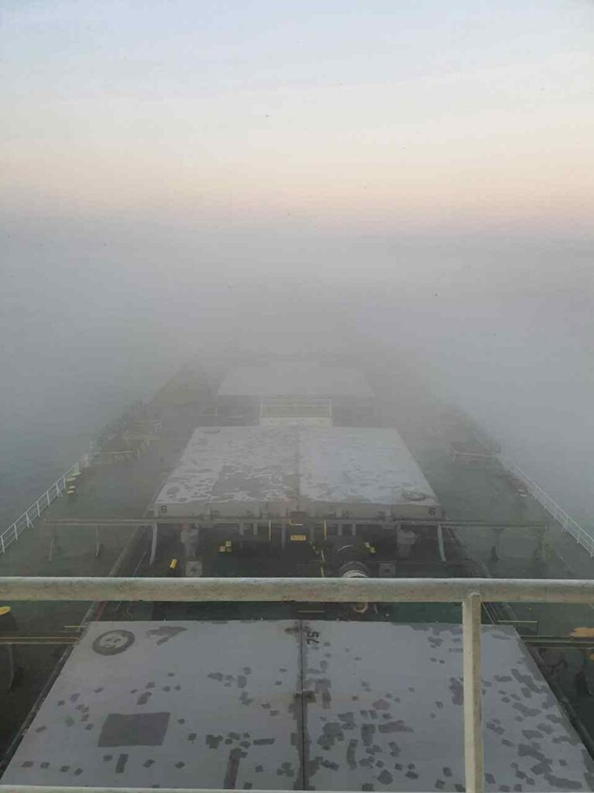
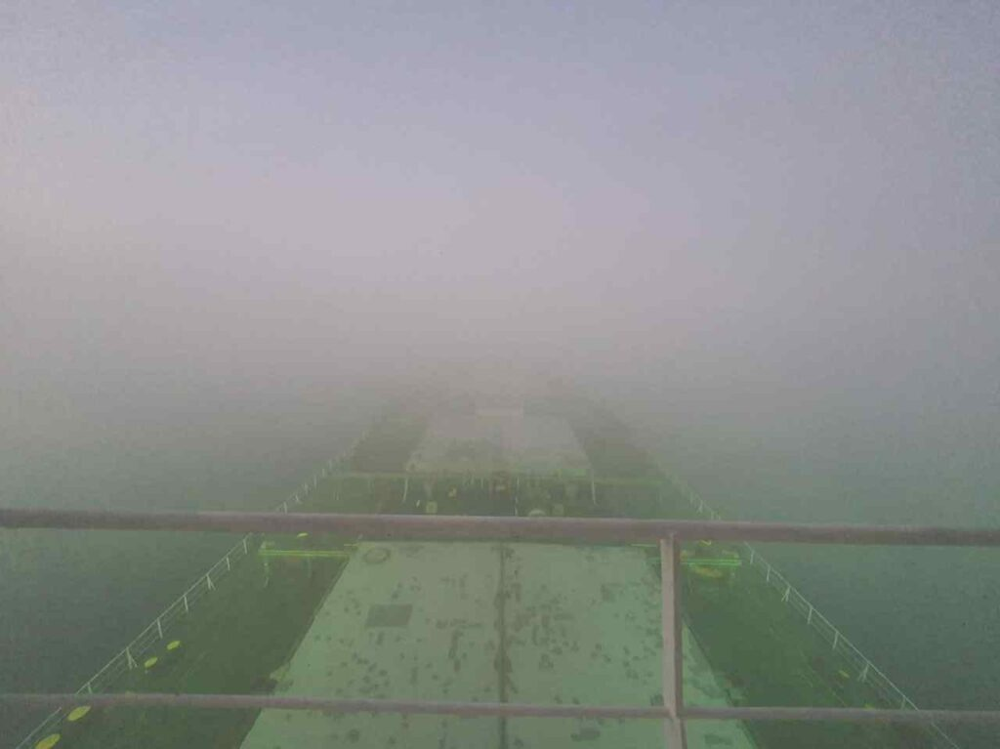
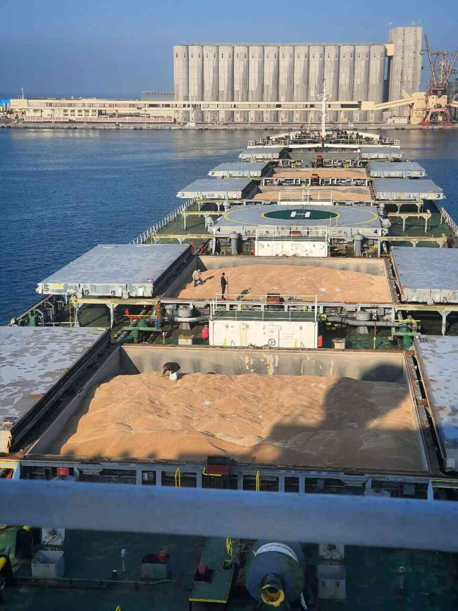

%%%

##### 2021.01.07 18:40

Here’s what met us as we left the port of Damietta. They did send us to the outer anchorage while they waited for the cargo analysis. Most likely we’ll be here for about 3–4 days. In reality, it looked much worse than the camera captured our vessel.

##### 2021.01.08 12:18

In Turkey we got such fantastic pears, a bit like a cross with quince. They’re incredibly tasty, juicy, and slightly tangy. I could happily eat them all the time. The Captain says the same pears are sold back home. **Upd.** It turns out I never found them in all these years.

##### 2021.01.09 05:15

Entering and mooring in Damietta, Egypt, wasn’t easy, but everything afterward proved even tougher. The Captain went to sleep, as he’d been on his feet all morning, and the Chief Officer and I ourselves struggled with the Arabs—first quarantine, then the agent, then the draft survey, and on and on. And everyone kept asking for cigarettes—even some lackey running errands. Typical Egyptian practice. After this voyage, I came to love Arabs more than any Jew, meh. The only consolation is that in this port there’s no unloading between 04:00 and 08:00, so I get some peace on watch from 04:00 to 06:00. In this port they’re supposed to replace our cook—a junkie who’s barely been here a month. The previous company offloaded him on the fifth day! He cooks worse than the old one, is rude—so it’s good riddance.

###### 2021.01.09 17:23

Experiment: buying Egyptian shawarma. On one hand, it doesn’t compare to European shawarma—ours is better. But still, it’s better than what our cook makes.

%%%2

%%%

##### 2021.01.10 16:51

I don’t know how, but I have a feeling the cook learned he was getting off the ship. By the way, today we received tickets for the new cook. Since then his cooking has turned into an utter inedible hell. Even I—a very undemanding eater—can’t bring myself to take a bite of that disgusting stuff. I hope the new cook arrives normal—at least better than this one…

##### 2021.01.11 11:50

A sort of epidemic has started on the ship. First the Chief Officer and Third Officer caught colds with fever, then several seamen. Now the bug has reached me. Thankfully, I only have a sore throat—my usual weak spot in these illnesses. Now this feels like the diary of the end of the world, which the main character must find hundreds of years later during his travels. 😅 All our medicines have run out, so now we can only rely on lemon-ginger teas.

##### 2021.01.11 13:30

A doctor came on board. We thought he’d be another cigarette beggar, but no. He took a test from the cook and left. The cook was puzzled. It turns out he really didn’t know he was leaving soon and just started cooking utter crap. Good riddance.

##### 2021.01.12 15:00

Within the hour the new cook should arrive. As it turned out, our current cook didn’t know at all that he was leaving soon.

We have 11 000 t of cargo left, so unloading should finish during the night. But we still don’t know where we’re heading next. They apparently said there’s no drydock planned for now, but we haven’t received the next voyage order either. For now, we’re waiting for information from the shipowner. Perhaps once we leave port, we’ll head “somewhere—don’t know where.”

#### 2021.01.13 01:00

The new cook looks decent and has plenty of experience, so I hope he’ll at least cook normally. But I don’t think he’ll outdo one of our seamen, who used to work as a cook ashore. He already doesn’t like cooking, but whenever our cooks on board fail, he delights us with his delicious meals.

The shore personnel say unloading will finish only after lunch, maybe even by evening. As I expected, near the end they’re cleaning out the cargo residues, which is much slower than sucking 200 t/hour with a pneumatic spout. It seems that we’re heading not to Russia or Ukraine but to Piraeus. At least, that’s the route they told me to plot.

##### 2021.01.13 11:30

I feel like a sore throat won’t be the end of it. Now I have a runny nose and fever, meh. And there’s no real treatment—if you don’t work, the others have to work twice as much, and they’re already at their limits. All we can do is pray for the mercy of the Great Goddess.

##### 2021.01.13 19:30

We departed the port of Damietta, Egypt, and are heading to Piraeus, Greece, where we should have repairs. However, the drydock will be busy for another month, so it’s unclear what we’ll do there—probably just anchor. The new cook turned out to be fantastic. The lunch and dinner he prepared, after the last two cooks, were just mind-blowingly delicious. He even found time to make pampushki for lunch and biscuits for dinner. Although he made mashed potatoes with chicken—just like the others—his was incredibly tasty, while the previous cooks turned food into garbage.

##### 2021.01.14 14:10

Someone gave me an interesting remedy: using seawater to rinse your throat. It helps a lot. I was shocked—no medicine ever helped me as much as this simple method. So if you live by the sea—give it a try. I then realized most nasal sprays are based on seawater. What an amazing business: selling seawater at $5–20 for 50 ml in a fancy bottle. Is that fraud? 😅

##### 2021.01.14 20:00

I just called the Chief Officer and asked him to calculate our route according to the voyage order received literally 15 minutes ago. Now we’re heading to Piraeus and will anchor there for 3–7 days. The Greeks will come and stress-test everything with pseudo-repairs. The drydock is still busy, so they’ll simply extend our documents until April. Then the ship will go to Taman, Russia. We’ve been there before; it’s an open berth in the middle of the sea, and as soon as the wind picks up, the ship tries to break free from its moorings and tear all the mooring lines. I think it will be terrible, especially since the weather is even worse now than in November when we were there. And we’ll be loading coal this time, which is surprising since the whole year the ship carried only grain. After Taman, the ship will carry cargo to Guangzhou, China. Approximate route: Taman → Istanbul → Suez → Singapore → Guangzhou. It will take about 1.5–2 months to get there, so the entire voyage will last at least 4 months, considering loading, port stays before straits, unloading, and the return trip. Because of this, the company plans to change every crew member who’s been on board 6 months or more, likely in Istanbul—though it’s not yet clear whether right after Piraeus or after Taman. Based on past experience, I’d rather avoid Taman. Oh, and I still need to recover before the crew change—otherwise I'll end up in quarantine somewhere in Turkey. 😅 Thank the Great Goddess for her mercy and assistance!

%%%3
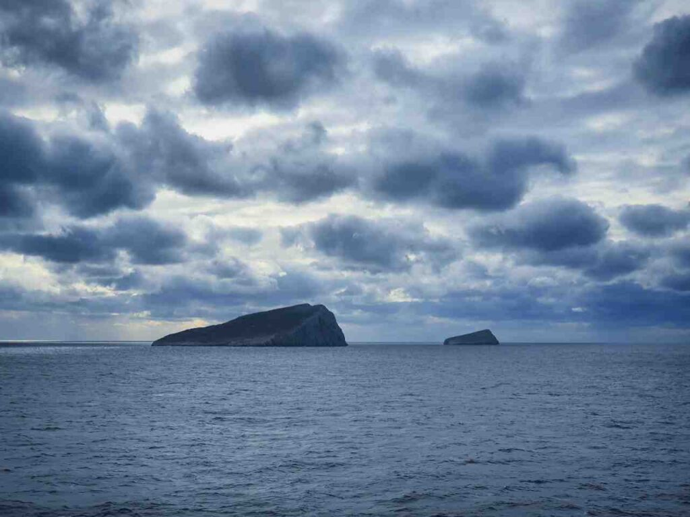
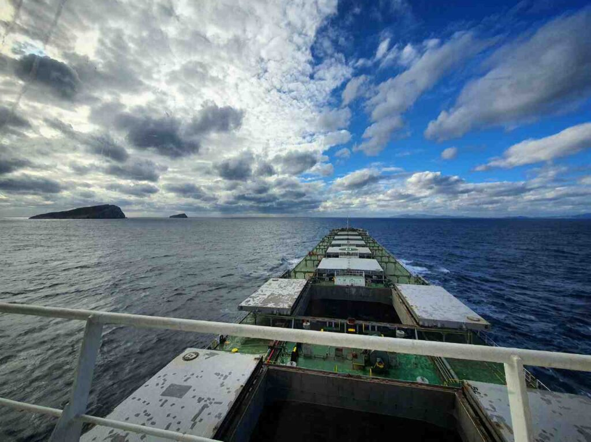

%%%

##### 2021.01.15 13:10

The seamen are washing down the last holds from the previous cargo.

##### 2021.01.16 17:10

Hello everyone from Piraeus, Greece. With great difficulty we managed to anchor. First several fishing vessels passed by us, then ships exiting the port crossed our path, to which we had to give way. We chose a decent spot to drop anchor and requested permission from Port Control, but when it was granted, a Chinese container ship arrived at 15 knots (almost 30 km/h) and took our spot. We barely found a tolerable position and dropped anchor. Anchoring in Piraeus is not pleasant, as depths are around 100 m and there’s a current that causes all ships to swing side to side, even though the wind isn’t that strong. Tomorrow a bunch of company people will come to inspect the engine room and ballast tanks, and they might install a combination pilot ladder on the port side. But the stay is planned to be short, after which we’ll head at full speed toward Istanbul.

##### 2021.01.17 01:00

A crazy wind has picked up, but I can’t even check its strength because on the last inspection, during the blackout test, our anemometer (wind speed/direction indicator) broke. They also forced us to cycle the ballast tanks for verification, so our windage is through the roof, and the anchor swings us around so fast it’s frightening. Even if we drift toward another ship, you won’t have time to react. Though we do have a powerful engine, so even if you react, it won’t accelerate fast enough. In short, near the end they really decided to wear us out mentally. But whatever—I’m one of the survivors heading to Taman, so it’s not too bad.

##### 2021.01.18 01:10

Today they brought us a proper espresso machine instead of that crappy American drip coffee maker. Now, even though the coffee itself is crap, with milk frothed in a steam wand and some cane sugar it tastes quite good. **Upd.** I lied—our coffee was actually excellent.

%%%2

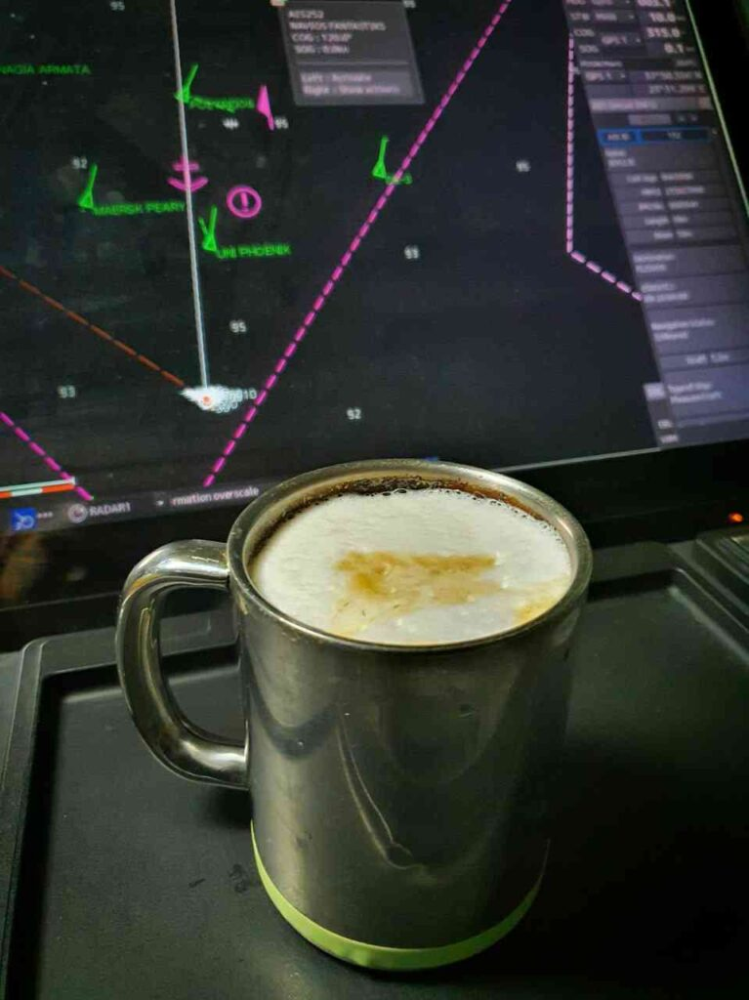
%%%

> **New details of the shipwreck off the coast of Turkey:** 13 crew members of the dry cargo ship were Ukrainians, and the vessel is operated by Tesoro Marine of Odessa.
>
> So far, two sailors are confirmed dead, six were rescued, and search operations for others continue, complicated by bad weather.

##### 2021.01.18 15:30

There are many new details now, but the fact itself is depressing. People in our country take dangerous jobs for not all that much money, just to survive—and these old, poorly maintained ships keep sinking one after another, taking sailors’ lives. Parents are left without sons, families without breadwinners, children without fathers. But companies operating ships that should not even be at sea face no consequences. Such is the capitalist world, in which human lives are not valued. Even those who survived, after prolonged exposure to the cold winter water of the Black Sea, sustained health damage that might not show up immediately but will appear later, when no one will pay for the sailors’ treatment.

##### 2021.01.19 00:40

We dropped anchor in Istanbul and are heading toward the Caucasus. The voyage to China was canceled, so no one will be signed off—we’ll keep working. The new voyage is Caucasus–Iskenderun. The Caucasus involves loading right at anchor from special transshipment vessels and barges, which is very dangerous, especially in winter storm weather. Iskenderun is just as bad as Taman—a berth in the open sea where the ship swings on its moorings, always trying to break free, especially now in winter. This voyage will be about a month: 3–4 days to Caucasus, 14 days promised for loading, 5–6 days to Iskenderun, 15 days unloading. Of course, everything depends heavily on weather.

##### 2021.01.19 17:50

Our ship was not allowed into the Dardanelles strait. Our port-side combination pilot ladder isn’t working. This ladder is half-vertical, half-normal stairs and must be installed if the ship’s freeboard exceeds 9 m. Because we’re in ballast with no cargo, our freeboard is 12.5 m. The Captain agreed to proceed through the Dardanelles without a pilot, but VTS (Vessel Traffic Service) temporarily refused due to our ship’s length. Now we’re waiting either for permission to pass from VTS or until our crew hurriedly finishes installing the ladder, which the Greek technicians were supposed to install. In that case, with a pilot aboard we should be cleared. The Greek maritime world—never a dull moment. May the Great Goddess protect us.

##### 2021.01.20 01:10

Our ship, having received permission from VTS, is heading toward the Dardanelles, which we’ll transit without a pilot. The agent wrote that if we declare the ladder unserviceable in the Bosphorus, the ship will face a very extensive PSC inspection there, and will, of course, be detained. But no evil without good—the port-side combination pilot ladder has been repaired by the crew and is now functioning, so no further problems should arise. The Captain said he will try to secure a bonus for everyone who participated in that repair.

##### 2021.01.20 17:00

The Captain sent the Chief Officer to photograph the finished ladder and sent me to fetch champagne, which the seamen at the helm and I shared among the four of us, to our departure!

%%%3
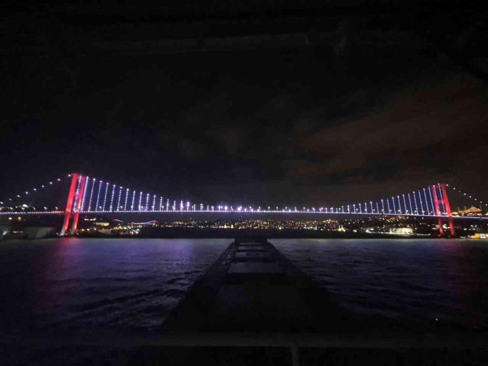
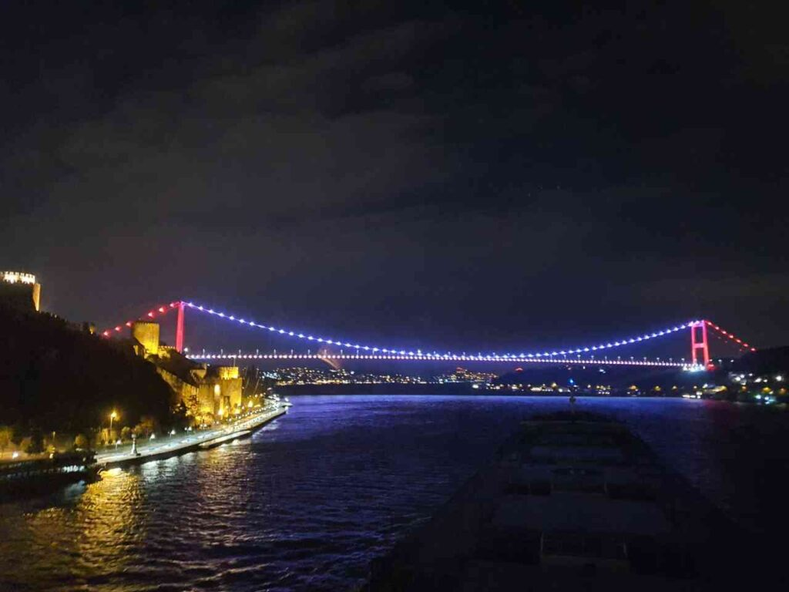

%%%

##### 2021.01.21 02:20

Here we have exited the Bosphorus and are heading toward the Caucasus. In the photo—you can see all the bridges of Istanbul.

##### 2021.01.23 01:00

We have arrived in Russian territorial waters and at 13:00 dropped anchor outside them, since there was no information about entering port and a storm warning was announced. By 20:00 we dropped anchor again inside. Here the waves are smaller, but the wind is still 20–30 knots. We’re waiting for authorities to arrive and loading to begin. Everyone who boarded the ship before autumn 2020 has been notified of replacement, and new crew passports have been sent, even those who wanted to stay. We should be replaced in the Bosphorus on the way to Iskenderun.

%%%2

%%%

There was absolutely nothing to do on the navigation bridge, so I hung a bedsheet and brought out the projector, and the seamen and I held movie nights, glancing occasionally to make sure the ship wasn’t dragging anchor.

%%%1

%%%

##### 2021.01.28 11:57

A bunch of barges for transshipment and ships—including ours—are waiting for improved weather to take on supplies, provisions, cargo operations, or border clearance.

##### 2021.01.28 12:19

We’re being tossed so much that the ship can’t point into the wind. Wind speed is around 30 knots, gusting to 35.

%%%1

%%%

##### 2021.01.29 19:07

Today one ship put on quite a show. In the photo—it’s the red one on the right. It was at the neighboring anchorage and suddenly at 14:00 started complaining to Caucasus Traffic (the coastal authority deciding who goes where) that we were 3 cables (1 cable = 185.2 m) from it and that we were drifting toward it. Traffic called us; we were peacefully at anchor, not drifting, and moreover, the distance was not 3 but 3.5 cables (3 cables is the safe anchoring distance at port Caucasus). That idiot had chosen his own anchor position away from us, and now he’s standing… 3.6 cables from us. A genius who wasted a ton of nerves and fuel to achieve nothing.

%%%1

%%%

##### 2021.01.30 23:37

I feel like I’m sleeping a lot, but lately I’m terribly sleep-deprived. We’ve been at anchor for a week. People complain that they’re tired of resting without work, and everyone has that “home” feeling—they just want to get off the ship. However, I don’t know when we’ll be able to go home. Weather improvements are forecast only for the 4th–5th, but there’s no way they’ll finish loading in 3 days, since they load not with loaders but with grappling cranes, and then the weather will worsen again. It’s possible we’ll end up staying here through the end of winter. Though there’s still the question of food and fresh water. We have enough food for five days, water for two weeks. What happens after that is completely unclear.

###### 2021.02.02 14:50

Nice weather—port Caucasus has come to life. Tugs and authorities come aboard ships, transshipment vessels load grain, bunkering vessels supply fuel and water. We too should have authorities aboard in a couple of hours.

%%%2
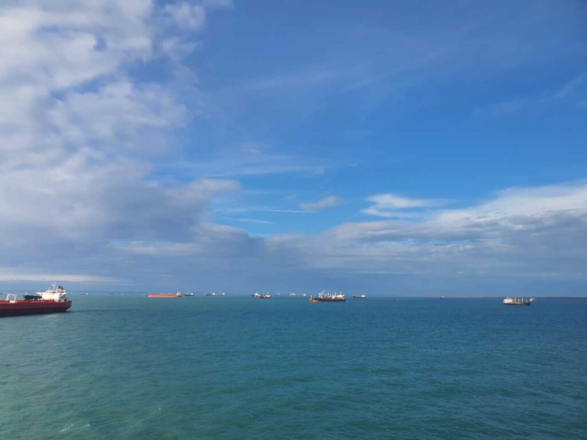

%%%

##### 2021.02.03 00:20

The transshipment vessel Kavkaz II has come alongside and berthed. A bunch of people have come aboard—hold inspectors, draft surveyors, fumigators. They all do their work and have the brains to talk to the Chief Officer. And I’m on the bridge, since we’re still at anchor and need to monitor the ship’s position.

%%%1
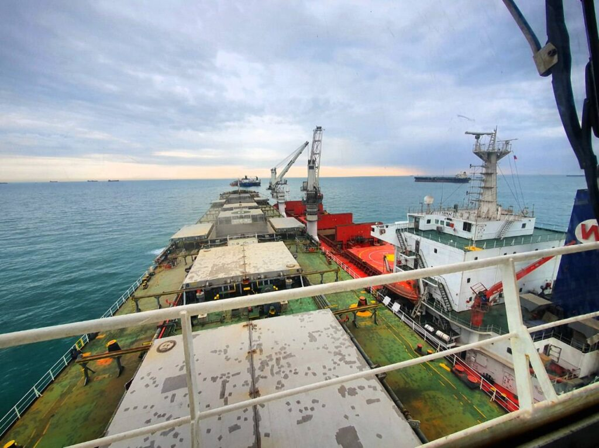
%%%

##### 2021.02.03 20:17

Today Paris MoU PSC came again at port Caucasus. The inspector turned out to be the same one from August. He opened his little notebook where he lists all the ships he’s inspected and checked what remarks we’d had. But seeing familiar faces—me and the Captain—he realized there was no need for formalities and “worked” directly. He let the Chief Officer off with a fine of half a bottle of vodka, and didn’t even look at anything in my domain. In the end he wrote only two trivial remarks in the “must be fixed before departure” category, like oil leaks—since a 20-year-old Chinese ship can’t have zero remarks. We immediately fixed those and sent photos of the repairs. So you could say our PSC is almost clean. And it didn’t cost much, since he came alone this time. Now we can truly not worry about anything and just wait to go home.

##### 2021.02.04 23:31

Speaking of why loading didn’t start sooner: In Russia and Ukraine, unlike normal countries, there’s the mandatory immigration authority commission. While in most countries you can pass it purely de jure without border guards, here you can’t. The process is as follows:

- Border guards arrive, usually at night.
- They call the entire crew for facial ID control, simply matching faces to photos in each sailor’s Seaman’s Identification Book.
- They scan those passports using their scanner attached to an Asus EeePC touchscreen netbook—the same model I have at home.
- They stamp each passport for both arrival and departure from either Russia or Ukraine! I don’t recall this nonsense anywhere except Russia and Ukraine. That’s the entire job of the border guards. Because of this, a ship may sit for weeks waiting for the commission to arrive, since they need calm weather to board. A ship next to us finished loading two weeks ago but couldn’t leave because the commission hadn’t come. The same happened to us—despite 10–15 m/s winds the transshipment vessel couldn’t come alongside, but without the commission they had no right to do so. And no one knows what the weather will do during or after loading. It’s been raining a lot, and we keep opening and closing cargo hatch covers, only for wind and waves to blow in again.
  Returning to the topic of stamps and passports: Besides the fact that maritime document prices have skyrocketed, a Seaman’s Identification Book (SIB) itself unofficially costs up to $500. Officially you can’t make one anymore, because they always have excuses—no blank forms, or something else.

%%%2
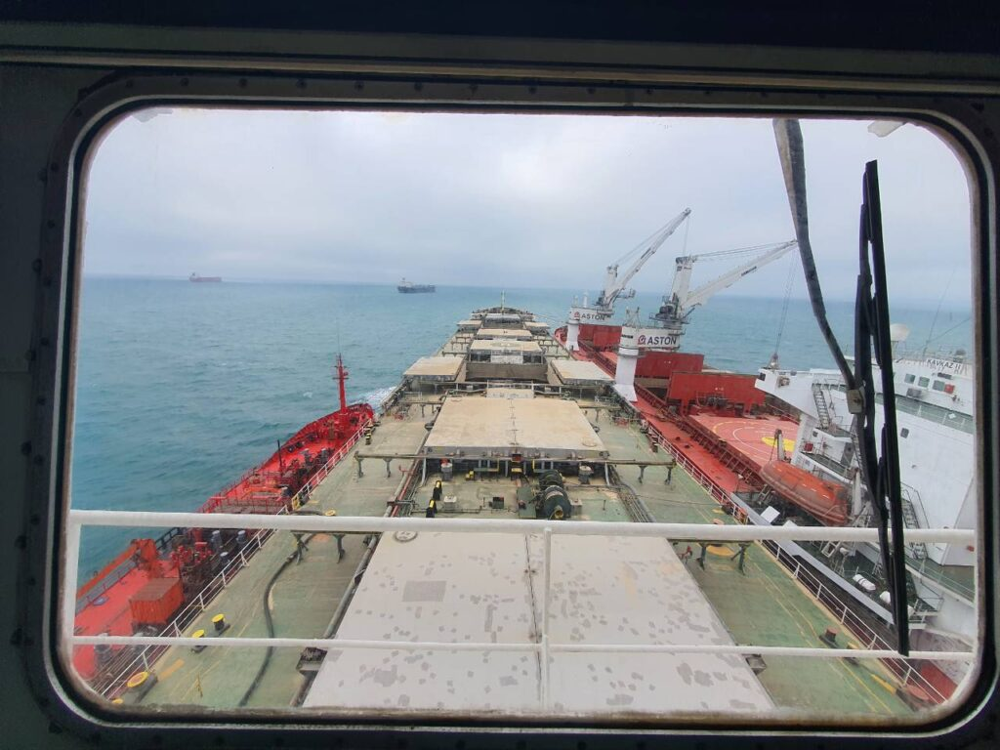

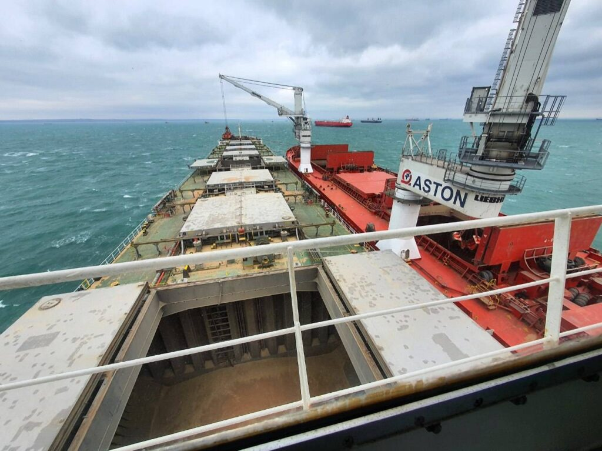
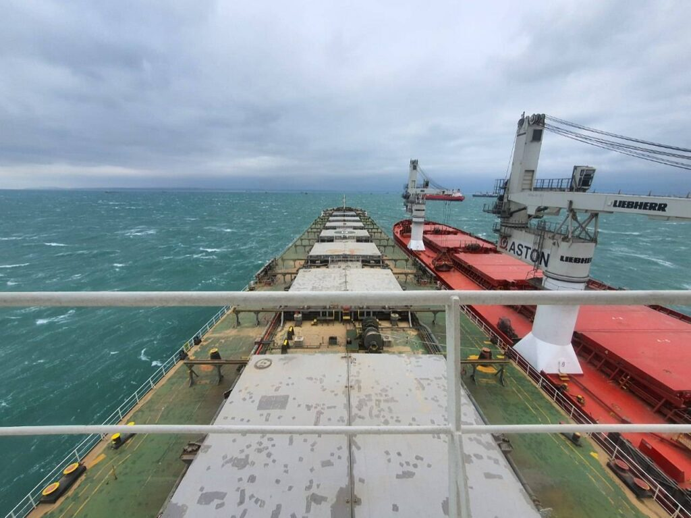
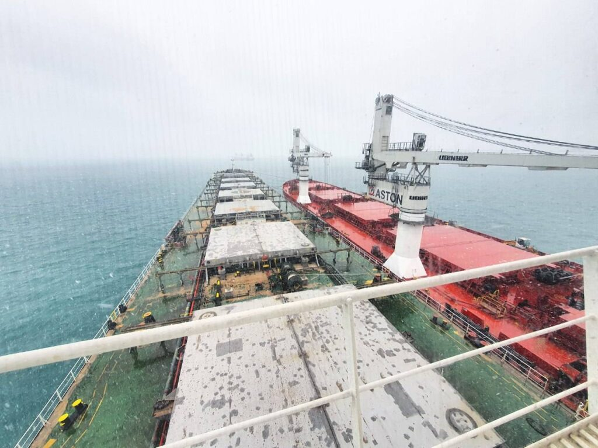
%%%

##### 2021.02.06 23:01

When you’ve been at sea for more than half a year, a strange mental state sets in: it feels as if you’ve always been on this ship and all memories before are artificial, not real, and the outside world doesn’t exist—there is only the ship and the ports. On the other hand, the opposite effect happens when the contract is over or you’ve just arrived home: it feels like the entire voyage was just a terrible dream.

%%%1

%%%

##### 2021.02.06 23:01

The transshipment vessel “Kavkaz IV” and the barge “Ekaterina” have berthed alongside us. We continue loading. Loaded: 31.5 k t. Remaining: 25.5 k t. Total: 57 k t. **Upd.** Literally half an hour later loading was suspended due to the blizzard.

##### 2021.02.07 03:03

Meanwhile the deck has iced over and snow is already falling. We’ve listed, and before we could even straighten up, cargo operations were suspended due to weather. Now we’re standing like idiots at 1.5–2 °C…

##### 2021.02.07 12:28

At noon today provisions were supposed to arrive, but the boat still hasn’t left—its trip takes 3–4 hours.

%%%2
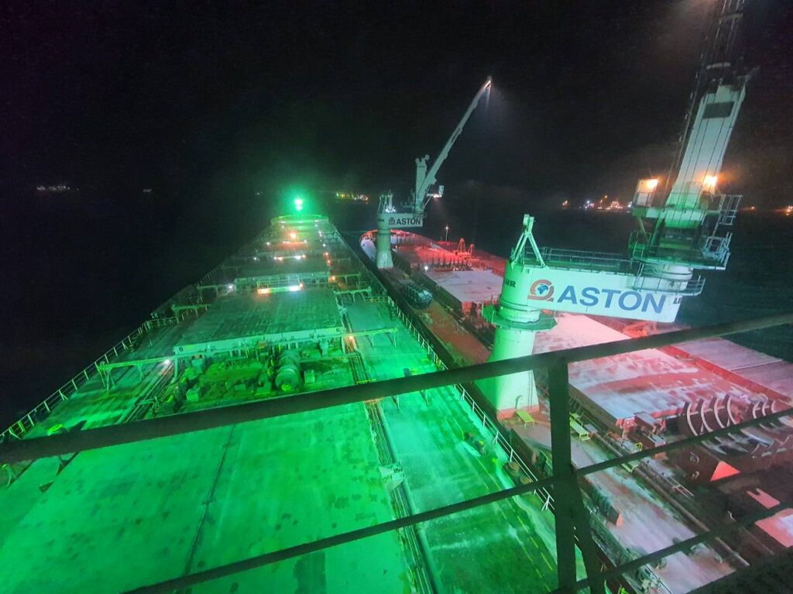

%%%

##### 2021.02.08 00:30

We’re finishing loading hold 7, and hold 1 remains. There’s hope we’ll leave Russia tomorrow and never see it again, meh. But starting tomorrow evening, weather will worsen—so it’s doubtful authorities can board.

##### 2021.02.08 03:20

At 01:00 we finished loading hold 7 and began moving the transshipment vessel forward to load holds 1 and 3. It’s already half past four, but they’ve only moved halfway…

##### 2021.02.08 03:47

They finally finished the reposition, but a fog rolled in. However, Kavkaz IV says it won’t affect loading.

%%%2
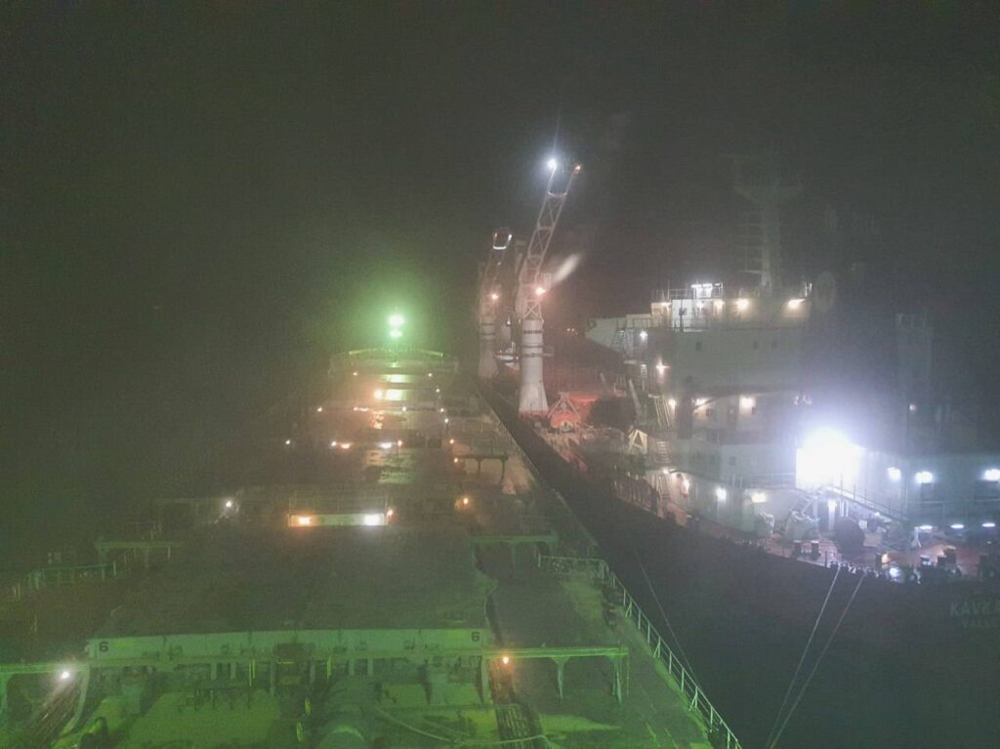
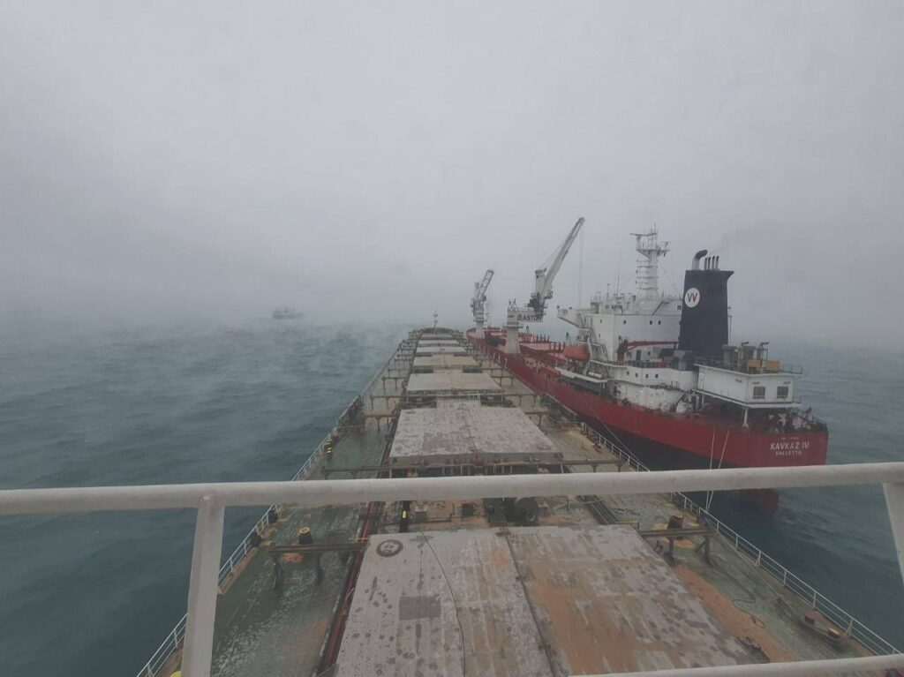
%%%

##### 2021.02.08 10:57

Loading is suspended—storm warning in effect, fog, slight icing, intermittent snow. Roster is delayed again.

%%%3
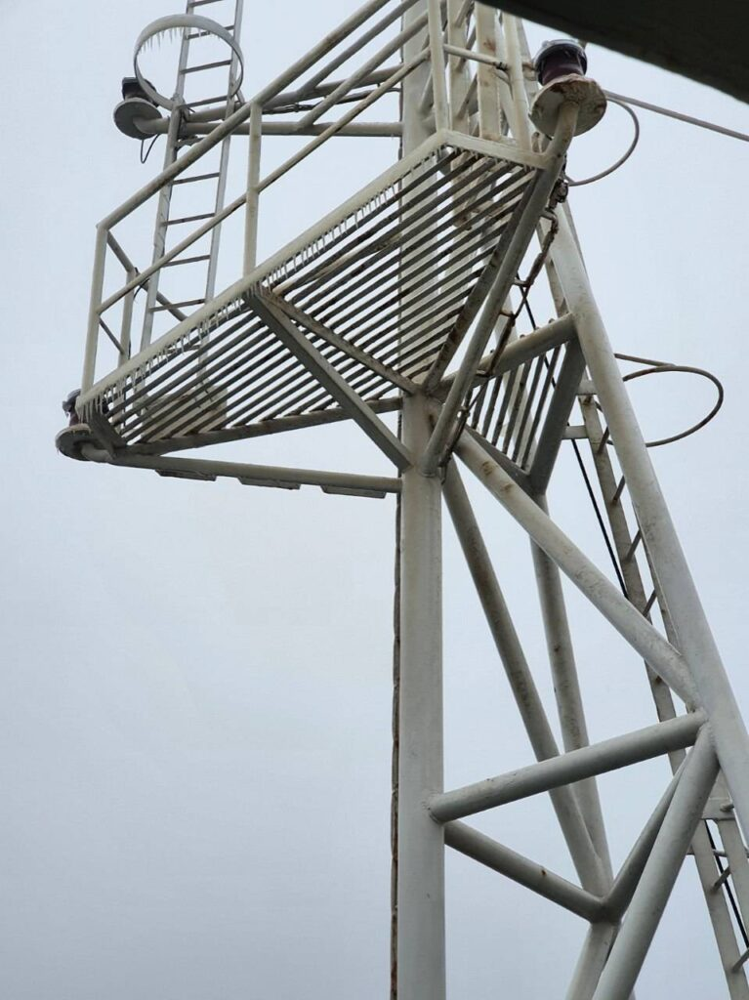
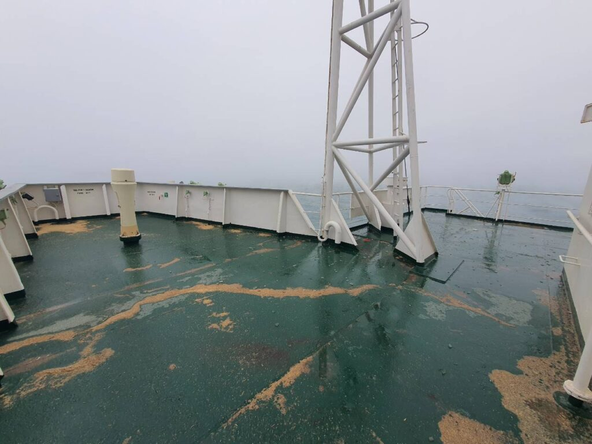
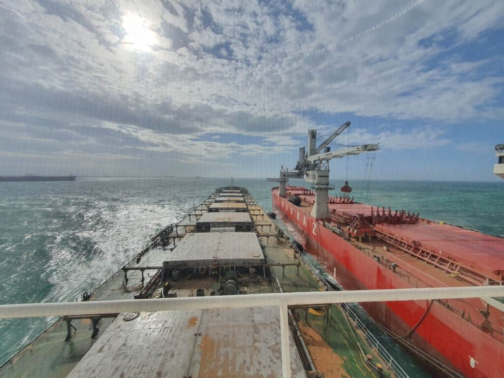
%%%

##### 2021.02.09 11:24

Lovely weather: no rain, no precipitation. Only 2.5 k t of cargo left to load. The transshipment vessel is empty, and in this wave they can’t load from the barge. We wait.

%%%1
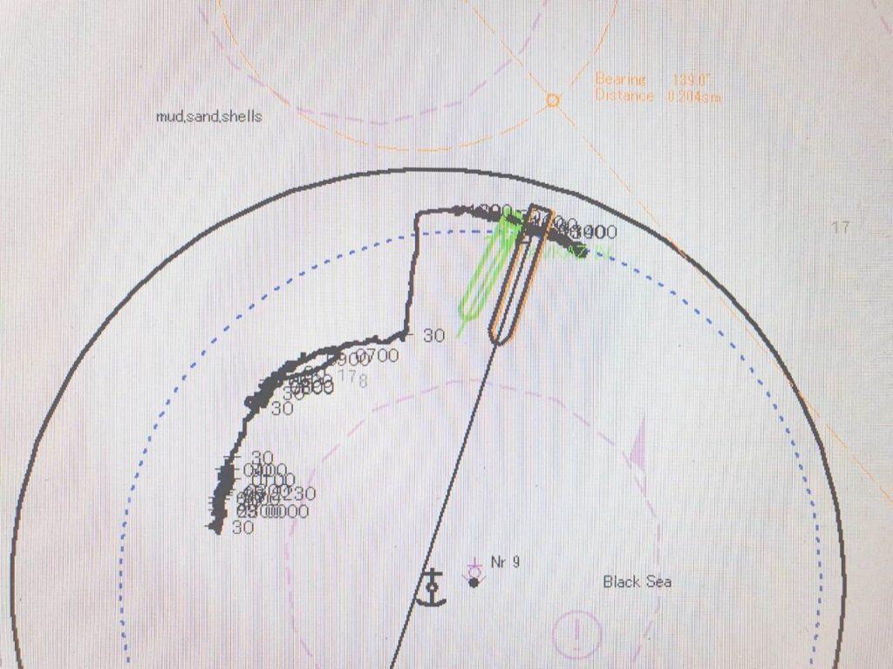
%%%

##### 2021.02.09 13:31

Because the foolish transshipment vessel used its winch for repositioning, we were dragged by 1 cable. Luckily there’s no one behind us.

##### 2021.02.09 16:31

Sunset soon in stormy Caucasus. Wind isn’t that strong, but with high waves even the loader-boat keeps 20–30 m away to avoid banging against us.

%%%1

%%%

##### 2021.02.10 01:10

I decided to indulge in nostalgia and review what happened on this voyage.

At the airport I met the Second Engineer and Captain, and was quite nervous—afraid I’d make a bad impression. On the plane I got a seat next to the Captain, and he asked me some questions.

Upon arrival we were settled in a hotel where we rested for almost a day, and that very night they sent us by boat to the ship.

When we arrived, we were all truly shocked by the ship’s condition, and the handover lasted only minutes.

Immediately upon boarding, we transited the Bosphorus toward port Caucasus. While I was just getting used to a new job—one I hadn’t done before—PSC swooped down on us and got us, though as usual in the CIS, everything is fixable.

After Caucasus, we went to the Persian Gulf, and in the Suez Canal our air conditioner broke. We spent several weeks at +40 °C without AC, sleeping on deck in hopes of catching some breeze, despite sailing through a dangerous pirate zone. The Captain did manage to buy a few ordinary home air conditioners and install them in large rooms so people could gather “barracks-style” and at least sleep in the cool. Until then, we saved ourselves with the pool, where the water was only +32 °C, not +40 like the air. There was also no cold water in the shower—both “hot” and “cold” taps dispensed +50–60 °C.

We survived those hardships, then endured a small week-long repair in Piraeus. The company wanted to reflag us to the Korean Register, but we’re still under the American flag.

Next port was Mykolaiv. First we anchored for almost two weeks, then when we berthed ashore I had a chance to breathe—stepping ashore felt like a huge relief. And of course I bought some “Russian ideas.”

In Aqaba, before discharging, we stood at anchor more than a week. It was a narrow harbor divided between Jordan and Israel, so the Israeli girls kept calling out, “Move away from our border,” as we maneuvered in a strait only a couple of kilometers wide between the shore and Israel.

After Aqaba we visited:

- Taman, where many of our lines were torn because the berth is in the open sea;
- Alexandria, where they brought us into port twice and berthed us—once to take a few sacks of grain for testing, and once to discharge. There we also had to take on ballast in hold 4;
- Novorossiysk, where they load 70 k t in less than a day. There, anchored, we celebrated New Year. Then for two consecutive days we partied so hard that when asked “Do you want a drink?” everyone ran away in horror;
- Damietta, which was unremarkable. The highlight: it’s the best Egyptian port—no beggars, one agent who takes a stable fee and distributes it to whomever needs it. Also there they sent us the best cook I’ve seen at sea—given his experience, he was a lifesaver compared to our previous cooks.

And now we’re back at port Caucasus, where PSC paid us another visit from the same inspector.

I hope soon to post my Istanbul–Odessa tickets here.

%%%2

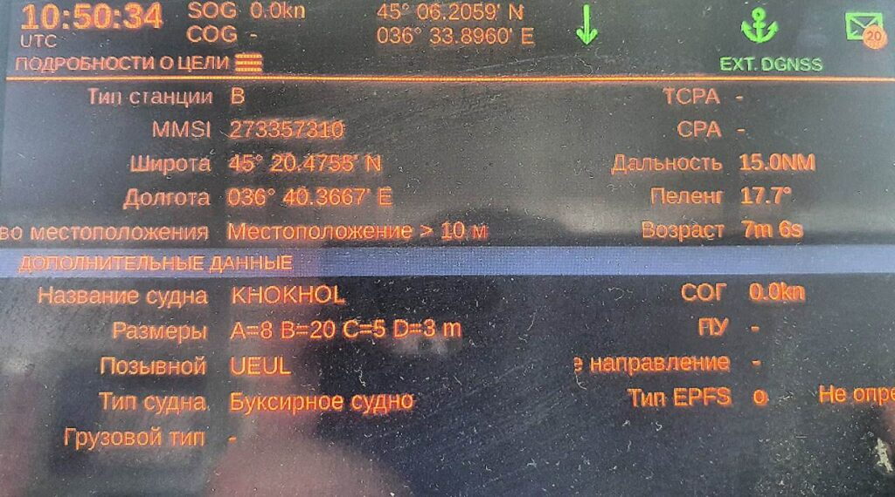
%&12

&%
%%%

##### 2021.02.11 00:32

Kavkaz IV departed. We have finished fumigation of the cargo and will now go through the border guard commission. Then (hooray!) we’ll finally leave Russia.

##### 2021.02.11 03:13

The commission left the ship—nothing’s stopping us from leaving Russia except for the lack of permission from port control… Russians, come on! Just give us the papers!

##### 2021.02.11 10:47

In Russia almost every day was a trial for us.

On February 9, our welder’s grinding wheel exploded while cleaning a part in the engine room. Large fragments of the wheel shattered his safety glasses, and only the next day did he realize something had hit his eye. They couldn’t take him from the ship for a day due to bad weather, and when they did, they took him all the way to Krasnodar to a large ophthalmology clinic. So our crew count went down to 23.

On February 10, a cylinder in the hydraulic system for hold 5’s hatch covers burst. Hydraulic oil poured all over the deck, but thankfully the spilled wheat absorbed it. We were lucky to have a spare (albeit used) cylinder on board, so we managed at least to close that hatch.

They say Russia has terrible bureaucracy—you have to run around for certificates to get certificates… Sea life here is no exception. First you need approval from customs to depart, then border guards, with a pile of documents the agent sends to port control, and they issue a special “Permission to Depart” paper. After that, you have to tell the individual number of that permission to another authority with the callsign “Caucasus Radio 5,” and when they give the okay, you must call “Caucasus Traffic Control” and say that Radio 5 has given permission, and only then are you allowed to depart. **Upd.** Not a day without adventures! When we were departing, we entered a traffic separation scheme (a sort of “road at sea”) and our main engine failed. Water started gushing from under the cover of cylinder 4. We reported the issue, requested permission from Caucasus Traffic, and—once we exited the separation lanes—we dropped anchor. Now we’re waiting for the mechanics to remove the cylinder cover, but… All three sets of special tools for that operation are broken! So the mechanics are trying to fix them somehow…

##### 2021.02.11 13:34

We’re at anchor. Mechanics are fixing it, and we all pray to whomever we can. Tomorrow they forecast a crazy storm with winds over 25 m/s—that’s force 10…

##### 2021.02.14 13:16

Meanwhile we’re drifting near Turkey, waiting for good weather. Fifteen minutes before entering the Bosphorus, they stopped us and turned us away… A storm is expected through Wednesday with waves of 4–5 m. And in the Sea of Marmara the wind will be just as strong as in the Black Sea. All circumstances are against us leaving this ship… **Upd.** We safely transited the Bosphorus and, after a departure as swift as ours, found ourselves ashore. Due to bad weather and high waves, we had to descend by pilot ladder rather than the normal gangway.

##### 2021.02.15 05:54

YES, KATSU IS ASHORE! FAREWELL, FORTUNE TRADER! But there’s a storm, snow, zero visibility—so I have no idea about the flight to Ukraine.

%%%3
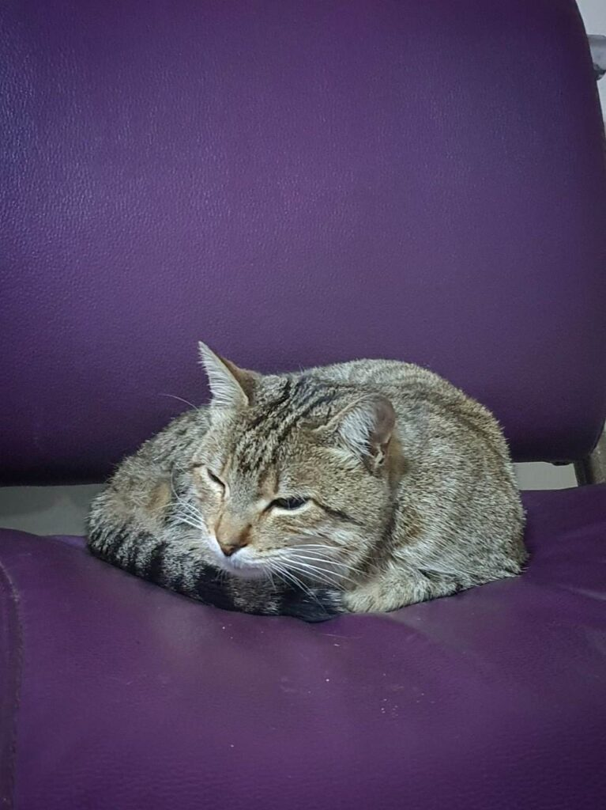
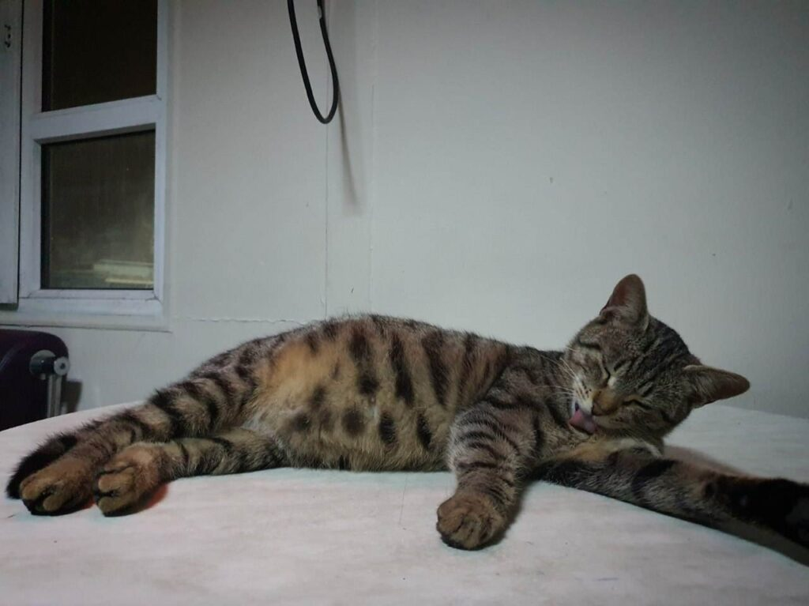
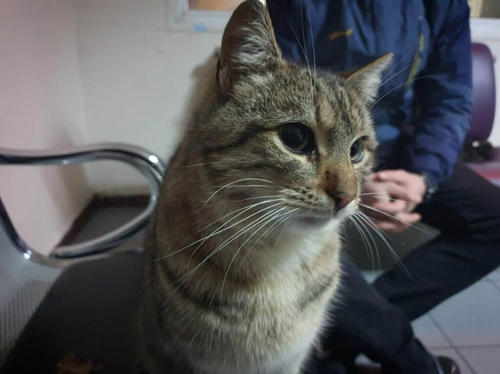
%%%

##### 2021.02.15 06:06

They settled us in the Panorama Hotel again—only this time it was eight of us instead of three! We spent the whole day wandering the neighborhood, buying things for home and as souvenirs.

##### 2021.02.15 21:53

It’s now 22:00. At 01:00 the agent will come and take us to the airport. I don’t understand why, since the next flight to Odessa is at 08:00. And no one’s even told us which tickets we have. **Upd.** Of course Katsu forgot about COVID and the requirement to test.

%%%3
%&13

&%
%&23
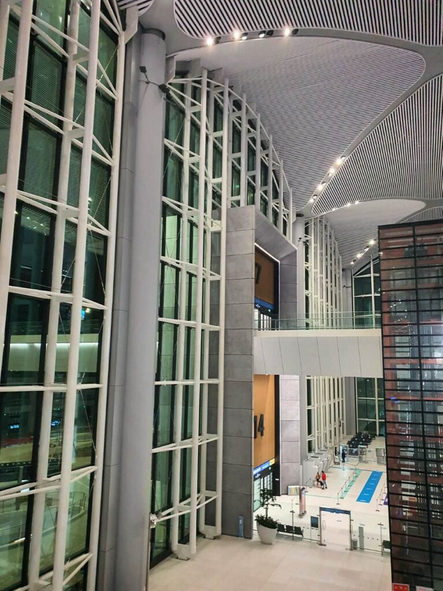
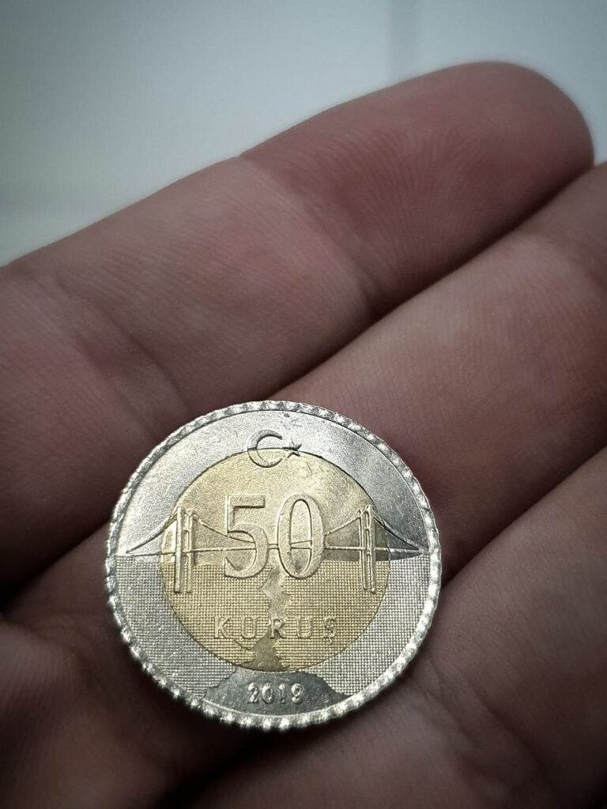
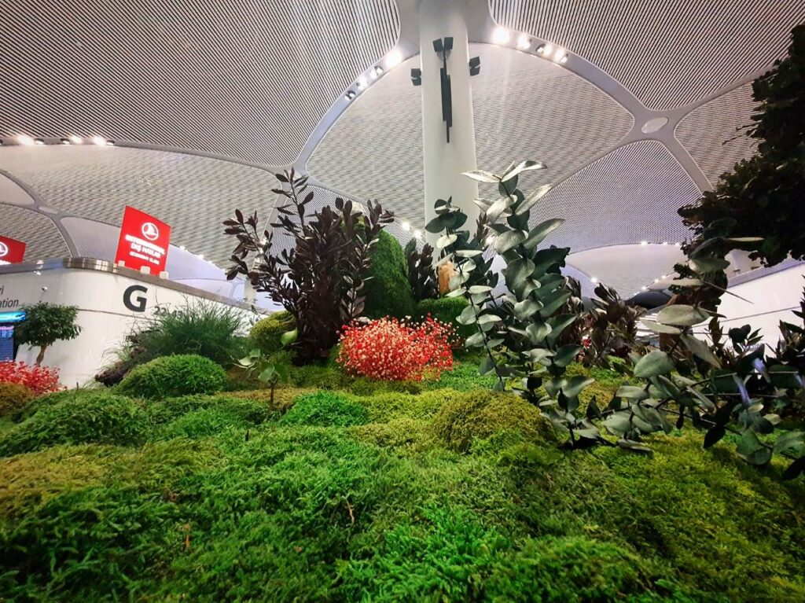

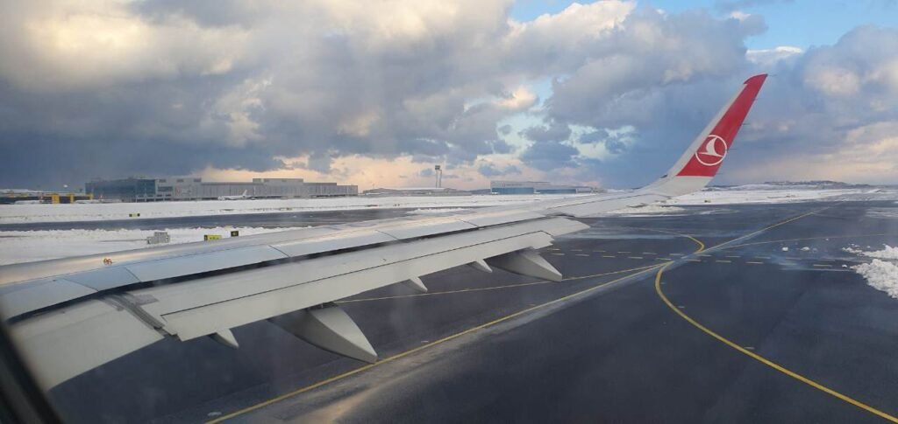

&%
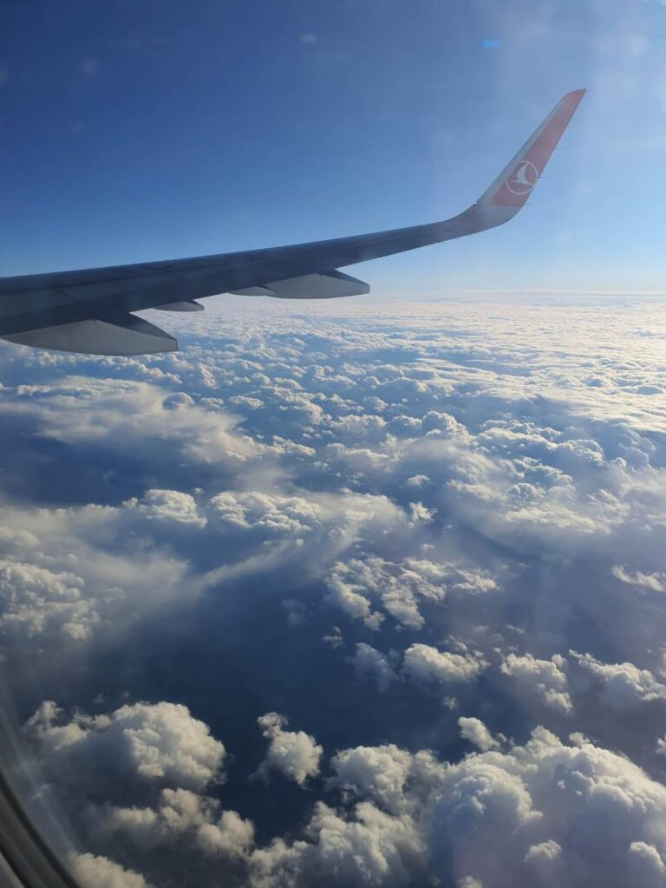

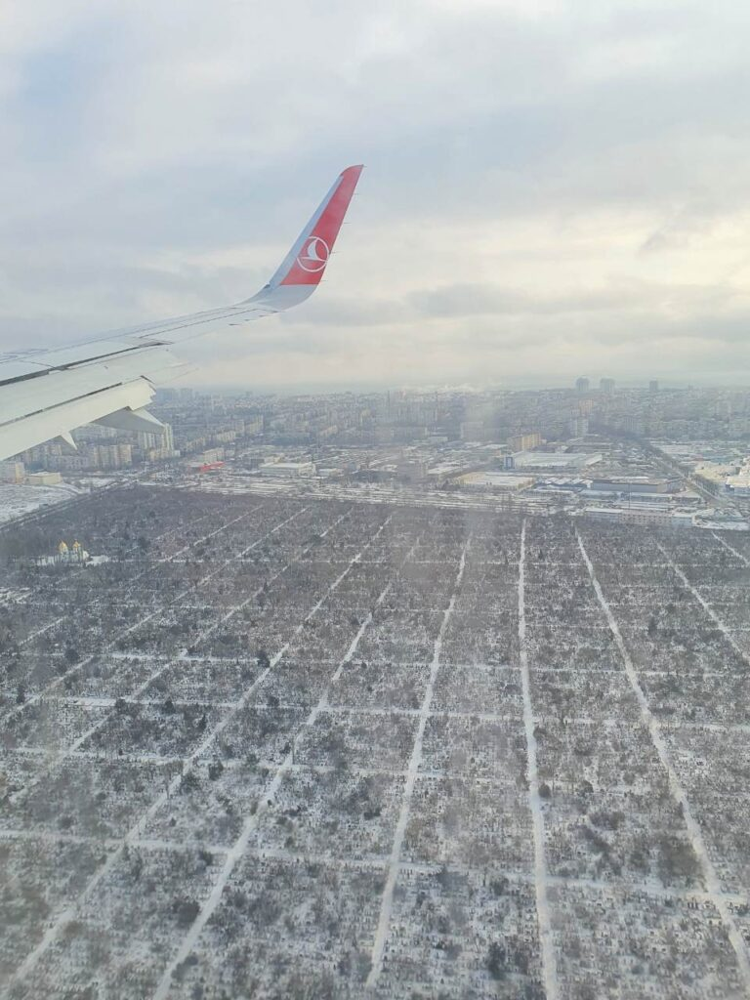
%%%

Thus I found myself home after what seemed to be a grueling voyage that I remember with special fondness. Despite all the hardships, with a united and tight-knit crew you can move mountains!

Soon I’ll tell you about my trip to Uzhhorod, and about one final short but very important voyage in my maritime career.

Love you all ❤️  
Everything will be Katsu! 🦊
