##### 2021.05.10

###### 13:09

Кажется, можно снова прощаться с Кацу и снова надолго, мех. Ну посмотрим, как оно выйдет.
Upd. Пока что отмена, может повезет, мх.
Upd 2. Снова звонили, теперь с другой компании, срочный вызов на 20е число.
Upd 3. Но ходят слухи, что это может быть развод.

:::1
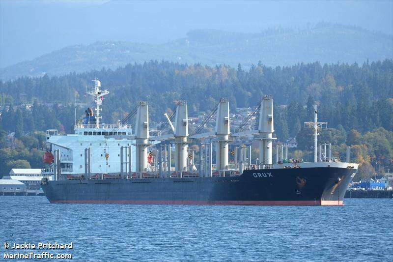
:::
##### 2021.05.22

###### 15:27

На этот раз точно забирают, уже и судно определили: CRUX
Судно не новое, 2002 года постройки, ещё и с собственными кранами.
Курсирует между Африкой и Китаем. Одна ходка - примерно пару месяцев.
В Африке - пираты-людоеды гвинейского залива, а в Китае - множество рыбаков с лодками, которые не отбивают на радаре и не отзываются по УКВ.
Думаю, рейс будет примерно до нового года.
Посадка на судно будет в Африке, где-то в Бенине или около того.

##### 2021.06.18

###### 18:03

Ну вот и всё, Кацу получил негативный ПЦР тест и подписал контракт, так что Африка неотвратима.

##### 2021.06.19

###### 11:19

Кацу выезжает в аэропорт Одесса.
В 14:45 вылет на Дубай, где мы проведем 12 часов с 20:00 до 08:00 утра. После этого мы сядем на другой самолет в сторону Сенегала, его столицу - Дакар. Там и будет посадка на судно.

###### 14:13

Тем временем мы в самолёте, через пол-часа он должен взлететь.
Upd. Переходим в авиа-режим, через 10 минут взлет.

:::3

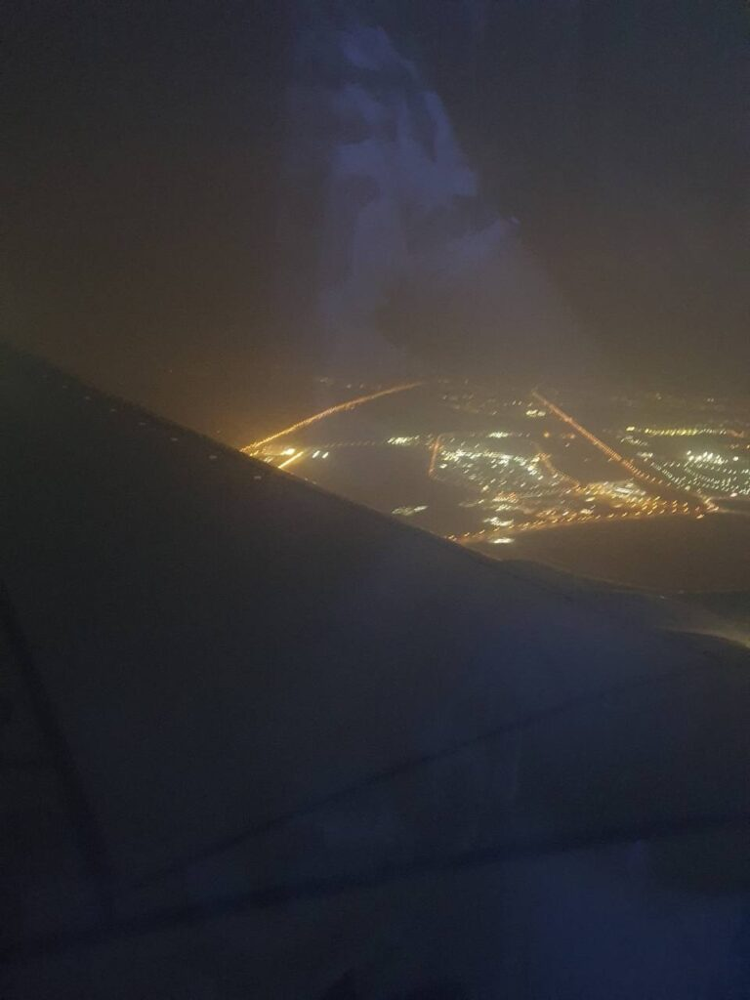
:::
###### 19:33

Мы прилетели в Дубай и удачно сели) Дальше - 12 часовой ожидание, и 12 часовой перелет.
Ходить будем все же на Китай, возить - лес.

##### 2021.06.20

###### 06:08

Вот мы и прошли очередной кордон в сторону посадки на следующий самолет. В 07:10 посадка, в 07:55 вылет. Время МСК+1.
Самолет летит в Конакри, а после полуторачасового ожидания отправляется дальше в Дакар.
Upd. Обидно, что я не взял мягкую куртку из чемодана в ручную кладь. А в самолете и аэропорту достаточно прохладно, что не особо приятно(

###### 19:55

Всем привет из Сенегала. Мы пережили 12 часовой перелет с 2-ух часовой стоянкой в Конакри и удачно приземлились. Сейчас проходим контроль в аэропорту, а дальше не знаю, повезут ди нас в отель или сразу на судно.
Мы летели на огромном Боинге 777 у которого в одном ряду было 10 мест в эконом классе и 7 мест - в бизнес.
Нас три раза покормили, раздали по набору гигиены, подушке и пледу, но кресла были не особо удобными.

##### 2021.06.21

###### 16:54

Ладно, пофиг на впечатления от Сенегала…
Лучше сразу о пароходе:
\- Общие туалет/душ, а не личные. Даже на 7к дедвейтном малыше были личные! Что тут скажешь, японская постройка…
\- Каютки маленькие, а коридоры большие и просторные.
\- Все гнилое с виду.
По экипажу:
\- Боцман тот же, что и был поначалу в прошлом рейсе.
\- Старпом приехал с нами, а тот что есть на судне - продвигается в капитаны.
Что-то меня всё это ещё больше не радует…
Пока что у меня чувство, что я попал если не в жопу, то в задницу.
Одно радует, у меня будет целый день на передачу дел, а не пол-часа, как на прошлом судне.

###### 16:57

Ладно, меня просто поселили в другой каюте временно. У офицеров туалет и душ личные.
Электронная карта вроде не сложная, но очень глючная.
Зато обновления получаются автоматически, а не бегать к капитану и забирать их лично.
Сейчас вот уезжает один из матросов, который сидел тут больше года.
Впечатления у меня далеко не самые лучшие…
Ладно, как-нибудь постараемся пережить эти пол-года.

:::3
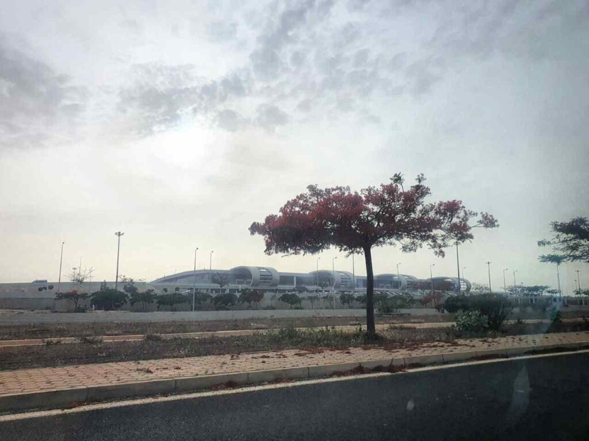
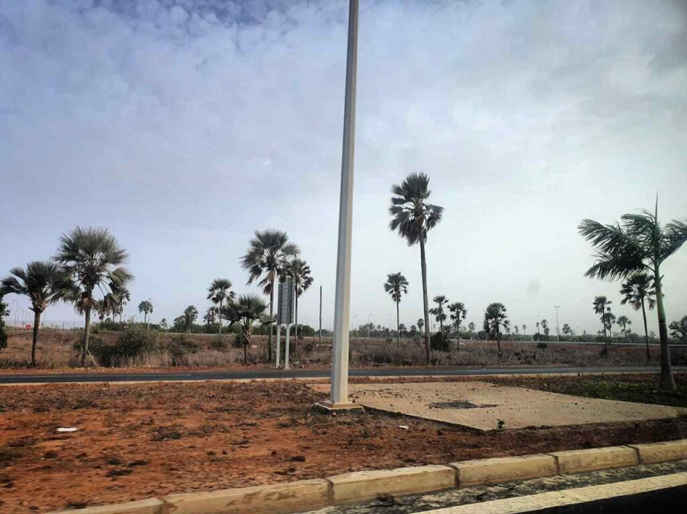

:::
###### 20:05

Несколько снимков Сенегала по пути на судно.

Мы очень выделялись, ведь абсолютно все вокруг - негры. Но, пока что, каких-то плохих я не встречал, тут они даже лучше арабов.

Машины все побитые, есть конкретные развалюхи, а есть новые, но все царапанные и мятые.

Трафик - сумасшедший. Они жмутся друг к друг меньше метра при скорости 120. Постоянные шашечки вокруг.

Здания тут почти все или недостроенные или полуразрушенные, только в самом центре более менее нормально.

##### 2021.06.23

###### 08:29

Подолгу не могу заснуть, ибо всякие мысли лезут в голову, не обязательно плохие.
_Даже днем я немного как в тумане, не могу трезво соображать. Как будто я сплю и делаю все на автомате. Впрочем я и живу довольно давно.
Вспоминая прошлое судно, там капитан обложил меня бумажной работой, в которой я хорош, однако я был свободен от возни с балластом, грузовыми и швартовок, в которых я куда хуже разбираюсь. Не знаю как оно будет тут, но ко мне может ухудшится отношение от ошибок в том, в чем я не разбираюсь.
Так же же 3ПКМ уже работал с этим мастером (тогда еще старпомом, он вот только сегодня стал мастером) и в хороших с ним отношениях. Страшновато, кажется, что это расплата кармы за прошлый контракт в котором мне везло почти со всем.
Старший помощник капитана вроде нормальный приятный человек, мы с ним летели и сейчас по работе он вроде бы нормально относится. Однако, он сам еще в запаре, посмотрим, что будет, когда со всем разберется.
Похожее чувство хождения по лезвию у меня было в начале прошлого контракта, однако поддержка капитана придала мне уверенности, которой сейчас у меня абсолютно нет. Мех._

###### 08:30

~~Выхожу на вахту, капитан по УКВ требует снять шесть осадок судна (бак/мидель/корма, левый/правый борта) в 00:30 ночи.
Что делается в начале грузовых и конце.
При ПОгрузке делается еще 1-2 раза в день для контроля.
При ВЫгрузке только в начале и конце.
Мастер, будучи чифом, даже начальный драфт сюрвей не делал, а теперь заявляет что ему надо почти что промежуточный драфт сюрвей посреди ночи.
Еще и с колкостями и доебами…~~

~~У меня уже стойкое желание послать на… и к черту и ехать домой.
Насколько я бесконфликтный человек, но вот так по УКВ до…ывать вахтенного и старпома для человека который только 12 часов капитан это верх.~~

~~Я, конечно, не ждал от этого рейса ничего хорошего, но что-то предвидится треш, угар и п…ц.~~

Это оказался старый капитан, который уезжает, про него и так никто ничего хорошего не говорил.
Чифа довел, что он хотел писать по собственному, но надеюсь пронесет, ибо чиф хороший.

###### 08:31

Старый капитан уехал, а про нового все говорят только хорошее, так что думаю что дальше будет легче.
Может быть карма решила, что в начале контракта надо немножко хлебнуть говна, чтобы потом все психологически казалось хорошо.

:::2
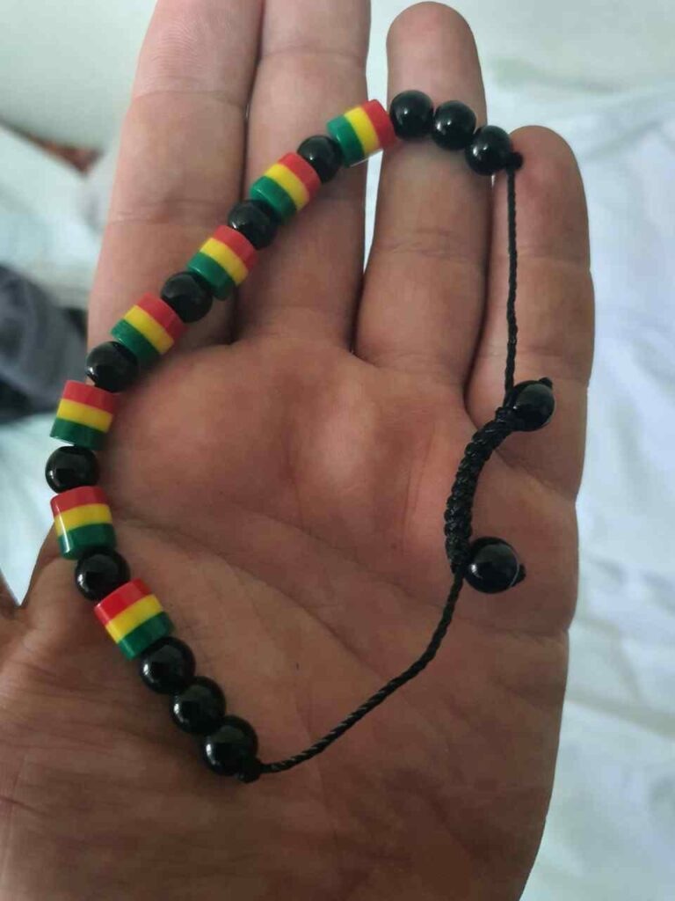

:::
##### 2021.06.24

###### 04:06

Сейчас выгружаем рис в мешках, осталось 2-3 тыс тонн.
Потом пойдем в Бучанан/Дуалу/Криби за лесом, который повезем в Китай.

:::3

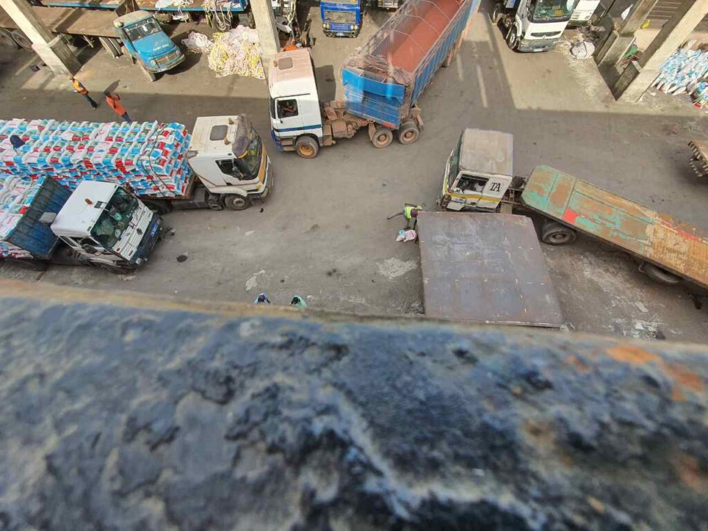

:::
###### 04:22

Мешки по 50кг выгружают из трюма на платформы, а потом ровно выкладывают в фуру мощные чернокожие парни. Они так быстро и слажено работают, что становится страшно.
Сколько же сил у них в руках и как они вообще выдерживают подобную работу?

:::1
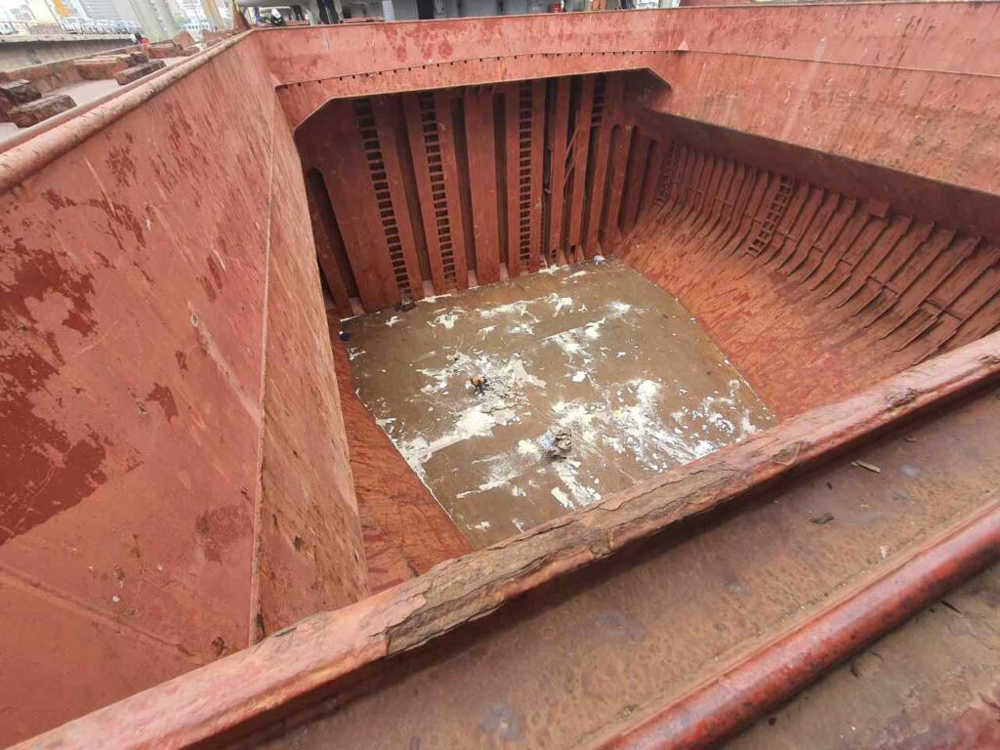
:::
###### 16:24

Понемногу выгрузка заканчивается.
Осталось немного груза в одном из трюмов, а в остальных - убирают бумагу и пенопласт.
Вероятно, сегодня мы отчалим из Дакара 🇸🇳 и направимся в Бучанан 🇱🇷.

##### 2021.06.25

###### 13:00 UTC Port Dakar

Несмотря на то, что выгрузка была закончена еще вчера до полуночи, наше судно стоит у причала, арестованное из-за недостачи груза. Обычно такое решается довольно быстро, но скоро уже пройдут сутки с окончания грузовых.
Так же Капитан порта с иммиграционной службой забрали паспорта экипажа, дабы никто не сбежал. (**Upd.** не сильно то и хотелось)
Сейчас страховая (P&I) должна порешать, но это уже немного затянулось.
У меня было несколько подобных случаев ранее, это распространённая практика в недоразвитых портах.
В прошлом рейсе, когда мы сменялись, новый капитан спрашивал у нашего, может ли старпом считать остойчивость судна.
Сейчас мастер спрашивал у меня, могу ли я сам стоять вахту и знаю ли МППСС (международные правила предупреждения столкновения судов).
Мне кажется, или уровень компетентности кадров в этой компании очень не очень, раз у капитанов возникают подобные вопросы.

##### 2021.06.26

###### 01:00 UTC Dakar Anchorage

Нас выгнали на якорь, пока не решены проблемы с задержанием судна из-за недостачи. Как я узнал, по мнению грузополучателя, не хватает 54 тонны. Это при том что этот самый рис просыпался из мешков на палубу и землю, и только Богиня знает, сколько еще из них было украдено самими работниками порта.
Сегодня я впервые за долгое время участвовал в швартовых операциях и у нас все получилось как надо, учитывая, что у меня было всего 2 матроса, что не может не радовать. Это даже в чем-то легче, чем быть на мостике во время прихода/отхода.

###### 11:30 UTC Dakar Anchorage

Сегодня во время обхода боцман нашел "зайца", так что капитан анонсировал большую поисковую компанию, дабы больше точно никого не было.
Мы только приехали на судно, однако ни дня без приключений.

:::1

:::
##### 2021.06.29

###### 02:20 🌍 13 26,7N 017 25,6W

Днем провели учения "Пожар на камбузе" и "Покидание судна", после чего нам показали как запускать аварийный дизельгенератор (в случае отказа основных) и как непосредственно вручную управлять рулем судна (управляя прямо на гидравлическом насосе), если откажет система управления с ходового мостика.
Почти во всех случаях аварийных ситуаций мои обязанности, как второго помощника капитана, - это находится на ходовом мостике, вести переговоры с другими судами и между аварийными партиями, что и спрашивал у меня капитан.
Ну а вечером, в 21.00 к нам приехал катер, забрал "зайца", вернул паспорта экипажа и вручил Port Clearance, так что наше судно выбрало якорь и отправилось в следующий пункт назначения, Buchanan, Liberia 🇱🇷.
Дистанция - около 750 миль, а судно, как оказалось, достаточно быстроходное, шпарим аж 13 узлов (узел = морская миля в час, морская миля = 1,852 километра).
Попадаются рыбаки, но немного и пока что достаточно спокойно.

##### 2021.07.01

###### 02:20 🌍 06 09,7N 010 57,5W

Третий день к ряду мы идем на Buchanan. Судно уже находится меньше чем в 60 милях от порта и по информации от агента мы с ходу зайдем в порт.
Однако, еще на рейде нас ждет проверка от CoastGuard, скорее всего, хотят снять сливки, как это делается во всех недоразвитых странах.
Погода неплохая, не штормит, дождей нет, однако небо полностью затянуто тучами, так что ночью никого не видно, а зыбь почти в борт раскачивает судно.
Из хороших вещей, у нас на судне оказался нормальный повар, хотя бы в этом плане не приходится страдать.
Так же, я понял что работа второго немного легче, чем я думал, ведь на прошлом судне я делал некоторую работу и за третьего, и за капитана.
Скоро уже будет две недели как я тут, а я уже считаю дни до отъезда.😅

:::1

:::
###### 17:20 Buchanan Port

Мы зашли в порт, была не самая простая швартовка, сразу же пришел PSC, а до захода в порт еще на судно поднимался Coast Guard.
Все взятки берут дизельным топливом. Там 20 канистр, там 30.
Говорят, что мы можем постоять до 3ех недель тут из-за сезона дождей.

:::2

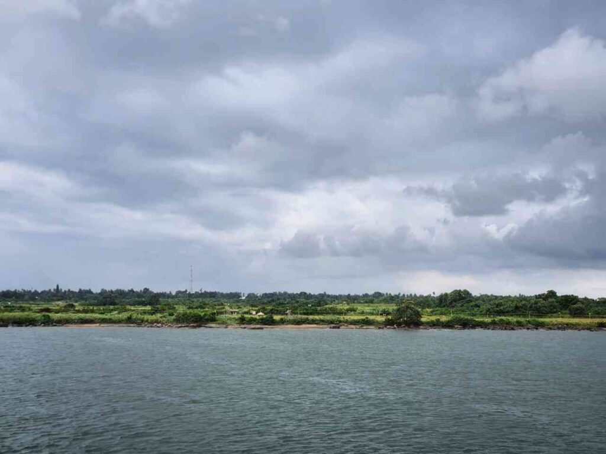

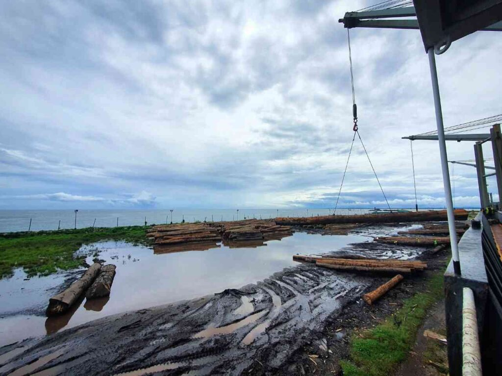
:::
##### 2021.07.02

###### 14:21

Вот так, сначала погрузят бревна в трюма, а под конец и сверху на крышки трюмов. Специальные крепления для этого на судне имеются.

###### 04:46

Наши бревна, хех. Однако сезон дождей не дает нам даже открыть трюма. на данный момент погрузили около 20 бревен, а должны загрузить 13 тыс. тонн.

:::2
!c2[17:01 Я возил огромные генераторы и трактора, возил зерно, контейнера и ящики, но не думал, что мне придется за свою практику везти лес, хех](+images/photo_1458@02-07-2021_14-21-59-1024x697.jpg)
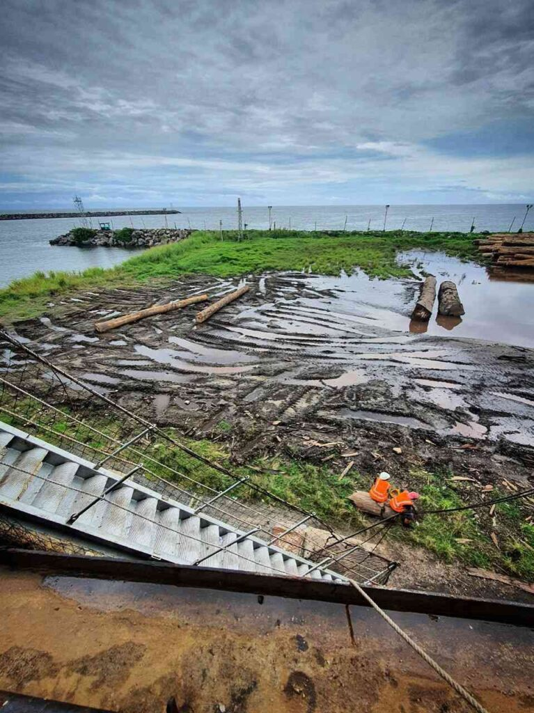

:::
###### 20:49

Получил новую информацию от мастера, что мы не будем заходить в Douala и Kribi, а отправимся южнее, в Pointe Noire, на дозаправку. Идти туда около 5 дней, а может и меньше. Соответственно и груза у нас будет меньше.
После Point Noire мы, вероятно зайдем или подойдем к Port Elizabeth, что за Мысом Доброй Надежды, то есть уже в восточной части южной Африки. Скорее всего там будет смена экипажа и дополучение провизии.
Следующая вероятная остановка - Сингапур. Снова для дозаправки, ведь пароход жрет 20-25 тонн топлива в сутки.
И уже после Сингапура мы дойдем до Китая, где и сдадим бревна получателю.

##### 2021.07.03

:::1

:::
###### 14:42

Просыпаюсь я поутру, прихожу готовить капитану ежедневный отчет в компанию, а мне третий помощник говорит, что у нас проверка флага на борту судна...
Как я люблю хорошие новости спросонья.

:::3

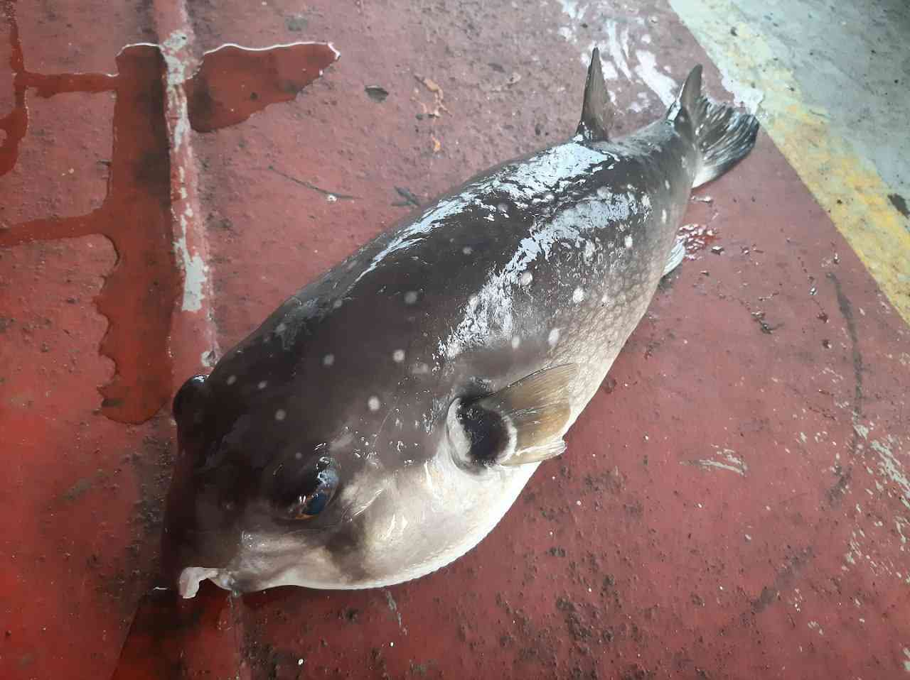
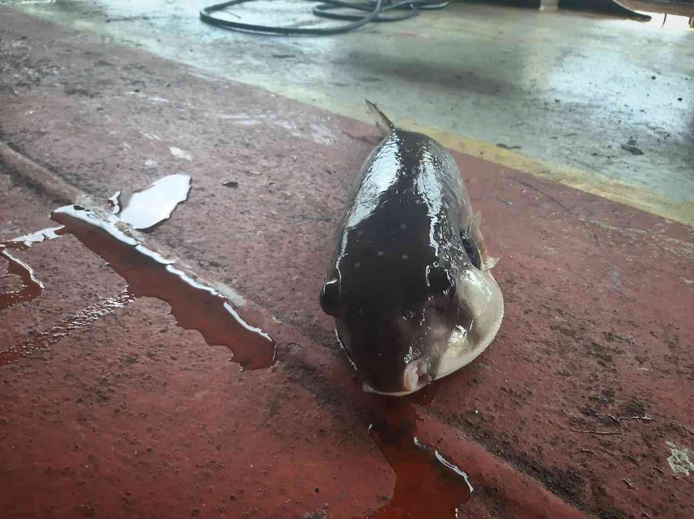
:::
###### 19:21

Вот такое злое нечто, похожее на рыбу фугу выловили наши черные друзья прямо во время тревоги по тушению пожара.

##### 2021.07.04

###### 03:36

С каждым днем всё больше устаю. Всё таки режим вахты 6 через 6 не предназначен для долгих стоянок в порту.

Когда ты работаешь таким образом 2-3 дня, это можно выдержать, но когда идет 4й, 5й день, неделя, то ты конкретно выгораешь. У тебя просто нет сил встать с кровати.

Учитывая что в режиме 6 часов работы и 6 часов "отдыха", в последний период тебе надо и помыться, и покушать. А мне, как второму помощнику ещё и подготовить и отправить ежедневные отчеты.

Кое-как на силе воли и на "надо" ещё выезжаешь, но с каждым днем все более сильно желание...

###### 04:45

:::2

  

    <b>IT</b>: *компенсация психотерапевта* 
    <b>Море</b>: в тебя выстрелил 100кг кусок железа в грудину? Ну, легкое сотрясение, полежи денек в каюте и за работу
  

:::
###### 08:18

Как заметно отличились для меня мусульманские страны от немусульманских.

В первых, к коим относится и Сенегал, будь ты арабом, негром или кем еще, ты будешь слушать непонятные для меня завывания.
И хотя в Либерии те же негры, но не связанные с мусульманством, слушают Pink Floyd, Queen, Muse и другую нормальную музыку.

Понятное дело, что это очень вкусовщина, и я не в коем случае никого ни к чему не призываю, но не мог не поделиться наблюдениями.

###### 21.12

:::1
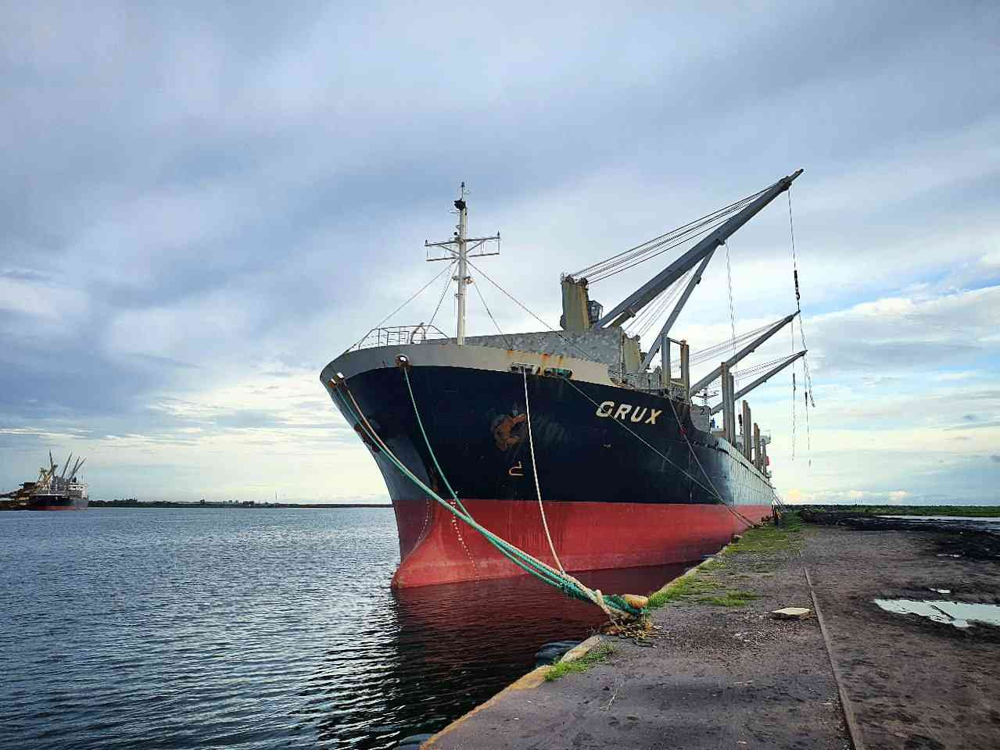
:::
##### 2021.07.05

###### 02.54

Непонятное интересное растение на пляже. Листья плотные, мясистые. Если кто подскажет что это, с меня бокал пива)

:::2

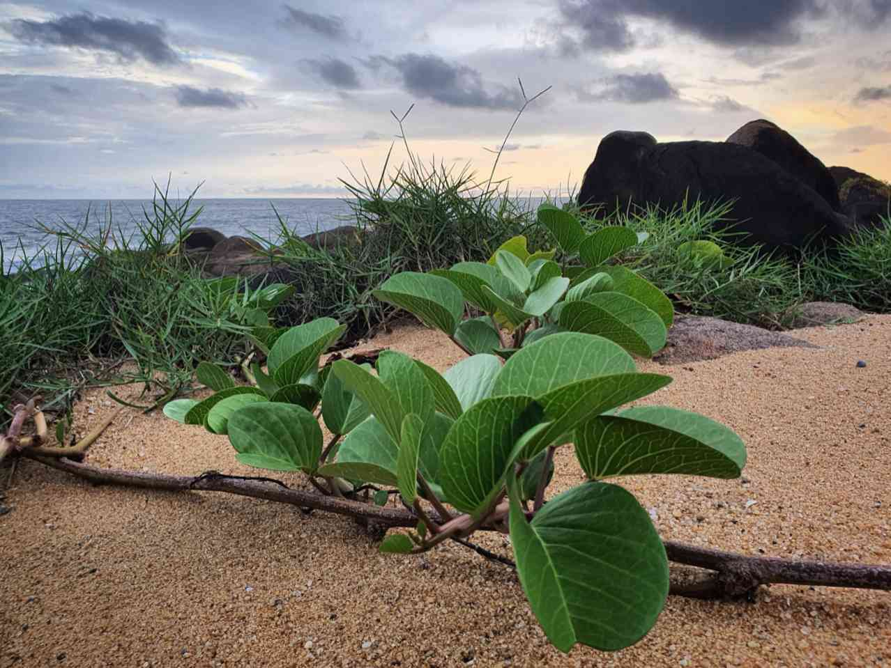

:::
###### 02.58

Вечерняя вылазка на пляж на границе порта Бекьёнен.

Невероятно красивое и живописное место, как будто созданное специально для фотосессий.

Пляж находится за границами порта меньше чем в сотне метров, правда) и сначала нас не хотели пускать, но добрый охранник дал нам сопровождающего, так что мы смогли выйти и сделать несколько классных снимков)

Upd. Как оказалось, сопроваждающего нам дали не для надсмотра, а для нашей же охраны, ибо там воруют людей.

:::3

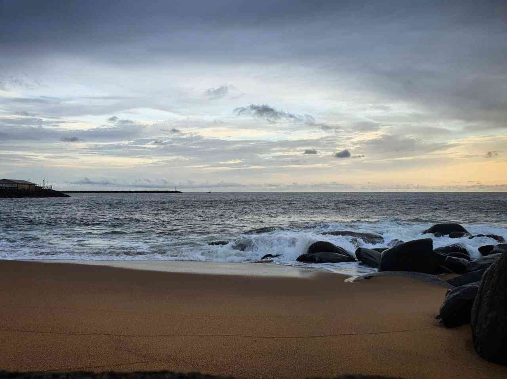

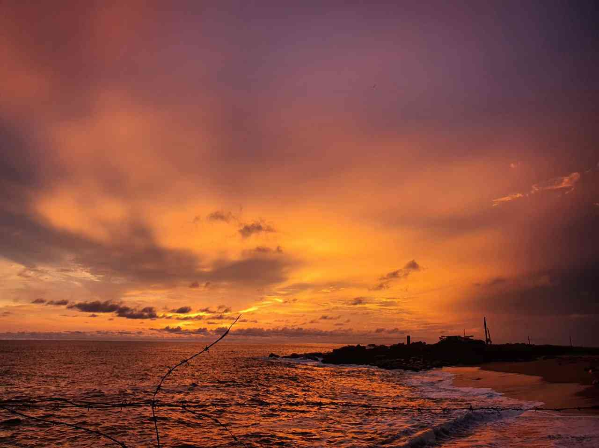
:::c3
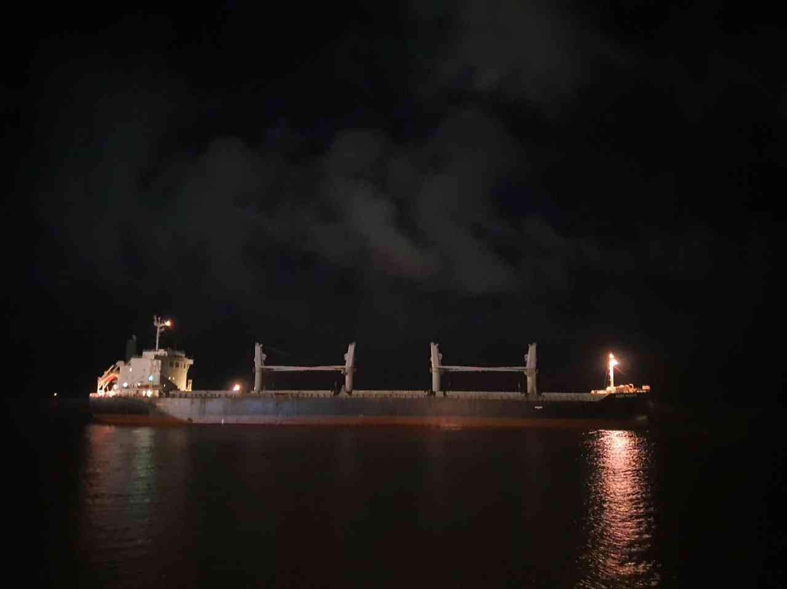

:::
!c3[14:26 Бревен остается все меньше, даже закончили 5 трюм грузить, так что скоро отправимся догружаться на Point Noire.](+images/2024-04-14_15.54.22.jpg)
:::
###### 14:46

Сегодня произошел security incident на борту нашего судна, украли часть такелажа, необходимого для крепления груза на палубе.
В 12 часов дня старпом собирает митинг по этому поводу.

###### 16:02

А еще я со вчера умудрился заболеть. Болит горло, насморк со всеми вытекающими. \
Так что неработающая от усталости голова теперь не работает вдвойне из-за болезни. Только вот вахты никто не отменял, конечно.
Я надеюсь это хотя бы не корона. _(Upd. лучше бы это была корона...)_

:::1

:::
###### 22:40

> Николаевский судостроительный завод официально прекратил своё существование
>
> Сотрудники уволены, имущество распродано, печать уничтожена: судостроительный завод в Николаеве официально прекратил своё существование. За 126 лет его истории на предприятии было построено более 1000 судов военного и гражданского назначения, в том числе авианосцы, крейсеры и крупные научно-исследовательские корабли. Но Украине завод оказался не нужен.
>
> [Таймер Одесса](https://telegra.ph/Legendarnyj-nikolaevskij-zavod-oficialno-prekratil-svoyo-sushchestvovanie-04-14)

Ушла эпоха, забрали у Николаева звание города корабелов. Осталось ли им теперь чем гордится?

###### 22:49

К нам в первый день приходили инспектора Port State Control, которые взяли 1,5 тонны дизеля за чистый репорт.

Оказывается, со слов инспектора Flag State Control, только он имеет право проверять суда с припиской в Либерии, а PSC может проверять только иностранные суда.

Так что нас налоховали. Агент должен был это обьяснить нам, но он участвовал в схеме, так что сам лишь помогал мошенникам.

##### 2021.07.06

Видео с тропическим ливнем я пока не знаю как залить сюда, так что вот [ссылка на сообщение](https://t.me/katsu_travel/2043))

:::2

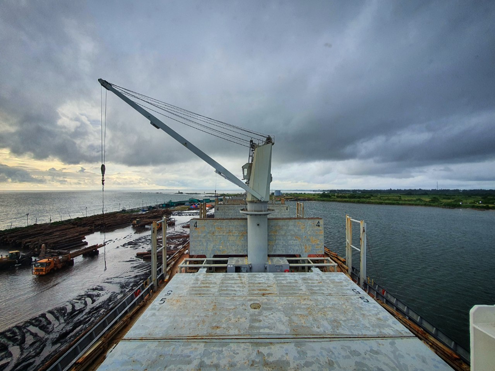
:::
##### 2021.07.08

###### 16.19

Сам [видео](https://www.youtube.com/watch?v=mRsgiYEtwJs) еще не смотрел, но название вдохновляющее.

Upd. Кажется, Капитан Тимур ограничил доступ к некоторым своим видео, так что остается только довольствоватсья скриншотом. Это одна из причин, почему я предпочитаю важные для себя вещи хранить локально.

:::2

:::
###### 19:45

Все что осталось для нас. Тем временем местные утверждают, что сегодня закончится погрузка, а уже завтра нас могут выгнать из порта.

:::1

:::
###### 21:40

По последней информации, завтра в 11 часов будут окончены отходные формальности и судно будет отходить от причала.

Далее мы направимся в Порт Нуар в Конго, где на имеющиеся 12,5 тыс тонн бревен погрузим еще 20 тыс сверху. Часть пойдет в трюма, а часть будет крепиться на крышках трюмов. Там же у нас будет дозаправка топлива, предположительно прямо на ходу.

Потом Порт Элизабет в ЮАР, где будет получение снабжения, провизии и смена экипажа. Часть людей уже перевалила за 7 мес, но их не сменили в Дакаре.

##### 2021.07.09 14:01

Всем привет. Судно стоит погруженное, ждем офицеров полиции, чтобы провести поиск нелегальных эмигрантов по судну.
После этого мы покинем порт Бьюкенен.

На этой ноте я оборву повествование и приглашаю вас ко второй половине этого поста)

Ваш Кацу 🦊
