##### 2021.07.12 12:00 UTC+1 🌍 01°47.5S 001°03.6E

Ось ми й перетнули екватор, і це трапилося вперше в моєму житті. Отже, якщо в Північній півкулі зараз літо, то в нас тут — зима.

Поки ми йдемо Атлантикою, температури справді не високі, а через кондиціонер доводиться спати під ковдрою. Все ж це краще, ніж у спеку.

Останнім часом я відчуваю постійну втому, і хоча ми вийшли з порту (тому зараз у нас графік 4 через 8) і я більшу частину часу витрачаю на сон, вона все одно не минає. Я також приймаю вітаміни, але полегшення не відчуваю. Складається враження, що ще один порт за тиждень чи два на графіку 6/6 мій організм уже не витримає.

Більш втомленим я був лише під час першого контракту третього помічника, коли доводилося допомагати матросам у кріпленні вантажу, і ми працювали цілодобово без сну: пиляли дошки, розставляли під тракторні гусениці дошки тощо. Пам’ятаю, тоді в мене вперше в житті пішла кров із носа.

:::2

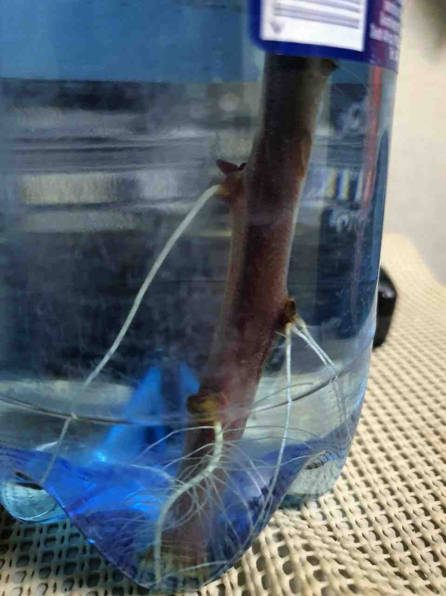

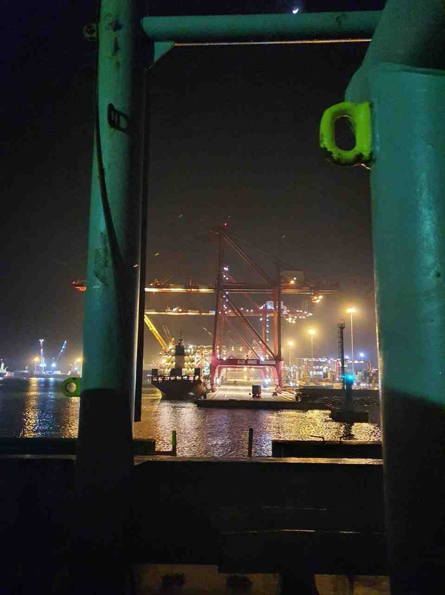

:::

###### 00:19

Проте контейнерний термінал виглядає досить сучасним. Останнім часом Китай дуже активно виходить на ринок Африки, будує свої заводи та інфраструктуру і під шумок вивозить усе цінне.

Водночас місцевим жителям це краще, ніж голодувати чи боротися за кокоси з пальм, адже вони можуть дозволити собі жити як люди.

###### 15:02

Ось прямо у нас під носом, менше ніж за півмилі, промайнула контейнеровоз **Baltimore Star**.

:::2

:::

##### 2021.07.15 🌍 Порт Поінт-Нуар, Конго

###### 01:30

Ось ми й прийшли до чергового порту. Обіцяють тиждень завантаження.  
Швартовка сьогодні була жахлива. І на носі, і на кормі порвався по одному тросу, і ми ледь не вдарилися об пароплав попереду.

Через пару днів у мене буде перший місяць на **M/V CRUX**, хоча за відчуттями я тут уже як шість місяців.

Сподіваюся, якось ми це витримаємо.

###### 04:59

Поліцейський з боку порту каже, що може дістати слонове м’ясо по двісті баксів за кілограм, хоча це нелегально й за це можуть посадити; також м’ясо мавп, яке вже продається в магазинах. Екзотично, справді.

###### 13:10

Як писав мій знайомий у своєму каналі про службу в армії [@mil_ik](https://t.me/mil_ik), будь ласка, задавайте свої питання в коментарях до того повідомлення, а я постараюся докладніше описати це в своїх постах. Бо читати дописи, повні скарг, не дуже цікаво, тож треба писати більш просвітницький контент.

###### 13:27

Ми простояли тут менше доби, і при всій складній швартовці вчора, нас хочуть вигнати на якір на рейд порту Поінт-Нуар до кінця моєї вахти (18:00), тому що треба пустити інше судно на завантаження. Але нас пустили сходу. Дуже весело, чесно.

Upd. Прийшов якийсь незрозумілий чувак у крутій морській формі, сказав, що він із безпеки і в нас є проблема. Розповів, що десь там упав якусь антищурячу накладку, забрав останні три ящики сигарет і пішов.

Upd2. Незважаючи на те що всі щитки були на місці й усе, що можна було прикріпити, було в хорошому стані. Однак з високим мускулистим негром-безпековцем сперечатися хочеться в останню чергу. Словом, це вам навіть не 90-ті роки.

###### 16:44

Закінчили вантажні операції та готуємось до виходу з порту.  
Ще невідомо, скільки ми стоятимемо на якірі, перш ніж нас пустять, щоб докріпити вантаж.

##### 2021.07.16

###### 00:02

Нове життя — нова надія, хих.

Оторваний мною на ліберійському пляжі відросток ліани скинув старе листя, а місця зрізу підсохли, і мені здавалося, що вона вмерла. Однак сьогодні я побачив, що з місць, де були старе листя, пішли корені (нижче рівня води) і свіжі пагони (вище).

Незабаром я попрошу у третього помічника землю, якої він набрав у Ліберії аж ціле відро, і посаджу свій саджанець. 😅

:::2

:::

###### 00:19

Однак контейнерний термінал виглядає досить сучасним. Останнім часом Китай дуже активно виходить на ринок Африки, будує свої заводи та інфраструктуру і під шумок вивозить усе цінне.

Та місцевим жителям це краще, ніж голодувати й боротися за кокоси з пальм — вони можуть дозволити собі жити, як люди.

###### 15:02

Отак прямо під нашим носом, менше ніж за півмилі, прослизнув контейнеровоз **Baltimore Star**.

:::2

:::

##### 2021.07.17

###### 14:12

:::3

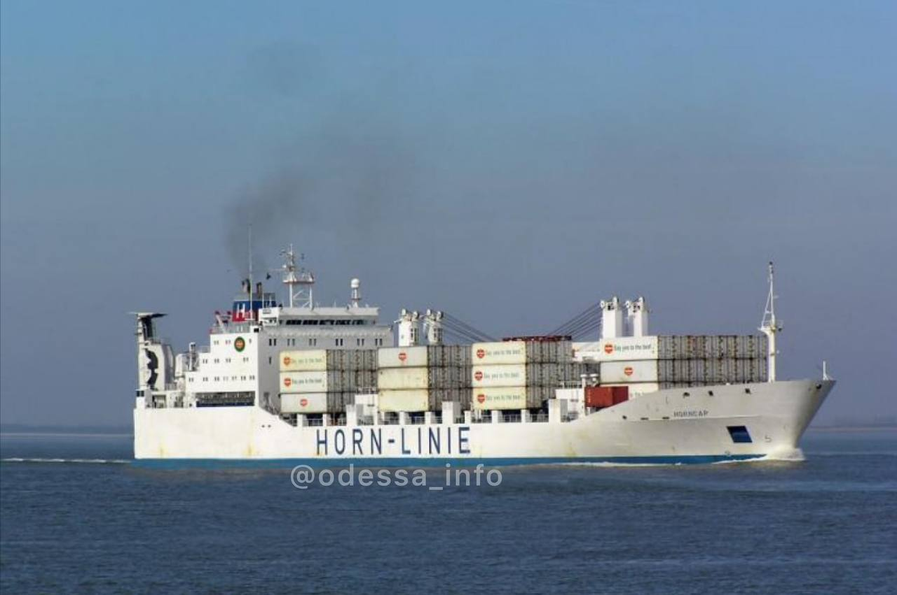

  

    
В Аденській затоці застрягло судно з одеськими моряками; є жертви ☠️

    
Судно <b>THORN1</b> прямувало в Індію на “утилізацію”. На борту корабля перебували 11 членів екіпажу, з них 10 — громадяни України. Під час проходження через Аденську затоку в судна закінчилося паливо і вийшла з ладу система життєзабезпечення в +38°C (у тіні) жару.

    
Через сильну спеку в одного з моряків стався інсульт. Чоловік помер. Він був із Очакова.

  

:::

###### 14:20

Як показує практика, моряки найчастіше гинуть через безвідповідальність.

Коли приходять на судно інспектори Port або Flag State Control — намагаються за допомогою хабарів зробити “чистий” репорт. Якщо це не вдається, провину за будь-які проблеми перекладають на моряків, які змушені витрачати нерви та сили на усунення дефектів, замість того, щоб відповідальними були судновласники чи оператори, які не проводять ремонтів, не організовують належного забезпечення та експлуатують судна, які взагалі не слід було пускати в море. Іноді морякам навіть доводиться оплачувати деякі роботи за власний рахунок без будь-якої компенсації.

Upd. Також хочеться додати, що технічні засоби, які використовуються на судах, спочатку дуже низької якості. Тому навіть до поломки вони можуть бути небезпечними — чи то радари, які не відстежують “цілі”, чи дуже лагаючі електронні карти. Думаю, в машинному відділенні не краще. Це відбувається через те, що користувач апаратури (моряк) ніяк не може вплинути на вибір обладнання при покупці, а офіси купують те, що дешевше.

Скільки б зараз не заплатили сім’ї загиблого моряка (а заплатять мінімально) — це не верне нікому дорогу людину: сина, чоловіка чи батька.

Так виходить, що морська праця — майже рабська, бо твоя доля в руках офісу, а не твоя. Ти для них просто механізм, який вони викинуть і “куплять” новий.

При цьому моряки віддають тисячі доларів, щоб отримати документи й вирушити в ці самі рейси.  
Чи можна сказати, що люди самі винні? Зараз це популярно, але я не поділяю таку точку зору — бо тоді можна сказати, що й дівчата, яких зґвалтували, винні лише через те, що вони дівчата, що звучить повним абсурдом, правда?

Ще одна [посилання](https://telegra.ph/Ukrainskie-moryaki-zastryali-na-bortu-avarijnogo-sudna-v-Dzhibuti-04-14) з більш детальною новиною.

##### 2021.07.18 01:57

У мене тут знову щось захворювання розвинулося.

Температура стрибає між 37°C і 39°C, болить голова, у тілі ломота. Але горло не болить, нежиті немає.  
Також не можу нічого їсти — все одразу повертається назад. Будь-яке навантаження просто протипоказане, бо пройти 15 кроків — і мозок крутить так, ніби я стою на каруселі, а коли спробував піднятися на три палуби, почув себе 70-річним дідом, почав задихатися й весь був у поту.

Сподіваюся, що це не малярія чи корона.

Проте якщо просто сидіти на місці, терпіти можна, тож я вийшов на вахту, вкрився ковдрою і зараз вип’ю гарячий “Фервекс”, а потім додам чаю з м’ятою.

##### 2021.07.20 12:40

Вчора мене зняли з вахт і почали наче “лікувати”. Ну як лікувати — але стежити. Мій пульс, тиск і насичення крові киснем — у нормі, ковід-тест — негативний.  
Ми досі не зайшли до порту, хоча повинні були ще позавчора.  
Вчора температура піднялася до 40°C, але сьогодні повністю зникла.  
Є проблеми зі стільцем — точніше, з практично повною його відсутністю. Хоча кілька днів поспіль я майже нічого не їв, так що нічого дивного.  
Слабкість усе ще присутня й нікуди не зникає.

##### 2021.07.27 20:00

Ми благополучно знову пришвартувалися в порту Поінт-Нуар.

Мене плющило +40°C чотири рази на добу ці дні, а то й частіше. Але мене непокоїло, що я не міг навіть до туалету дійти без запаморочення. Сьогодні мені вже значно легше — міг помитися й почистити зуби, що дуже цінно для людини, яка не могла собі цього дозволити.

Ось що мене більше турбує, так це те, що з шостого числа я взагалі не сплю. Завтра вранці, як я зрозумів, мене повинні забрати на аналізи. І, сподіваюся, прокапають і доб’ють заразну заразу.

##### 2021.07.28

###### 09:37

До мене приходила делегація — на щастя, я вже набрався сил, щоб нормально прибратися в каюті; це були Капітан, агент, поліцейський і лікар.  
Капітан розповідав, що сталося, я уточнював. Лікарка виміряла температуру й зробила укол для її зниження. Перевірила тиск — у нормі. Перевірила цукор — він виявився підвищеним.  
Виніс діагноз “малярія”, хоча для підтвердження малярії треба брати кров на аналіз.

Зараз агент поїде купувати ліки, а боцман надрукує інструкцію, як їх приймати.

###### 14:47

Мені принесли пакет з ліками. Серед них — шипучі вітаміни і Метформін (знижує цукор), кілька таблеток, які не дають температурі підвищуватися, інші — від малярії. Тож лікуватимемося.

##### 2021.07.29 09:46

Доброго ранку,  
Нарешті я поспав, і в мене взагалі не піднімалася температура. Слабкість усе ще є; намагаюся більше їсти, щоб набратися сил.

##### 2021.07.31 13:00

Нарешті я за ці дні виліз із берлоги. Нам почали вантажити колоди на палубу.  
Однак завтра о 06:00 нас знову мають вигнати на якір.

:::1

:::

##### 2021.08.01 12:36

Сьогодні опівночі нас знову вигнали на якір. Припускають, що до четверга. Знову через якесь “пріоритетне” судно.

Я почуваюся краще та вже вийшов на вахти. Залишилася слабкість, але вона не так впливає на роботу.

##### 2021.08.02 00:11

> **Танкер “Mercer Street” був атакований безпілотником-камікадзе. Загинуло двоє членів екіпажу**  
> [Military Courier Ukraine](https://mil.co.ua/cherez-vybuh-bezpilotnyka-zagynulo-dvoye-chleniv-ekipazhu-tankera-mercer-street)

Працювати в море стає дедалі небезпечніше.

Поблизу узбережжя Оману невідомий безпілотник-камікадзе вибухнув на танкері. Загинуло двоє членів екіпажу. Враховуючи, що це танкер, тішить те, що вантаж не запалився — інакше жертв могло б бути значно більше.

Це навіть не напад піратів, а військовий безпілотник.

##### 2021.08.04 16:08

> **Gunmen leave tanker feared to have been hijacked by Iran in Gulf of Oman**  
> [The Times](https://www.thetimes.co.uk/article/fingers-pointed-at-iran-as-oil-tanker-is-seized-in-gulf-of-oman-mgmhsg2k0)

:::3

  

    
WARNING 001/AUG/2021 Update 01

    
Категорія: Інцидент – Можливе захоплення – не піратство

    
Опис: Зараз відбувається інцидент в позиції 25°02.00'N 57°28.54'E. Інцидент оновлено до “Можливий захоплення”.

    

      <a href="https://twitter.com/hashtag/MaritimeSecurity">#MaritimeSecurity</a>
      <a href="https://twitter.com/hashtag/MarSec">#MarSec</a>
    

    
&mdash; United Kingdom Maritime Trade Operations (UKMTO)

  

:::

Ще один танкер захоплено. Кажуть, що це не пірати.

Що відбувається у світі — важко збагнути. Зрозуміло лише одне: робота в морі надзвичайно небезпечна.

##### 2021.08.05

###### 16:24

<blockquote>
  **Смерть від коронавірусу в морі**  
  Хочу розповісти правду про те, що сталося на борту **CMA CGM SORBONNE** з прекрасною людиною—електромеханіком **Жуковим Євгенієм Геннадійовичем**. Сином, братом і просто величезною людиною, яка померла через халатність і нерасторопність старшого керівництва вищевказаного судна та медичної бригади в порту Сінгапур.  

<a href="http://telegra.ph/Smert-ot-koronavirusa-v-more-08-05">Підслухано Одеса</a>

</blockquote>

Ще один приклад зневажливого ставлення до екіпажу і ще один загиблий моряк. Ще чиїсь син, чоловік та батько пішов у вічність через зневажливе ставлення. І **CMA CGM** вважається гарною компанією.

##### 17:42

:::1

:::

##### 2021.08.06 17:08

Наші хлопці підкладають бруси під колоди, щоб вони не зсунулися під час переходу.

Тим часом капітан оголосив, що відхід судна буде о 03:30 ночі. Отже, на мої півтора місяця переходу до Китаю у мене не буде інтернету.

##### 2021.08.07

###### 00:41

Перспектива відходу о 03:30 видається занадто райдужною. У нас досі купа вантажу, а потім його треба закріпити. Поки я був не на своїй вахті, судно навіть сіло на ґрунт під час відпливу, але зараз усе гаразд.

###### 01:51

Врешті о 01:35 ми закінчили операції з вантаження. Однак вантаж все ще треба закріпити. Отже, в 03:30 ми справді можемо вийти. Хоча навряд чи матроси встигнуть за цей час закріпити ще три трюми.

###### 02:42

Старший помічник виконує драфт-сюрвей (визначення кількості вантажу). Після цього матроси закріплять крани “у походовому варіанті”. І о 03:30 у нас справді буде лоцман, і судно вийде з порту.

:::1

:::

###### 06:12

Ми вийшли з порту і о 05:10 за місцевим часом кинули якір. На якірі матроси докріплять вантаж, після чого ми рушимо в точку рандеву з бункерувальником за 150 миль від берега, де будемо приймати паливо на ходу (приблизно 700 тонн).

Тим часом мене залишили стояти вахту до 08:00, щоб старший помічник міг поспати пару годин (його вахта з 04:00 до 08:00). (Саме тому старший помічник вийде з матросами закріпляти вантаж у 08:00). Проте і я зможу поспати пару годин до своєї вахти о 12:00.

###### 11:55

Ми стоїмо на якірі, а матроси докріплюють вантаж. Наразі закріплено 3 трюми з 5.

:::1

:::

###### 15:40

Закріплення завершили, зараз чекаємо, поки підготують машину для запуску, і будемо вибирати якір.

Отже, протягом 20 хвилин ми підемо з Конго 🇨🇬 на офшорну бункерування.

##### 08.08.2021 13:00 UTC+1 🌍 05°13.5S 009°35.7E

Моя вахта з 00:00 до 04:00 накрилася мідіяною тазом. О 05:00 підійшов бункерувальник, тож я стояв на містку, поки старший помічник із 3 РМ його швартували. Потім старший помічник займався паперами з безпеки, а старший механік почав приймати паливо. І от я вже другий день поспіль стою на містку до 08:00, мех.

Оскільки часу навіть перекусити не було, капітан розпорядився принести на місток смачні сендвічі з ковбасою й сиром у булочках для хот-догів. Було справді смачно, особливо з кавою з молоком.

О 13:00 ми завершили прийом палива і відв’язали баржу.  
Тепер нас чекає спокійний тиждень руху в бік порту Елізабет, де ми отримуватимемо провізію і, можливо, мінятимемо частину екіпажу.

Я тут подумав, чому мені так сильно захотілося фруктів, коли ми зайшли в порт. По-перше, зрозуміло, що вони смачні. А по-друге, мені здається, після хвороби мене спіткала дикунська авітаміноз, тож не допомагали навіть таблетки-вітаміни. До речі, зелені манго пожовкли й зараз дуже смачні.

##### 11.08.2021 12:00 UTC+1 🌍 18°11.2S 011°02.2E

Ми вже відійшли достатньо далеко на південь. А всі знають, що коли в Північній півкулі літо, то в Південній — зима. У нас зараз температура +17°C, а кондиціонер продовжує так гнати, що я сплю під двома ковдрами. Але я завжди казав, що краще холод, від якого можна сховатися чи одягнутися, ніж спека, від якої вмираєш без сил змінити хоч щось.

Я почав виходити в більш спокійний робочий режим після хвороби. Організм навіть сам почав вимагати руху, тож я проводжу сесії в **Beat Saber**. Багато пісень на складності Hard я вже можу пройти у Full Combo, а експертні рівні рідко викликають у мене труднощі.  
Тут ні куди ходити, як на минулому судні, бо вся палуба зайнята колодами, як ви бачили на фото раніше.

Дякую всім, хто за мене хвилювався; тепер можу сказати, що я повністю вільний від наслідків хвороби у вигляді слабкості.

##### 13.08.2021

###### 00:00 UTC+1 🌍 24°03.9S 012°10.8E

Вітаю всіх,

Ми йдемо зі швидкістю 5,5–6,3 вузлів (при нормальній 10,5–12,5) через дуже сильний зустрічний вітер і течію, а також великі хвилі. І служба погоди, яку спеціально найняли стежити за прогнозом, нас про це не попередила. Хвилі сягають п’яти метрів, а вітер — 50 вузлів. По суті, це шторм 9–10 балів.

Капітан сказав слідкувати за погодою (щоб не стало ще гірше), а завтра зранку вирішить, що нам робити.

Зараз безмісячна ніч, тож морів взагалі не видно, однак завивання вітру дуже неприємні.

###### 15:00 UTC+1 🌍 25°16.9S 012°27.6E

Як виявилося, сьогодні п’ятниця 13-те, і у нас є невелике покращення погоди. Принаймні зараз ми йдемо ті ж 5,5–6,3 вузлів, що й учора, а не як на моїй нічній вахті — 3,8–4,8. І помітно, що стає легше. Хоча вітер усе ще тримається 40 вузлів із поривами до 50.  
За ці 24 години ми пройшли всього 165 морських миль (305 км); за нормальної швидкості 11–12 вузлів ми б пройшли 260–290 миль (480–550 км, як запас ходу Tesla 😂).

Upd. Судно стихло на хвилях, і коли воно потрапляє з ними в резонанс, відбуваються величезні бризки, що пролітають з носа понад 170 метрів і заливають навіть надбудову (місця для життя) судна на кормі. Зате в цих бризках видно чудові маленькі веселки.

##### 14.08.2021 15:00 UTC+1 🌍 27°51.4S 013°20.3E

Сьогодні вдень шторм пішов на спад: хвилі менші, вітер слабший, а швидкість уже близько 9 вузлів, тож приблизно 17 серпня ми повинні прийти до **Порт-Елізабет**, де буде отримання провізії та запчастин, а також заміна екіпажу.

Однак за ці 24 години ми пройшли ще менше, ніж протягом попередніх — 155 миль (290 км).

##### 15.08.2021 14:00 UTC+2 🌍 30°59.7S 015°30.6E

Сьогодні вночі ми перевели час, тож у третього помічника вахта була на годину коротша, а в усіх інших — відпочинок.

Кілька днів тому я в документах, які третій помічник готував для прибуття судна в порт Елізабет, побачив своє прізвище в списках членів екіпажу, які мають бути звільнені. Сказати, що я був сильно здивований, — не скажу, але це було неприємно. Причини мого зняття я розповім трохи пізніше.

Я знайшов цю інформацію 13-го числа; зараз 15-те, а прибуття в порт — 17-го. Проте мені досі ніхто нічого не сказав. У перший же день я потроху почав пакувати свої речі. Цікаво, чи повідомлять мене про від’їзд, коли туди підійде буксир, на який треба буде сходити?

Проте не те щоб мені було дуже прикро. На цьому судні моральна атмосфера надзвичайно неприємна. Підстави, підливання масла в вогонь, плітки та постійна напруженість у повітрі виснажують значно сильніше, ніж сама робота.

Отже, незабаром побачимося на березі, тим, кому я обіцяв.)

##### 18.08.2021

###### 02:00 UTC+2 🌍 34°03.1S 026°01.2E Рейд порту Елізабет

За обставин, яких я не розумію, капітан ставиться до мене дуже дивно.

Якби йому просто не подобалася моя робота, нормальна людина підійшла б і сказала щось типу: “Мене не задовольняє, як ти працюєш, тому я змушений відправити тебе додому.”

Однак щоразу, коли він мене бачить, він косить лице, усе, що стосується мене, робить халатно (хапає чи кидає речі) і спілкується грубо. Як я згадував раніше, мені за день до від’їзду натякнули, що я їду додому.

У морському посвідченні в компанії, яка відправила мене в рейс, пишуть дату зарахування (зазвичай це дата вильоту з країни проживання), він її виправив на дату фактичного прибуття на судно (на день пізніше). Серйозно? Ніхто так не робить.

Виникає відчуття, ніби я зробив йому якісь злісний вчинок навмисне. Я вперше стикаюся з таким ставленням.

Розумію, що він капітан лише два місяці, але треба ж залишатися людиною.

Бажаю йому, щоб із досвідом він став хорошим капітаном, про якого ніхто не писатиме подібного, а, навпаки, моряки казали б один одному: “Під таким капітаном можна працювати”, і цікавилися б його здоров’ям та справами.

###### 13:00 UTC+2 🌍 34°41.4S 023°54.2E

Сьогодні ввечері ми прийдемо на рейд порту Елізабет, але дозволу стати на якір нам не дали, тож будемо дрейфувати.

Приблизно о 09:00–10:00 завтра я вже злазитиму на катер, після чого нас, звісно, відправлять на ПЛР-тест перед вильотом.

Само собою, як мені приховували сам факт мого від’їзду, так і досі ніхто не дав нам квитків, а мені не сказали, чи дадуть мені зарплату за цей місяць, чи відправлять додому за власний рахунок. Також боцман досі не дав вказівки вивісити списки тих, хто виїжджає і хто приїжджає. На секундочку, завтра вранці нам уже потрібно злазити на катер.

До речі, досі ніхто офіційно мені не сказав: “Ти їдеш додому”, хоча мені вже видали документи. Тож і так усе зрозуміло.

Проте, як я писав раніше, я радий, що не буду тут далі. Якщо б не вийшло списати мене, думаю, мені б влаштували “виймання років”, тож я б сам пожалів, що не поїхав.

###### 17:00 UTC+2 🌍 Порт Елізабет

**Квитки: Елізабет — Йоганнесбург — Доха — Київ / Qatar Airways**

Чемодан їде з Йоганнесбурга прямо в Київ; забирать потрібно буде тільки там.

Посадка на літак у Києві о 08:00 20.08.21 UTC+3.

##### 2021.08.19

###### 01:00

Жерти хочеться, бо в готелі так мало нагодували...

А капітан не дав грошей на харчування (travel expenses), а видав по 100 баксів записаних як “cash advance”, тобто аванс, який буде відраховано з зарплати.

Але тут нічого не купиш, бо магазини та кафе закриваються о 18:00 і не відкриваються раніше ніж о 07:00, а всі будинки й готелі огороджені колючим дротом із електрикою. Тож якщо ввечері вийдеш з готелю, можуть анулювати твої квитки на літак.

Підозрюю, що попри дуже класні машини на дорогах, рівень бандитизму тут зашкалює.

###### 07:00

Декілька людей не змогли отримати результати ПЛР-тесту, але агент сказав, що їх відправлять у Йоганнесбург.

Для внутрішнього перельоту достатньо експрес-тесту, а для міжнародних потрібні серйозні тести.

Учора нам казали, що вранці нас не годуватимуть. О 06:20 мені подзвонили й сказали, що о 07:00 нас забере агент. Я виходжу з номера о 06:40, агент уже під’їхав.  
А хлопці кажуть, що там яєшня з сосисками. Довелося дуже швидко перекушувати, запиваючи все це молоком. Я 2 місяці не бачив нормальних смачних сосисок, а хлопці — по 5–7.

:::3

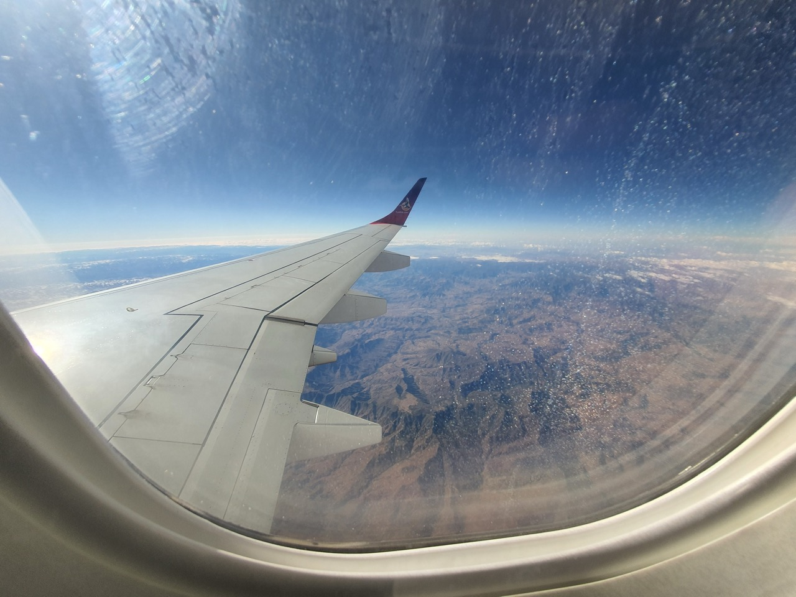
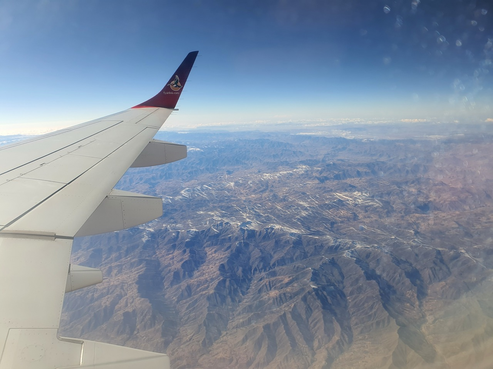
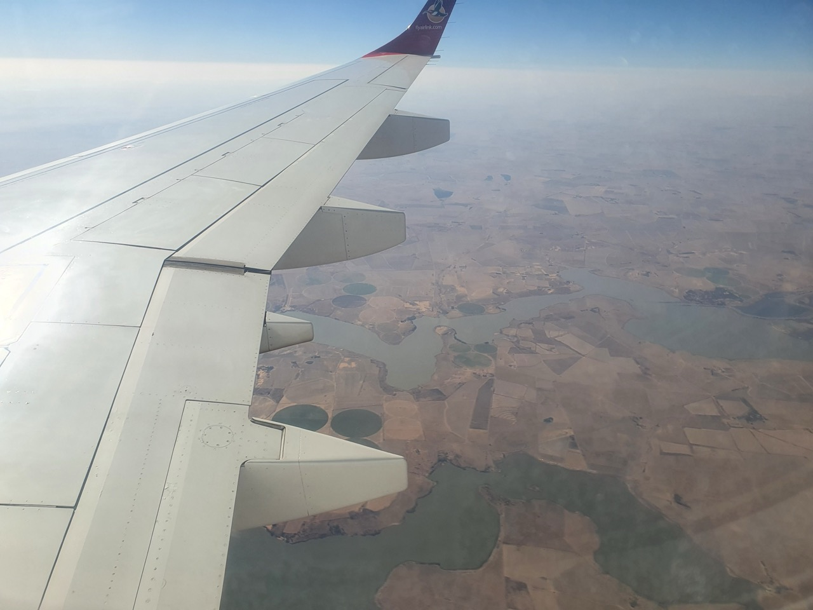

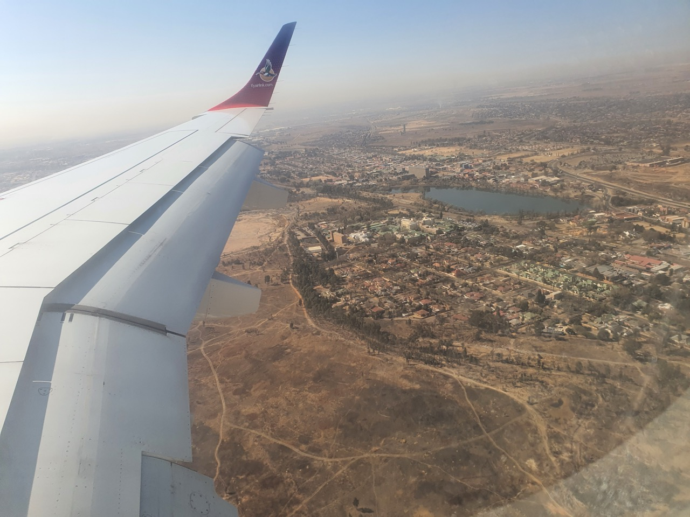

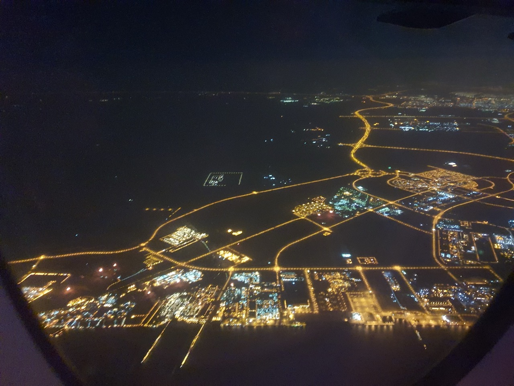
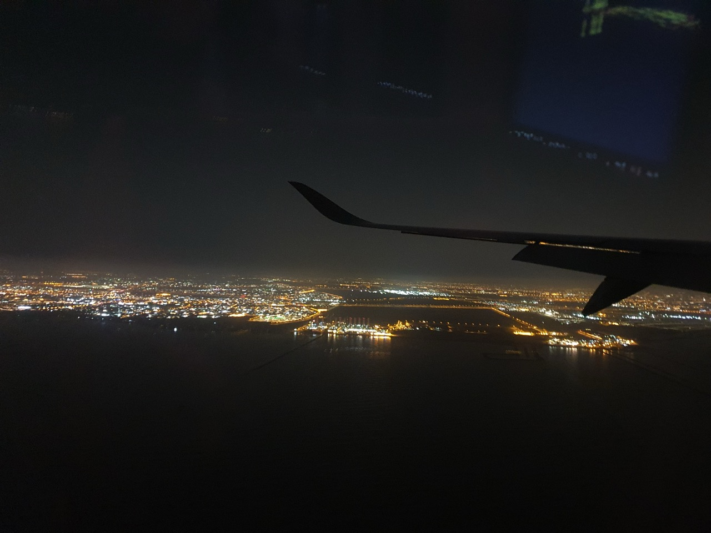

:::

###### 20:10 UTC+2

Залишилося 1,5 години до посадки в Досі, Катар 🇶🇦. Там ми проведемо близько 3 годин до наступного рейсу в Київ.  
Ще о 08:00 приземлимося в Києві, і нас восьмеро забере Sprinter, про що домовився один із членів нашої групи.

До речі, в Катарі часовий пояс UTC+3, як і в Україні, треба було б перевести час на телефоні.

Upd. Літак весь час потрясає в польоті, напевно, через неспокійні повітряні потоки, прямо як штормові океани.

##### 2021.08.20

###### 01:50

За 10 хвилин почнеться посадка в економклас на наш літак до Києва. Через 6 годин я буду в Україні, а через 12 — в Одесі^^

###### 08:34

Ну ось і приземлилися в аеропорту Бориспіль, пройшли паспортний і митний контроль і вирушаємо в Одесу)

:::3

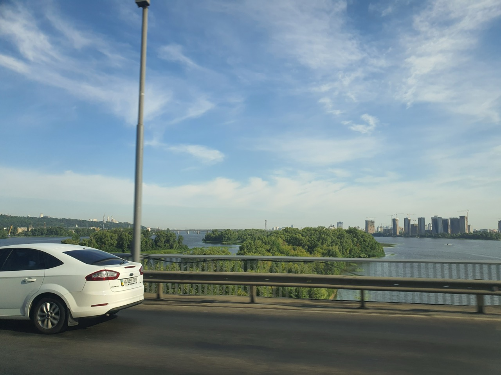
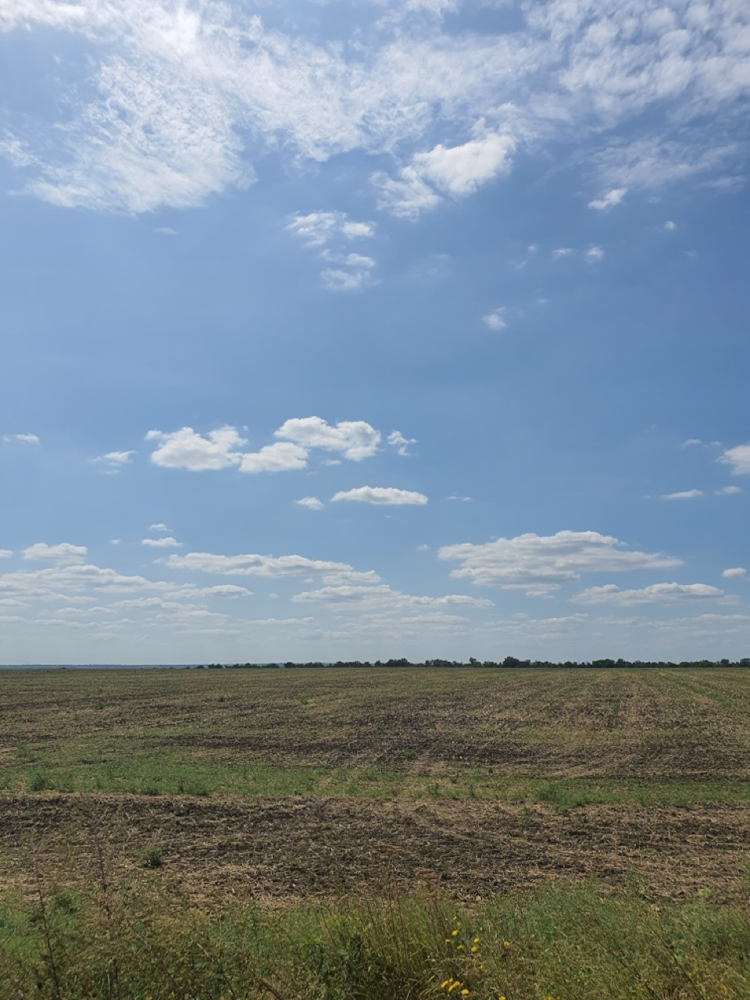

:::

###### 23:14

Дякую всім, хто стежив за моїми записами.

На цьому закінчується мій другий контракт Другого Помічника. Поки що я чекатиму пропозицій від компаній, щоб завершити оформлення документів.

Якщо у вас є скарги чи пропозиції щодо того, як я веду цей канал, будь ласка, опишіть їх у коментарях під цим дописом.

Отже, мої пригоди на моєму, сподіваюся, останньому рейсі завершилися, і я вирушив у новий світ — світ IT, де до людей ставляться як до людей, а не як до тварин.

Дякую, що прочитали.

Завжди ваш Кацу ❤️ 🦊
