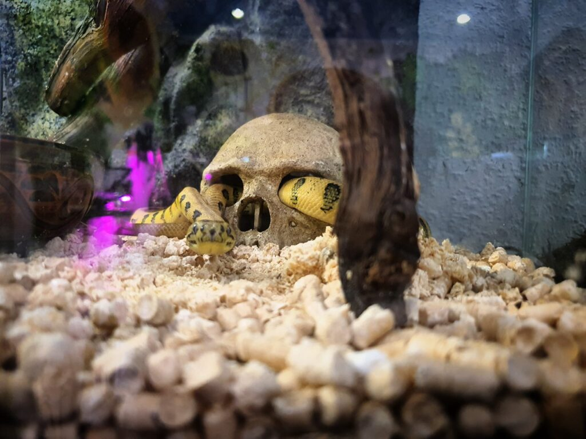
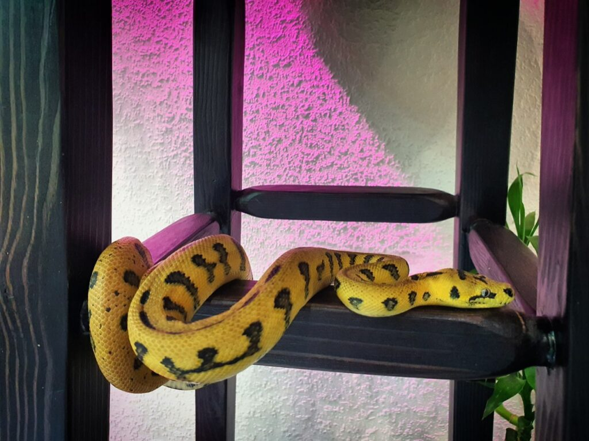
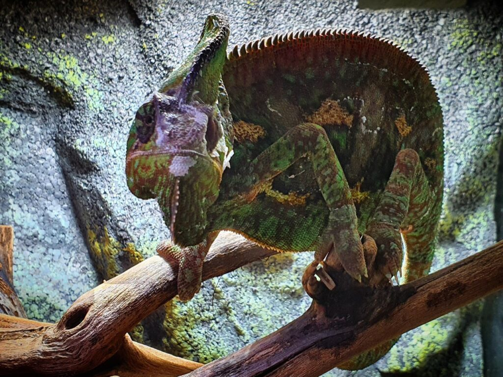
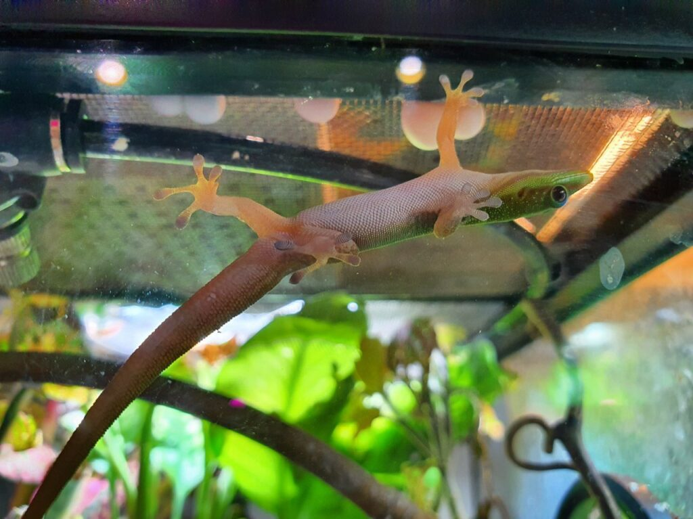
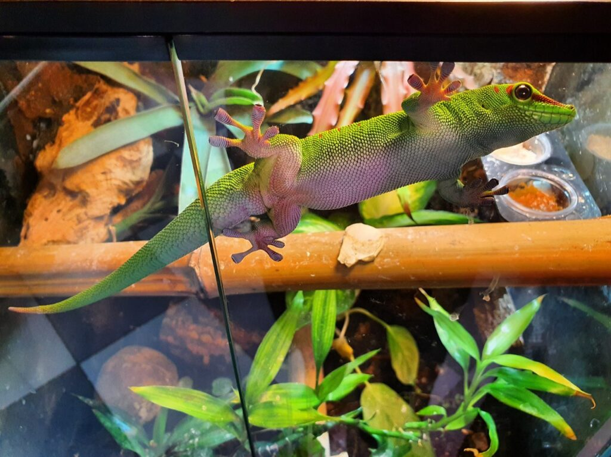
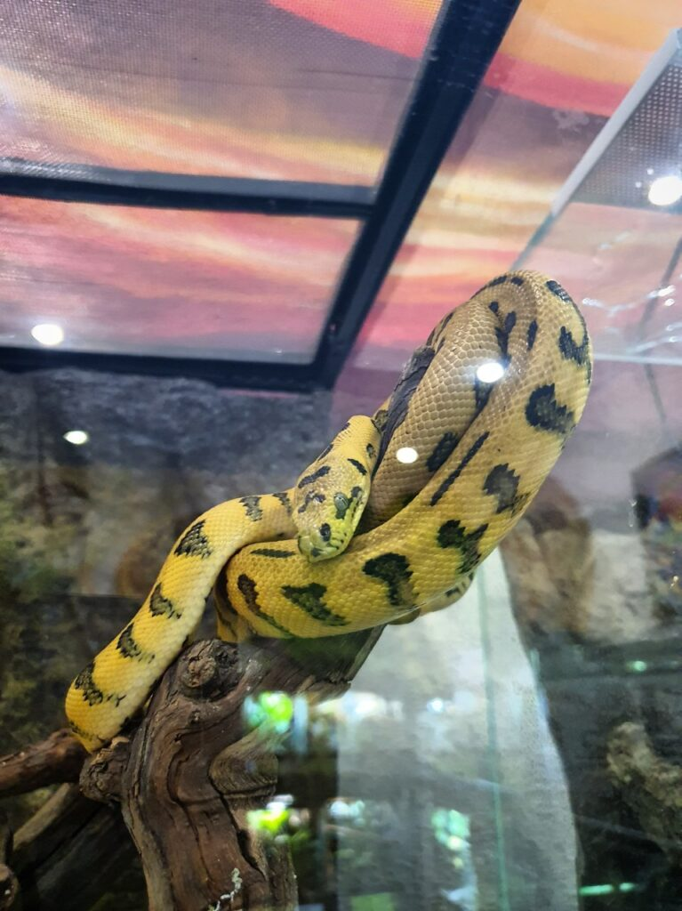
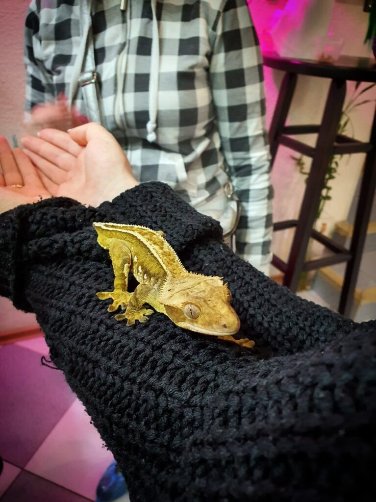
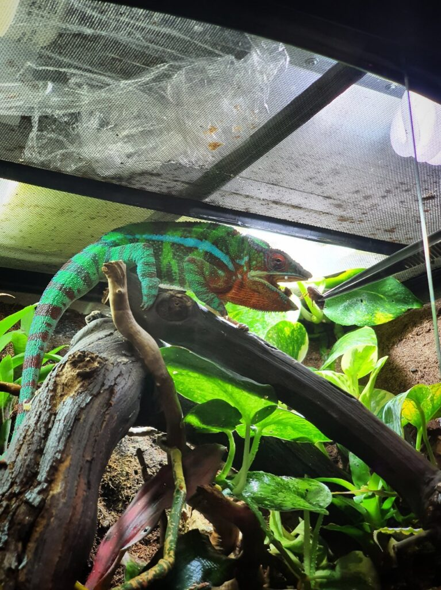

The following report from agent Katsu arrived.
Вітаю знову тут) Останні кілька тижнів я відпочивав від рейсу на Fortune Trader і приводив думки до ладу, а сьогодні з другом знову вибрався в кафе з рептиліями, [де я був](/other/19.11_odessa_rept_cafe), як виявилося, аж півтора року тому.
Багато змій і ящерів підросли, так само з'явилося значно більше тераріумів, один палюдаріум, і готуються до наповнення ще два. Палюдаріум - складна екосистема, яка являє собою акваріум і тераріум одночасно, там є і земля, і вода.
Кафе розширюється, і, як на мене, якщо ви живете в Одесі, або тут проїздом - його варто відвідати.
Нижче я додаю фотозвіт)

%%%3
  
  
  
  
  
  
  
  
  
  
  
%%%
