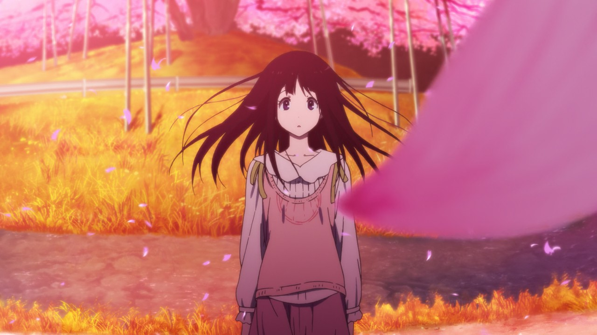

Нещодавно я почав переглядати деякі відносно старі аніме, і нагоду згадав класне аніме - Хёука.

Сюжет оповідає про лінивого хлопця, який "не стане робити що можна не робити, а якщо треба щось зробити - то зробить це швидко" - Орекі Хотару і дуже незвичайній дівчині з місцевого стародавнього роду - Читанде Еру.

Її чарівна фраза "Я хочу знати!" і чарівні фіолетові очі змушують нашого головного героя включати свої детективні здібності та розгадувати дрібні шкільні загадки одну за одною.

Зрештою вони, звичайно ж, закохуються одна в одну.

Як для 2012-го року в цьому аніме просто неймовірне малювання, яке дасть фору сучасним серіалам. Особливо малювання персонажів. Та й самі персонажі вийшли дуже живими.

Спочатку я навіть хотів тремтіти - але не зміг, хоча останнім часом тремтів дуже багато серіалів. А це щось означає)

Раджу звернути вам на нього увагу)

:::3

:::