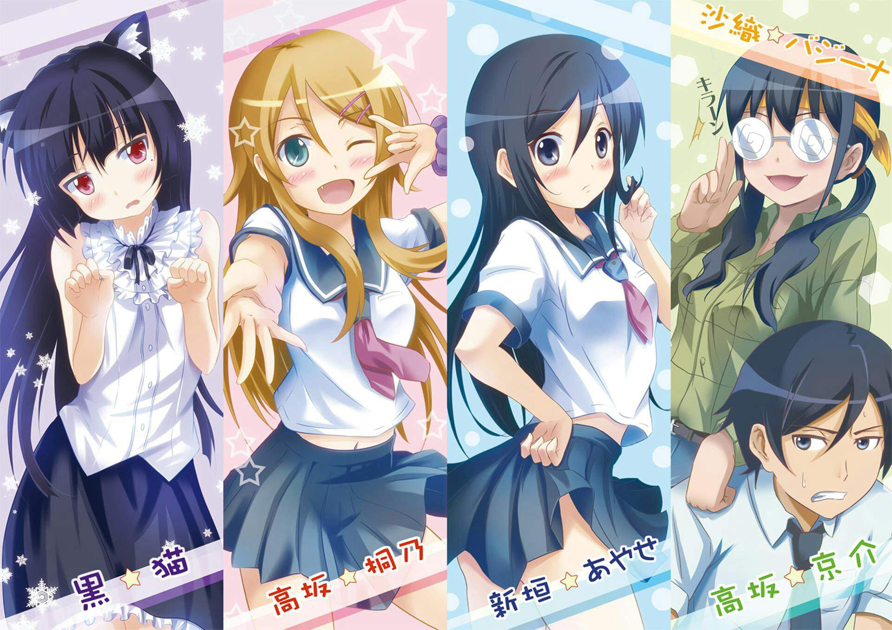

:::1

:::
I will continue my series of short anime reviews.

A few days before "Hyouka", I rewatched another series from 10 years ago - "OreImo" or "My Little Sister Can't Be This Cute".
This series spanned two seasons and was another star of school romances of its time.

In the opening scenes, we see the relationship between a brother and sister, where the sister doesn't even consider him as a human. Meanwhile, the girl, unlike her mediocre brother, is an excellent student, a model, an athlete, and just a beauty!

One day, she reveals her secret to her brother - she's passionate about anime, manga, and games, which is not welcomed by their strict father and Kirino's friends.

After that, Kyosuke, her brother, helps her to hide her hobby and in other matters, as well as find new friends.

Only by the end of the second season do we begin to understand why there was a rift in their relationship in childhood. During the anime, mediocre Kyosuke manages to be in a relationship twice, and is confessed to even more often, but in the end, he realizes who his heart belongs to.

The anime is quite cute, but it's more suitable for nostalgia for titles from the beginning of the 2010s than for watching from scratch.

:::1

:::