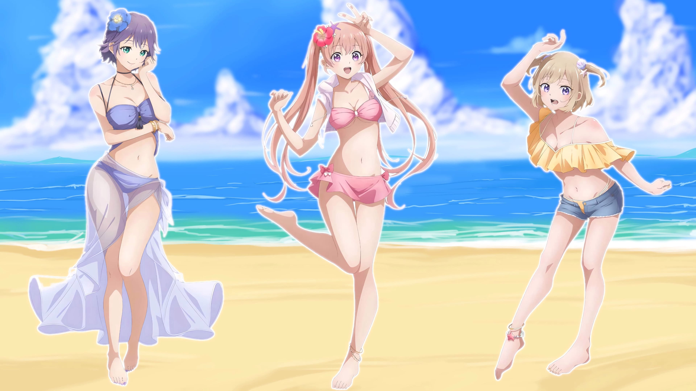

A cute romcom anime that I dropped for some reason a year ago - "Kakkou no Iinazuke". The plot revolves around a boy and a girl who were accidentally switched at birth, and now that their parents have found out... they've decided to marry them off to be both the parents of the adopted children and the biological ones at the same time.
Erika Amano - is the daughter of wealthy parents who are hotel magnates and an influencer on Instagram.
Nagi Umeno - is the son of owners of a small cafe, former bikers, and the brother of Sachi (Erika's biological sister). He's obsessed with studying and strives to be in first place on all tests.

:::1

:::