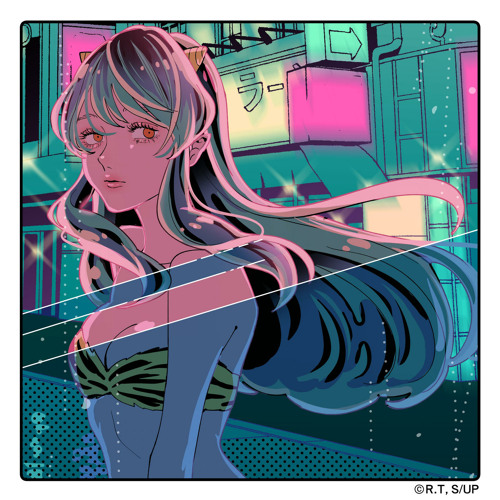

:::1

:::
Начал смотреть прошлогоднее аниме - ремейк Несносных пришельцев - классического “этти” из 80-ых, если можно так сказать. Это аниме - прародитель великой серии To Love Ru и жанра в принципе.

Новое аниме достаточно интересное и затягивающее, но что меня поразило - подборка музыки. Она тут прямо попала в мои вкусы. Прикладываю ссылки официальные creditless версии и версии от испольнителя опенингов и эндингов.

:::2

@{h-70}
@{h-70}

@{h-70}
@{h-70}
:::
:::2

@{h-70}
@{h-70}

@{h-70}
@{h-70}
:::