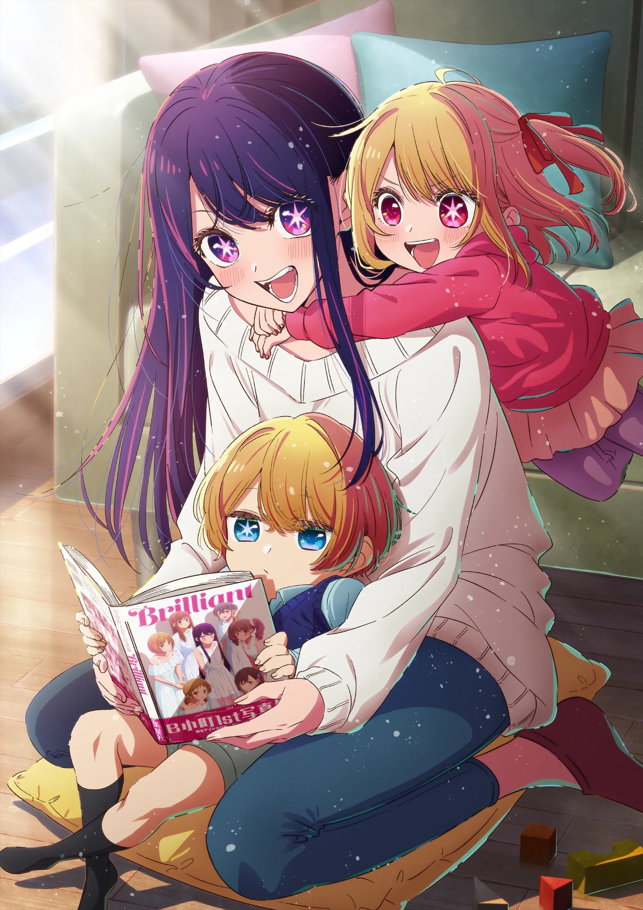

:::1

:::

This work is about the vicissitudes of life in modern Japanese show business. I can't carelessly call it just "anime" or "tittle". And it stands out from modern anime for many factors.

The first and most noticeable right from the start is the structure of the piece. The first episode is an hour and a half long film - a prequel to the subsequent ten episodes. It can even be watched separately as a feature-length film.

Next is the plot. There have been a lot of anime about idols, among them Idolmaster or Love Live, but Oshi no Ko shows the underside of show business with behind-the-scenes agreements, set-ups and bullying, not ideals in a vacuum.

Third, the characters here are really alive and... not typical? It's hard to apply one of the usual labels to them (tsundere, codere, etc). At the same time, each of the main characters is revealed little by little, giving insight into the motivations and experiences of the heroes and heroines.

The drawing - it changes from scene to scene. Sometimes, where it doesn't matter, the characters are drawn habitually lousy, but in the most important scenes the frame shines. Especially this work is notable for the unusual drawing of eyes, which just manifests itself in emotional scenes of strong feelings.

Opening - at first, even before watching the anime I did not like it, but with each episode, imbued with love for this work, it also became in its own way close to me. It was performed by YOASOBI - one of my favourite Japanese performers. I'll share the video in the comments of the post.

I've been putting off watching it for a very long time, because I don't like things that are hype, but this is the first anime in years that I didn't want to turn away from for a second and watched with rapt attention. And this will be the most anticipated second season for me.

There will be a hidden part under a spoiler, for those of you who are already a Smesharik.

Ai Hoshino's fate struck me hard. At first, in the first episode, I felt sympathy and empathy for her, as I think many people do. A bright, sparkling singer who is adored by everyone. I didn't think at all about her behaviour and many oddities, which only became apparent during Akwa's investigation of her son, and Akane Kurokawa's (Akwa's partner in the reality show) own investigation, who wanted to get into character.

A poor little orphan who knew no love and lived a lie, hoping that lie would one day become the truth. She really did put all of herself in without a trace.

Some people wrote that Ai didn't have time to develop as a character..... But I think that just looking at her - we would also see only a bright, beautiful, but false wrapper, just not understanding the true experiences of the girl.

Yes, the anime is not without mysticism, because Ai's children are reborn fans who loved her with all their hearts to the core, but it is based on this small detail).

The first season of the anime ends logically enough with the first concert and success for the young generation of B-Komachi, but the last episode is cut off in the middle and leaves everything hanging in the air, which leaves a slight unpleasant aftertaste and a desire for the urgent release of the sequel.

I don't know what else to write, but given that the emotions have made me write so much already - shows how worth it it is to watch this work.

:::3

:::

:::2

@{h-70}
@{h-70}

Anime Opening

Official Music Video

:::