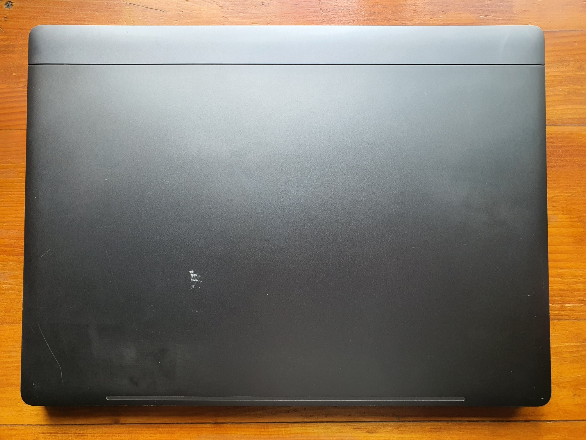
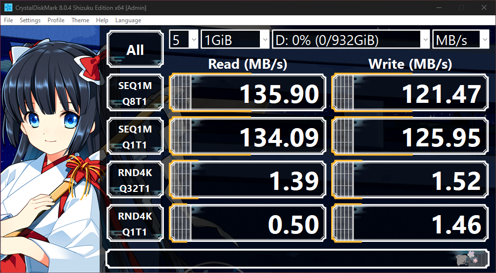
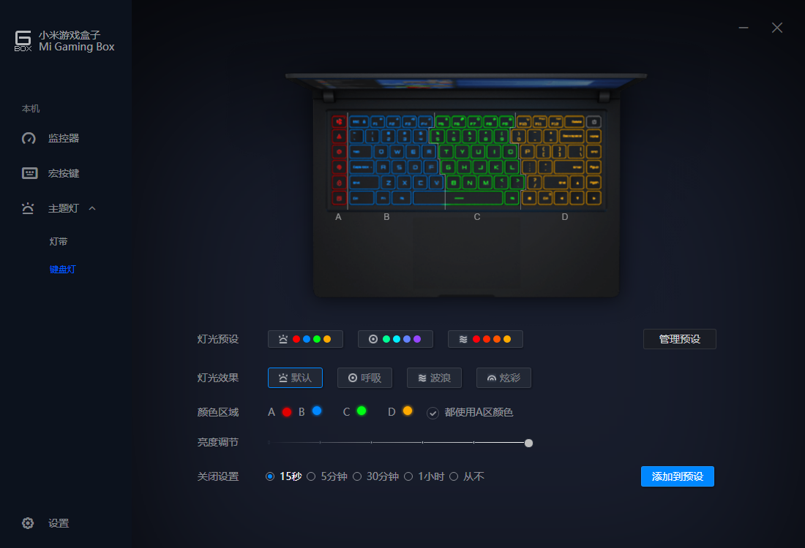
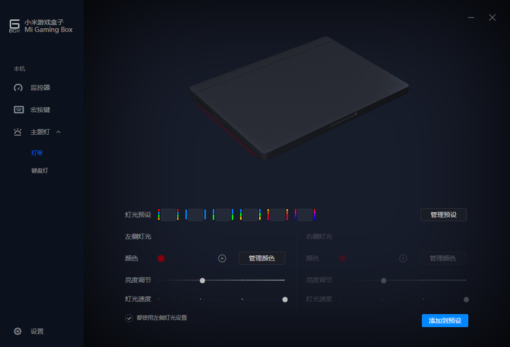
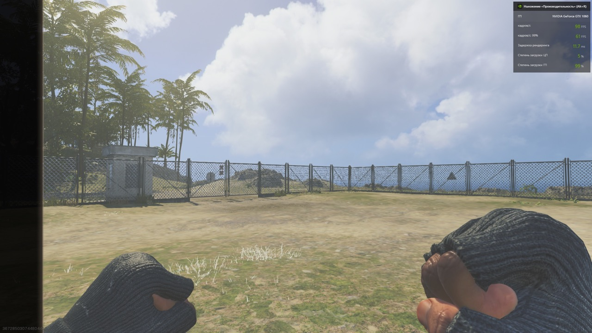
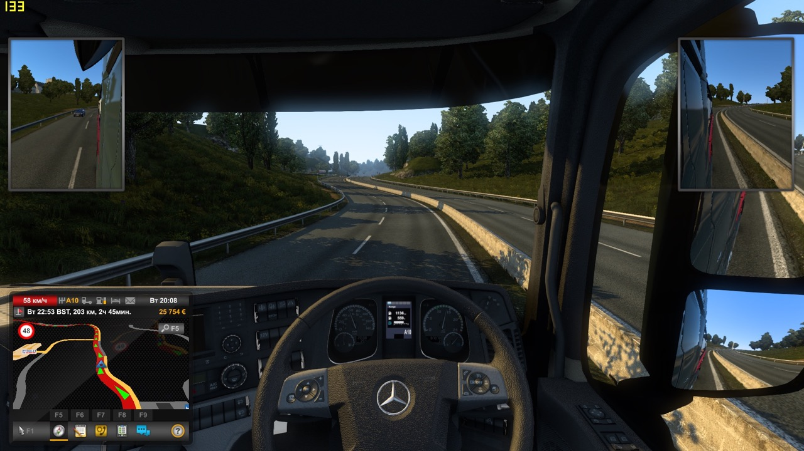
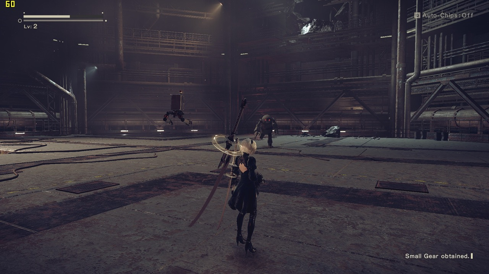
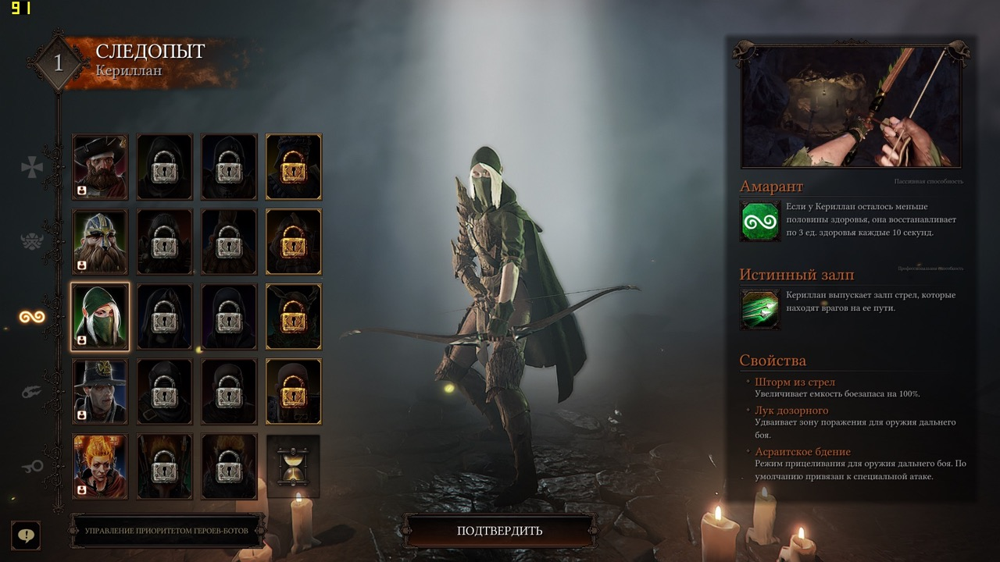
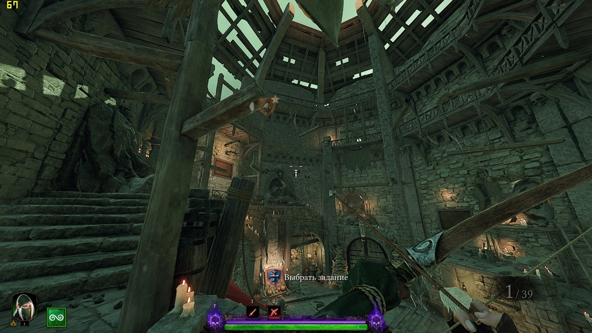
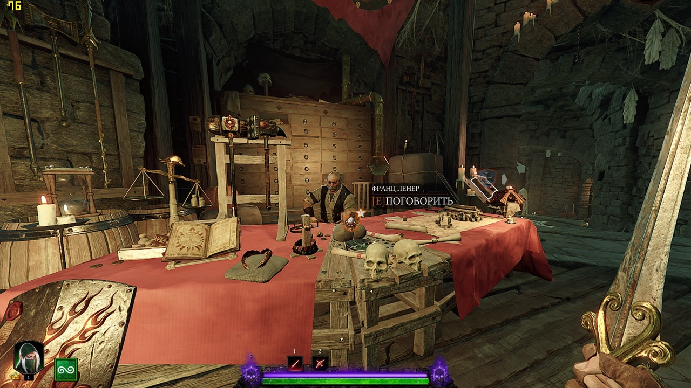

Я представляю вашій увазі ігровий ноутбук Xiaomi Mi Gaming Laptop (late 2018).

%%%2
  

  

    
Куплений у лютому 2019 року і служив сумлінно. Стан оцінюється десь на 4 із 5, як видно на фото. Легко тягне хіти минулих років на ультра-настройках: будь то The Witcher 3, Nier: Automata або Nier: Replicant. Підтримує VR; запускає Half-Life: Alyx та Skyrim VR на середньо-низьких налаштуваннях.

    
Переважно використовувався для веб-розробки, ігор було небагато.

    
Клавіатура має RGB-підсвітку, розділену на 4 зони, 5 макроклавіш, на які можна призначити будь-які дії, а також кнопку для увімкнення вентиляторів на максимальну швидкість.

    
RGB-підсвітка також є по боках корпусу.

    
У цілому, якщо вимкнути RGB-підсвітку, виглядає дуже стримано порівняно з конкурентами.

    
Має якісні мікрофони та вбудоване шумозаглушення, тому в голосових дзвінках працює краще, ніж гарнітура.

    
Особливість: HDMI-порт підключений напряму до дискретної відеокарти Nvidia для кращої продуктивності, а не до Intel, як зазвичай.

    
Продається у зв’язку з бажанням придбати потужніший комп’ютер. У комплекті оригінальна коробка та блок живлення.

    
Удачно продано, дякую за увагу)

  

%%%

## Характеристики

%%%2
  <dt>CPU</dt>
  <dd>Intel Core i7-8750H 2.2–4 ГГц (6 ядер / 12 потоків)</dd>
  <dt>iGPU</dt>
  <dd>Intel UHD Graphics 630 (GT2)</dd>
  <dt>dGPU</dt>
  <dd>NVIDIA GeForce GTX 1060 6 ГБ GDDR5 (192 bit)</dd>
  <dt>ОЗП</dt>
  <dd>16 ГБ (2×8 ГБ) Samsung M471A1K DDR4-2666 SDRAM (20-19-19-43)</dd>
  <dt>SSD</dt>
  <dd>256 ГБ NVMe 4×PCI-E 3.0 SAMSUNG MZVLB256HAHQ</dd>
  <dt>HDD</dt>
  <dd>1 ТБ SATA 3 Seagate ST1000LM048-2E7172</dd>
  <dt>Екран</dt>
  <dd>15,6" 16:9 IPS Full HD Panda LM156LF9L01 (матовий)</dd>
  <dt>Аудіочип</dt>
  <dd>Realtek ALC1220</dd>
  <dt>Порти</dt>
  <dd>4×USB 3.0, USB Type-C, HDMI, 3,5 мм mini-jack (окремо для навушників і мікрофона), RJ-45 Ethernet, кардрідер SD</dd>
  <dt>Батарея</dt>
  <dd>55 Вт·год SUNWODA G15B01W (знос 8 %)</dd>
  <dt>Розміри та вага</dt>
  <dd>365×265×20,9 мм, 2,7 кг (без блока живлення)</dd>
  <dt>Блок живлення</dt>
  <dd>180 Вт MA100000340388930CM4 (0,5 кг)</dd>
%%%
  
## Фото

%%%2
  
  
  
  
%%%

## Програми та тести

%%%2
  
  
  
  
  
  
  
  
  
  
  
  
%%%

## FPS в іграх

%%%2
  
  
  
  
  
  
  
  
  
  
  
  
  
  
  
  
  
  
  
  
%%%
