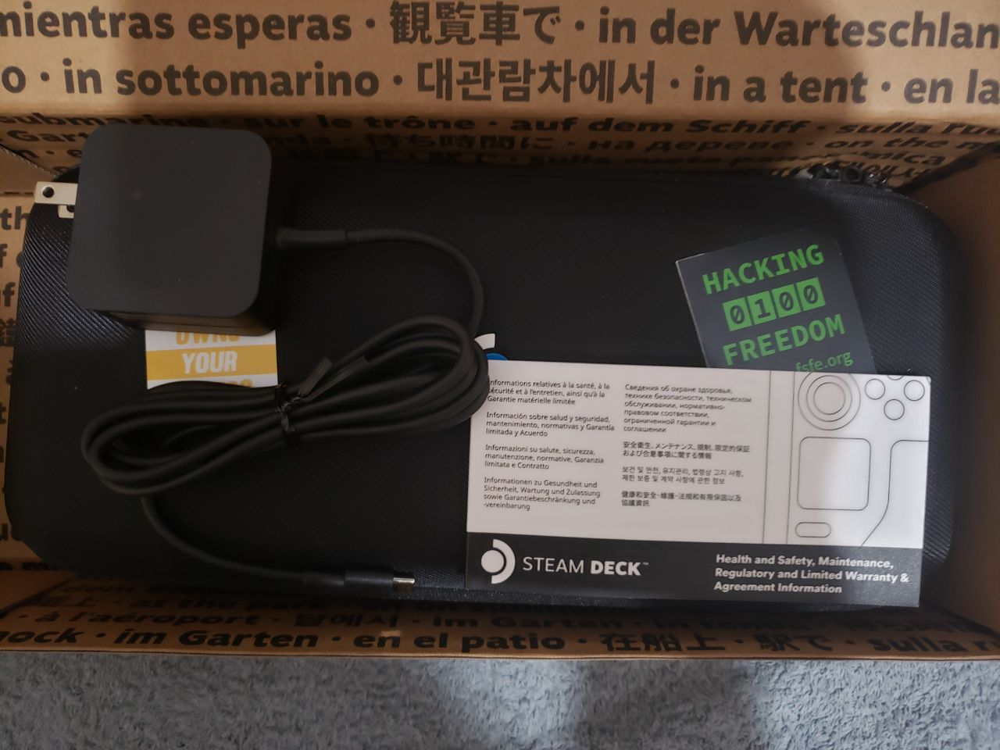
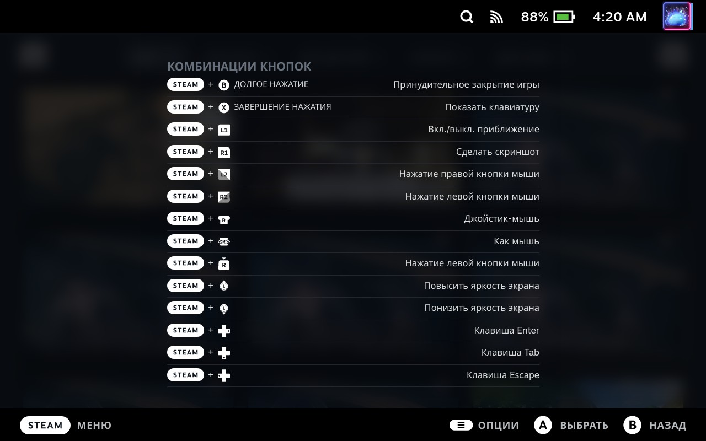

Першого грудня я став щасливим власником скандальної консолі від Valve. Оскільки я живу в країні, де Steam Deck недоступний для замовлення, мені довелося попросити хорошого друга придбати його для мене. Заявку в Steam було подано ще навесні, але друг зміг отримати та надіслати консоль лише ближче до кінця осені.

Але зараз із поставками все гаразд, і люди практично не чекають у черзі.

## Невеликий анбоксинг

Оскільки нові речі оподатковуються набагато більше, мій друг наддав консолі трохи поюзаний вигляд, аби уникнути державних зборів)

%%%3

%%%

## Характеристики

Не те щоб я не писав про них на кожному другому порталі в інтернеті, але все ж коротко нагадаю.

#### SoC

Steam Deck базується на оригінальному процесорі AMD з 4 ядрами / 8 потоками, вбудованою графікою Vega 8 та TDP 15 Вт.

#### ОЗП

16 ГБ оперативної пам’яті працюють у 4-канальному режимі та використовуються також для графіки.

#### Накопичувачі

У моїй версії встановлено SSD на 512 ГБ; також є версії на 256 і 64 ГБ. SSD не розпаяний, а формату M.2 2230, і його може замінити користувач (Valve цього не схвалює).

Є також слот для карт microSD, тому можна додати пам’ять до додаткового терабайта або тримати кілька карток.

#### Екран

Дисплей 7" має роздільну здатність 1280×800 з співвідношенням сторін 16:10. Для ігор на такому діагоналі цього роздільної здатності більш ніж достатньо, хоча до співвідношення сторін є питання. Деякі ігри не вміють із ним адекватно працювати й показують чорні поля, або гра рендериться на весь екран, а HUD — лише в області 16:9. Але це трапляється не дуже часто. Екран не найвищої якості й має підсвітки, але цілком непоганий.

#### Акумулятор

Акумулятор 40 Вт·год досить великий для портативного пристрою і наближається за ємністю до ноутбучних. Втім під час гри в AAA-проєкти споживання може сягати 23 Вт.

#### Порти

Порт USB Type-C можна використовувати як для заряджання, так і для підключення периферії, хабів, моніторів, зовнішніх дисків. Є також роз’єм 3,5 мм для навушників/колонок.

#### Елементи керування

Окрім стандартних для консолей стиків, хрестовини, триґерів і кнопок A, B, X, Y, тут є кнопки ззаду, як на елітних контролерах. Але одна з найцікавіших фіч — це тачпади з гаптичною вібрацією. Дисплей, звісно, також сенсорний.

Є окремі кнопки Steam — для керування магазином та більшістю шорткатів, а також кнопка “…”, яка відкриває меню, де можна обмежити TDP, частоту процесора та частоту оновлення екрану для економії енергії.

## Користувацький досвід

#### Ігри

На момент написання статті консоль у мене вже місяць. Я майже пройшов на ній Cyberpunk 2077 і часто граю у Hatsune Miku: Project DIVA Mega Mix+.

AAA-проєкти в середньому йдуть приблизно на 30 FPS на середньо-низьких налаштуваннях, а щось простіше може дотягувати й до 60 FPS.

%%%2

%%%

#### Стаціонарний режим

Консоль можна спокійно підключити до телевізора і використовувати будь-який бездротовий контролер (DualShock / DualSense / Xbox Controller), таким чином отримавши аналог PS4 за потужністю.

Деякі простіші ігри можна запускати з роздільною здатністю 1080p, але вищу роздільну здатність не раджу.

#### Режим робочого столу

У меню вимкнення можна знайти пункт “Перейти в режим робочого столу”, після натискання на який вас зустріне… KDE!

%%%1

%%%

Так, SteamOS базується на дистрибутиві Arch Linux з оболонкою KDE. Це відкрита операційна система, яка абсолютно не забороняє вам робити що завгодно.

Epic Games Store і GOG через Heroic Launcher? Легко.

Піратські ігри? Будь ласка!

Перед вами також відкрито величезну бібліотеку пакетів AUR (Arch User Repository), а консольна утиліта `yay` для встановлення програм із AUR уже передвстановлена. Хоча це важливіше для фанатиків, як-от мене)

Стисло кажучи — тут немає жодних обмежень для кінцевого користувача порівняно з закритими консолями від компаній на кшталт Sony, Microsoft і Nintendo.

#### Емулятори

Так, вони тут є, і їх тут багато, адже RetroArch доступний у магазині Steam. Хоча мені не дуже сподобався його інтерфейс.

Емуляція дуже старих консолей, включаючи Sony PSP, взагалі не викликає жодних проблем.

Ігри Nintendo Switch часто працюють у кращій якості та з вищою кількістю кадрів, ніж на оригінальній консолі (тільки нікому не кажіть, велика N дуже зла на цей факт).

Емулятори PS4 і PSVita ще в розробці, але для користувачів уже доступний емулютор PS3, з величезною кількістю класичних ігор свого часу.

#### Шорткати

У Windows/Linux чи macOS ми звикаємо до використання “гарячих” поєднань клавіш, щоб пришвидшити роботу. Консоль також має багато таких “шорткатів”, які значно спрощують роботу з пристроєм і роблять її приємнішою.

%%%1

%%%

## Підсумки

Консоль вийшла досить хорошою, і мені вона дуже сподобалася. Якісна збірка, достатня продуктивність, щоб замінити PS4, і габарити, що дозволяють взяти її з собою в дорогу. Акумулятор не вражає, але якщо в дорозі грати інді-проєкти, можна “витягнути” понад 6 годин.

Не можу сказати, що це обов’язково до придбання, але вона точно варта уваги кожного ґіка)
