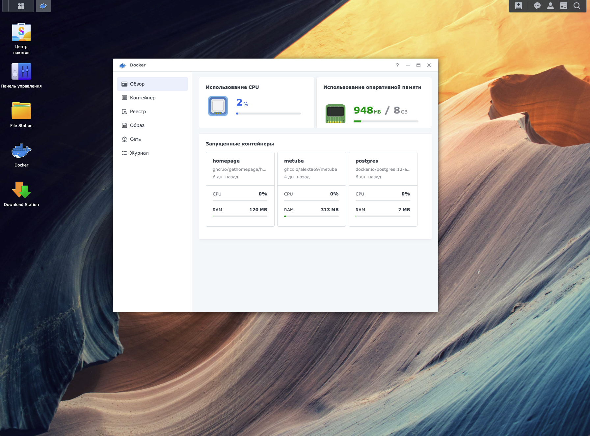

**I decided to create a more detailed addition to the post in my Telegram channel.**

So, I’ve long dreamed of having my own NAS server. I went through many iterations on the way to it: portable HDDs, connecting drives to an Orange Pi (a Raspberry Pi clone), and finally using a custom computer-switch. All these attempts had limited success and drawbacks. After several years of trying to build a server in a convoluted way, I realized it was time to stop.

I was also offered to just use a full-fledged PC for this, but that solution didn’t suit me either.

I needed the device to consume little power, be quiet, and still be reasonably performant. For me, that device turned out to be the Synology DiskStation 916+.

%%%2

%%%

This little guy is equipped with a quad-core Intel Pentium N3710 running up to 2.5 GHz and drawing up to 6 W, as well as 8 GB of DDR3 RAM.

It runs a special Linux distribution—DiskStation Manager (DSM)—developed by the device manufacturer. You can connect to it via SSH and use it like a simple Linux server, but it also has a very advanced web interface. It looks like a regular desktop OS.

The web interface also lets you run various applications:

%%%2

%%%

Yes, you can launch Docker containers, run any web applications, and connect flash drives or USB disks.

So far, I’m just getting familiar with it and learning something new all the time.
