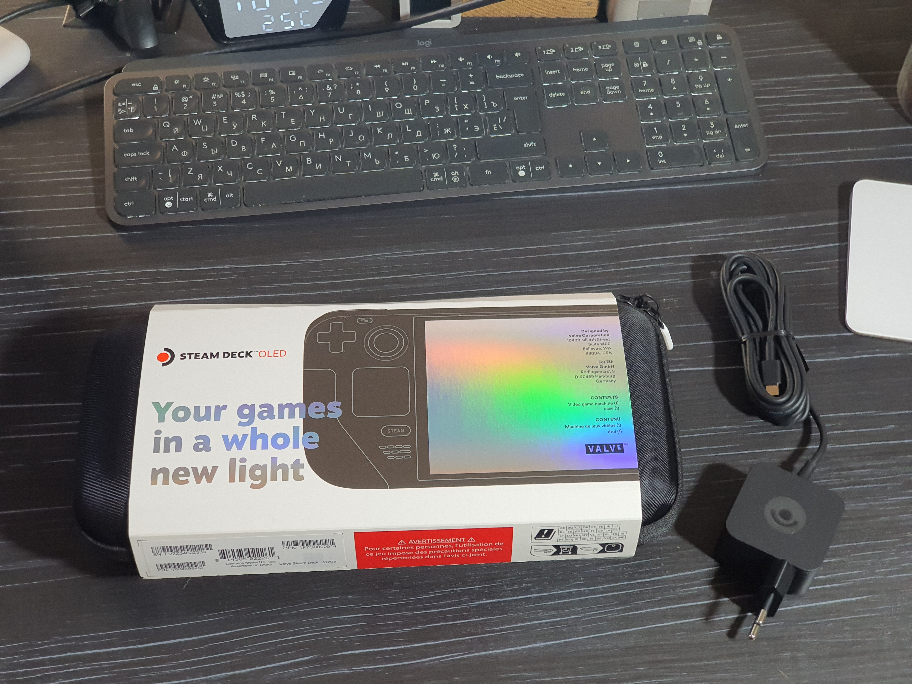
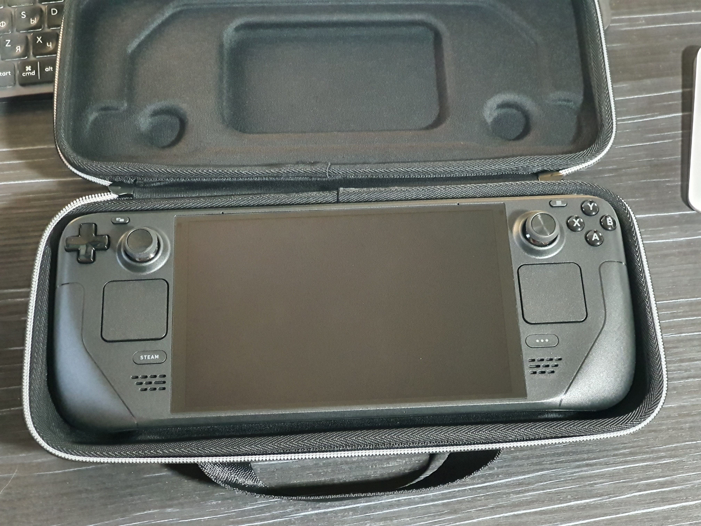

**After the release of the original Steam Deck, other companies began launching their own competitors. They featured more powerful processors and 1080p screens, but ran hotter and could barely last an hour on battery. Valve responded by saying that the Steam Deck platform will be with us for many years and they have no plans to release new higher-powered versions.**

But now, we have the Steam Deck OLED!

## A Little Unboxing

%%%3
  
  
  
  
  
  
%%%

Below are the console specifications as described on Valve’s website:

%%%3
  

  
Steam Deck

  
Steam Deck OLED

  
CPU

  
7nm Zen 2 4c/8t, 2.4–3.5 GHz

  
6nm Zen 2 4c/8t, 2.4–3.5 GHz

  
GPU

  
RDNA 2 8 CU, 1.6 GHz

  
RDNA 2 8 CU, 1.6 GHz

  
RAM Speed

  
16 GB LPDDR5 4-ch 5500 MT/s

  
16 GB LPDDR5 4-ch 6400 MT/s

  
Storage

  
64 (​eMMC) / 256 / 512 

  
512 / 1024 

  
Display

  
IPS 7″ 1280×800 400 nits 60 Hz

  
HDR OLED 7.4″ 1280×800 1000–600 nits 90 Hz

  
Bluetooth

  
5.0

  
5.3, separate antenna

  
Wi-Fi

  
2.4 GHz & 5 GHz, 802.11a/b/g/n/ac

  
2.4 GHz, 5 GHz & 6 GHz, 802.11a/b/g/n/ac/ax

  
Battery

  
40 Wh

  
50 Wh

  
Playtime

  
2–8 hours

  
3–12 hours

  
Power Adapter

  
45 W Type-C PD 3.0

  
45 W Type-C PD 3.0

  
Power Cable Length

  
1.5 m

  
2.5 m

  
Weight

  
669 g

  
640 g

  
  
Dimensions

  
298 × 117 × 49 mm

  
298 × 117 × 49 mm

%%%

It seems like they just improved a little bit here and there, and to some extent that’s true—but no, they actually improved absolutely everything!

## Impressions

### Screen

The original Steam Deck’s display was, to put it mildly, mediocre. Low contrast, uneven backlighting with visible bleed, an air gap between the screen and the glass, and large bezels all around.

Even the raw specs tell us that the screen has changed significantly, but in person it’s even better. On paper, the screen only grew by 0.4″, but that extra size was exactly what was missing. Brightness, contrast, and color saturation are all superb.

I also have to mention the increased refresh rate. For AAA titles, this is almost irrelevant, since they typically run at around 30–45 FPS. But in lighter titles—like indie games or my favorite Hatsune Miku: Project Diva Megamix+—the higher refresh rate feels very smooth and easy on the eyes.

### Performance

I will post detailed game benchmarks separately, but I can note that the console feels more responsive, wakes from sleep more quickly, and switches to desktop mode faster. Some of this could be due to software optimizations.

I’m not entirely sure, but it seems to me that microSD write speeds have improved as well—though I can’t compare directly with the old Deck anymore.

### Cooling System

Here is where the main overhaul took place! They moved to a smaller process node for the APU, so it generates less heat, causing the fan to spin up less frequently. The heatsink and fan assembly have also been redesigned so that even at maximum speed, the fan is much quieter than before.

### Haptics and Feel

Many changes have been made in this area as well. The L1/R1 buttons now click more crisply. The touchpads feel closer to Apple’s Magic Trackpad—they barely flex and provide much more precise haptic feedback. The thumbsticks have slightly taller rims, so your finger settles neatly inside. Overall, the console feels more solid in hand, and, thanks to the lower weight, more comfortable. Yes, that 50 g difference is really noticeable!

### Other Changes

Briefly, I’ll mention battery life and audio. The battery capacity is larger despite the reduced weight, and you really notice how much longer it lasts (excluding heavy AAA usage). The speakers are louder now, though sound was not a weak point of the original Deck.

As for the interface—nothing has changed. It’s the same SteamOS with Steam Big Picture and KDE, so there’s no new learning curve.

This time, Valve showed what a true mid-generation console update should be—unlike “Slim” variants that merely shave off a bit of weight or power consumption.

### Pricing

I also want to highlight Valve’s very consumer-friendly pricing.

At launch, the original Deck’s prices were:

`LCD 64 GB – $399, 256 GB – $549, 512 GB – $649`

At the time of writing, prices are:

`LCD 256 GB – $399, OLED 512 GB – $549, 1 TB – $649`

They also discounted the remaining older models:

`LCD 64 GB – $349, 512 GB – $449`

In other words, they didn’t raise the price for the new version; instead, they lowered the price of the old one! Valve seems to treat customers like people. There is also a special limited edition 1 TB model with a dark-transparent shell, but I’m not sure of its price.

%%%2
  
  
%%%

### Conclusion

In summary, I can say that this update is worth every dollar, and if you have the means, don’t hesitate to pick one up.
