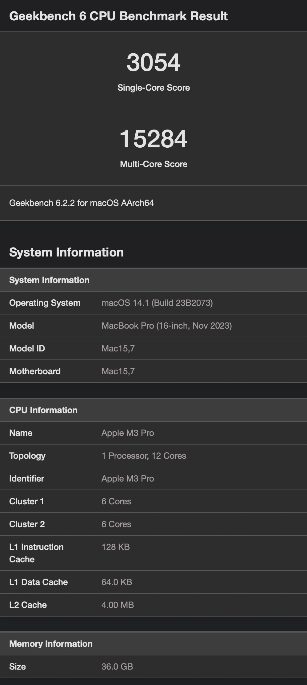
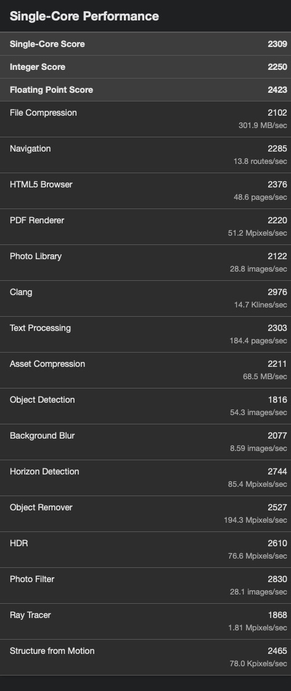
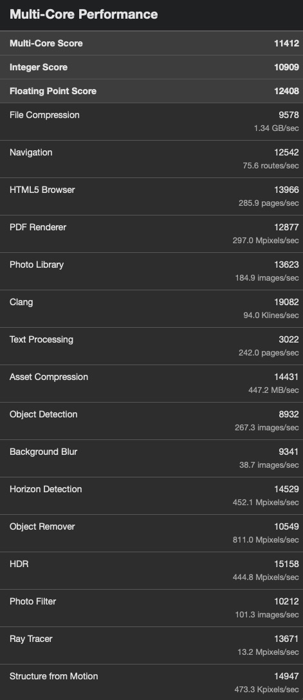
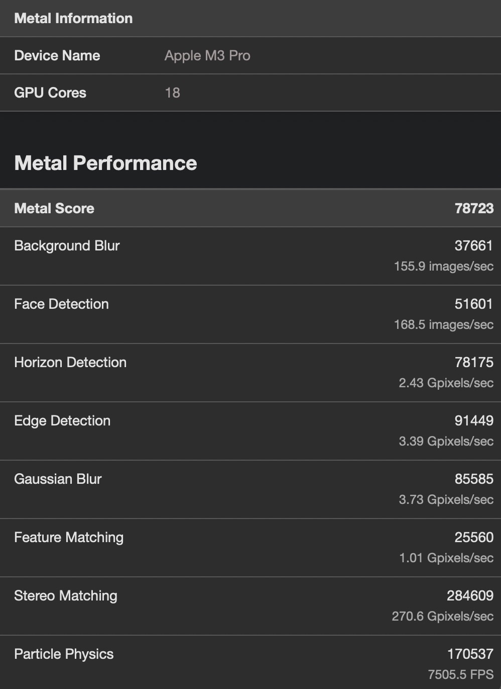
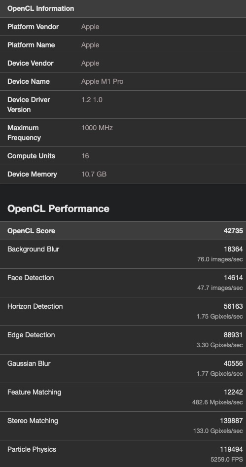
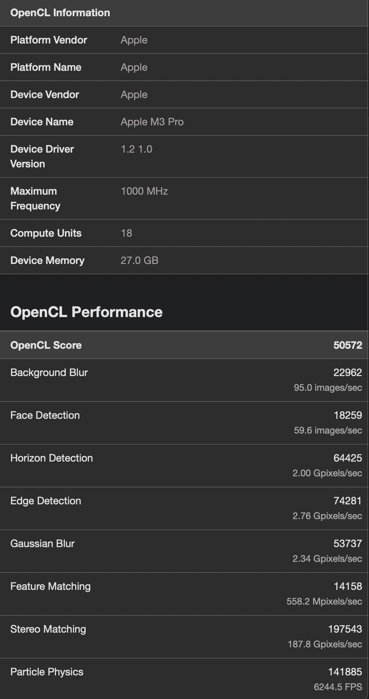
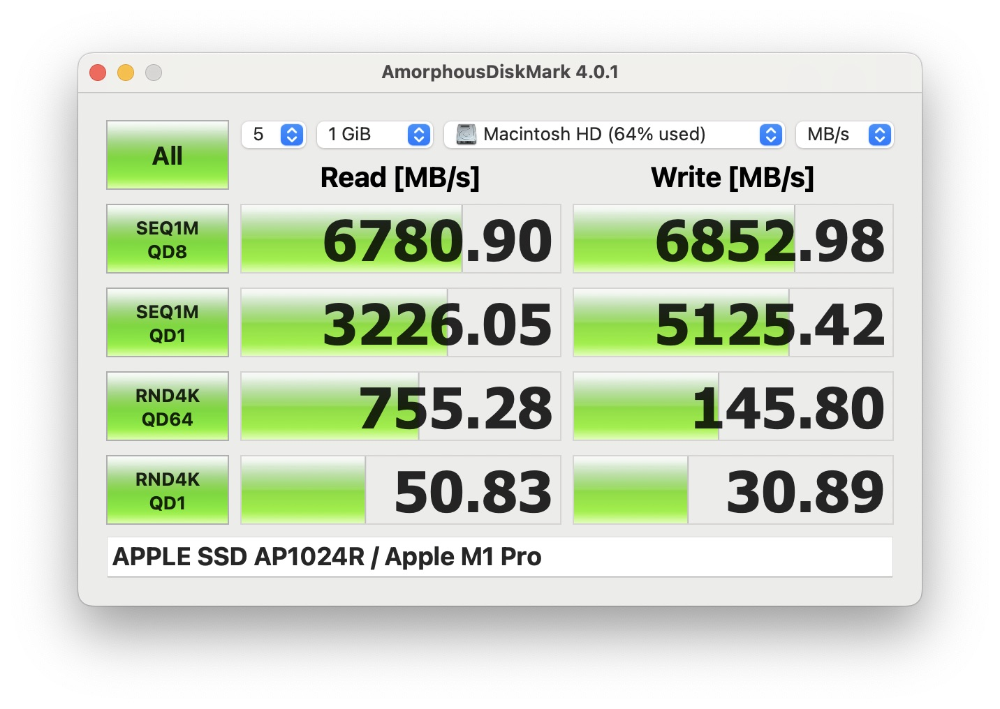
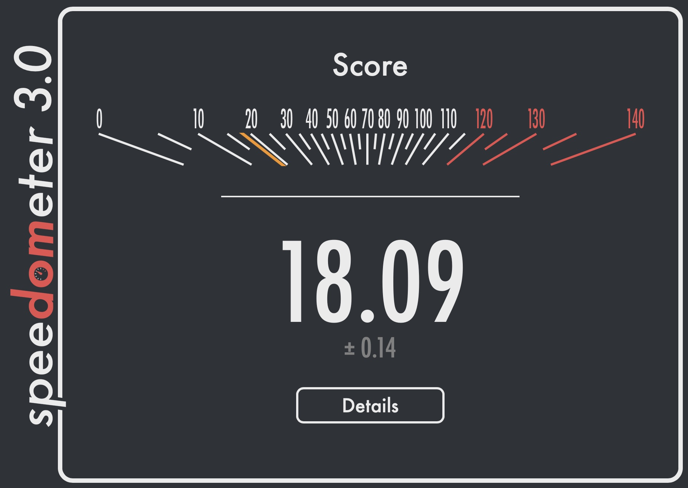

## Geekbench 6

:::2

  
MacBook Pro 2021

  
MacBook Pro 2023

  
  
  
  
  
  
  
  
  
  

:::

## Amorphous Disk Mark

:::2

  
MacBook Pro 2021

  
MacBook Pro 2023

  
  

:::

[Link to the benchmark](https://apps.apple.com/ua/app/amorphousdiskmark/id1168254295)

## Amorphous Memory Mark

:::2

  
MacBook Pro 2021

  
MacBook Pro 2023

  
  

:::

[Link to the benchmark](https://apps.apple.com/ua/app/amorphousmemorymark/id1495719766)

## Browserbench Speedometer 3.0

:::2

  
MacBook Pro 2021

  
MacBook Pro 2023

  
  

:::

[Link to the benchmark](https://browserbench.org/Speedometer3.0/)

## Mozilla Kraken

:::5

  
TEST

  
M3Pro

  
M1Pro

  
COMPARISON

  
DETAILS

  
ai

  
115.3ms +/- 10.4%

  
135.5ms +/- 0.8%

  
*1.175x as slow*

  
significant

  
– astar

  
115.3ms +/- 10.4%

  
135.5ms +/- 0.8%

  
*1.175x as slow*

  
significant

  
audio

  
98.6ms +/- 1.1%

  
128.2ms +/- 0.9%

  
*1.30x as slow*

  
significant

  
– beat-detection

  
26.0ms +/- 1.8%

  
32.8ms +/- 2.3%

  
*1.26x as slow*

  
significant

  
– dft

  
28.9ms +/- 1.8%

  
39.1ms +/- 1.0%

  
*1.35x as slow*

  
significant

  
– fft

  
16.9ms +/- 4.2%

  
22.1ms +/- 2.4%

  
*1.31x as slow*

  
significant

  
– oscillator

  
26.8ms +/- 1.1%

  
34.2ms +/- 1.6%

  
*1.28x as slow*

  
significant

  
imaging

  
79.0ms +/- 1.6%

  
106.3ms +/- 0.8%

  
*1.35x as slow*

  
significant

  
– gaussian-blur

  
27.0ms +/- 3.5%

  
35.6ms +/- 1.0%

  
*1.32x as slow*

  
significant

  
– darkroom

  
27.4ms +/- 1.3%

  
36.0ms +/- 0.0%

  
*1.31x as slow*

  
significant

  
– desaturate

  
24.6ms +/- 2.0%

  
34.7ms +/- 1.7%

  
*1.41x as slow*

  
significant

  
json

  
16.0ms +/- 0.0%

  
20.0ms +/- 2.4%

  
*1.25x as slow*

  
significant

  
– parse-financial

  
8.2ms +/- 3.7%

  
9.7ms +/- 3.6%

  
*1.183x as slow*

  
significant

  
– stringify-tinderbox

  
7.8ms +/- 3.9%

  
10.3ms +/- 4.7%

  
*1.32x as slow*

  
significant

  
stanford

  
65.4ms +/- 1.1%

  
85.2ms +/- 1.0%

  
*1.30x as slow*

  
significant

  
– crypto-aes

  
19.4ms +/- 2.6%

  
25.7ms +/- 2.3%

  
*1.32x as slow*

  
significant

  
– crypto-ccm

  
14.8ms +/- 2.0%

  
19.6ms +/- 2.5%

  
*1.32x as slow*

  
significant

  
– crypto-pbkdf2

  
21.7ms +/- 1.6%

  
27.9ms +/- 1.5%

  
*1.29x as slow*

  
significant

  
– crypto-sha256-iterative

  
9.5ms +/- 4.0%

  
12.0ms +/- 0.0%

  
*1.26x as slow*

  
significant

  
** TOTAL **

  
374.3ms +/- 3.1%

  
475.2ms +/- 0.3%

  
*1.27x as slow*

  
significant

:::

[Link to the benchmark](https://mozilla.github.io/krakenbenchmark.mozilla.org/)
