In this series of posts, I will describe my journey, during which I am taking a break from my first officer voyage. The trip consisted of the following cities:

- Lviv
- Prague
- Ústí nad Labem
- Dresden
- Salzburg
- Munich
- Prag

##### 2018.07.06 20:15

Good evening, my dear friends)  
I didn’t rename the channel to “Traveler’s Diary” for nothing, so now I’ll share with you a report of my little trip from last weekend)

##### 2018.07.07

###### 02:40

Sorry for the lack of photos, to be honest, I forgot)  
Today Katsu set off on a new journey, and here he is on his way to Lviv) I’ll try to keep you updated on what’s happening)

###### 07:00

Good morning everyone, Katsu is already approaching Lviv, and—just as my relatives told me—the conductor woke me up exactly one hour before disembarkation, minute by minute.

###### 08:00

Hello, Lviv, the night express with Katsu has arrived)

###### 22:30

Today was a tough day 😂  
Katsu is sitting in the hostel, sipping tea and watching some soccer  
Today we, along with the Nyan-crew participants, walked over 20 km around Lviv.  
It all started with me saying goodbye to my compartment neighbor from Ireland, with whom I’d chatted in English for a long time, and then I met the Inquisitor. We headed to the hostel that I had booked, and I was surprised to find that the reservation had been canceled and the room was taken… The confrontation led nowhere, so I was just lucky to find another hostel. It’s a minute’s walk from the Opera House)  
After that, we went to an interesting place where they serve coffee by setting it on fire with a flamethrower (Kopalnia Kawy).  
Then breakfast, and another person joined us, so we became four)  
We visited the city hall and climbed all the way to its top.  
Next, we climbed two hills and took a short walk through the huge park located right in the city center. Now I’m resting and waiting for tomorrow; it promises to be no easier)

%%%2

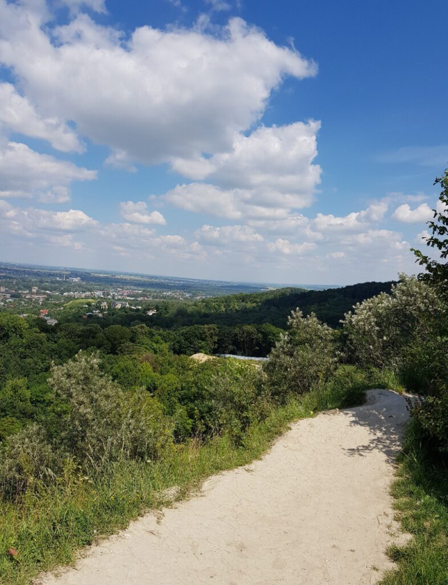
%&12
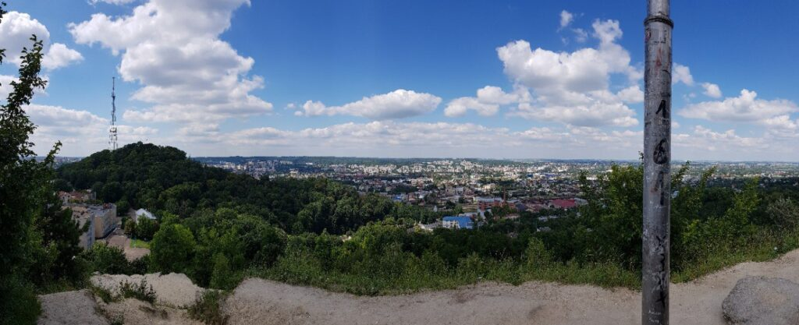
&%
%%%

##### 2018.07.08 00:10

Damn it, I believed in victory until the last minute. Respect to the national team, they did great)

%%%2

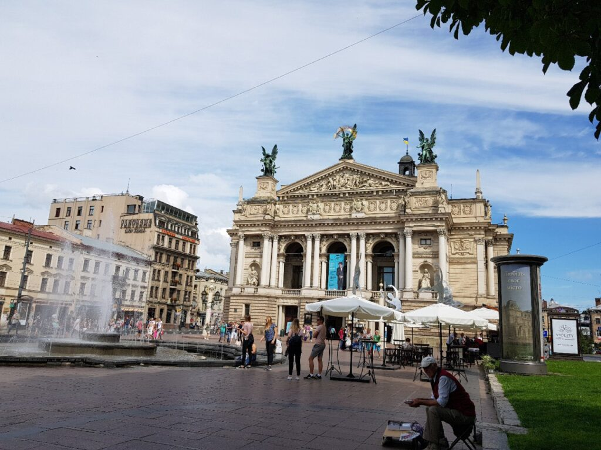
%%%

##### 2018.07.08 23:50

And today has come to an end)  
Today, after breakfast at the decent Tsisar Café near the hostel, we (again the four of us) went on a picnic to… God knows where 😂😂 we walked for a very long time along an abandoned railway line out towards the suburbs and ended up at a spot near a large railway bridge with a stream nearby. Colins brought with him… a CELLO, YES! But an electronic version, which is much more compact. I also saw a rather interesting musical instrument called a kalimba. The sausages roasted over the fire with similar bread and baked potatoes were simply wonderful)  
In the end, it turned out that there was a shortcut we could have taken, which we used on the way back. After that we spent a long time cracking jokes in front of the Opera House)  
After dinner, I went to the hostel where, unlike yesterday’s football atmosphere, it’s very quiet today.  
Well, oyasuminasai, nyashi)

%%%3
%&13

&%
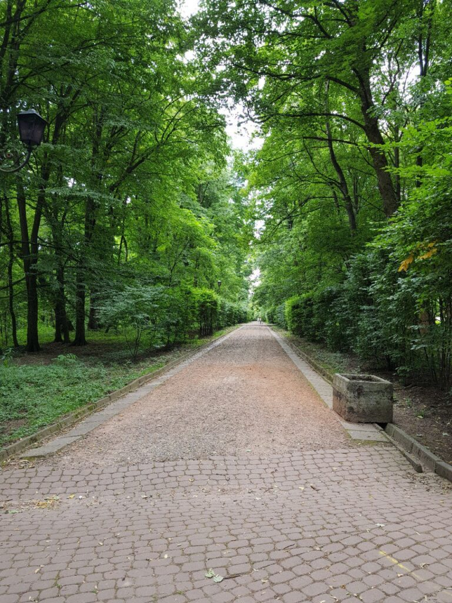
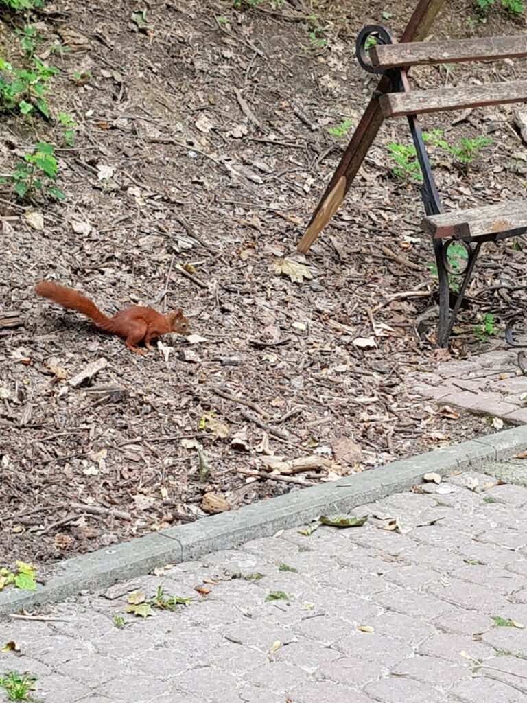
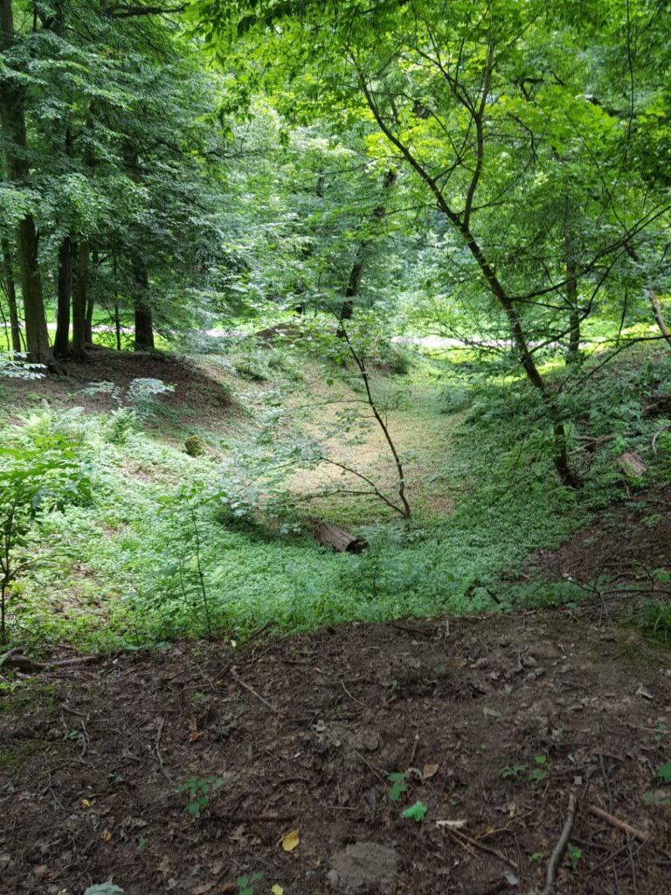

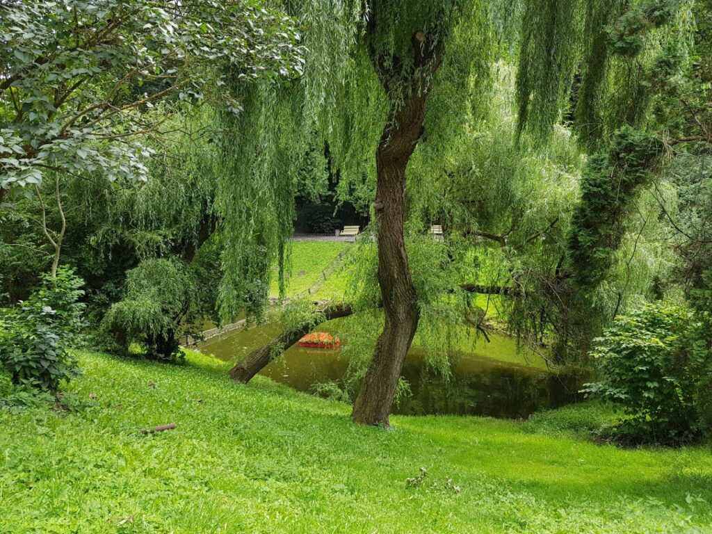
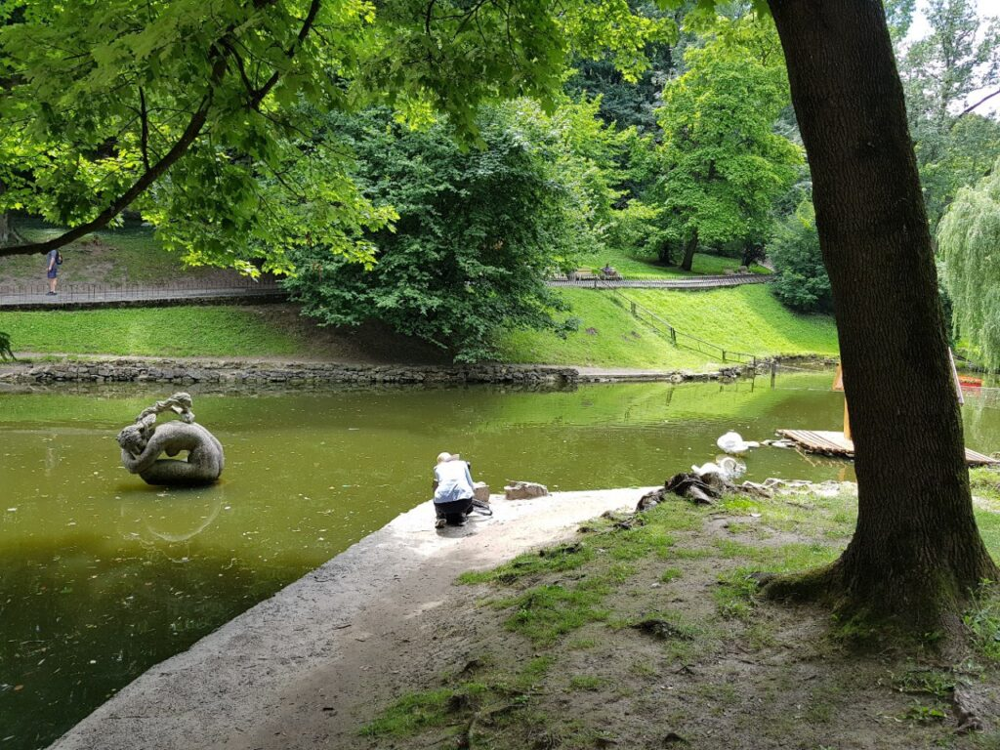
%&13

&%
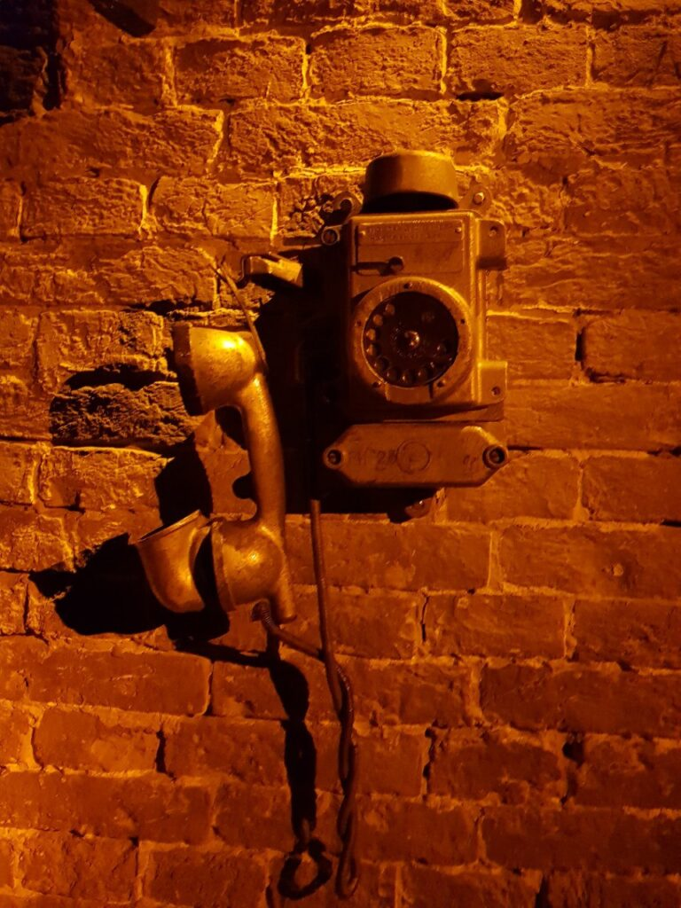

!r2

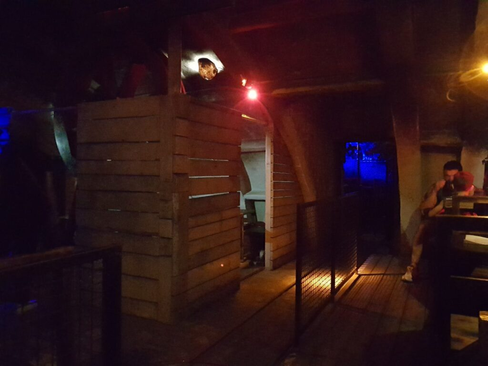

%&13

&%

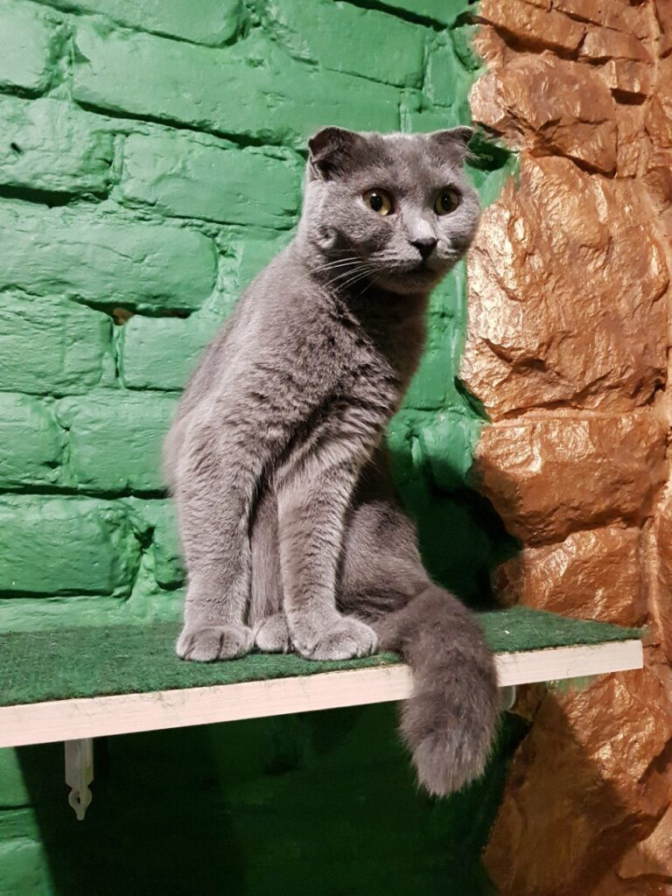
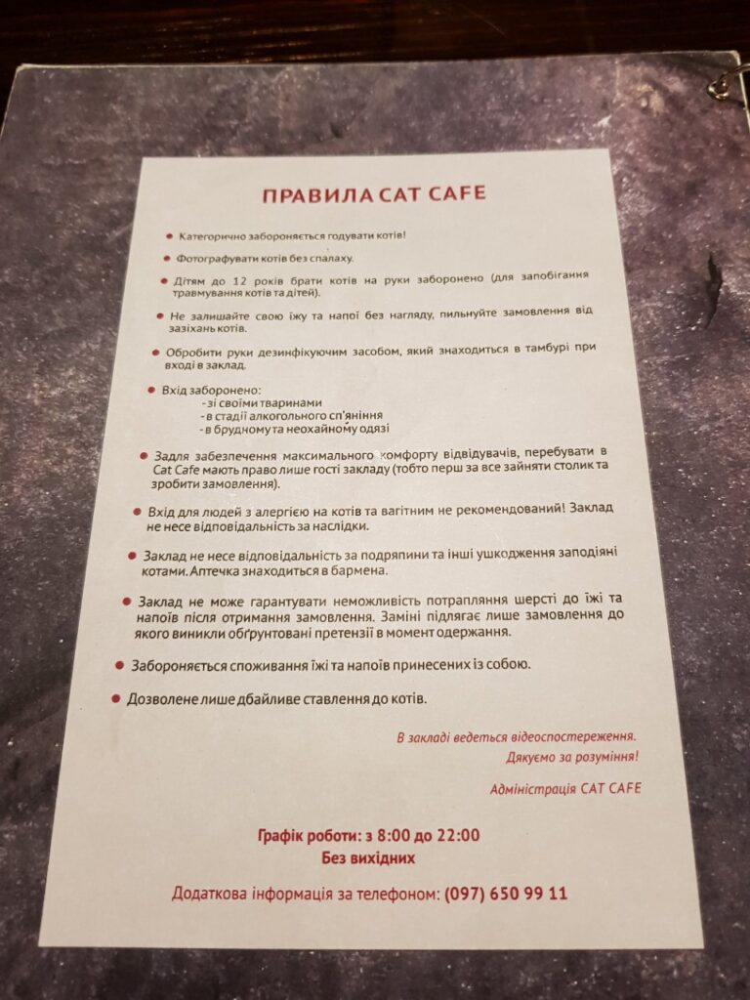
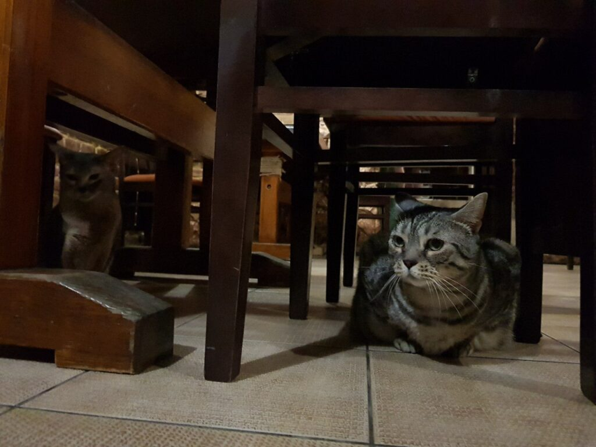

%%%

##### 2018.07.09 23:55

Today was much calmer; I strolled through Stryiskyi Park, eating raspberries—it's really large, like Sofiivka, probably. Though not as big as Kaiserwald, which we explored over the past two days. After that, I visited a wonderful place called a cat café. Even though the staff and people there probably got tired of the cats, it was still awesome)

##### 2018.07.11

###### 11:00

Good morning, nyashi)  
And so, Katsu has left his temporary abode, Antihostel Forest. A very cute place right next to the Opera House.  
Today at 22:00, the bus to Prague will be waiting for me, so my stay in this interesting city is almost over)  
I want to thank my local friends very much for their warm hospitality and wonderful time)

###### 20:50

Today Katsu visited Lviv’s aquapark, thus opening his swimming season.  
In Lviv… in an aquapark… 😂😂😂  
Everything was very cool—I swam 300 m in the sports pool, slid down awesome water slides)  
And now I’m at Lviv’s train/bus station waiting for the bus, which should arrive in about an hour or earlier. Today my journey will continue and I have to leave this interesting and pleasant city(  
I really enjoyed my time here)

###### 21:45

Katsu has boarded the bus! Katsu is very pleased, and judging by the bus, it’s like amazing here, nothing like Ukrainian ones)

###### 22:10

Goodbye, Lviv, thank you all)
