Выехав на автобусе из Львова мы отправились в Прагу через Польшу, Краков, как на нем написано.
Львов - Краков - Богумин (пересадка на ЖД) - Прага

##### 2018.07.11 23:25

Тем временем Кацу приближается к польско-украинской границе

##### 2018.07.12

###### 00:05

Стоим и ждём своей очереди на прохождение погран контроля

###### 02:45

3 часа мы простояли и мы только зашли на украинскую таможню…

###### 06:20

И вот, нога Кацу впервые ступил на европейскую землю (несколькочасовое стояние напротив тюрьмы в Англии мы опустим))
Ну, разница в дорогах чувствуется сразу, пятая точка посылает респект дорогоукладчикам)
Ого, вместо опор ЛЭП на полях стоят огромные ветряки)
На Польшу опустился туман, все небо затянуто облаками, такая погода очень по вкусу Кацу)
Из-за того что мы очень долго были на границе, на поезд в билете мы не успеваем, и будем ехать следующим
Приближается к Катовице, а оттуда и до Бохумина (Это там рядом с Остравой) недалеко

###### 12:00

Итак, Кацу пересел в поезд, у Леоэкспресс свой личный поезд, который придержали для нашего автобуса.
Тут поезд конечно, как космический корабль, с нашими электричками и не сравнить, ощущения, как в машине за $25+к.
Этот поезд такой же тихий как современные электрокары, никакого чух-чух, с одной стороны это очень круто, с другой - в нем нет души.
Не знаю сколько едет поезд, GPS не работает, но по ощущениям не меньше 200 км/ч
По факту 260-270км/ч Быстрее только на самолете😂

###### 15:15

Здравствуй долгожданная Прага, Кацу прибыл!

###### 15:55

И вот, Кацу первый раз в KFC, все ему рассказывали про это, но вот он своей персоной.
И все таки сложно тут без знания языка, хех

:::3

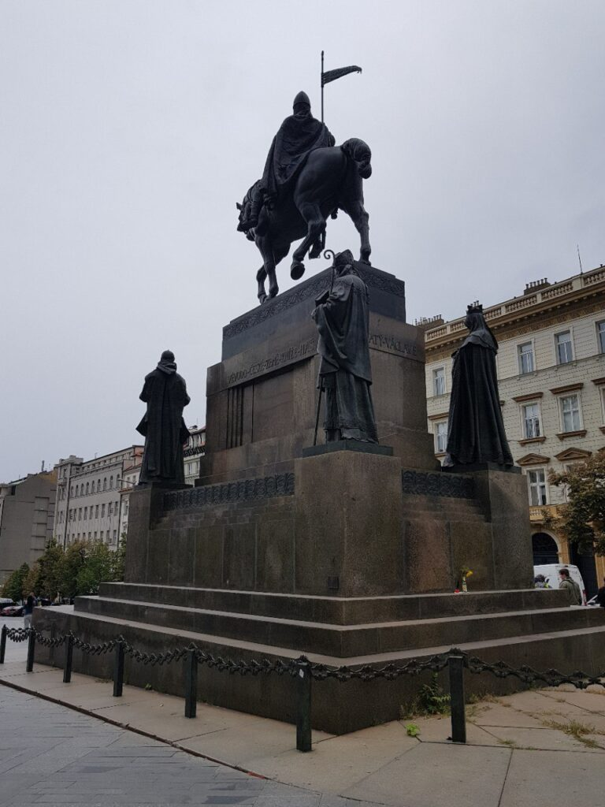

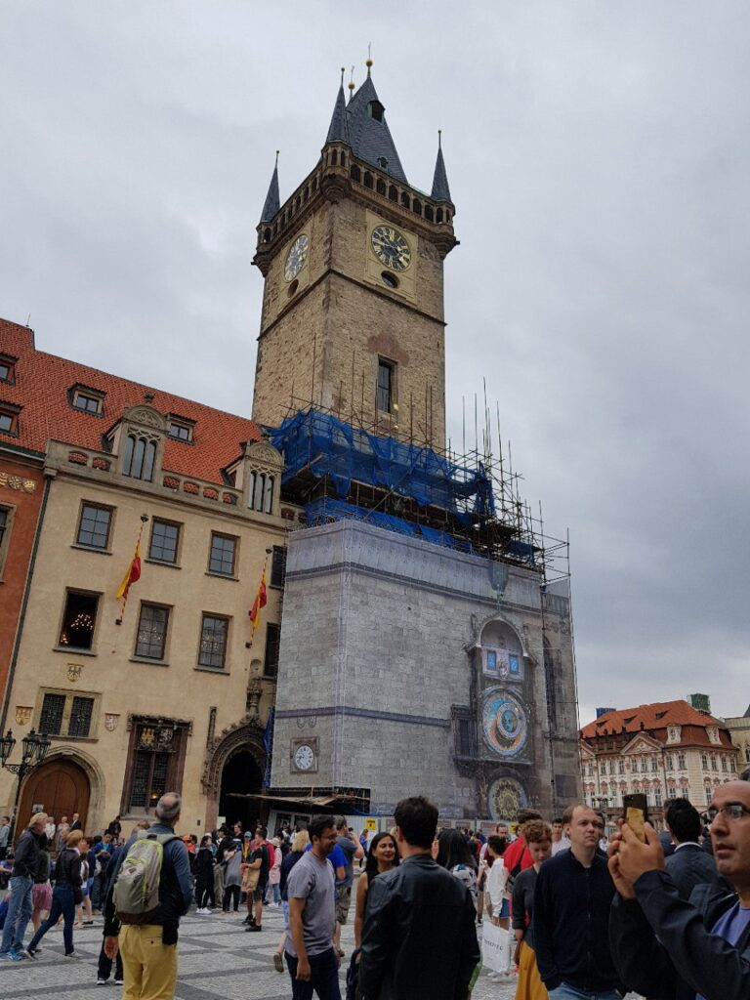

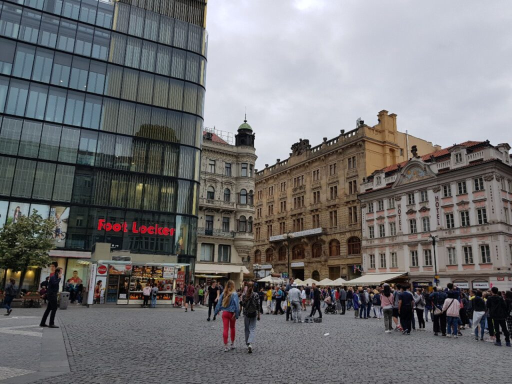

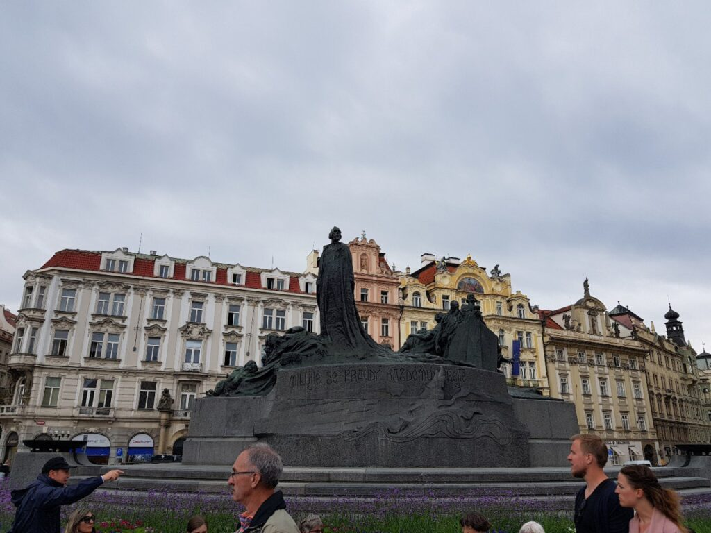

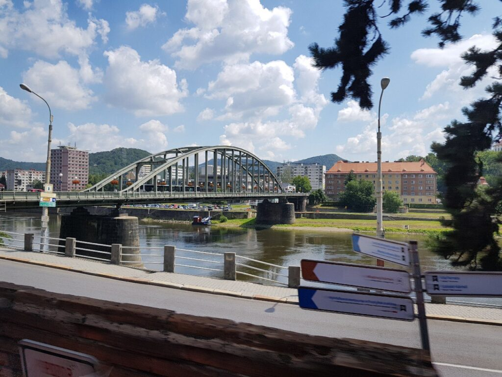

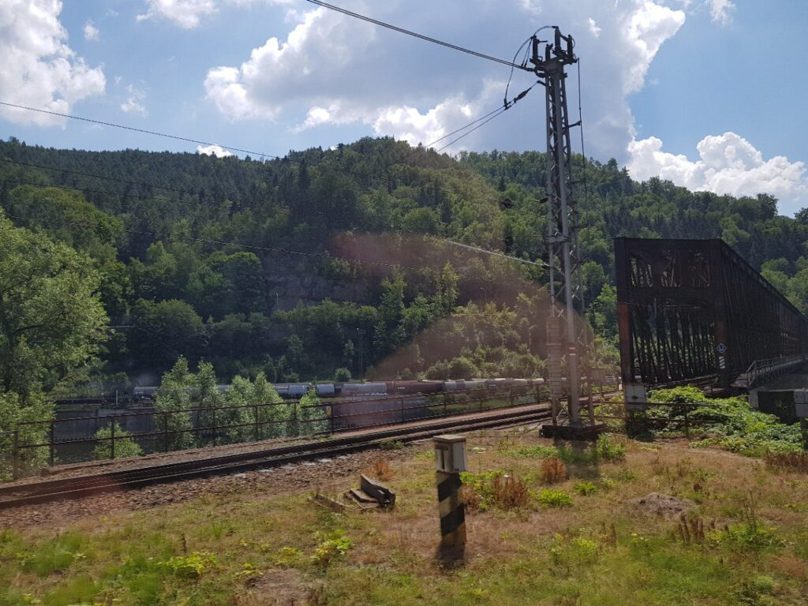

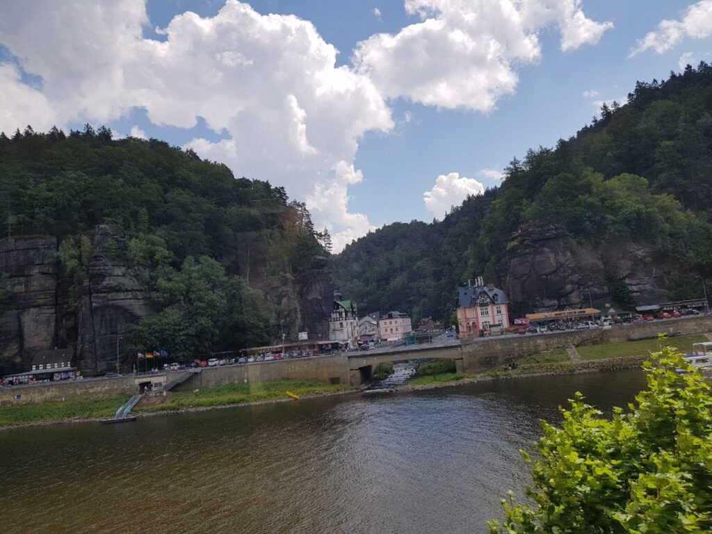
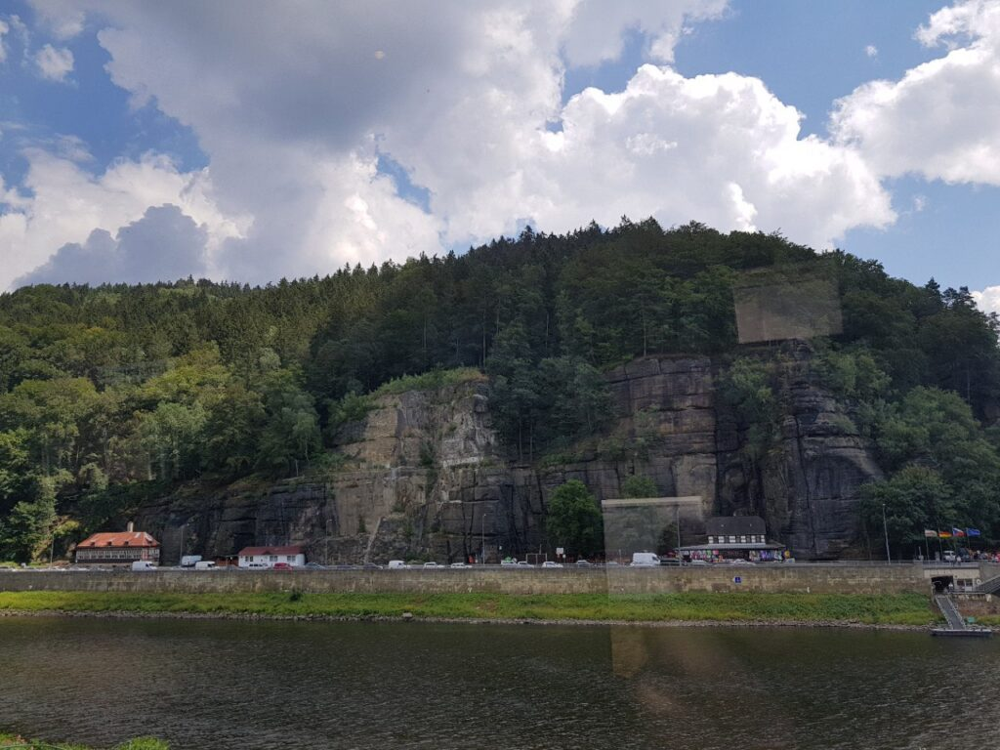
!c3[Тот самый дизельный тепловоз. Мы на него опоздали и ждали 2 часа, гуляя по Дечину](+images/photo_317@13-07-2018_16-01-55-768x1024.jpg)
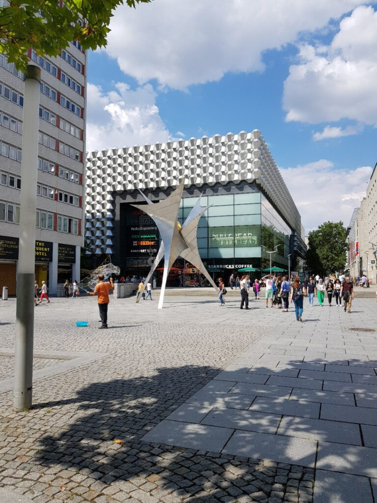
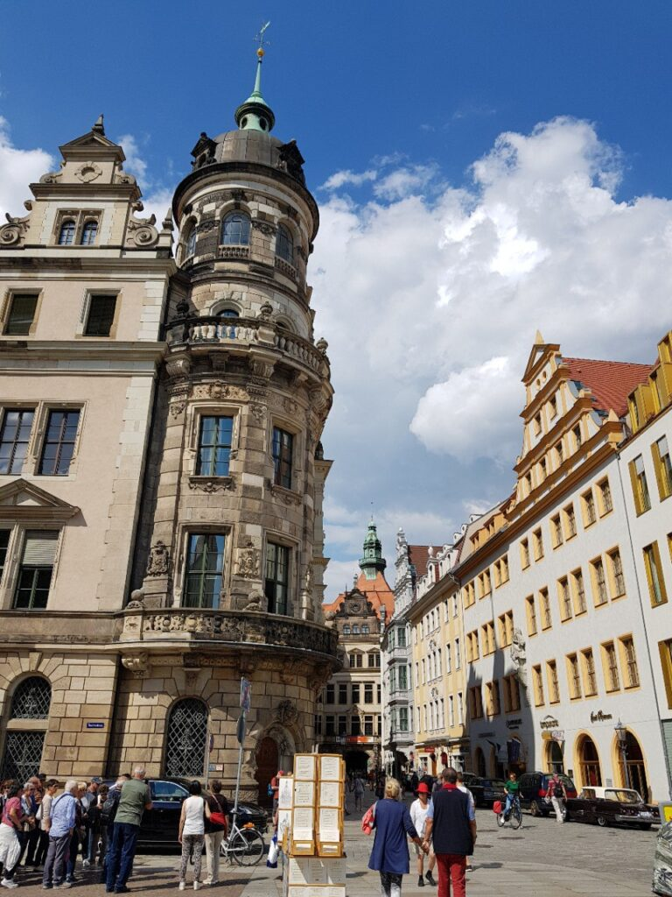

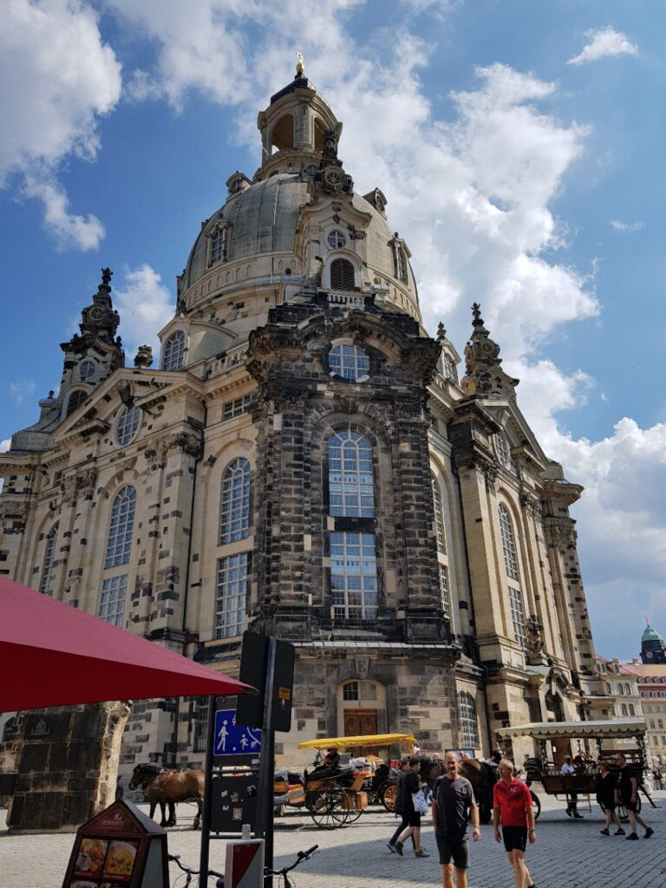
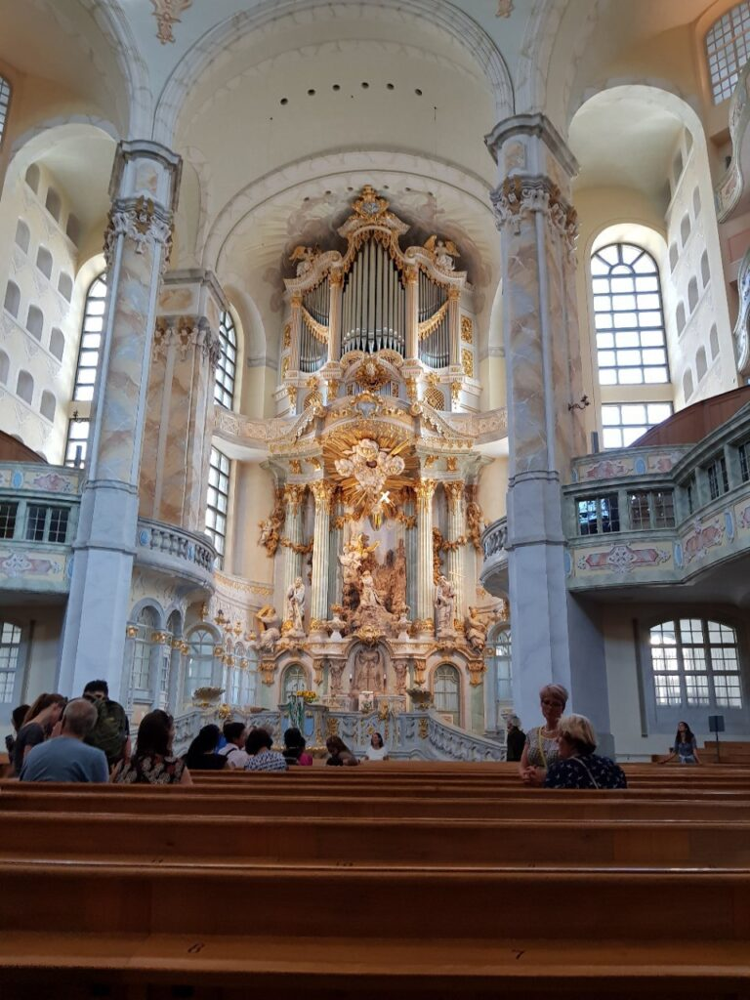
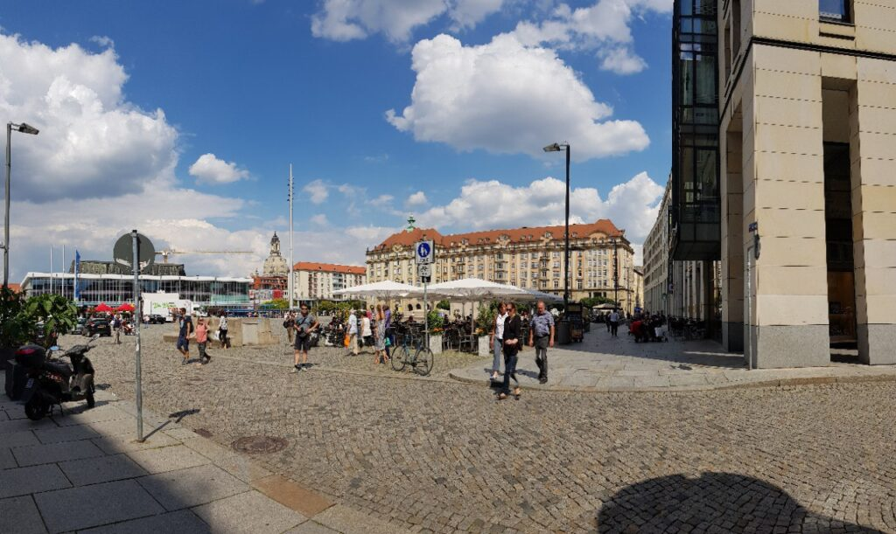
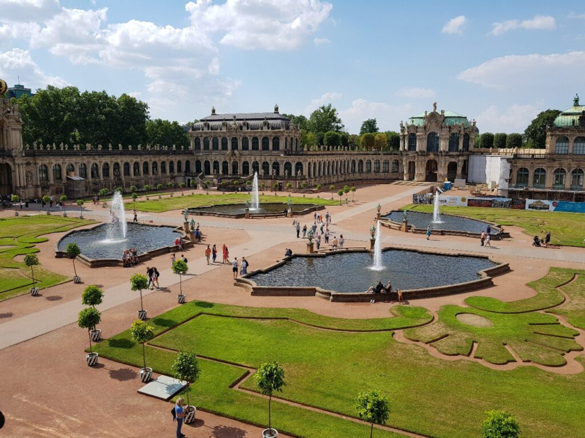

:::

Дрезден - город почти полностью уничтоженный силами воздушнимы силами США и ВБ во ВМВ. Так что большая часть "исторических" зданий тут восстановлены или построены заново.
