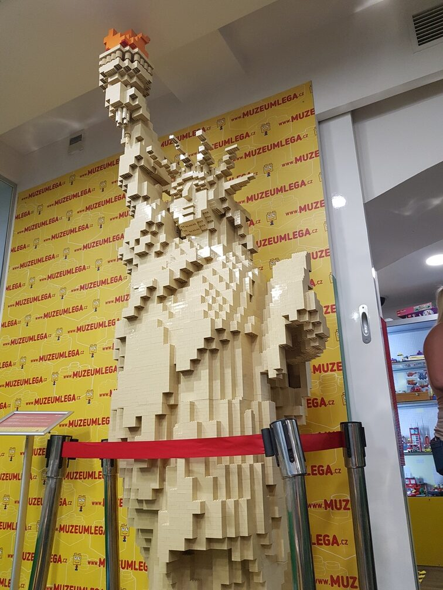
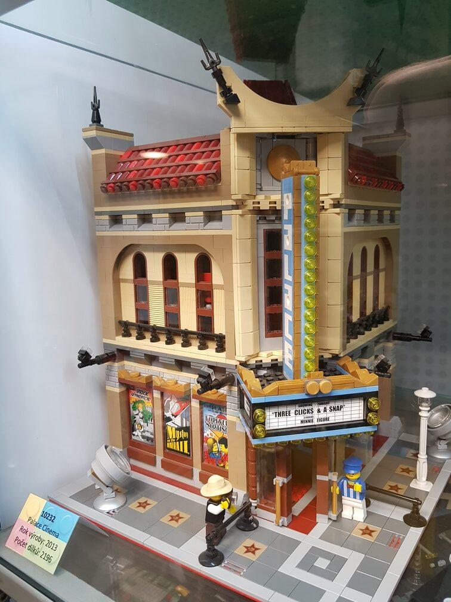
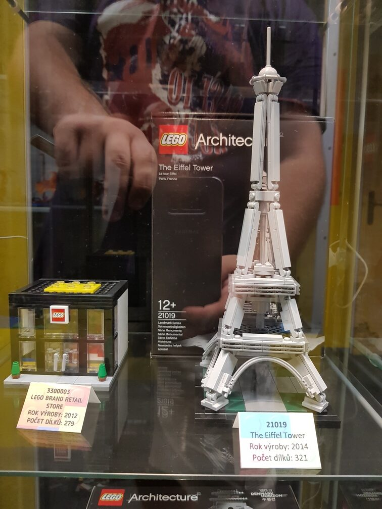
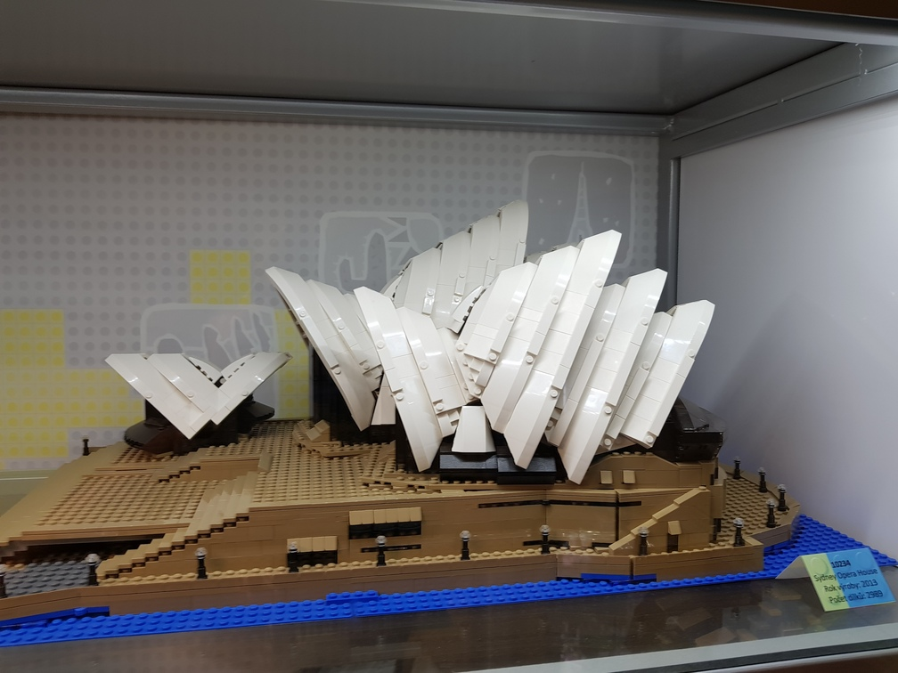
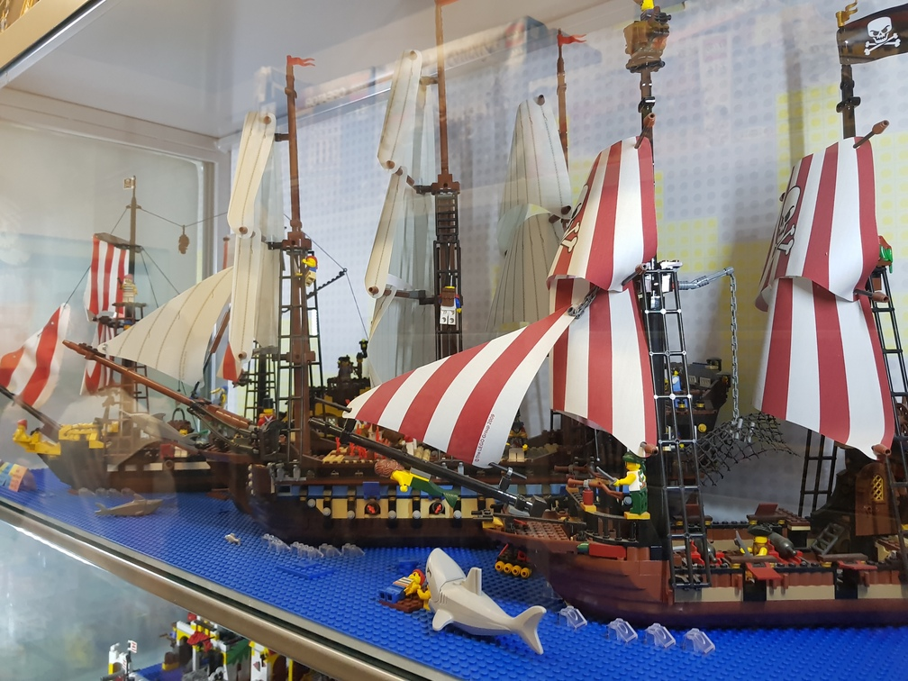
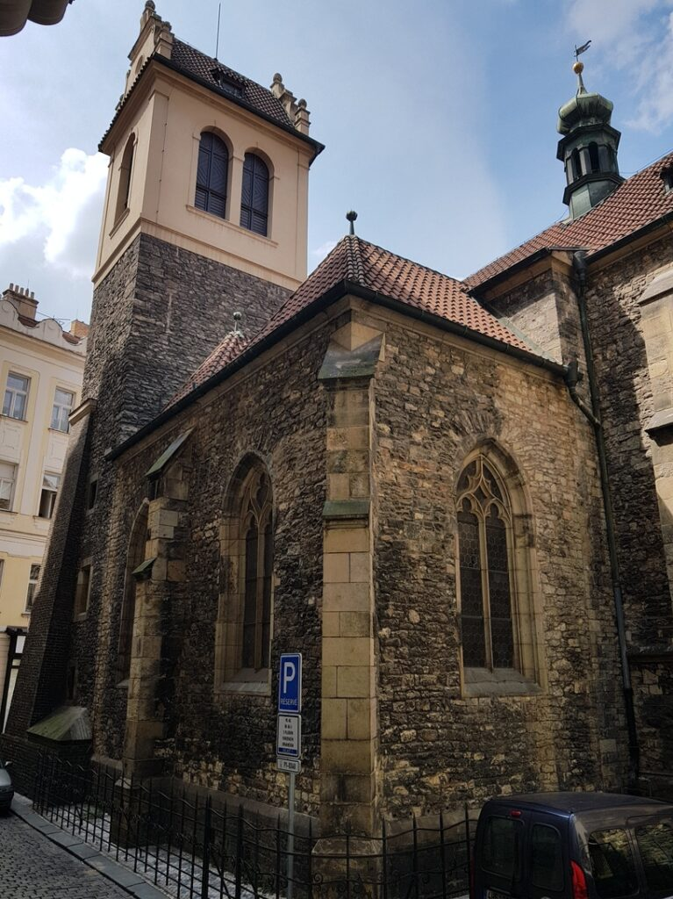
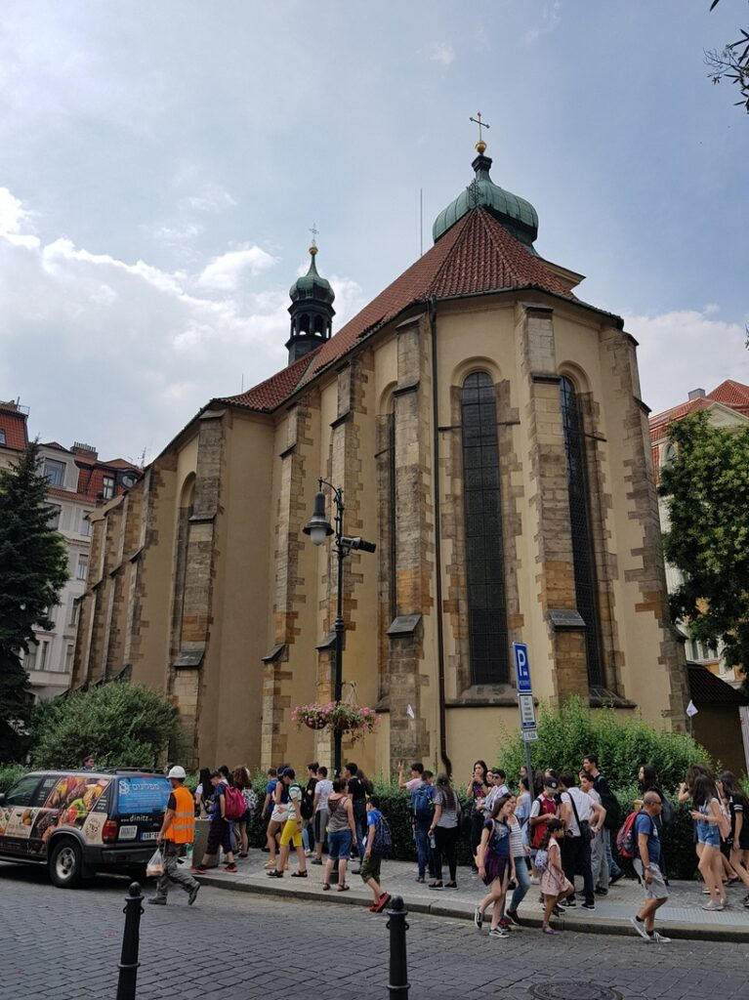

##### 2018.07.15

###### 23:40

I’m sitting at Prague Hlavní Nádraží (Main Train Station), waiting for my friend with the hostel keys)  
There is one thing that surprised me about Europe. Almost everything closes at 8–9 p.m., and you can’t even buy water late at night—there aren’t any 24-hour pharmacies on my route, let alone convenience stores. You have to plan well in advance here, unlike back home where you can decide at the last minute or just buy what you need when you want.

###### 00:30

Checked into the hostel—thanks to my friend and his brother))

##### 2018.07.16

Today I spent the whole day walking around Prague)  
I visited the Museum of Anti-Communism, the Museum of Sex Machines, and the Lego Museum, and also toured Prague Castle. I treated myself to an iced latte from Starbucks (incredibly tasty), a schnitzel, and the famous Prague sweet whose name I didn’t know at the time 😅 (UPD: Trdelník).  
It was a fantastic day, but now I need to prepare for departure. Tomorrow at 09:17 I have a train to Bohumín, from where I’ll take a bus to Lviv, and at 9 a.m. I’ll catch the train back to Odesa.

There won’t be any photos from the Museum of Anti-Communism, since the symbols there are illegal in my country.

%%%3

!c2

%%%

##### 2018.07.17

###### 13:15

So, Katsu is on the Leo Express train en route to Bohumín. After that, I’ll catch a bus to Lviv, and from there a train to Odesa. By tomorrow evening, I’ll be back home)

##### 2018.07.18

###### 05:30

Katsu has arrived in Lviv! Now I just have to wait for the train)  
Thankfully, we passed the border very quickly—we didn’t even leave the bus, just had our passports stamped at the Polish checkpoint, and went on our way.

###### 20:15

Only a few minutes remain until Katsu arrives in his hometown)  
Odesa is very, very close now^^

That’s how I spent two wonderful weeks after that stressful and tough voyage)
