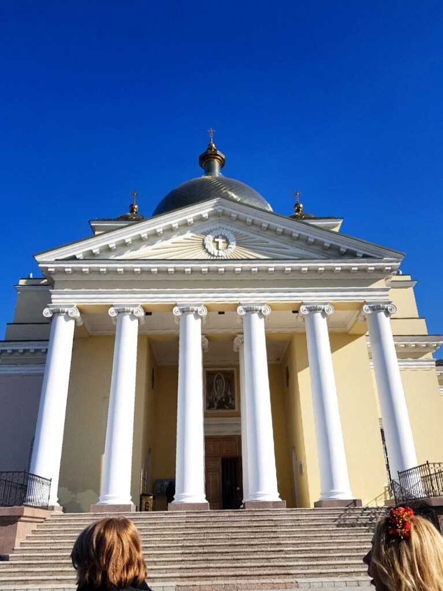
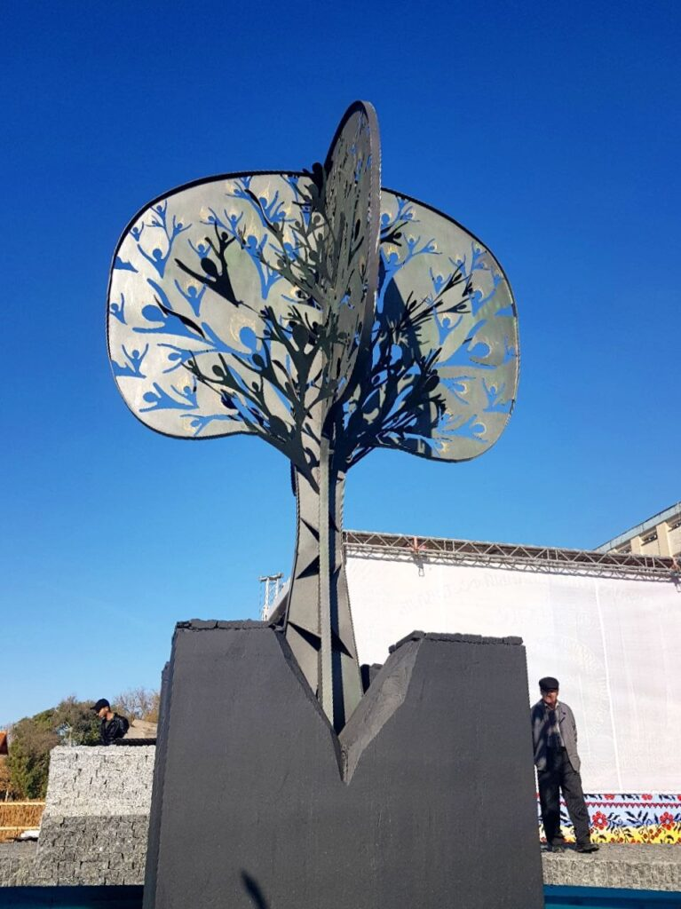
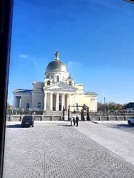
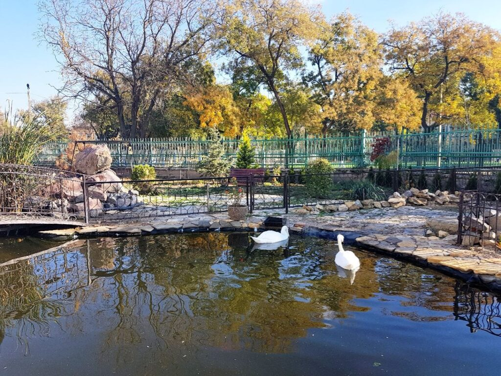
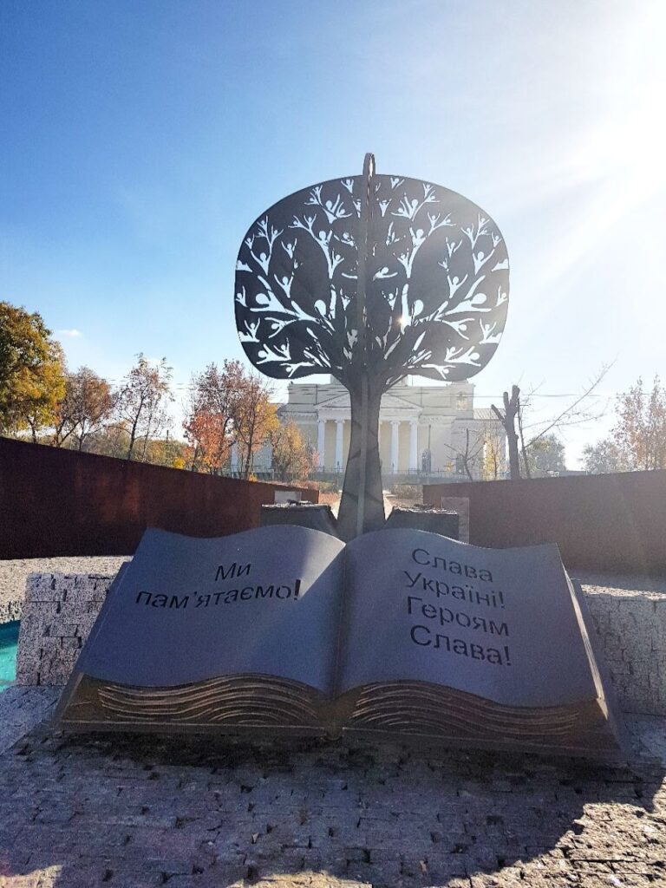

Холодная ноябрьская Одесса. Хороший друг решил предложить мне съездить в небольшой город на юге нашей области - Болград. Логично предположить, что созвучно с названием там с давних времен живет немало болгар.
"Почему бы и нет?" - подумал я и согласился. Кто же тогда знал, что в Болграде будет проводится винный фестиваль!?

%%%3
  !c3[Пытаемся отогреться холодным одесским утром ожидая автобус)](+images/photo_731@10-11-2018_07-07-56-768x1024.jpg)
  
  
  
  
  
  
  
  
  
  !c3[Фестиваль кроме как винный еще и сырный оказался)](+images/photo_746@10-11-2018_15-39-37-1-768x1024.jpg)
  %&23
    
    
  &%
  
  
  
%%%

Мы перепробовали множество видов вина, включая и глинтвейны, а также разных сортов сыра и набрав сувениров - отправились назад домой, в родную Одессу.
