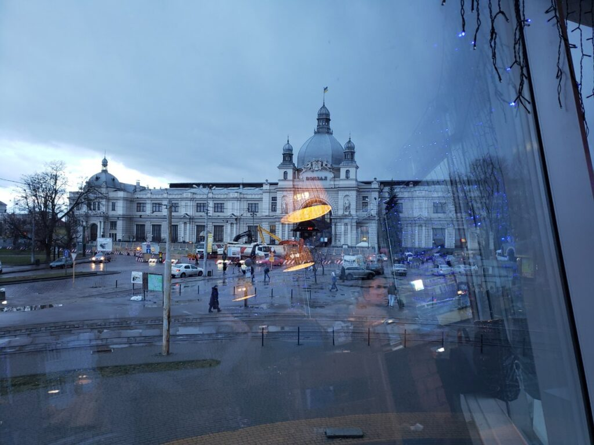
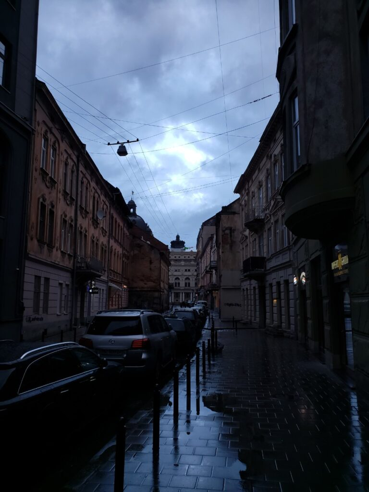
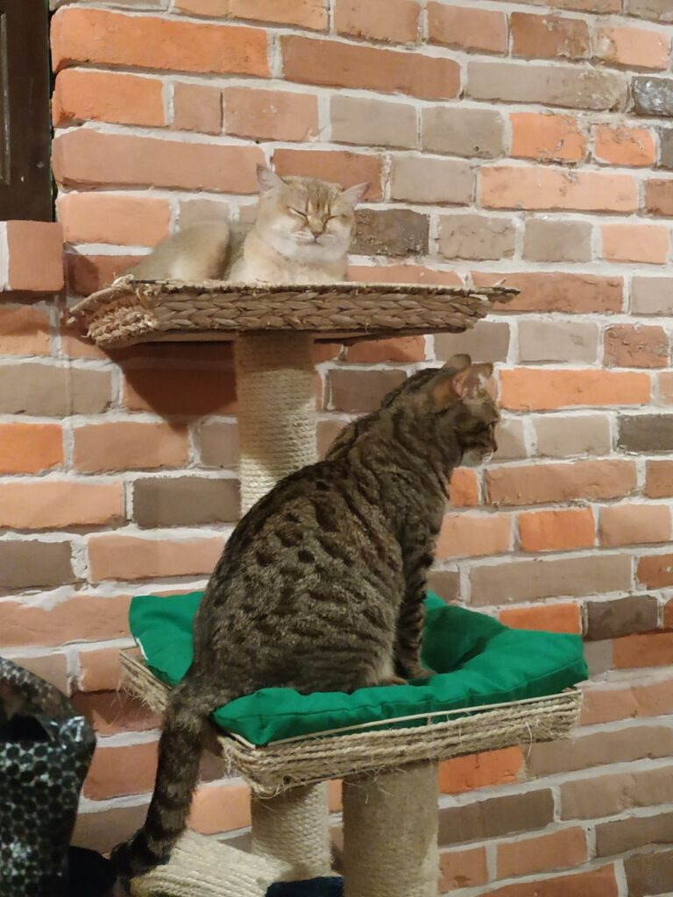
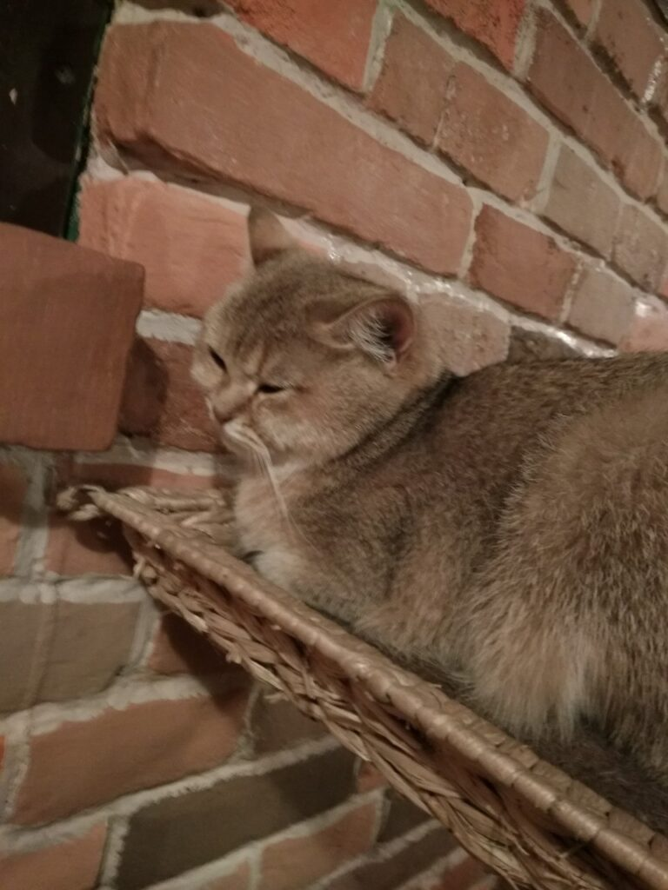
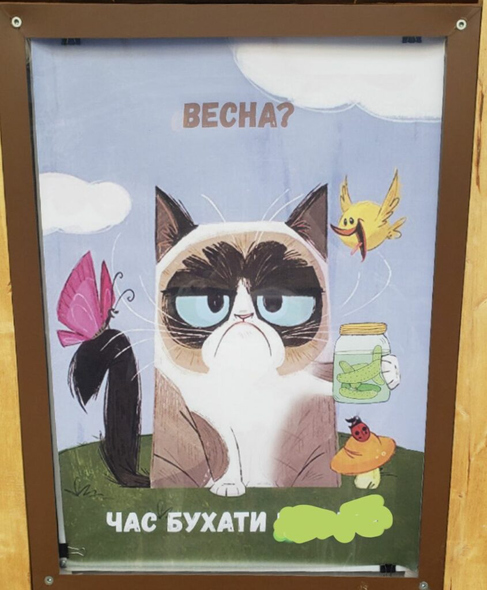

##### 2019.03.16

###### 07:25

Hello, new journey! Katsu has arrived in Lviv for a short but eventful weekend, and… he was greeted by cold, rainy Lviv weather. “This is not Odessa,” hehehe)

:::3

:::
We only dropped in briefly for tea, but they managed to whip us pretty well on the backs. And two girls at the next table were tied up and given a soft-area “execution,” ahem.

:::3

:::
###### 21:38

Good evening, Katsu checking in again. Today we managed to visit the S&M Masoch Café, where we were flogged, and the cat café, which brought some of us far more suffering than the S&M did 🙂 Overall, today was incredibly fun—I think everyone who was with me shares my point of view)) Also, a very interesting instrument, the kalimba, which you’ll see in the photo on the guitar, also brings us joy every time we come to Lviv) I hope tomorrow will be no less heretical of a day.

###### 2019.03.17

:::2

:::
Love you all ❤️

Everything will be Katsu! 🦊
