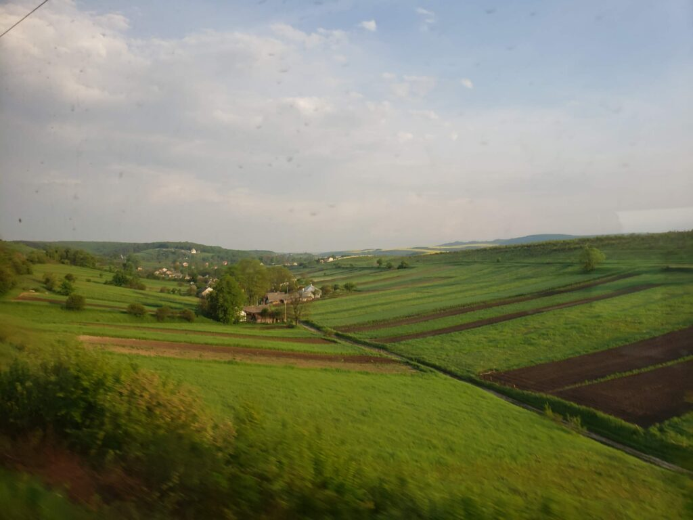
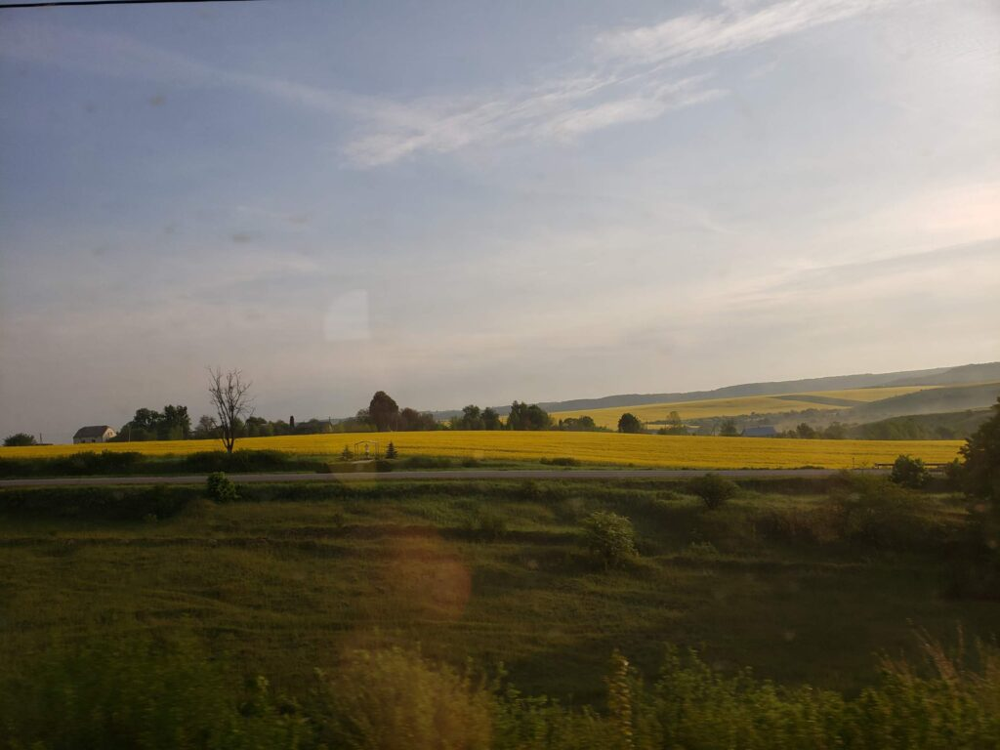
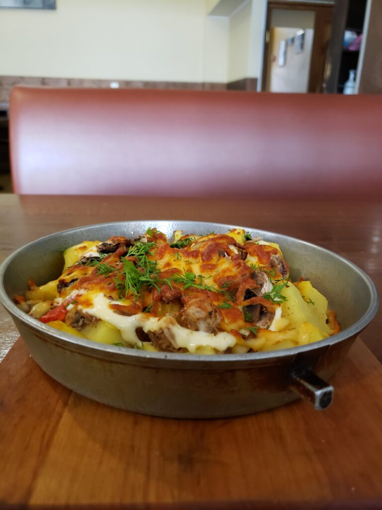
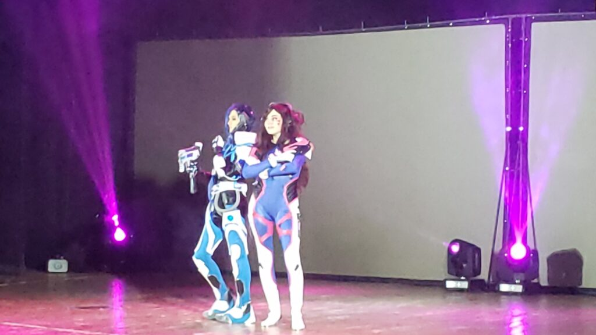
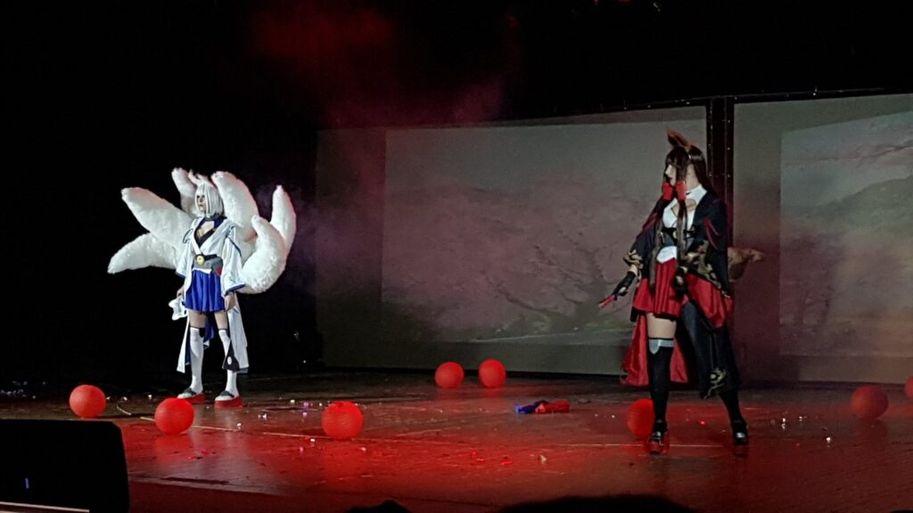
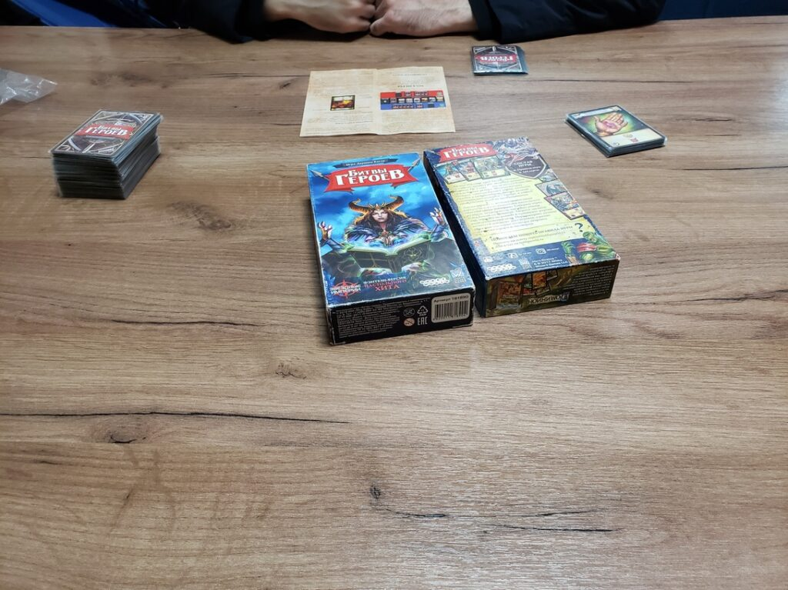
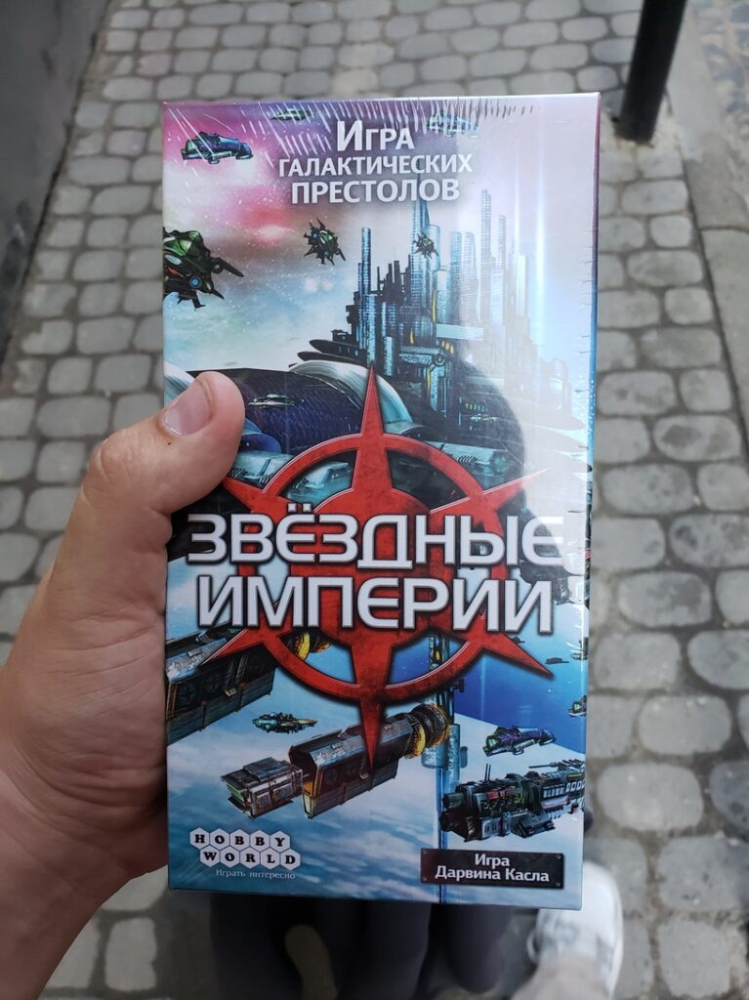

In May 2019, Lviv hosted an anime festival—Anicon—and I headed there!

##### 2019.05.17

Konbanwa, minna-san^^  
Once again, Katsu sets off on his journey, and Lviv greets him warmly)

As always, “U chornogo Morya” (By the Black Sea) plays every time a new diesel arrives in Odessa)

##### 2019.05.18

Good morning, dear readers)  
Here are a few morning photos from the train window)

%%%3

%%%

I dressed in summer style, Odessa‐only (it was up to +30°C back home), but my friend warned me about Lviv’s trickiness, so I came prepared with an umbrella and warm clothes)

%%%2

%%%

The skillet at Tsisar (RIP) is my favorite food in Lviv. Not sponsored—it’s genuinely delicious and cheap. For under $2, you get pork, mushrooms, cheese, and potatoes drenched in mayonnaise)

Lviv’s weather welcomed Katsu with open arms: bright sun, a few clouds, and a divine coolness compared to Odessa’s stifling heat—absolutely wonderful.

%%%3

%%%

%%%2

!c2
%%%

After the festival, my friend the Inquisitor and I went to the Metro Pub to celebrate the end of the fest. The Anime Club Mitsuruki, as I understand, is the largest anime community in Lviv and this region of the country. After the pub, my local friend who showed me around went home, and I stayed to wander a bit longer with the remaining club members)  
And now Katsu is finally in his hostel bed, and all is well)

%%%2

  
A part of the interior of this cool hostel right by Ivan Franko Park

%%%

Unlike the Odessa and Kyiv events, Anicon was a one-day festival, so on the second day we just strolled around, had fun, and stumbled upon a board game shop where you can also sit and play.

%%%3

%%%

After playing Battles of Heroes, I decided to buy it, but it wasn’t in stock. So I ended up getting Star Realms, which has essentially the same mechanics but a different setting.

On the way home, on the night express, I played it until 3 a.m. with my seatmate, and his girlfriend grumbled at me to go to sleep, hehe.
