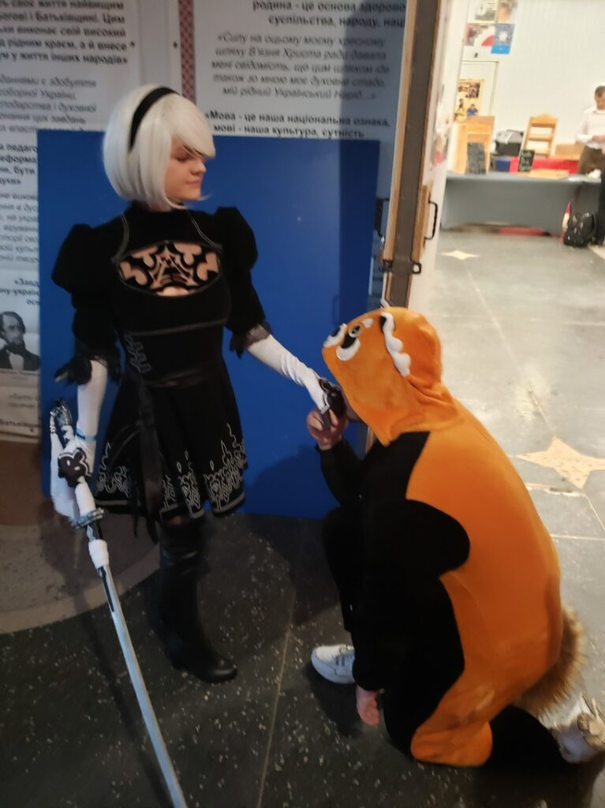

У травні 2019 року у Львові відбувся аніме-фестиваль Anicon, на який я й вирушив!

##### 2019.05.17

Конбанва, мінна-сан^^  
І знову Кацу вирушає в дорогу, а Львів зустрічає його щедро)

Як завжди, «У чорного моря» звучить щоразу, як у Одесу приходить новий тепловоз)

##### 2019.05.18

Доброго ранку, дорогі читачі)  
Ось вам кілька ранкових фото з вікна потяга)

:::3

:::

Я одягнувся по-літньому, по-одеськи (у нас було до +30°C), але друг попередив про львівську мінливість, тому я підготувався з парасолькою та теплим одягом)

:::2

:::

Сковорідка в «Цисарі» (UPD: світлій пам’яті) – моя улюблена їжа у Львові. І це не реклама, просто вона справді смачна і недорога. За менше ніж 2 долари тут отримуєш свинину, гриби, сир і картоплю, залиті майонезом)

Львівська погода зустріла Кацу щедро: яскраве сонце, небагато хмар і божественна прохолода порівняно з духотою Одеси — неймовірно класно.

:::3

:::

:::2

:::

Після фестивалю ми з моїм другом Інквізитором пішли у Metro Pub, де святкували закінчення фесту. Аніме Клуб Mitsuruki, наскільки я зрозумів, — найбільша аніме-спільнота Львова та цього регіону країни. Після пабу місцевий друг, який мене всюди водив, пішов додому, а я трохи прогулявся з іншими учасниками клубу)  
І ось зараз Кацу нарешті в ліжку хостелу, і в нього все добре)

:::2

  
Трохи інтер’єру цього класного хостелу прямо біля парку Івана Франка

:::

На відміну від одеських і київських, Anicon був одноденним фестивалем, тому на другий день ми просто гуляли, розважалися і натрапили на магазин настільних ігор, де можна було просто сісти й пограти.

:::3

:::

Погравши в Battles of Heroes, я вирішив купити його, але його не було в наявності. Врешті я обрав Star Realms з точно такою ж механікою, але іншим сеттингом.

В дорозі додому в нічному експресі я грав у неї до 3-ї ночі з попутником, а його дівчина бурчала, щоб я йшов спати, хе-хе.
