Після того, як я тоді думав, що контракт був нелегким, я хотів відпочити та розвіятися, тому ми з друзями вирішили поїхати в Ужгород, щоб подивитися на повсюдне цвітіння сакур.

Оскільки мені з Одеси їхати було на багато далі, ніж моїм друзям з Києва та Львова, я приїхав на добу раніше і забронював тримісний номер у класному хостелі прямо в центрі міста.
Втім, Ужгород доволі невелике місто, тож усе місто — як центр Одеси)

Далі слово кореспонденту Кацу прямо з місця подій у квітні 2021 року:

##### 2021.04.22 21:30

Кацу вже в поїзді, який за 15 хвилин вирушить в Ужгород, щоб дивитися на цвітіння сакур) Чекайте звіту)
Мені попалися дуже цікаві попутники: родина майстрів татуажу з купою смачної їжі та цікавими історіями з життя)

:::1

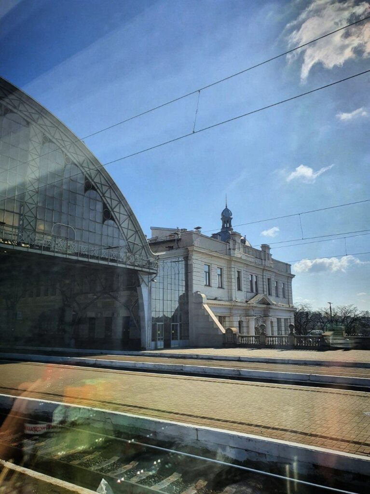

:::

##### 2021.04.23 09:47

Доброго ранку! Тим часом Кацу у Львові. До Ужгорода ще понад 6 годин)
**Upd.** Тоді я ще не знав, що Львів стане для мене другим домом)

:::3

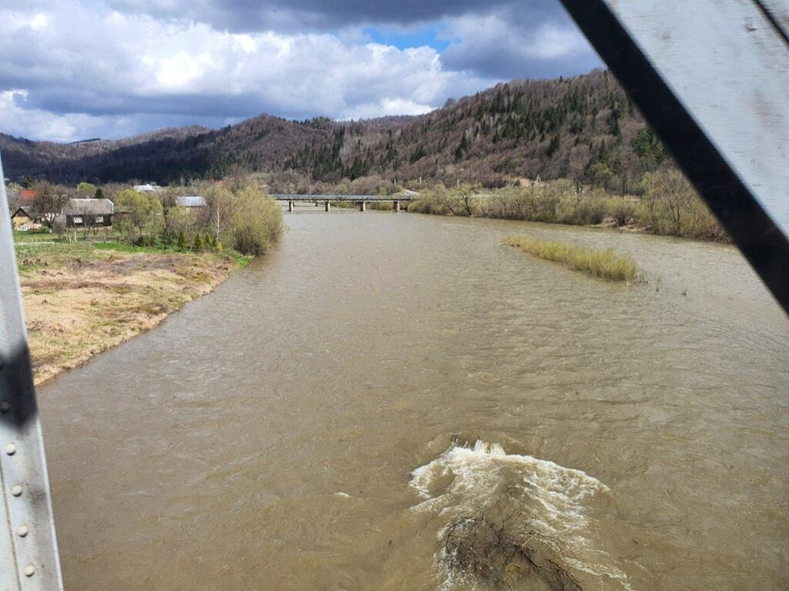

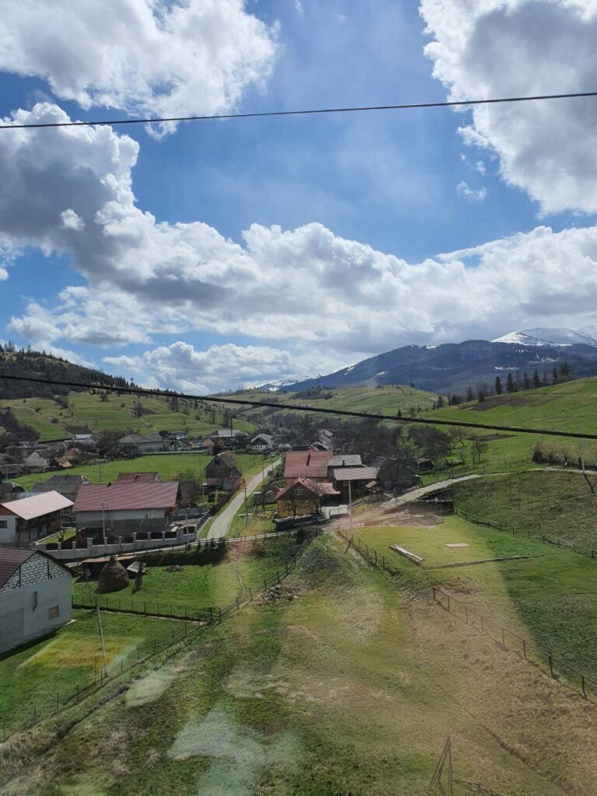

:::c3

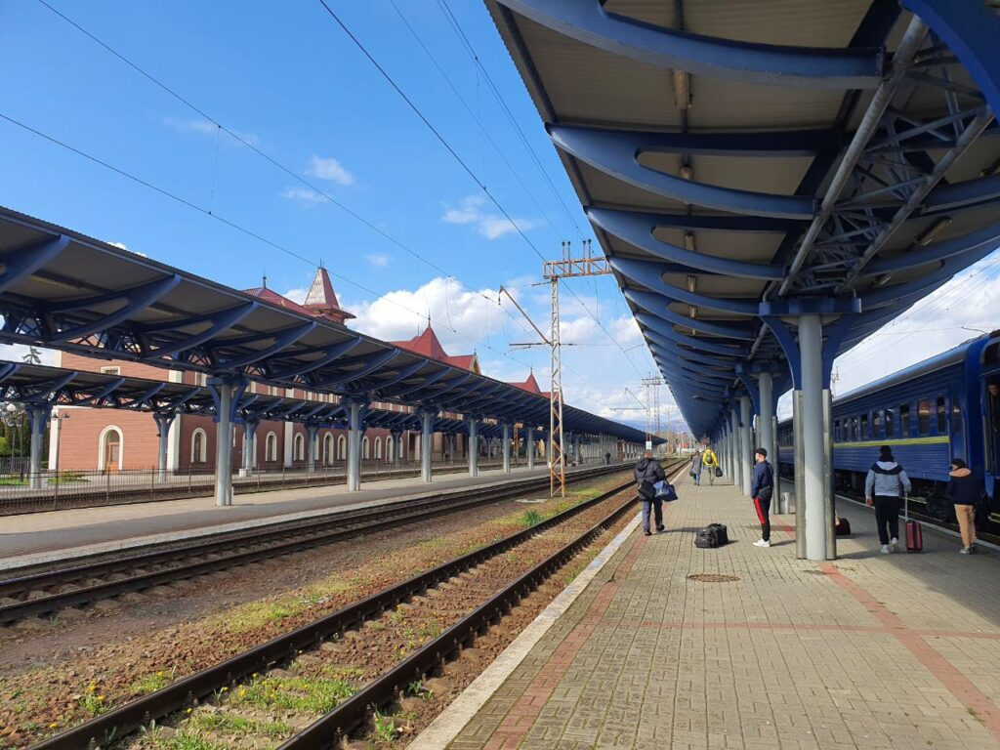

:::

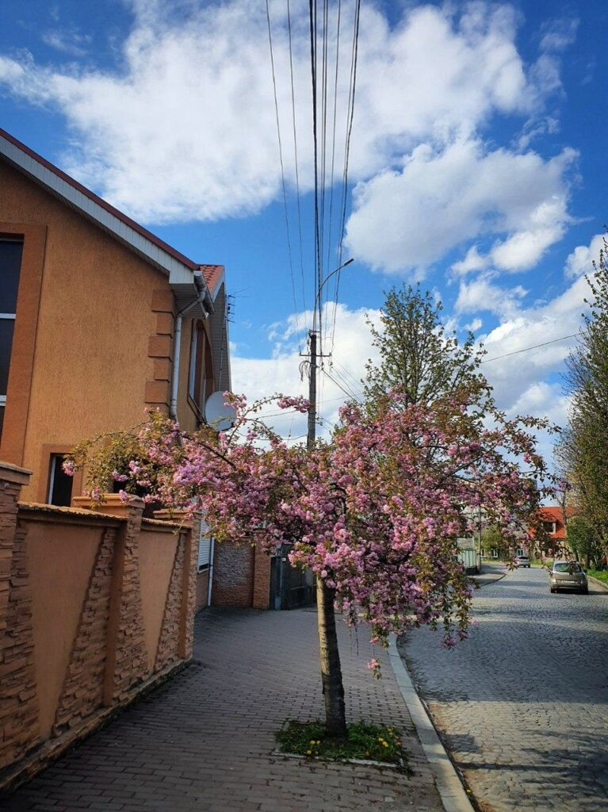

:::

Фото далі не залишилося, але після того як я зустрів товаришів з їхнього потяга, ми почали шукати, де поїсти. Рестораном із найкращими відгуками у місті виявилася палатка, де готують бургери, і... Жоден із захоплених відгуків не брехав! Це були найкращі бургери, які я коли-небудь пробував після австрійських)

:::3

:::c3

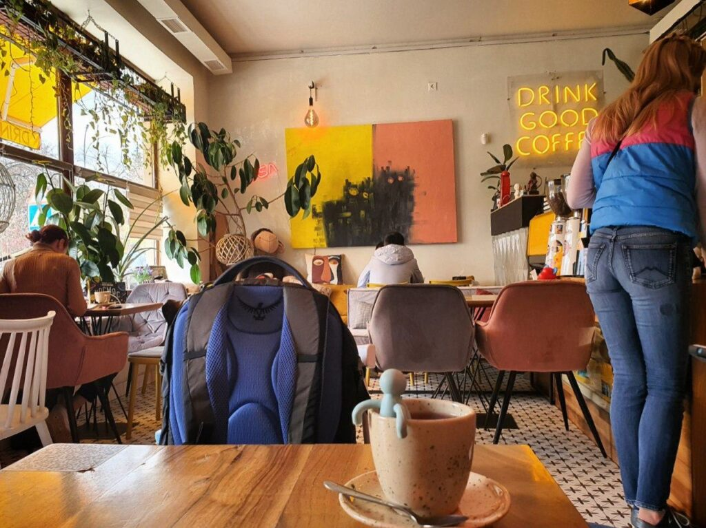

:::

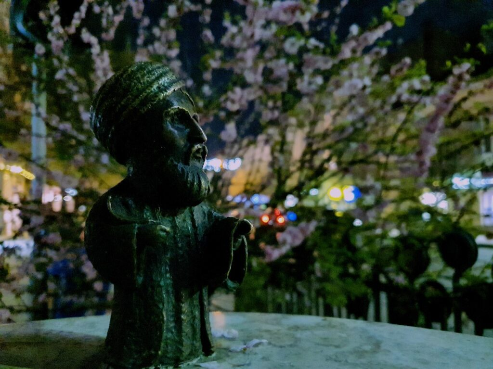

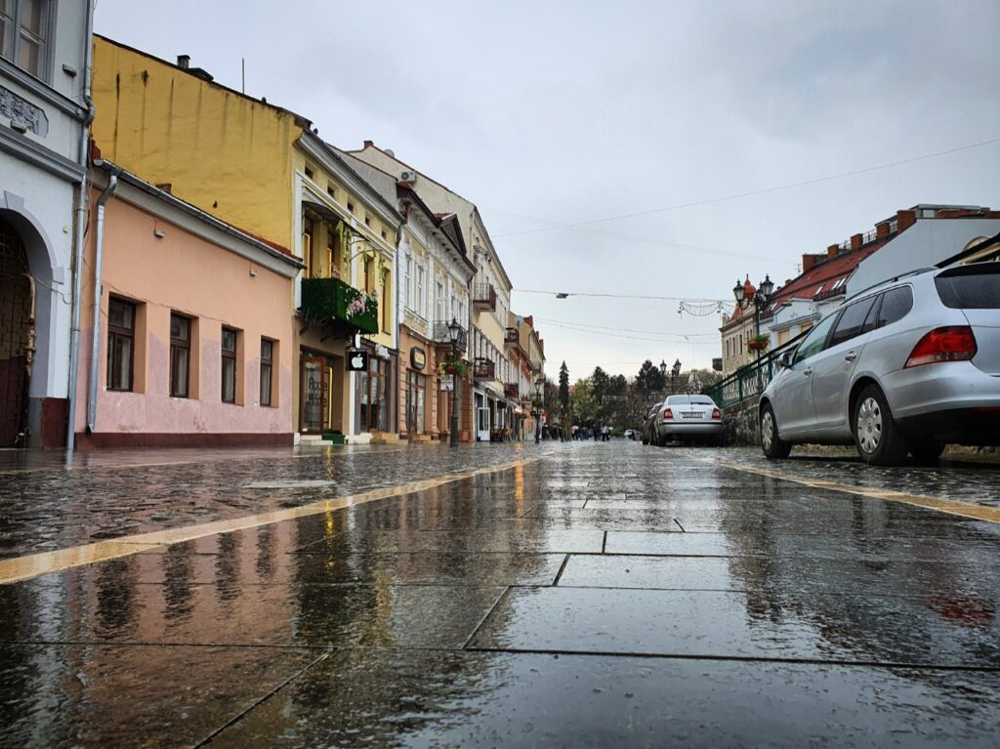

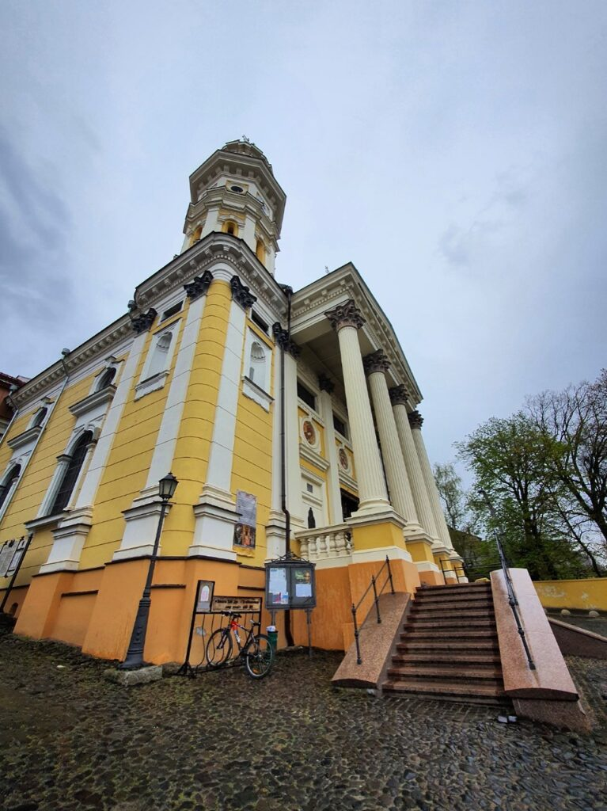

:::

Трохи пізніше полудня ми проводжали товариша зі Львова до його потяга, а самі вирішили вирушити шукати їжу, бо до наших потягів ще було кілька годин)

:::3

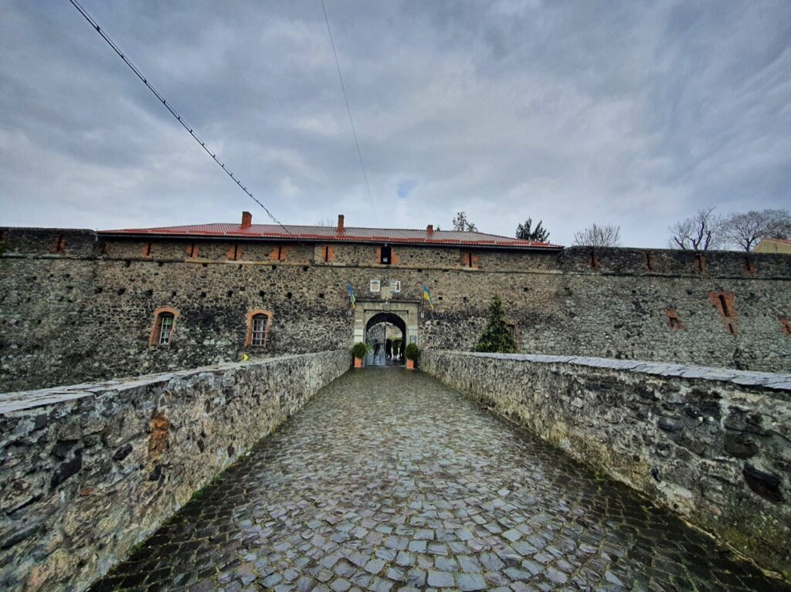
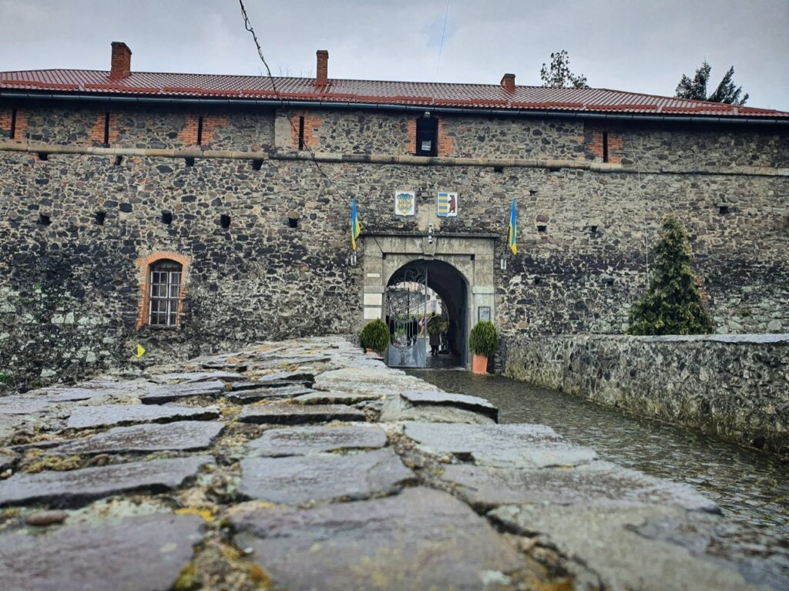

:::

Кацу вирушив до Одеси! ^^ Як же я обожнюю потяги! ^^  
Це один із найкращих видів транспорту для автентичності)

Отже, чудово пройшов мій уїкенд у весняному Ужгороді)

Люблю вас ❤️  
Усе буде Кацу! 🦊
